# UML: animationsystem

Class relationships (inheritance and composition) for the `animationsystem` module.

**Arrow legend:** `<|--` inheritance &nbsp; `*--` composition &nbsp; `-->` association/pointer

```mermaid
classDiagram
    AnimationSnapshotBase_t <|-- AnimationSnapshot_t
    CMoodVData *-- MoodType_t
    CMoodVData *-- MoodAnimationLayer_t
    CAnimKeyData *-- CAnimBone
    CAnimKeyData *-- CAnimUser
    CAnimKeyData *-- CAnimDataChannelDesc
    CAnimData *-- CAnimDesc
    CAnimData *-- CAnimDecoder
    CAnimData *-- CAnimFrameSegment
    CSeqAutoLayer *-- CSeqAutoLayerFlag
    AnimationDecodeDebugDump_t *-- AnimationProcessingType_t
    AnimationDecodeDebugDump_t *-- AnimationDecodeDebugDumpElement_t
    CSeqCmdSeqDesc *-- CSeqSeqDescFlag
    CSeqCmdSeqDesc *-- CSeqTransition
    CSeqCmdSeqDesc *-- CSeqCmdLayer
    CSeqCmdSeqDesc *-- CAnimEventDefinition
    CSeqCmdSeqDesc *-- CAnimActivity
    CSeqCmdSeqDesc *-- CSeqPoseSetting
    CAnimDesc *-- CAnimDesc_Flag
    CAnimDesc *-- CAnimEncodedFrames
    CAnimDesc *-- CAnimMovement
    CAnimDesc *-- CAnimEventDefinition
    CAnimDesc *-- CAnimActivity
    CAnimDesc *-- CAnimLocalHierarchy
    CAnimDesc *-- CAnimSequenceParams
    CSeqS1SeqDesc *-- CSeqSeqDescFlag
    CSeqS1SeqDesc *-- CSeqMultiFetch
    CSeqS1SeqDesc *-- CSeqAutoLayer
    CSeqS1SeqDesc *-- CSeqIKLock
    CSeqS1SeqDesc *-- CSeqTransition
    CSeqS1SeqDesc *-- CAnimActivity
    CAnimationGroup *-- CAnimKeyData
    CSeqMultiFetch *-- CSeqMultiFetchFlag
    MoodAnimationLayer_t *-- MoodAnimation_t
    CSequenceGroupData *-- CSeqS1SeqDesc
    CSequenceGroupData *-- CSeqSynthAnimDesc
    CSequenceGroupData *-- CSeqCmdSeqDesc
    CSequenceGroupData *-- CSeqBoneMaskList
    CSequenceGroupData *-- CSeqScaleSet
    CSequenceGroupData *-- CSeqPoseParamDesc
    CSequenceGroupData *-- CSeqIKLock
    AnimationSnapshotBase_t *-- AnimationSnapshotType_t
    AnimationSnapshotBase_t *-- AnimationDecodeDebugDumpElement_t
    CSeqSynthAnimDesc *-- CSeqSeqDescFlag
    CSeqSynthAnimDesc *-- CSeqTransition
    CSeqSynthAnimDesc *-- CAnimActivity
    CAnimEncodeDifference *-- CAnimBoneDifference
    CAnimEncodeDifference *-- CAnimMorphDifference
    CAnimEncodeDifference *-- CAnimUserDifference
    CAnimEncodedFrames *-- CAnimFrameBlockAnim
    CAnimEncodedFrames *-- CAnimEncodeDifference
```

