# UML: animgraphdoclib

Class relationships (inheritance and composition) for the `animgraphdoclib` module.

**Arrow legend:** `<|--` inheritance &nbsp; `*--` composition &nbsp; `-->` association/pointer

```mermaid
classDiagram
    CAnimGraphDoc_Component <|-- CCPPScriptComponent
    CAnimGraphDoc_StateTransition <|-- CAnimGraphDoc_NodeStateTransition
    CAnimGraphDoc_Node <|-- CAnimGraphDoc_PairedSequenceNode
    CAnimGraphDoc_MotionMetric <|-- CAnimGraphDoc_CurrentRotationVelocityMetric
    CAnimGraphDoc_Node <|-- CAnimGraphDoc_TargetSelectorNode
    CAnimGraphDoc_Component <|-- CMovementComponent
    CAnimGraphDoc_Action <|-- CAnimGraphDoc_ToggleComponentAction
    CAnimGraphDoc_Node <|-- CAnimGraphDoc_HitReactNode
    CAnimGraphDoc_Condition <|-- CAnimGraphDoc_CycleCondition
    CAnimGraphDoc_Node <|-- CAnimGraphDoc_SingleFrameNode
    CAnimGraphDoc_Blend2DItem <|-- CAnimGraphDoc_SequenceBlend2DItem
    CAnimGraphDoc_Node <|-- CAnimGraphDoc_BoneMaskNode
    CAnimConflictBase <|-- CAnimTagConflict
    CAnimGraphDoc_MotionMetric <|-- CAnimGraphDoc_FutureVelocityMetric
    CAnimGraphDoc_Node <|-- CAnimGraphDoc_Blend2DNode
    CAnimGraphDoc_Component <|-- CActionComponent
    CAnimGraphDoc_Node <|-- CAnimGraphDoc_AddNode
    CAnimGraphDoc_Node <|-- CAnimGraphDoc_SubtractNode
    CAnimGraphDoc_Node <|-- CAnimGraphDoc_WayPointHelperNode
    CAnimGraphDoc_MotionMetric <|-- CAnimGraphDoc_TimeRemainingMetric
    CAnimGraphDoc_Node <|-- CAnimGraphDoc_BindPoseNode
    CAnimGraphDoc_Component <|-- CPairedSequenceComponent
    CAnimGraphDoc_Node <|-- CAnimGraphDoc_SelectorNode
    CAnimGraphDoc_Node <|-- CAnimGraphDoc_TurnHelperNode
    CAnimGraphDoc_Node <|-- CAnimGraphDoc_AimMatrixNode
    CAnimGraphDoc_Node <|-- CAnimGraphDoc_FollowPathNode
    CAnimGraphDoc_Node <|-- CAnimGraphDoc_RagdollNode
    CAnimGraphDoc_SequenceNode <|-- CAnimGraphDoc_JumpHelperNode
    CAnimGraphDoc_ProxyNodeBase <|-- CAnimGraphDoc_GroupOutputNode
    CAnimGraphDoc_Node <|-- CAnimGraphDoc_LookAtNode
    CAnimGraphDoc_Action <|-- CAnimGraphDoc_SetParameterAction
    CAnimGraphDoc_Condition <|-- CAnimGraphDoc_FinishedCondition
    CAnimGraphDoc_Node <|-- CAnimGraphDoc_OrientationWarpNode
    CAnimGraphDoc_MotionMetric <|-- CAnimGraphDoc_StepsRemainingMetric
    CAnimGraphDoc_Motor <|-- CAnimGraphDoc_PlayerInputMotor
    CAnimGraphDoc_Node <|-- CAnimGraphDoc_DirectionalBlendNode
    CAnimGraphDoc_Node <|-- CAnimGraphDoc_ZeroPoseNode
    CAnimGraphDoc_State <|-- CAnimGraphDoc_NodeState
    CAnimGraphDoc_Component <|-- CStateMachineComponent
    CAnimGraphDoc_StateMachine <|-- CStateMachineComponent
    CAnimGraphDoc_Node <|-- CAnimGraphDoc_StanceOverrideNode
    CAnimGraphDoc_MotionMetric <|-- CAnimGraphDoc_PathMetric
    CAnimGraphDoc_ProxyNodeBase <|-- CAnimGraphDoc_GroupInputNode
    CAnimGraphDoc_Condition <|-- CAnimGraphDoc_AndCondition
    CAnimGraphDoc_ConditionContainer <|-- CAnimGraphDoc_AndCondition
    CAnimGraphDoc_ContainerNodeBase <|-- CAnimGraphDoc_SubGraphNode
    CAnimGraphDoc_MotionItem <|-- CAnimGraphDoc_SequenceMotionItem
    CAnimGraphDoc_MotionMetric <|-- CAnimGraphDoc_CurrentVelocityMetric
    CAnimGraphDoc_Component <|-- CLODComponent
    CAnimGraphDoc_Node <|-- CAnimGraphDoc_TargetWarpNode
    CAnimGraphDoc_Node <|-- CAnimGraphDoc_CycleControlNode
    CAnimGraphDoc_MotionMetric <|-- CAnimGraphDoc_BlockSelectionMetric
    CAnimGraphDoc_MotionItem <|-- CAnimGraphDoc_GraphMotionItem
    CAnimGraphDoc_Node <|-- CAnimGraphDoc_MotionMatchingNode
    CAnimGraphDoc_Condition <|-- CAnimGraphDoc_OrCondition
    CAnimGraphDoc_ConditionContainer <|-- CAnimGraphDoc_OrCondition
    CAnimGraphDoc_MotionMetric <|-- CAnimGraphDoc_DistanceRemainingMetric
    CAnimGraphDoc_NodeManager <|-- CAnimGraphDoc_MotionNodeManager
    CAnimGraphDoc_MotionMetric <|-- CAnimGraphDoc_BonePositionMetric
    CAnimGraphDoc_MotionMetric <|-- CAnimGraphDoc_BoneVelocityMetric
    CAnimGraphDoc_MotionMetric <|-- CAnimGraphDoc_FutureFacingMetric
    CAnimGraphDoc_SubGraph <|-- CAnimGraphDoc_Graph
    CAnimGraphDoc_Condition <|-- CAnimGraphDoc_StateStatusCondition
    CAnimGraphDoc_Condition <|-- CAnimGraphDoc_TimeCondition
    CAnimGraphDoc_MotionMetric <|-- CAnimGraphDoc_FootPositionMetric
    CAnimGraphDoc_Condition <|-- CAnimGraphDoc_TagCondition
    CAnimGraphDoc_Node <|-- CAnimGraphDoc_ChoiceNode
    CAnimGraphDoc_Node <|-- CAnimGraphDoc_FootStepTriggerNode
    CAnimGraphDoc_Node <|-- CAnimGraphDoc_ProxyNodeBase
    CAnimGraphDoc_Motor <|-- CAnimGraphDoc_PathMotorBase
    CAnimGraphDoc_Node <|-- CAnimGraphDoc_AimCameraNode
    CAnimGraphDoc_ContainerNodeBase <|-- CAnimGraphDoc_GroupNode
    CAnimGraphDoc_Node <|-- CAnimGraphDoc_SpeedScaleNode
    CAnimGraphDoc_Component <|-- CDemoSettingsComponent
    CAnimGraphDoc_Node <|-- CAnimGraphDoc_CycleControlClipNode
    CAnimGraphDoc_Action <|-- CAnimGraphDoc_ExpressionAction
    CAnimGraphDoc_Component <|-- CRagdollComponent
    CAnimGraphDoc_Node <|-- CAnimGraphDoc_CommentNode
    CAnimGraphDoc_Node <|-- CAnimGraphDoc_StateMachineNode
    CAnimGraphDoc_StateMachine <|-- CAnimGraphDoc_StateMachineNode
    CAnimGraphDoc_Component <|-- CSlopeComponent
    CAnimGraphDoc_PathMotorBase <|-- CAnimGraphDoc_DampedPathMotor
    CAnimGraphDoc_Node <|-- CAnimGraphDoc_FootAdjustmentNode
    CAnimGraphDoc_Node <|-- CAnimGraphDoc_RootNode
    CAnimGraphDoc_Node <|-- CAnimGraphDoc_ChoreoNode
    CAnimGraphDoc_Node <|-- CAnimGraphDoc_InputStreamNode
    CAnimGraphDoc_StateTransition <|-- CAnimGraphDoc_ComponentStateTransition
    CAnimGraphDoc_Node <|-- CAnimGraphDoc_TwoBoneIKNode
    CAnimGraphDoc_PathMotorBase <|-- CAnimGraphDoc_PathMotor
    CAnimGraphDoc_Component <|-- CLookComponent
    CAnimGraphDoc_Action <|-- CAnimGraphDoc_EmitTagAction
    CAnimGraphDoc_Component <|-- CRemapValueComponent
    CAnimGraphDoc_Node <|-- CAnimGraphDoc_FootLockNode
    CAnimGraphDoc_Node <|-- CAnimGraphDoc_LeanMatrixNode
    CAnimGraphDoc_Node <|-- CAnimGraphDoc_JiggleBoneNode
    CAnimGraphDoc_Node <|-- CAnimGraphDoc_BlendNode
    CAnimConflictBase <|-- CAnimParameterConflict
    CAnimGraphDoc_Node <|-- CAnimGraphDoc_MoverNode
    CAnimGraphDoc_Blend2DItem <|-- CAnimGraphDoc_NodeBlend2DItem
    CAnimGraphDoc_Node <|-- CAnimGraphDoc_SlowDownOnSlopesNode
    CAnimGraphDoc_Condition <|-- CAnimGraphDoc_ParameterCondition
    CAnimGraphDoc_Component <|-- CDampedValueComponent
    CAnimGraphDoc_MotionMetric <|-- CAnimGraphDoc_FootCycleMetric
    CAnimGraphDoc_Node <|-- CAnimGraphDoc_PathHelperNode
    CAnimGraphDoc_Node <|-- CAnimGraphDoc_FollowTargetNode
    CAnimGraphDoc_Node <|-- CAnimGraphDoc_SolveIKChainNode
    CAnimGraphDoc_Node <|-- CAnimGraphDoc_FollowAttachmentNode
    CAnimGraphDoc_Node <|-- CAnimGraphDoc_FootPinningNode
    CAnimGraphDoc_Node <|-- CAnimGraphDoc_DirectPlaybackNode
    CAnimGraphDoc_Node <|-- CAnimGraphDoc_ContainerNodeBase
    CAnimGraphDoc_Node <|-- CAnimGraphDoc_StanceScaleNode
    CAnimGraphDoc_Component <|-- CAnimScriptComponent
    CAnimGraphDoc_Node <|-- CAnimGraphDoc_SequenceNode
    CAnimGraphDoc_State <|-- CAnimGraphDoc_ComponentState
    CAnimGraphDoc_Node <|-- CAnimGraphDoc_StopAtGoalNode
    CAnimGraphDoc_NodeStateTransition *-- CFloatAnimValue
    CAnimGraphDoc_TargetSelectorNode *-- CTargetSelectorChild
    CAnimGraphDoc_TargetSelectorNode *-- TargetWarpLinearRootMotionMode
    CSolveIKChainAnimNodeChainData *-- SolveIKChainAnimNodeSettingSource
    CAnimGraphDoc_SubGraph *-- CAnimGraphDoc_NodeManager
    CAnimGraphDoc_SubGraph *-- CAnimGraphDoc_ComponentManager
    CMovementComponent *-- CAnimGraphDoc_Motor
    CAnimGraphDoc_NodeManager *-- CAnimGraphDoc_Node
    CAnimGraphDoc_HitReactNode *-- CAnimGraphDoc_NodeConnection
    CAnimGraphDoc_CycleCondition *-- Comparison_t
    CAnimGraphDoc_CycleCondition *-- ComparisonValueType
    CAnimGraphDoc_SingleFrameNode *-- SingleFrameSelection
    CAnimGraphDoc_SingleFrameNode *-- CAnimGraphDoc_Action
    CTargetSelectorChild *-- CAnimGraphDoc_NodeConnection
    CAnimGraphDoc_SequenceBlend2DItem *-- CAnimGraphDoc_TagSpan
    CAnimGraphDoc_BoneMaskNode *-- CAnimGraphDoc_NodeConnection
    CAnimGraphDoc_ConflictManager *-- CAnimConflictBase
    CAnimGraphDoc_ClipData *-- CAnimGraphDoc_TagSpan
    CDampedValueItem *-- DampedValueType
    CAnimGraphDoc_Blend2DNode *-- CAnimGraphDoc_Blend2DItem
    CAnimGraphDoc_Blend2DNode *-- CAnimGraphDoc_TagSpan
    CAnimGraphDoc_Blend2DNode *-- CAnimGraphDoc_ParamSpan
    CActionComponent *-- CAnimGraphDoc_Action
    CBlendNodeChild *-- CAnimGraphDoc_NodeConnection
    CAnimGraphDoc_AddNode *-- CAnimGraphDoc_NodeConnection
    CAnimGraphDoc_SubtractNode *-- CAnimGraphDoc_NodeConnection
    CAnimGraphDoc_WayPointHelperNode *-- CAnimGraphDoc_NodeConnection
    CAnimGraphDoc_SelectorNode *-- CAnimGraphDoc_NodeConnection
    CAnimGraphDoc_SelectorNode *-- SelectionSource_t
    CAnimGraphDoc_SelectorNode *-- CFloatAnimValue
    CAnimGraphDoc_TurnHelperNode *-- CAnimGraphDoc_NodeConnection
    CAnimGraphDoc_AimMatrixNode *-- CAnimGraphDoc_NodeConnection
    CAnimGraphDoc_FollowPathNode *-- CAnimGraphDoc_NodeConnection
    CAnimGraphDoc_RagdollNode *-- CAnimGraphDoc_NodeConnection
    CFloatAnimValue *-- EAnimValueSource
    CAnimGraphDoc_LookAtNode *-- CAnimGraphDoc_NodeConnection
    CAnimGraphDoc_FinishedCondition *-- FinishedConditionOption
    CAnimGraphDoc_OrientationWarpNode *-- CAnimGraphDoc_NodeConnection
    CConnectionProxyItem *-- CAnimGraphDoc_NodeConnection
    CAnimGraphDoc_NodeState *-- CAnimGraphDoc_NodeConnection
    CAnimGraphDoc_StanceOverrideNode *-- CAnimGraphDoc_NodeConnection
    CAnimGraphDoc_ParamSpan *-- CAnimGraphDoc_ParamSpanSample
    CChoiceNodeChild *-- CAnimGraphDoc_NodeConnection
    CAnimGraphDoc_TargetWarpNode *-- CAnimGraphDoc_NodeConnection
    CAnimGraphDoc_TargetWarpNode *-- TargetWarpLinearRootMotionMode
    CAnimGraphDoc_CycleControlNode *-- CAnimGraphDoc_NodeConnection
    CAnimGraphDoc_GraphMotionItem *-- CAnimGraphDoc_MotionNodeManager
    CAnimGraphDoc_MotionMatchingNode *-- CAnimGraphDoc_MotionItemGroup
    CAnimGraphDoc_MotionMatchingNode *-- CAnimGraphDoc_MotionMetric
    CAnimGraphDoc_Graph *-- CAnimGraphDoc_ClipDataManager
    CAnimGraphDoc_StateStatusCondition *-- StateValue
    CAnimGraphDoc_StateStatusCondition *-- StateComparisonValueType
    CAnimGraphDoc_StateStatusCondition *-- Comparison_t
    CAnimGraphDoc_TimeCondition *-- Comparison_t
    CAnimGraphDoc_ComponentManager *-- CAnimGraphDoc_Component
    CAnimGraphDoc_ChoiceNode *-- CChoiceNodeChild
    CAnimGraphDoc_ConditionContainer *-- CAnimGraphDoc_Condition
    CAnimGraphDoc_FootStepTriggerNode *-- CAnimGraphDoc_NodeConnection
    CAnimGraphDoc_FootStepTriggerNode *-- CFootStepTriggerItem
    CAnimGraphDoc_ProxyNodeBase *-- CConnectionProxyItem
    CAnimGraphDoc_AimCameraNode *-- CAnimGraphDoc_NodeConnection
    CAnimGraphDoc_AimCameraNode *-- CAnimGraphDoc_AimCameraNode_PropJoint
    CAnimGraphDoc_GroupNode *-- CAnimGraphDoc_NodeManager
    CAnimGraphDoc_SpeedScaleNode *-- CAnimGraphDoc_NodeConnection
    CAnimGraphDoc_MotionParameterManager *-- CAnimGraphDoc_MotionParameter
    CAnimGraphDoc_State *-- CAnimGraphDoc_StateTransition
    CAnimGraphDoc_State *-- CStateAction
    CAnimGraphDoc_CycleControlClipNode *-- CAnimGraphDoc_TagSpan
    CAnimGraphDoc_StateList --> CAnimGraphDoc_State
    CRagdollComponent *-- CAnimGraphDoc_RigidBodyWeightList
    CAnimGraphDoc_FootAdjustmentNode *-- CAnimGraphDoc_NodeConnection
    CAnimGraphDoc_RootNode *-- CAnimGraphDoc_NodeConnection
    CAnimGraphDoc_ChoreoNode *-- CAnimGraphDoc_NodeConnection
    CAnimGraphDoc_RigidBodyWeightList *-- CRigidBodyWeight
    CAnimGraphDoc_MotionItemGroup *-- CAnimGraphDoc_MotionItem
    CAnimGraphDoc_MotionItemGroup *-- CAnimGraphDoc_ConditionContainer
    CAnimGraphDoc_TwoBoneIKNode *-- CAnimGraphDoc_NodeConnection
    CAnimGraphDoc_StateMachine *-- CAnimGraphDoc_State
    CAnimGraphDoc_StateTransition *-- CAnimGraphDoc_ConditionContainer
    CRemapValueComponent *-- CRemapValueItem
    CAnimGraphDoc_FootLockNode *-- CAnimGraphDoc_NodeConnection
    CAnimGraphDoc_FootLockNode *-- CFootLockItem
    CAnimGraphDoc_JiggleBoneNode *-- CAnimGraphDoc_NodeConnection
    CAnimGraphDoc_JiggleBoneNode *-- CJiggleBoneItem
    CAnimGraphDoc_BlendNode *-- CBlendNodeChild
    CAnimGraphDoc_MoverNode *-- CAnimGraphDoc_NodeConnection
    CAnimConflictBase *-- CAnimConflictInfo_t
    CAnimConflictBase *-- AnimConflictType_t
    CAnimGraphDoc_NodeBlend2DItem *-- CAnimGraphDoc_NodeConnection
    CAnimGraphDoc_SlowDownOnSlopesNode *-- CAnimGraphDoc_NodeConnection
    CAnimGraphDoc_ParameterCondition *-- Comparison_t
    CDampedValueComponent *-- CDampedValueItem
    CAnimGraphDoc_PathHelperNode *-- CAnimGraphDoc_NodeConnection
    CAnimGraphDoc_ClipDataManager *-- CAnimGraphDoc_ClipData
    CAnimGraphDoc_FollowTargetNode *-- CAnimGraphDoc_NodeConnection
    CAnimGraphDoc_SolveIKChainNode *-- CAnimGraphDoc_NodeConnection
    CAnimGraphDoc_SolveIKChainNode *-- CSolveIKChainAnimNodeChainData
    CAnimGraphDoc_FollowAttachmentNode *-- CAnimGraphDoc_NodeConnection
    CAnimGraphDoc_FootPinningNode *-- CAnimGraphDoc_NodeConnection
    CAnimGraphDoc_FootPinningNode *-- CFootPinningItem
    CAnimGraphDoc_DirectPlaybackNode *-- CAnimGraphDoc_NodeConnection
    CAnimGraphDoc_MotionItem *-- CAnimGraphDoc_MotionParameterManager
    CAnimGraphDoc_MotionItem *-- CAnimGraphDoc_TagSpan
    CAnimGraphDoc_MotionItem *-- CAnimGraphDoc_ParamSpan
    CAnimGraphDoc_NodeList --> CAnimGraphDoc_Node
    CAnimGraphDoc_ContainerNodeBase *-- CAnimGraphDoc_NodeConnection
    CAnimGraphDoc_StanceScaleNode *-- CAnimGraphDoc_NodeConnection
    CStateAction *-- CAnimGraphDoc_Action
    CRemapValueItem *-- RemapValueType
    CAnimGraphDoc_SequenceNode *-- CAnimGraphDoc_TagSpan
    CAnimGraphDoc_SequenceNode *-- CAnimGraphDoc_ParamSpan
    CAnimGraphDoc_StopAtGoalNode *-- CAnimGraphDoc_NodeConnection
```

