# UML: animgraphlib

Class relationships (inheritance and composition) for the `animgraphlib` module.

**Arrow legend:** `<|--` inheritance &nbsp; `*--` composition &nbsp; `-->` association/pointer

```mermaid
classDiagram
    CUnaryUpdateNode <|-- CWayPointHelperUpdateNode
    CAnimUpdateNodeBase <|-- CBinaryUpdateNode
    CAnimComponentUpdater <|-- CCPPScriptComponentUpdater
    CUnaryUpdateNode <|-- CFollowTargetUpdateNode
    CUnaryUpdateNode <|-- CTargetWarpUpdateNode
    CAnimTagBase <|-- CMaterialAttributeAnimTag
    CPathAnimMotorUpdaterBase <|-- CPathAnimMotorUpdater
    CUnaryUpdateNode <|-- CRagdollUpdateNode
    CAnimComponentUpdater <|-- CAnimScriptComponentUpdater
    CUnaryUpdateNode <|-- CFollowPathUpdateNode
    CHandshakeAnimTagBase <|-- CTaskHandshakeAnimTag
    CUnaryUpdateNode <|-- CTwoBoneIKUpdateNode
    CMotionNode <|-- CMotionNodeBlend1D
    CUnaryUpdateNode <|-- CFootStepTriggerUpdateNode
    CLeafUpdateNode <|-- CDirectionalBlendUpdateNode
    CAnimTagBase <|-- CBodyGroupAnimTag
    CAnimTagBase <|-- CRagdollAnimTag
    CConcreteAnimParameter <|-- CBoolAnimParameter
    CAnimTagBase <|-- CStringAnimTag
    CMotionGraph <|-- CEditableMotionGraph
    CAnimUpdateNodeBase <|-- CLeafUpdateNode
    CBinaryUpdateNode <|-- CBoneMaskUpdateNode
    CUnaryUpdateNode <|-- CSolveIKChainUpdateNode
    CBinaryUpdateNode <|-- CSubtractUpdateNode
    CUnaryUpdateNode <|-- CMoverUpdateNode
    CMotionMetricEvaluator <|-- CCurrentRotationVelocityMetricEvaluator
    CAnimationGraphVisualizerPrimitiveBase <|-- CAnimationGraphVisualizerPie
    CAnimMotorUpdaterBase <|-- CPlayerInputAnimMotorUpdater
    CConcreteAnimParameter <|-- CFloatAnimParameter
    CAnimTagBase <|-- CWarpSectionAnimTagBase
    CLeafUpdateNode <|-- CCycleControlClipUpdateNode
    CUnaryUpdateNode <|-- CDirectPlaybackUpdateNode
    CMotionMetricEvaluator <|-- CDistanceRemainingMetricEvaluator
    CAnimationGraphVisualizerPrimitiveBase <|-- CAnimationGraphVisualizerAxis
    CMotionNode <|-- CMotionNodeSequence
    CLeafUpdateNode <|-- CMotionMatchingUpdateNode
    CAnimationGraphVisualizerPrimitiveBase <|-- CAnimationGraphVisualizerText
    CLeafUpdateNode <|-- CBindPoseUpdateNode
    CAnimActionUpdater <|-- CToggleComponentActionUpdater
    CUnaryUpdateNode <|-- CTurnHelperUpdateNode
    CAnimTagBase <|-- CAudioAnimTag
    CHandshakeAnimTagBase <|-- CMovementHandshakeAnimTag
    CAnimationGraphVisualizerPrimitiveBase <|-- CAnimationGraphVisualizerSphere
    CAnimTagBase <|-- CClothSettingsAnimTag
    CMotionMetricEvaluator <|-- CBonePositionMetricEvaluator
    CAnimActionUpdater <|-- CSetParameterActionUpdater
    CMotionMetricEvaluator <|-- CFutureVelocityMetricEvaluator
    CAnimParameterBase <|-- CVirtualAnimParameter
    CAnimComponentUpdater <|-- CSlopeComponentUpdater
    CAnimTagBase <|-- CHandshakeAnimTagBase
    CConcreteAnimParameter <|-- CEnumAnimParameter
    CAnimTagBase <|-- CFootstepLandedAnimTag
    CAnimComponentUpdater <|-- CDemoSettingsComponentUpdater
    CBinaryUpdateNode <|-- CAddUpdateNode
    CMotionMetricEvaluator <|-- CFutureFacingMetricEvaluator
    CAnimComponentUpdater <|-- CMovementComponentUpdater
    CUnaryUpdateNode <|-- CFollowAttachmentUpdateNode
    CAnimMotorUpdaterBase <|-- CPathAnimMotorUpdaterBase
    CMotionMetricEvaluator <|-- CCurrentVelocityMetricEvaluator
    CUnaryUpdateNode <|-- CSpeedScaleUpdateNode
    CUnaryUpdateNode <|-- CLookAtUpdateNode
    CUnaryUpdateNode <|-- CHitReactUpdateNode
    CUnaryUpdateNode <|-- CAimMatrixUpdateNode
    CAnimUpdateNodeBase <|-- CStateMachineUpdateNode
    CStaticPoseCache <|-- CStaticPoseCacheBuilder
    CConcreteAnimParameter <|-- CQuaternionAnimParameter
    CAnimUpdateNodeBase <|-- CBlendUpdateNode
    CMotionMetricEvaluator <|-- CFootPositionMetricEvaluator
    CAnimComponentUpdater <|-- CPairedSequenceComponentUpdater
    CAnimComponentUpdater <|-- CLODComponentUpdater
    CUnaryUpdateNode <|-- CJiggleBoneUpdateNode
    CWarpSectionAnimTagBase <|-- CWarpSectionAnimTag
    CMotionMetricEvaluator <|-- CBoneVelocityMetricEvaluator
    CSequenceUpdateNode <|-- CJumpHelperUpdateNode
    CUnaryUpdateNode <|-- CFootLockUpdateNode
    CMotionMetricEvaluator <|-- CPathMetricEvaluator
    CAnimComponentUpdater <|-- CStateMachineComponentUpdater
    CAnimUpdateNodeBase <|-- CSelectorUpdateNode
    CAnimUpdateNodeBase <|-- CUnaryUpdateNode
    CAnimActionUpdater <|-- CEmitTagActionUpdater
    CAnimTagBase <|-- CParticleAnimTag
    CAnimUpdateNodeBase <|-- CTargetSelectorUpdateNode
    CConcreteAnimParameter <|-- CSymbolAnimParameter
    CLeafUpdateNode <|-- CLeanMatrixUpdateNode
    CAnimUpdateNodeBase <|-- CBlend2DUpdateNode
    CAnimComponentUpdater <|-- CRagdollComponentUpdater
    CSequenceUpdateNodeBase <|-- CPairedSequenceUpdateNode
    CAnimParameterBase <|-- CConcreteAnimParameter
    CAnimComponentUpdater <|-- CDampedValueComponentUpdater
    CUnaryUpdateNode <|-- CCycleControlUpdateNode
    CAnimationGraphVisualizerPrimitiveBase <|-- CAnimationGraphVisualizerLine
    CAnimActionUpdater <|-- CExpressionActionUpdater
    CAnimUpdateNodeBase <|-- CChoiceUpdateNode
    CMotionMetricEvaluator <|-- CFootCycleMetricEvaluator
    CMotionMetricEvaluator <|-- CStepsRemainingMetricEvaluator
    CAnimTagBase <|-- CFootFallAnimTag
    CUnaryUpdateNode <|-- CChoreoUpdateNode
    CUnaryUpdateNode <|-- CFootAdjustmentUpdateNode
    CUnaryUpdateNode <|-- CPathHelperUpdateNode
    CPathAnimMotorUpdaterBase <|-- CDampedPathAnimMotorUpdater
    CAnimComponentUpdater <|-- CActionComponentUpdater
    CUnaryUpdateNode <|-- CStopAtGoalUpdateNode
    CMotionMetricEvaluator <|-- CTimeRemainingMetricEvaluator
    CLeafUpdateNode <|-- CSequenceUpdateNodeBase
    CUnaryUpdateNode <|-- CFootPinningUpdateNode
    CAnimComponentUpdater <|-- CRemapValueComponentUpdater
    CMotionMetricEvaluator <|-- CBlockSelectionMetricEvaluator
    CLeafUpdateNode <|-- CSingleFrameUpdateNode
    CAnimGraphSettingsGroup <|-- CAnimGraphNetworkSettings
    CAnimComponentUpdater <|-- CLookComponentUpdater
    CLeafUpdateNode <|-- CMotionGraphUpdateNode
    CUnaryUpdateNode <|-- CRootUpdateNode
    CUnaryUpdateNode <|-- CStanceOverrideUpdateNode
    CConcreteAnimParameter <|-- CVectorAnimParameter
    CUnaryUpdateNode <|-- CStanceScaleUpdateNode
    CUnaryUpdateNode <|-- CAimCameraUpdateNode
    CSequenceUpdateNodeBase <|-- CSequenceUpdateNode
    CAnimTagBase <|-- CTaskStatusAnimTag
    CConcreteAnimParameter <|-- CIntAnimParameter
    CLeafUpdateNode <|-- CInputStreamUpdateNode
    CAnimTagBase <|-- CSequenceFinishedAnimTag
    CUnaryUpdateNode <|-- COrientationWarpUpdateNode
    CUnaryUpdateNode <|-- CSlowDownOnSlopesUpdateNode
    CLeafUpdateNode <|-- CZeroPoseUpdateNode
    CAnimTagManagerUpdater *-- CAnimTagBase
    CMotionGraphGroup *-- CMotionSearchDB
    CMotionGraphGroup *-- CMotionGraph
    CMotionGraphGroup *-- CMotionGraphConfig
    CBinaryUpdateNode *-- CAnimUpdateNodeRef
    CBinaryUpdateNode *-- BinaryNodeTiming
    IKSolverSettings_t *-- IKSolverType
    IKSolverSettings_t *-- EIKEndEffectorRotationFixUpMode
    CFollowTargetUpdateNode *-- FollowTargetOpFixedSettings_t
    CFollowTargetUpdateNode *-- CAnimParamHandle
    CTargetWarpUpdateNode *-- TargetWarpAngleMode_t
    CTargetWarpUpdateNode *-- CAnimParamHandle
    CTargetWarpUpdateNode *-- TargetWarpCorrectionMethod
    CTargetWarpUpdateNode *-- TargetWarpTimingMethod
    CMaterialAttributeAnimTag *-- MatterialAttributeTagType_t
    CRagdollUpdateNode *-- RagdollPoseControl
    AimMatrixOpFixedSettings_t *-- CAnimInputDamping
    AimMatrixOpFixedSettings_t *-- CPoseHandle
    AimMatrixOpFixedSettings_t *-- AimMatrixBlendMode
    AimMatrixOpFixedSettings_t *-- CBlendCurve
    CFollowPathUpdateNode *-- CAnimInputDamping
    CFollowPathUpdateNode *-- AnimValueSource
    CFollowPathUpdateNode *-- CAnimParamHandle
    CTwoBoneIKUpdateNode *-- TwoBoneIKSettings_t
    CMotionNodeBlend1D *-- MotionBlendItem
    CMotionSearchDB *-- CMotionSearchNode
    CMotionSearchDB *-- CProductQuantizer
    CMotionSearchDB *-- MotionDBIndex
    IKTargetSettings_t *-- IKTargetSource
    IKTargetSettings_t *-- IKBoneNameAndIndex_t
    IKTargetSettings_t *-- IKTargetCoordinateSystem
    CFootStepTriggerUpdateNode *-- FootStepTrigger
    ParamSpan_t *-- ParamSpanSample_t
    ParamSpan_t *-- CAnimParamHandle
    ParamSpan_t *-- AnimParamType_t
    CDirectionalBlendUpdateNode *-- CAnimInputDamping
    CDirectionalBlendUpdateNode *-- AnimValueSource
    CDirectionalBlendUpdateNode *-- CAnimParamHandle
    CBodyGroupAnimTag *-- CBodyGroupSetting
    CAnimUpdateSharedData *-- CAnimUpdateNodeBase
    CAnimUpdateSharedData *-- CAnimNodePath
    CAnimUpdateSharedData *-- CAnimComponentUpdater
    CAnimUpdateSharedData *-- CAnimParameterManagerUpdater
    CAnimUpdateSharedData *-- CAnimTagManagerUpdater
    CAnimUpdateSharedData *-- CAnimScriptManager
    CAnimUpdateSharedData *-- CAnimGraphSettingsManager
    CAnimUpdateSharedData *-- CStaticPoseCacheBuilder
    TwoBoneIKSettings_t *-- IkEndEffectorType
    TwoBoneIKSettings_t *-- IkTargetType
    TwoBoneIKSettings_t *-- CAnimParamHandle
    SolveIKChainPoseOpFixedSettings_t *-- ChainToSolveData_t
    CBoneMaskUpdateNode *-- BoneMaskBlendSpace
    CBoneMaskUpdateNode *-- BinaryNodeChildOption
    CBoneMaskUpdateNode *-- AnimValueSource
    CBoneMaskUpdateNode *-- CAnimParamHandle
    CSolveIKChainUpdateNode *-- CSolveIKTargetHandle_t
    CSolveIKChainUpdateNode *-- SolveIKChainPoseOpFixedSettings_t
    CPoseHandle *-- PoseType_t
    CSubtractUpdateNode *-- BinaryNodeChildOption
    JiggleBoneSettingsList_t *-- JiggleBoneSettings_t
    CMoverUpdateNode *-- CAnimInputDamping
    CMoverUpdateNode *-- AnimValueSource
    CMoverUpdateNode *-- CAnimParamHandle
    CStateUpdateData *-- CStateActionUpdater
    CPlayerInputAnimMotorUpdater *-- CAnimParamHandle
    CStateActionUpdater *-- CAnimActionUpdater
    CStateActionUpdater *-- StateActionBehavior
    MotionBlendItem *-- CMotionNode
    CAnimGraphModelBinding *-- CAnimUpdateSharedData
    CAnimGraphSettingsManager *-- CAnimGraphSettingsGroup
    LookAtOpFixedSettings_t *-- CAnimInputDamping
    LookAtOpFixedSettings_t *-- LookAtBone_t
    CStaticPoseCache *-- CCachedPose
    CCycleControlClipUpdateNode *-- TagSpan_t
    CCycleControlClipUpdateNode *-- AnimValueSource
    CCycleControlClipUpdateNode *-- CAnimParamHandle
    ScriptInfo_t *-- CAnimParamHandle
    ScriptInfo_t *-- AnimScriptType
    CDirectPlaybackUpdateNode *-- CDirectPlaybackTagData
    FootPinningPoseOpFixedData_t *-- FootFixedData_t
    CMotionNodeSequence *-- TagSpan_t
    CMotionMatchingUpdateNode *-- CMotionDataSet
    CMotionMatchingUpdateNode *-- CMotionMetricEvaluator
    CMotionMatchingUpdateNode *-- CBlendCurve
    CMotionMatchingUpdateNode *-- CAnimInputDamping
    CAnimationGraphVisualizerPrimitiveBase *-- CAnimationGraphVisualizerPrimitiveType
    CTurnHelperUpdateNode *-- AnimValueSource
    CSetParameterActionUpdater *-- CAnimParamHandle
    CAnimUpdateNodeBase *-- CAnimNodePath
    CAnimUpdateNodeBase *-- AnimNodeNetworkMode
    CFutureVelocityMetricEvaluator *-- VelocityMetricMode
    CVirtualAnimParameter *-- AnimParamType_t
    ChainToSolveData_t *-- IKSolverSettings_t
    ChainToSolveData_t *-- IKTargetSettings_t
    ChainToSolveData_t *-- SolveIKChainAnimNodeDebugSetting
    CAnimInputDamping *-- DampingSpeedFunction
    CSlopeComponentUpdater *-- CAnimParamHandle
    CFootstepLandedAnimTag *-- FootstepLandedFootSoundType_t
    CFootstepLandedAnimTag *-- FootstepJumpPhase_t
    CStateNodeStateData *-- CAnimUpdateNodeRef
    CDemoSettingsComponentUpdater *-- CAnimDemoCaptureSettings
    CAddUpdateNode *-- BinaryNodeChildOption
    CMovementComponentUpdater *-- CAnimMotorUpdaterBase
    CMovementComponentUpdater *-- CAnimInputDamping
    CMovementComponentUpdater *-- CAnimParamHandle
    CFollowAttachmentUpdateNode *-- FollowAttachmentSettings_t
    CSequenceTagSpans *-- TagSpan_t
    CSpeedScaleUpdateNode *-- CAnimParamHandle
    PairedSequenceData *-- PairedSequence_t
    CAnimParameterManagerUpdater *-- CAnimParameterBase
    CAnimParameterManagerUpdater *-- CAnimParamHandle
    CLookAtUpdateNode *-- LookAtOpFixedSettings_t
    CLookAtUpdateNode *-- AnimVectorSource
    CLookAtUpdateNode *-- CAnimParamHandle
    CHitReactUpdateNode *-- HitReactFixedSettings_t
    CHitReactUpdateNode *-- CAnimParamHandle
    CAimMatrixUpdateNode *-- AimMatrixOpFixedSettings_t
    CAimMatrixUpdateNode *-- AnimVectorSource
    CAimMatrixUpdateNode *-- CAnimParamHandle
    CStateMachineUpdateNode *-- CAnimStateMachineUpdater
    CStateMachineUpdateNode *-- CStateNodeStateData
    CStateMachineUpdateNode *-- CStateNodeTransitionData
    CBlendUpdateNode *-- CAnimUpdateNodeRef
    CBlendUpdateNode *-- AnimValueSource
    CBlendUpdateNode *-- LinearRootMotionBlendMode_t
    CBlendUpdateNode *-- CAnimParamHandle
    CBlendUpdateNode *-- CAnimInputDamping
    CBlendUpdateNode *-- BlendKeyType
    CDampedValueUpdateItem *-- CAnimInputDamping
    CDampedValueUpdateItem *-- CAnimParamHandle
    MotionSelection *-- NetVarConfigIndex
    CJiggleBoneUpdateNode *-- JiggleBoneSettingsList_t
    FootLockPoseOpFixedSettings *-- FootFixedData_t
    FootLockPoseOpFixedSettings *-- CAnimInputDamping
    FootLockPoseOpFixedSettings *-- IKSolverType
    CJumpHelperUpdateNode *-- CAnimParamHandle
    CJumpHelperUpdateNode *-- JumpCorrectionMethod
    JiggleBoneSettings_t *-- JiggleBoneSimSpace
    CFootLockUpdateNode *-- FootLockPoseOpFixedSettings
    CFootLockUpdateNode *-- FootFixedSettings
    CFootLockUpdateNode *-- CAnimInputDamping
    FootStepTrigger *-- StepPhase
    CStateMachineComponentUpdater *-- CAnimStateMachineUpdater
    CSelectorUpdateNode *-- CAnimUpdateNodeRef
    CSelectorUpdateNode *-- CBlendCurve
    CSelectorUpdateNode *-- CAnimParamHandle
    CSelectorUpdateNode *-- SelectorTagBehavior_t
    CUnaryUpdateNode *-- CAnimUpdateNodeRef
    CAnimStateMachineUpdater *-- CStateUpdateData
    CAnimStateMachineUpdater *-- CTransitionUpdateData
    CParamSpanUpdater *-- ParamSpan_t
    CDirectPlaybackTagData *-- TagSpan_t
    CTargetSelectorUpdateNode *-- TargetSelectorAngleMode_t
    CTargetSelectorUpdateNode *-- CAnimUpdateNodeRef
    CTargetSelectorUpdateNode *-- CAnimParamHandle
    CLeanMatrixUpdateNode *-- CPoseHandle
    CLeanMatrixUpdateNode *-- CAnimInputDamping
    CLeanMatrixUpdateNode *-- AnimVectorSource
    CLeanMatrixUpdateNode *-- CAnimParamHandle
    CBlend2DUpdateNode *-- BlendItem_t
    CBlend2DUpdateNode *-- TagSpan_t
    CBlend2DUpdateNode *-- CParamSpanUpdater
    CBlend2DUpdateNode *-- CAnimInputDamping
    CBlend2DUpdateNode *-- AnimValueSource
    CBlend2DUpdateNode *-- CAnimParamHandle
    CBlend2DUpdateNode *-- Blend2DMode
    CAnimComponentUpdater *-- AnimNodeNetworkMode
    CRagdollComponentUpdater *-- CAnimNodePath
    CRagdollComponentUpdater *-- WeightList
    CConcreteAnimParameter *-- AnimParamButton_t
    CConcreteAnimParameter *-- AnimParamNetworkSetting
    BlendItem_t *-- TagSpan_t
    BlendItem_t *-- CAnimUpdateNodeRef
    CDampedValueComponentUpdater *-- CDampedValueUpdateItem
    CCycleControlUpdateNode *-- AnimValueSource
    CCycleControlUpdateNode *-- CAnimParamHandle
```

