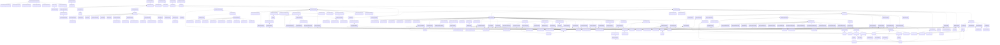

# UML: animgraphlib

Class relationships (inheritance and composition) for the `animgraphlib` module (showing 300 of 301 relationships).

**Arrow legend:** `<|--` inheritance &nbsp; `*--` composition &nbsp; `-->` association/pointer

```mermaid
classDiagram
    CAnimComponentUpdater <|-- CActionComponentUpdater
    CBinaryUpdateNode <|-- CAddUpdateNode
    CUnaryUpdateNode <|-- CAimCameraUpdateNode
    CUnaryUpdateNode <|-- CAimMatrixUpdateNode
    CAnimGraphSettingsGroup <|-- CAnimGraphNetworkSettings
    CAnimComponentUpdater <|-- CAnimScriptComponentUpdater
    CAnimationGraphVisualizerPrimitiveBase <|-- CAnimationGraphVisualizerAxis
    CAnimationGraphVisualizerPrimitiveBase <|-- CAnimationGraphVisualizerLine
    CAnimationGraphVisualizerPrimitiveBase <|-- CAnimationGraphVisualizerPie
    CAnimationGraphVisualizerPrimitiveBase <|-- CAnimationGraphVisualizerSphere
    CAnimationGraphVisualizerPrimitiveBase <|-- CAnimationGraphVisualizerText
    CAnimTagBase <|-- CAudioAnimTag
    CAnimUpdateNodeBase <|-- CBinaryUpdateNode
    CLeafUpdateNode <|-- CBindPoseUpdateNode
    CAnimUpdateNodeBase <|-- CBlend2DUpdateNode
    CAnimUpdateNodeBase <|-- CBlendUpdateNode
    CMotionMetricEvaluator <|-- CBlockSelectionMetricEvaluator
    CAnimTagBase <|-- CBodyGroupAnimTag
    CBinaryUpdateNode <|-- CBoneMaskUpdateNode
    CMotionMetricEvaluator <|-- CBonePositionMetricEvaluator
    CMotionMetricEvaluator <|-- CBoneVelocityMetricEvaluator
    CConcreteAnimParameter <|-- CBoolAnimParameter
    CAnimComponentUpdater <|-- CCPPScriptComponentUpdater
    CAnimUpdateNodeBase <|-- CChoiceUpdateNode
    CUnaryUpdateNode <|-- CChoreoUpdateNode
    CAnimTagBase <|-- CClothSettingsAnimTag
    CAnimParameterBase <|-- CConcreteAnimParameter
    CMotionMetricEvaluator <|-- CCurrentRotationVelocityMetricEvaluator
    CMotionMetricEvaluator <|-- CCurrentVelocityMetricEvaluator
    CLeafUpdateNode <|-- CCycleControlClipUpdateNode
    CUnaryUpdateNode <|-- CCycleControlUpdateNode
    CPathAnimMotorUpdaterBase <|-- CDampedPathAnimMotorUpdater
    CAnimComponentUpdater <|-- CDampedValueComponentUpdater
    CAnimComponentUpdater <|-- CDemoSettingsComponentUpdater
    CUnaryUpdateNode <|-- CDirectPlaybackUpdateNode
    CLeafUpdateNode <|-- CDirectionalBlendUpdateNode
    CMotionMetricEvaluator <|-- CDistanceRemainingMetricEvaluator
    CMotionGraph <|-- CEditableMotionGraph
    CAnimActionUpdater <|-- CEmitTagActionUpdater
    CConcreteAnimParameter <|-- CEnumAnimParameter
    CAnimActionUpdater <|-- CExpressionActionUpdater
    CConcreteAnimParameter <|-- CFloatAnimParameter
    CUnaryUpdateNode <|-- CFollowAttachmentUpdateNode
    CUnaryUpdateNode <|-- CFollowPathUpdateNode
    CUnaryUpdateNode <|-- CFollowTargetUpdateNode
    CUnaryUpdateNode <|-- CFootAdjustmentUpdateNode
    CMotionMetricEvaluator <|-- CFootCycleMetricEvaluator
    CAnimTagBase <|-- CFootFallAnimTag
    CUnaryUpdateNode <|-- CFootLockUpdateNode
    CUnaryUpdateNode <|-- CFootPinningUpdateNode
    CMotionMetricEvaluator <|-- CFootPositionMetricEvaluator
    CUnaryUpdateNode <|-- CFootStepTriggerUpdateNode
    CAnimTagBase <|-- CFootstepLandedAnimTag
    CMotionMetricEvaluator <|-- CFutureFacingMetricEvaluator
    CMotionMetricEvaluator <|-- CFutureVelocityMetricEvaluator
    CAnimTagBase <|-- CHandshakeAnimTagBase
    CUnaryUpdateNode <|-- CHitReactUpdateNode
    CLeafUpdateNode <|-- CInputStreamUpdateNode
    CConcreteAnimParameter <|-- CIntAnimParameter
    CUnaryUpdateNode <|-- CJiggleBoneUpdateNode
    CSequenceUpdateNode <|-- CJumpHelperUpdateNode
    CAnimComponentUpdater <|-- CLODComponentUpdater
    CAnimUpdateNodeBase <|-- CLeafUpdateNode
    CLeafUpdateNode <|-- CLeanMatrixUpdateNode
    CUnaryUpdateNode <|-- CLookAtUpdateNode
    CAnimComponentUpdater <|-- CLookComponentUpdater
    CAnimTagBase <|-- CMaterialAttributeAnimTag
    CLeafUpdateNode <|-- CMotionGraphUpdateNode
    CLeafUpdateNode <|-- CMotionMatchingUpdateNode
    CMotionNode <|-- CMotionNodeBlend1D
    CMotionNode <|-- CMotionNodeSequence
    CAnimComponentUpdater <|-- CMovementComponentUpdater
    CHandshakeAnimTagBase <|-- CMovementHandshakeAnimTag
    CUnaryUpdateNode <|-- CMoverUpdateNode
    CUnaryUpdateNode <|-- COrientationWarpUpdateNode
    CAnimComponentUpdater <|-- CPairedSequenceComponentUpdater
    CSequenceUpdateNodeBase <|-- CPairedSequenceUpdateNode
    CAnimTagBase <|-- CParticleAnimTag
    CPathAnimMotorUpdaterBase <|-- CPathAnimMotorUpdater
    CAnimMotorUpdaterBase <|-- CPathAnimMotorUpdaterBase
    CUnaryUpdateNode <|-- CPathHelperUpdateNode
    CMotionMetricEvaluator <|-- CPathMetricEvaluator
    CAnimMotorUpdaterBase <|-- CPlayerInputAnimMotorUpdater
    CConcreteAnimParameter <|-- CQuaternionAnimParameter
    CAnimTagBase <|-- CRagdollAnimTag
    CAnimComponentUpdater <|-- CRagdollComponentUpdater
    CUnaryUpdateNode <|-- CRagdollUpdateNode
    CAnimComponentUpdater <|-- CRemapValueComponentUpdater
    CUnaryUpdateNode <|-- CRootUpdateNode
    CAnimUpdateNodeBase <|-- CSelectorUpdateNode
    CAnimTagBase <|-- CSequenceFinishedAnimTag
    CSequenceUpdateNodeBase <|-- CSequenceUpdateNode
    CLeafUpdateNode <|-- CSequenceUpdateNodeBase
    CAnimActionUpdater <|-- CSetParameterActionUpdater
    CLeafUpdateNode <|-- CSingleFrameUpdateNode
    CAnimComponentUpdater <|-- CSlopeComponentUpdater
    CUnaryUpdateNode <|-- CSlowDownOnSlopesUpdateNode
    CUnaryUpdateNode <|-- CSolveIKChainUpdateNode
    CUnaryUpdateNode <|-- CSpeedScaleUpdateNode
    CUnaryUpdateNode <|-- CStanceOverrideUpdateNode
    CUnaryUpdateNode <|-- CStanceScaleUpdateNode
    CAnimComponentUpdater <|-- CStateMachineComponentUpdater
    CAnimUpdateNodeBase <|-- CStateMachineUpdateNode
    CStaticPoseCache <|-- CStaticPoseCacheBuilder
    CMotionMetricEvaluator <|-- CStepsRemainingMetricEvaluator
    CUnaryUpdateNode <|-- CStopAtGoalUpdateNode
    CAnimTagBase <|-- CStringAnimTag
    CBinaryUpdateNode <|-- CSubtractUpdateNode
    CConcreteAnimParameter <|-- CSymbolAnimParameter
    CAnimUpdateNodeBase <|-- CTargetSelectorUpdateNode
    CUnaryUpdateNode <|-- CTargetWarpUpdateNode
    CHandshakeAnimTagBase <|-- CTaskHandshakeAnimTag
    CAnimTagBase <|-- CTaskStatusAnimTag
    CMotionMetricEvaluator <|-- CTimeRemainingMetricEvaluator
    CAnimActionUpdater <|-- CToggleComponentActionUpdater
    CUnaryUpdateNode <|-- CTurnHelperUpdateNode
    CUnaryUpdateNode <|-- CTwoBoneIKUpdateNode
    CAnimUpdateNodeBase <|-- CUnaryUpdateNode
    CConcreteAnimParameter <|-- CVectorAnimParameter
    CAnimParameterBase <|-- CVirtualAnimParameter
    CWarpSectionAnimTagBase <|-- CWarpSectionAnimTag
    CAnimTagBase <|-- CWarpSectionAnimTagBase
    CUnaryUpdateNode <|-- CWayPointHelperUpdateNode
    CLeafUpdateNode <|-- CZeroPoseUpdateNode
    AimMatrixOpFixedSettings_t *-- CAnimInputDamping
    AimMatrixOpFixedSettings_t *-- CPoseHandle
    AimMatrixOpFixedSettings_t *-- AimMatrixBlendMode
    AimMatrixOpFixedSettings_t *-- CBlendCurve
    BlendItem_t *-- TagSpan_t
    BlendItem_t *-- CAnimUpdateNodeRef
    CActionComponentUpdater *-- CAnimActionUpdater
    CAddUpdateNode *-- BinaryNodeChildOption
    CAimCameraUpdateNode *-- CAnimParamHandle
    CAimCameraUpdateNode *-- AimCameraOpFixedSettings_t
    CAimMatrixUpdateNode *-- AimMatrixOpFixedSettings_t
    CAimMatrixUpdateNode *-- AnimVectorSource
    CAimMatrixUpdateNode *-- CAnimParamHandle
    CAnimComponentUpdater *-- AnimNodeNetworkMode
    CAnimDemoCaptureSettings *-- EDemoBoneSelectionMode
    CAnimDemoCaptureSettings *-- BoneDemoCaptureSettings_t
    CAnimDemoCaptureSettings *-- IKDemoCaptureSettings_t
    CAnimGraphDebugReplay *-- CAnimReplayFrame
    CAnimGraphModelBinding *-- CAnimUpdateSharedData
    CAnimGraphSettingsManager *-- CAnimGraphSettingsGroup
    CAnimInputDamping *-- DampingSpeedFunction
    CAnimParamHandle *-- AnimParamType_t
    CAnimParameterManagerUpdater *-- CAnimParameterBase
    CAnimParameterManagerUpdater *-- CAnimParamHandle
    CAnimScriptManager *-- ScriptInfo_t
    CAnimStateMachineUpdater *-- CStateUpdateData
    CAnimStateMachineUpdater *-- CTransitionUpdateData
    CAnimTagManagerUpdater *-- CAnimTagBase
    CAnimUpdateNodeBase *-- CAnimNodePath
    CAnimUpdateNodeBase *-- AnimNodeNetworkMode
    CAnimUpdateSharedData *-- CAnimUpdateNodeBase
    CAnimUpdateSharedData *-- CAnimNodePath
    CAnimUpdateSharedData *-- CAnimComponentUpdater
    CAnimUpdateSharedData *-- CAnimParameterManagerUpdater
    CAnimUpdateSharedData *-- CAnimTagManagerUpdater
    CAnimUpdateSharedData *-- CAnimScriptManager
    CAnimUpdateSharedData *-- CAnimGraphSettingsManager
    CAnimUpdateSharedData *-- CStaticPoseCacheBuilder
    CAnimationGraphVisualizerPrimitiveBase *-- CAnimationGraphVisualizerPrimitiveType
    CBinaryUpdateNode *-- CAnimUpdateNodeRef
    CBinaryUpdateNode *-- BinaryNodeTiming
    CBlend2DUpdateNode *-- BlendItem_t
    CBlend2DUpdateNode *-- TagSpan_t
    CBlend2DUpdateNode *-- CParamSpanUpdater
    CBlend2DUpdateNode *-- CAnimInputDamping
    CBlend2DUpdateNode *-- AnimValueSource
    CBlend2DUpdateNode *-- CAnimParamHandle
    CBlend2DUpdateNode *-- Blend2DMode
    CBlendUpdateNode *-- CAnimUpdateNodeRef
    CBlendUpdateNode *-- AnimValueSource
    CBlendUpdateNode *-- LinearRootMotionBlendMode_t
    CBlendUpdateNode *-- CAnimParamHandle
    CBlendUpdateNode *-- CAnimInputDamping
    CBlendUpdateNode *-- BlendKeyType
    CBodyGroupAnimTag *-- CBodyGroupSetting
    CBoneMaskUpdateNode *-- BoneMaskBlendSpace
    CBoneMaskUpdateNode *-- BinaryNodeChildOption
    CBoneMaskUpdateNode *-- AnimValueSource
    CBoneMaskUpdateNode *-- CAnimParamHandle
    CChoiceUpdateNode *-- CAnimUpdateNodeRef
    CChoiceUpdateNode *-- ChoiceMethod
    CChoiceUpdateNode *-- ChoiceChangeMethod
    CChoiceUpdateNode *-- ChoiceBlendMethod
    CChoreoInstanceData *-- CAnimationLayer
    CConcreteAnimParameter *-- AnimParamButton_t
    CConcreteAnimParameter *-- AnimParamNetworkSetting
    CCycleControlClipUpdateNode *-- TagSpan_t
    CCycleControlClipUpdateNode *-- AnimValueSource
    CCycleControlClipUpdateNode *-- CAnimParamHandle
    CCycleControlUpdateNode *-- AnimValueSource
    CCycleControlUpdateNode *-- CAnimParamHandle
    CDampedPathAnimMotorUpdater *-- CAnimParamHandle
    CDampedValueComponentUpdater *-- CDampedValueUpdateItem
    CDampedValueUpdateItem *-- CAnimInputDamping
    CDampedValueUpdateItem *-- CAnimParamHandle
    CDemoSettingsComponentUpdater *-- CAnimDemoCaptureSettings
    CDirectPlaybackInstanceData *-- SequenceData
    CDirectPlaybackTagData *-- TagSpan_t
    CDirectPlaybackUpdateNode *-- CDirectPlaybackTagData
    CDirectionalBlendUpdateNode *-- CAnimInputDamping
    CDirectionalBlendUpdateNode *-- AnimValueSource
    CDirectionalBlendUpdateNode *-- CAnimParamHandle
    CExpressionActionUpdater *-- CAnimParamHandle
    CExpressionActionUpdater *-- AnimParamType_t
    CFollowAttachmentUpdateNode *-- FollowAttachmentSettings_t
    CFollowPathUpdateNode *-- CAnimInputDamping
    CFollowPathUpdateNode *-- AnimValueSource
    CFollowPathUpdateNode *-- CAnimParamHandle
    CFollowTargetUpdateNode *-- FollowTargetOpFixedSettings_t
    CFollowTargetUpdateNode *-- CAnimParamHandle
    CFootAdjustmentUpdateNode *-- CPoseHandle
    CFootAdjustmentUpdateNode *-- CAnimParamHandle
    CFootFallAnimTag *-- FootFallTagFoot_t
    CFootLockUpdateNode *-- FootLockPoseOpFixedSettings
    CFootLockUpdateNode *-- FootFixedSettings
    CFootLockUpdateNode *-- CAnimInputDamping
    CFootPinningUpdateNode *-- FootPinningPoseOpFixedData_t
    CFootPinningUpdateNode *-- FootPinningTimingSource
    CFootPinningUpdateNode *-- CAnimParamHandle
    CFootStepTriggerUpdateNode *-- FootStepTrigger
    CFootstepLandedAnimTag *-- FootstepLandedFootSoundType_t
    CFootstepLandedAnimTag *-- FootstepJumpPhase_t
    CFutureVelocityMetricEvaluator *-- VelocityMetricMode
    CHitReactUpdateNode *-- HitReactFixedSettings_t
    CHitReactUpdateNode *-- CAnimParamHandle
    CJiggleBoneUpdateNode *-- JiggleBoneSettingsList_t
    CJumpHelperUpdateNode *-- CAnimParamHandle
    CJumpHelperUpdateNode *-- JumpCorrectionMethod
    CLeanMatrixUpdateNode *-- CPoseHandle
    CLeanMatrixUpdateNode *-- CAnimInputDamping
    CLeanMatrixUpdateNode *-- AnimVectorSource
    CLeanMatrixUpdateNode *-- CAnimParamHandle
    CLookAtUpdateNode *-- LookAtOpFixedSettings_t
    CLookAtUpdateNode *-- AnimVectorSource
    CLookAtUpdateNode *-- CAnimParamHandle
    CLookComponentUpdater *-- CAnimParamHandle
    CMaterialAttributeAnimTag *-- MatterialAttributeTagType_t
    CMotionDataSet *-- CMotionGraphGroup
    CMotionGraph *-- CParamSpanUpdater
    CMotionGraph *-- TagSpan_t
    CMotionGraph *-- CMotionNode
    CMotionGraphConfig *-- MotionIndex
    CMotionGraphGroup *-- CMotionSearchDB
    CMotionGraphGroup *-- CMotionGraph
    CMotionGraphGroup *-- CMotionGraphConfig
    CMotionGraphUpdateNode *-- CMotionGraph
    CMotionMatchingUpdateNode *-- CMotionDataSet
    CMotionMatchingUpdateNode *-- CMotionMetricEvaluator
    CMotionMatchingUpdateNode *-- CBlendCurve
    CMotionMatchingUpdateNode *-- CAnimInputDamping
    CMotionNodeBlend1D *-- MotionBlendItem
    CMotionNodeSequence *-- TagSpan_t
    CMotionSearchDB *-- CMotionSearchNode
    CMotionSearchDB *-- CProductQuantizer
    CMotionSearchDB *-- MotionDBIndex
    CMotionSearchNode *-- CVectorQuantizer
    CMotionSearchNode *-- SampleCode
    CMovementComponentUpdater *-- CAnimMotorUpdaterBase
    CMovementComponentUpdater *-- CAnimInputDamping
    CMovementComponentUpdater *-- CAnimParamHandle
    CMoverUpdateNode *-- CAnimInputDamping
    CMoverUpdateNode *-- AnimValueSource
    CMoverUpdateNode *-- CAnimParamHandle
    COrientationWarpUpdateNode *-- OrientationWarpMode_t
    COrientationWarpUpdateNode *-- CAnimParamHandle
    COrientationWarpUpdateNode *-- OrientationWarpTargetOffsetMode_t
    COrientationWarpUpdateNode *-- CAnimInputDamping
    COrientationWarpUpdateNode *-- OrientationWarpRootMotionSource_t
    COrientationWarpUpdateNode *-- AnimValueSource
    CParamSpanUpdater *-- ParamSpan_t
    CPlayerInputAnimMotorUpdater *-- CAnimParamHandle
    CPoseHandle *-- PoseType_t
    CProductQuantizer *-- CVectorQuantizer
    CRagdollComponentUpdater *-- CAnimNodePath
    CRagdollComponentUpdater *-- WeightList
    CRagdollUpdateNode *-- RagdollPoseControl
    CRemapValueComponentUpdater *-- CRemapValueUpdateItem
    CRemapValueUpdateItem *-- CAnimParamHandle
    CSelectorUpdateNode *-- CAnimUpdateNodeRef
    CSelectorUpdateNode *-- CBlendCurve
    CSelectorUpdateNode *-- CAnimParamHandle
    CSelectorUpdateNode *-- SelectorTagBehavior_t
    CSequenceTagSpans *-- TagSpan_t
    CSequenceUpdateNode *-- CParamSpanUpdater
    CSequenceUpdateNode *-- TagSpan_t
    CSetParameterActionUpdater *-- CAnimParamHandle
    CSingleFrameUpdateNode *-- CAnimActionUpdater
    CSingleFrameUpdateNode *-- CPoseHandle
    CSlopeComponentUpdater *-- CAnimParamHandle
    CSolveIKChainUpdateNode *-- CSolveIKTargetHandle_t
    CSolveIKChainUpdateNode *-- SolveIKChainPoseOpFixedSettings_t
    CSolveIKTargetHandle_t *-- CAnimParamHandle
    CSpeedScaleUpdateNode *-- CAnimParamHandle
    CStanceOverrideUpdateNode *-- StanceInfo_t
    CStanceOverrideUpdateNode *-- CAnimUpdateNodeRef
    CStanceOverrideUpdateNode *-- CAnimParamHandle
```
