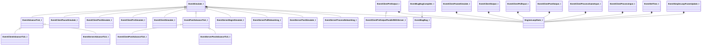

# UML: engine2

Class relationships (inheritance and composition) for the `engine2` module.

**Arrow legend:** `<|--` inheritance &nbsp; `*--` composition &nbsp; `-->` association/pointer

```mermaid
classDiagram
    EventSimulate_t <|-- EventAdvanceTick_t
    EventAdvanceTick_t <|-- EventClientAdvanceTick_t
    EventSimulate_t <|-- EventClientPauseSimulate_t
    EventPostAdvanceTick_t <|-- EventClientPostAdvanceTick_t
    EventSimulate_t <|-- EventClientPostSimulate_t
    EventClientPreOutput_t <|-- EventClientPreOutputParallelWithServer_t
    EventSimulate_t <|-- EventClientPreSimulate_t
    EventSimulate_t <|-- EventClientSimulate_t
    EventSimulate_t <|-- EventPostAdvanceTick_t
    EventAdvanceTick_t <|-- EventServerAdvanceTick_t
    EventSimulate_t <|-- EventServerBeginSimulate_t
    EventSimulate_t <|-- EventServerPollNetworking_t
    EventPostAdvanceTick_t <|-- EventServerPostAdvanceTick_t
    EventSimulate_t <|-- EventServerPostSimulate_t
    EventSimulate_t <|-- EventServerProcessNetworking_t
    EventBugBugComplete_t --> EventBugBug_t
    EventClientFrameSimulate_t *-- EngineLoopState_t
    EventClientOutput_t *-- EngineLoopState_t
    EventClientPollInput_t *-- EngineLoopState_t
    EventClientPostOutput_t *-- EngineLoopState_t
    EventClientPreOutput_t *-- EngineLoopState_t
    EventClientProcessGameInput_t *-- EngineLoopState_t
    EventClientProcessInput_t *-- EngineLoopState_t
    EventSetTime_t *-- EngineLoopState_t
    EventSimpleLoopFrameUpdate_t *-- EngineLoopState_t
    EventSimulate_t *-- EngineLoopState_t
```
