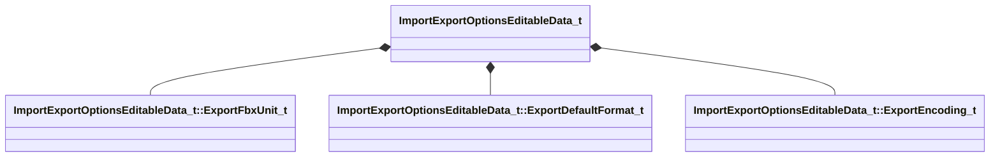

# UML: hammer

Class relationships (inheritance and composition) for the `hammer` module.

**Arrow legend:** `<|--` inheritance &nbsp; `*--` composition &nbsp; `-->` association/pointer

```mermaid
classDiagram
    ImportExportOptionsEditableData_t *-- `ImportExportOptionsEditableData_t::ExportFbxUnit_t`
    ImportExportOptionsEditableData_t *-- `ImportExportOptionsEditableData_t::ExportDefaultFormat_t`
    ImportExportOptionsEditableData_t *-- `ImportExportOptionsEditableData_t::ExportEncoding_t`
```
