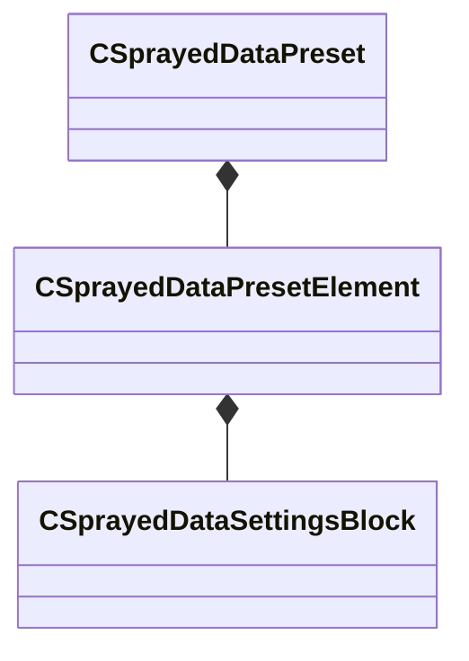

# UML: mapdoclib

Class relationships (inheritance and composition) for the `mapdoclib` module.

**Arrow legend:** `<|--` inheritance &nbsp; `*--` composition &nbsp; `-->` association/pointer

```mermaid
classDiagram
    CSprayedDataPreset *-- CSprayedDataPresetElement
    CSprayedDataPresetElement *-- CSprayedDataSettingsBlock
```
