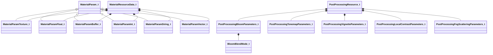

# UML: materialsystem2

Class relationships (inheritance and composition) for the `materialsystem2` module.

**Arrow legend:** `<|--` inheritance &nbsp; `*--` composition &nbsp; `-->` association/pointer

