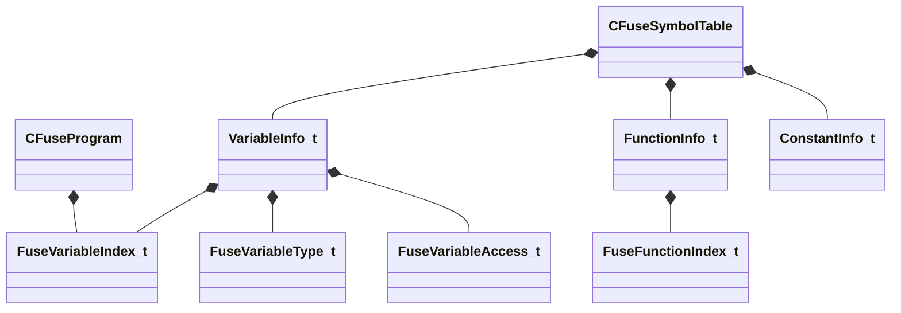

# UML: mathlib_extended

Class relationships (inheritance and composition) for the `mathlib_extended` module.

**Arrow legend:** `<|--` inheritance &nbsp; `*--` composition &nbsp; `-->` association/pointer

