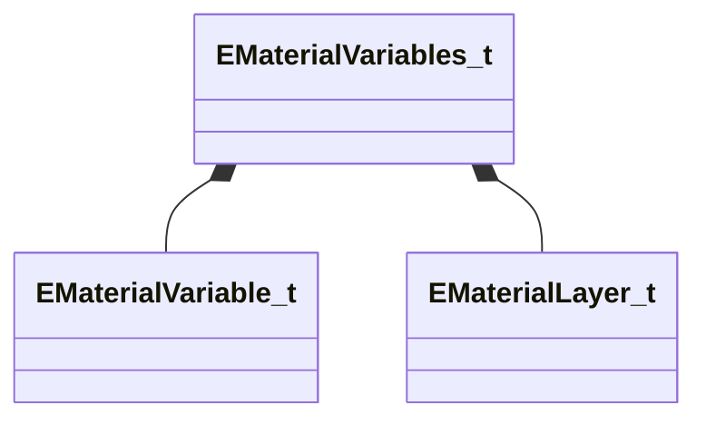

# UML: met

Class relationships (inheritance and composition) for the `met` module.

**Arrow legend:** `<|--` inheritance &nbsp; `*--` composition &nbsp; `-->` association/pointer

```mermaid
classDiagram
    EMaterialVariables_t *-- EMaterialVariable_t
    EMaterialVariables_t *-- EMaterialLayer_t
```
