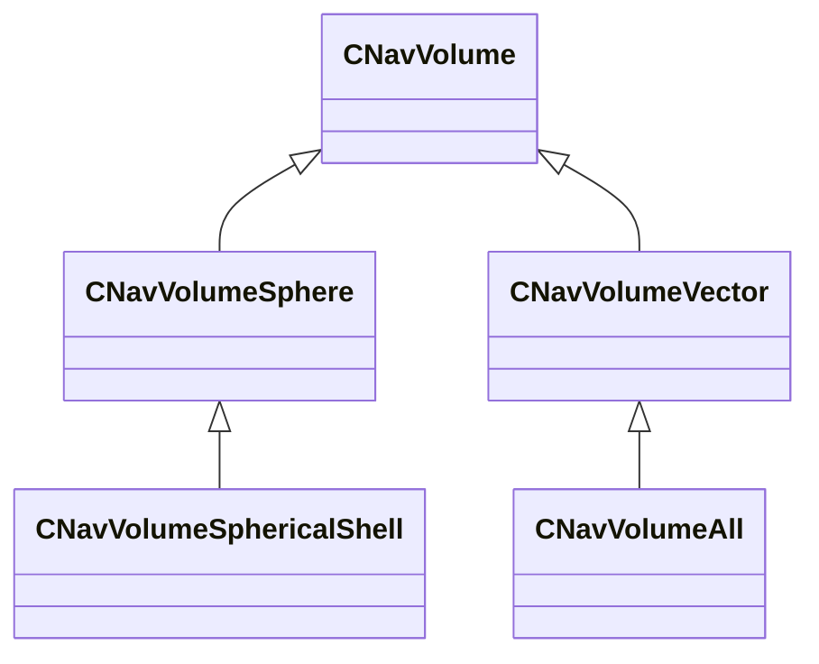

# UML: navlib

Class relationships (inheritance and composition) for the `navlib` module.

**Arrow legend:** `<|--` inheritance &nbsp; `*--` composition &nbsp; `-->` association/pointer

```mermaid
classDiagram
    CNavVolume <|-- CNavVolumeSphere
    CNavVolumeVector <|-- CNavVolumeAll
    CNavVolume <|-- CNavVolumeVector
    CNavVolumeSphere <|-- CNavVolumeSphericalShell
```
