# UML: pulse_system

Class relationships (inheritance and composition) for the `pulse_system` module.

**Arrow legend:** `<|--` inheritance &nbsp; `*--` composition &nbsp; `-->` association/pointer

```mermaid
classDiagram
    CPulseExecCursor <|-- CPulseTurtleGraphicsCursor
    CPulseCell_BaseFlow <|-- CPulseCell_Outflow_TestRandomYesNo
    CPulseCell_BaseFlow <|-- CPulseCell_Outflow_TestExplicitYesNo
    CPulseCell_BaseFlow <|-- CPulseCell_Test_MultiInflow_NoDefault
    CPulseCell_BaseValue <|-- CPulseCell_Val_TestDomainGetEntityName
    CPulseCell_BaseFlow <|-- CPulseCell_Step_TestDomainTracepoint
    CBasePulseGraphInstance <|-- CPulseGraphInstance_TestDomain_FakeEntityOwner
    CPulseGraphInstance_TestDomain <|-- CPulseGraphInstance_TestDomain_Derived
    CPulseCell_BaseYieldingInflow <|-- CPulseCell_Test_MultiOutflow_WithParams_Yielding
    CPulseCell_BaseFlow <|-- CPulseCell_Step_TestDomainEntFire
    CPulseCell_BaseFlow <|-- CPulseCell_Step_TestDomainCreateFakeEntity
    CBasePulseGraphInstance <|-- CPulseGraphInstance_TestDomain
    CPulseCell_BaseYieldingInflow <|-- CPulseCell_TestWaitWithCursorState
    CBasePulseGraphInstance <|-- CPulseGraphInstance_TurtleGraphics
    CPulseGraphInstance_TestDomain <|-- CPulseGraphInstance_TestDomain_UseReadOnlyBlackboardView
    CPulseCell_BaseFlow <|-- CPulseCell_Test_NoInflow
    CPulseCell_BaseRequirement <|-- CPulseCell_ExampleCriteria
    CPulseCell_BaseFlow <|-- CPulseCell_Test_MultiInflow_WithDefault
    CPulseCell_BaseValue <|-- CPulseCell_Value_TestValue50
    CPulseExecCursor <|-- CTestDomainDerived_Cursor
    CPulseCell_BaseFlow <|-- CPulseCell_ExampleSelector
    CPulseCell_BaseFlow <|-- CPulseCell_Test_MultiOutflow_WithParams
    CPulseCell_BaseFlow <|-- CPulseCell_Step_TestDomainDestroyFakeEntity
    CPulseCell_BaseValue <|-- CPulseCell_Val_TestDomainFindEntityByName
```

