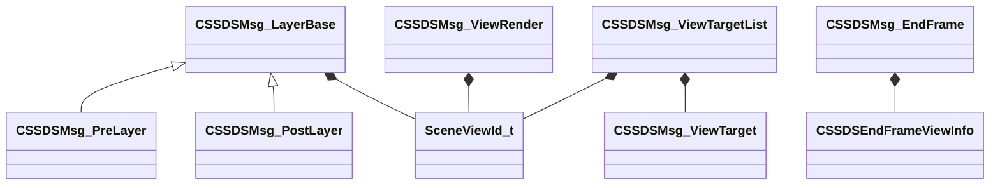

# UML: scenesystem

Class relationships (inheritance and composition) for the `scenesystem` module.

**Arrow legend:** `<|--` inheritance &nbsp; `*--` composition &nbsp; `-->` association/pointer

```mermaid
classDiagram
    CSSDSMsg_LayerBase <|-- CSSDSMsg_PreLayer
    CSSDSMsg_LayerBase <|-- CSSDSMsg_PostLayer
    CSSDSMsg_EndFrame *-- CSSDSEndFrameViewInfo
    CSSDSMsg_ViewRender *-- SceneViewId_t
    CSSDSMsg_ViewTargetList *-- SceneViewId_t
    CSSDSMsg_ViewTargetList *-- CSSDSMsg_ViewTarget
    CSSDSMsg_LayerBase *-- SceneViewId_t
```
