# UML: sounddoc_lib

Class relationships (inheritance and composition) for the `sounddoc_lib` module.

**Arrow legend:** `<|--` inheritance &nbsp; `*--` composition &nbsp; `-->` association/pointer

```mermaid
classDiagram
    CMixPropertyBase <|-- CMixDelayImpulseResponse
    CMixPropertyBase <|-- CMixControlStackInput
    CMixPropertyBase <|-- CMixSum
    CMixPropertyBase <|-- CMixPlateverb
    CMixPropertyBase <|-- CMixSteamAudioHybridReverb
    CMixPropertyBase <|-- CMixControlCurve
    CMixPropertyBase <|-- CMixAutoFilter
    CMixPropertyBase <|-- CMixEffectChain
    CMixPropertyBase <|-- CMixStereoDelay
    CMixPropertyBase <|-- CMixImpulseResponseInput
    CMixPropertyBase <|-- CMixRemapVsndToImpulseResponse
    CMixPropertyBase <|-- CMixBlendVsndsToImpulseResponse
    CMixPropertyBase <|-- CMixFreeverb
    CMixPropertyBase <|-- CMixConvolution
    CMixPropertyBase <|-- CMixSubgraphSwitch
    CMixPropertyBase <|-- CMixGroupBox
    CMixPropertyBase <|-- CMixModDelay
    CMixPropertyBase <|-- CMixControlInputArray
    CMixPropertyBase <|-- CMixSplitter
    CMixPropertyBase <|-- CMixDelay
    CMixPropertyBase <|-- CMixBlendAudio
    CMixPropertyBase <|-- CMixPitchShift
    CMixPropertyBase <|-- CMixEnvelope
    CMixPropertyBase <|-- CMixDynamicsCompressor
    CMixPropertyBase <|-- CMixUtility
    CMixPropertyBase <|-- CMixTrack
    CMixPropertyBase <|-- CMixControlCrossfade
    CMixPropertyBase <|-- CMixOutput
    CMixPropertyBase <|-- CMixEnvelopeTrigger
    CMixPropertyBase <|-- CMixOsc
    CMixPropertyBase <|-- CMixBoxverb2
    CMixPropertyBase <|-- CMixControlAutomatic
    CMixPropertyBase <|-- CMixPresetDSP
    CMixPropertyBase <|-- CMixControlTransientInput
    CMixPropertyBase <|-- CMixControlListener
    CMixPropertyBase <|-- CMixControlMax
    CMixPropertyBase <|-- CMixShaper
    CMixPropertyBase <|-- CMixSubgraph
    CMixPropertyBase <|-- CMixFilter
    CMixPropertyBase <|-- CMixSteamAudioPathing
    CMixPropertyBase <|-- CMixAmp
    CMixPropertyBase <|-- CMixSteamAudioSource
    CMixPropertyBase <|-- CMixDynamics3Band
    CMixPropertyBase <|-- CMixEQ8
    CMixPropertyBase <|-- CMixDynamics
    CMixPropertyBase <|-- CMixSteamAudioDirect
    CMixPropertyBase <|-- CMixAudioMeter
    CMixPropertyBase <|-- CMixDiffusor
    CMixPropertyBase <|-- CMixBoxverb
    CMixPropertyBase <|-- CMixVsndName
    CMixPropertyBase <|-- CMixDualCompressor
    CMixPropertyBase <|-- CMixVocoder
    CMixPropertyBase <|-- CMixControlInput
    CMixPropertyBase <|-- CMixControlMeter
    CMixPropertyBase <|-- CMixSplitterBlend
    CMixPropertyBase <|-- CMixFlanger
    CMixPropertyBase <|-- CMixPanner
    CMixPropertyBase <|-- CMixControlRemap
    CMixPropertyBase <|-- CMixEffectName
    CMixPropertyBase <|-- CMixControlOutput
    CVMixToolGraph *-- CVMixEditorNode
    CVMixToolGraph *-- CVMixEditorEdge
    CVMixToolGraphEntry *-- CVMixToolGraph
    CVMixToolGraphEntry *-- CGraphEditorState
    CVMixToolGraphEntry *-- CGraphPreviewList
    CMixSubgraphSwitch *-- CSelectableSubgraph
    CEffectsPreviewList *-- CPreviewList
    CPreviewList *-- CPreviewEntry
    CGraphPreviewList *-- CPreviewList
    CMixSteamAudioSource *-- SteamAudioHRTFInterpolationType_t
    CMixEQ8 *-- CFilterStage
```

