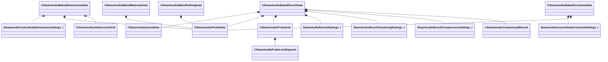

# UML: steamaudio

Class relationships (inheritance and composition) for the `steamaudio` module.

**Arrow legend:** `<|--` inheritance &nbsp; `*--` composition &nbsp; `-->` association/pointer

```mermaid
classDiagram
    CSteamAudioProbeGrid *-- CSteamAudioProbeLineSegment
    CSteamAudioBakedDimensionsData *-- SteamAudioCustomDataDimensionsSettings_t
    CSteamAudioBakedDimensionsData *-- CSteamAudioProbeData
    CSteamAudioBakedDimensionsData *-- CSteamAudioAmbisonicsField
    CSteamAudioBakedReverbData *-- CSteamAudioSceneData
    CSteamAudioBakedReverbData *-- CSteamAudioProbeData
    CSteamAudioBakedReverbData *-- CSteamAudioProbeGrid
    CSteamAudioBakedReverbData *-- SteamAudioReverbSettings_t
    CSteamAudioBakedReverbData *-- SteamAudioReverbClusteringSettings_t
    CSteamAudioBakedReverbData *-- SteamAudioReverbCompressionSettings_t
    CSteamAudioBakedReverbData *-- CSteamAudioCompressedReverb
    CSteamAudioBakedOcclusionData *-- SteamAudioCustomDataOcclusionSettings_t
    CSteamAudioBakedOcclusionData *-- CSteamAudioProbeData
    CSteamAudioBakedMaterialsData *-- CSteamAudioProbeData
    CSteamAudioBakedPathingData *-- CSteamAudioProbeData
```
