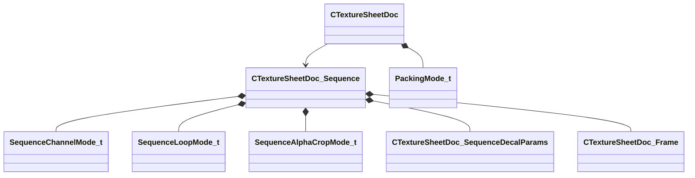

# UML: texturelib

Class relationships (inheritance and composition) for the `texturelib` module.

**Arrow legend:** `<|--` inheritance &nbsp; `*--` composition &nbsp; `-->` association/pointer

```mermaid
classDiagram
    CTextureSheetDoc_Sequence *-- SequenceChannelMode_t
    CTextureSheetDoc_Sequence *-- SequenceLoopMode_t
    CTextureSheetDoc_Sequence *-- SequenceAlphaCropMode_t
    CTextureSheetDoc_Sequence *-- CTextureSheetDoc_SequenceDecalParams
    CTextureSheetDoc_Sequence *-- CTextureSheetDoc_Frame
    CTextureSheetDoc *-- PackingMode_t
    CTextureSheetDoc --> CTextureSheetDoc_Sequence
```
