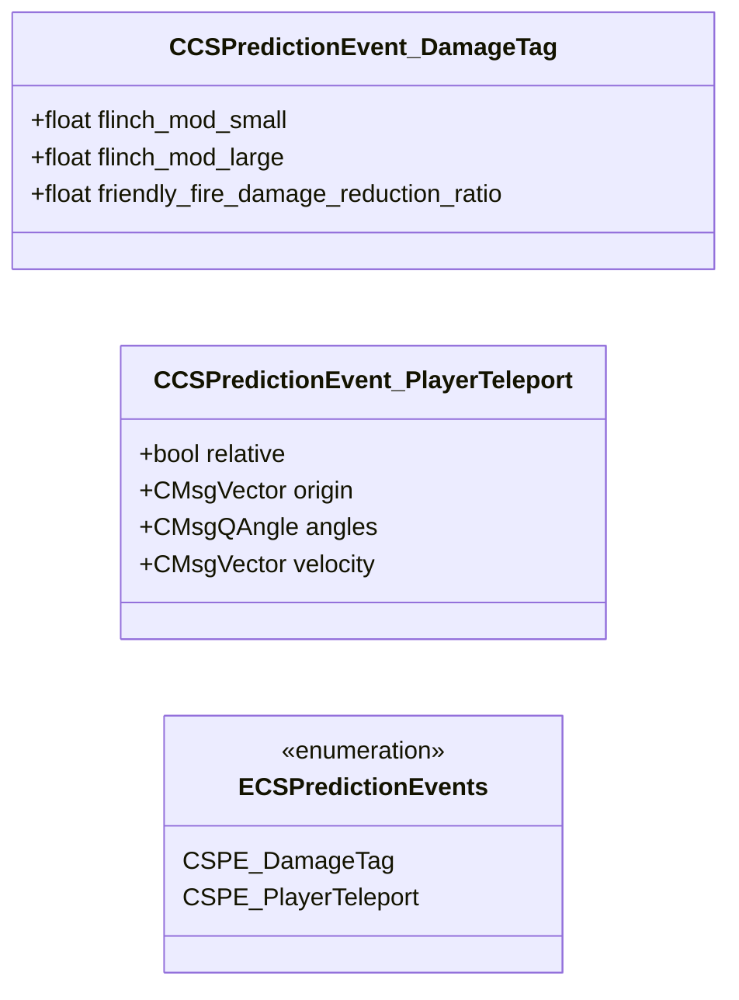

# `cs_prediction_events.proto`

**Imports:** [`networkbasetypes.proto`](networkbasetypes.md), `prediction_events.proto`

## Diagram

## Enums

### `ECSPredictionEvents`

| Name | Value |
|------|-------|
| `CSPE_DamageTag` | 1 |
| `CSPE_PlayerTeleport` | 3 |

## Messages

### `CCSPredictionEvent_DamageTag`

| Field | Number | Type | Label | Description |
|-------|--------|------|-------|-------------|
| `flinch_mod_small` | 1 | float | optional |  |
| `flinch_mod_large` | 2 | float | optional |  |
| `friendly_fire_damage_reduction_ratio` | 3 | float | optional |  |

### `CCSPredictionEvent_PlayerTeleport`

| Field | Number | Type | Label | Description |
|-------|--------|------|-------|-------------|
| `relative` | 1 | bool | optional |  |
| `origin` | 2 | [CMsgVector](networkbasetypes.md#cmsgvector) | optional |  |
| `angles` | 3 | [CMsgQAngle](networkbasetypes.md#cmsgqangle) | optional |  |
| `velocity` | 4 | [CMsgVector](networkbasetypes.md#cmsgvector) | optional |  |
