# `cstrike15_gcmessages.proto`

## Diagram

```mermaid
classDiagram
direction LR

  class TournamentPlayer {
    +uint32 account_id
    +string player_nick
    +string player_name
    +uint32 player_dob
    +string player_flag
    +string player_location
    +string player_desc
  }

  class TournamentTeam {
    +int32 team_id
    +string team_tag
    +string team_flag
    +string team_name
    +List~TournamentPlayer~ players
  }

  class TournamentEvent {
    +int32 event_id
    +string event_tag
    +string event_name
    +uint32 event_time_start
    +uint32 event_time_end
    +int32 event_public
    +int32 event_stage_id
    +string event_stage_name
    +uint32 active_section_id
  }

  class OperationalVarValue {
    +string name
    +int32 ivalue
    +float fvalue
    +bytes svalue
  }

  class PlayerRankingInfo {
    +uint32 account_id
    +uint32 rank_id
    +uint32 wins
    +float rank_change
    +uint32 rank_type_id
    +uint32 tv_control
    +uint64 rank_window_stats
    +string leaderboard_name
    +uint32 rank_if_win
    +uint32 rank_if_lose
    +uint32 rank_if_tie
    +List~PlayerRankingInfo.PerMapRank~ per_map_rank
    +uint32 leaderboard_name_status
    +uint32 highest_rank
    +uint32 rank_expiry
  }

  class PlayerRankingInfo_PerMapRank["PlayerRankingInfo.PerMapRank"] {
    +uint32 map_id
    +uint32 rank_id
    +uint32 wins
  }

  class IpAddressMask {
    +uint32 a
    +uint32 b
    +uint32 c
    +uint32 d
    +uint32 bits
    +uint32 token
  }

  class XpProgressData {
    +uint32 xp_points
    +int32 xp_category
  }

  class ScoreLeaderboardData {
    +uint64 quest_id
    +uint32 score
    +List~ScoreLeaderboardData.AccountEntries~ accountentries
    +List~ScoreLeaderboardData.Entry~ matchentries
    +string leaderboard_name
  }

  class ScoreLeaderboardData_Entry["ScoreLeaderboardData.Entry"] {
    +uint32 tag
    +uint32 val
  }

  class ScoreLeaderboardData_AccountEntries["ScoreLeaderboardData.AccountEntries"] {
    +uint32 accountid
    +List~ScoreLeaderboardData.Entry~ entries
  }

  class DeepPlayerStatsEntry {
    +uint32 accountid
    +uint64 match_id
    +uint32 mm_game_mode
    +uint32 mapid
    +bool b_starting_ct
    +uint32 match_outcome
    +uint32 rounds_won
    +uint32 rounds_lost
    +uint32 stat_score
    +uint32 stat_deaths
    +uint32 stat_mvps
    +uint32 enemy_kills
    +uint32 enemy_headshots
    +uint32 enemy_2ks
    +uint32 enemy_3ks
    +uint32 enemy_4ks
    +uint32 total_damage
    +uint32 engagements_entry_count
    +uint32 engagements_entry_wins
    +uint32 engagements_1v1_count
    +uint32 engagements_1v1_wins
    +uint32 engagements_1v2_count
    +uint32 engagements_1v2_wins
    +uint32 utility_count
    +uint32 utility_success
    +uint32 flash_count
    +uint32 flash_success
    +List~uint32~ mates
  }

  class DeepPlayerMatchEvent {
    +uint32 accountid
    +uint64 match_id
    +uint32 event_id
    +uint32 event_type
    +bool b_playing_ct
    +int32 user_pos_x
    +int32 user_pos_y
    +int32 user_pos_z
    +uint32 user_defidx
    +int32 other_pos_x
    +int32 other_pos_y
    +int32 other_pos_z
    +uint32 other_defidx
    +int32 event_data
  }

  class CDataGCCStrike15_v2_TournamentMatchDraft {
    +int32 event_id
    +int32 event_stage_id
    +int32 team_id_0
    +int32 team_id_1
    +int32 maps_count
    +int32 maps_current
    +int32 team_id_start
    +int32 team_id_veto1
    +int32 team_id_pickn
    +List~CDataGCCStrike15_v2_TournamentMatchDraft.Entry~ drafts
    +List~int32~ vote_mapid_0
    +List~int32~ vote_mapid_1
    +List~int32~ vote_mapid_2
    +List~int32~ vote_mapid_3
    +List~int32~ vote_mapid_4
    +List~int32~ vote_mapid_5
    +List~int32~ vote_starting_side
    +int32 vote_phase
    +float vote_phase_start
    +float vote_phase_length
  }

  class CDataGCCStrike15_v2_TournamentMatchDraft_Entry["CDataGCCStrike15_v2_TournamentMatchDraft.Entry"] {
    +int32 mapid
    +int32 team_id_ct
  }

  class CPreMatchInfoData {
    +int32 predictions_pct
    +CDataGCCStrike15_v2_TournamentMatchDraft draft
    +List~CPreMatchInfoData.TeamStats~ stats
    +List~int32~ wins
  }

  class CPreMatchInfoData_TeamStats["CPreMatchInfoData.TeamStats"] {
    +int32 match_info_idxtxt
    +string match_info_txt
    +List~string~ match_info_teams
  }

  class CMsgGCCStrike15_v2_MatchmakingGC2ServerReserve {
    +List~uint32~ account_ids
    +uint32 game_type
    +uint64 match_id
    +uint32 server_version
    +uint32 flags
    +List~PlayerRankingInfo~ rankings
    +uint64 encryption_key
    +uint64 encryption_key_pub
    +List~uint32~ party_ids
    +List~IpAddressMask~ whitelist
    +uint64 tv_master_steamid
    +TournamentEvent tournament_event
    +List~TournamentTeam~ tournament_teams
    +List~uint32~ tournament_casters_account_ids
    +uint64 tv_relay_steamid
    +CPreMatchInfoData pre_match_data
    +uint32 tv_control
    +List~OperationalVarValue~ op_var_values
    +uint32 socache_control
    +List~int32~ teammate_colors
    +uint32 match_id_additional
  }

  class CMsgGCCstrike15_v2_GC2ServerNotifyXPRewarded {
    +List~XpProgressData~ xp_progress_data
    +uint32 account_id
    +uint32 current_xp
    +uint32 current_level
    +uint32 upgraded_defidx
    +uint32 operation_points_awarded
    +uint32 free_rewards
    +uint32 xp_trail_remaining
    +int32 xp_trail_xp_needed
    +uint32 xp_trail_level
  }

  class CMsgGCCStrike15_ClientDeepStats {
    +uint32 account_id
    +CMsgGCCStrike15_ClientDeepStats.DeepStatsRange range
    +List~CMsgGCCStrike15_ClientDeepStats.DeepStatsMatch~ matches
  }

  class CMsgGCCStrike15_ClientDeepStats_DeepStatsRange["CMsgGCCStrike15_ClientDeepStats.DeepStatsRange"] {
    +uint32 begin
    +uint32 end
    +bool frozen
  }

  class CMsgGCCStrike15_ClientDeepStats_DeepStatsMatch["CMsgGCCStrike15_ClientDeepStats.DeepStatsMatch"] {
    +DeepPlayerStatsEntry player
    +List~DeepPlayerMatchEvent~ events
  }

  class CEconItemPreviewDataBlock {
    +uint32 accountid
    +uint64 itemid
    +uint32 defindex
    +uint32 paintindex
    +uint32 rarity
    +uint32 quality
    +uint32 paintwear
    +uint32 paintseed
    +uint32 killeaterscoretype
    +uint32 killeatervalue
    +string customname
    +List~CEconItemPreviewDataBlock.Sticker~ stickers
    +uint32 inventory
    +uint32 origin
    +uint32 questid
    +uint32 dropreason
    +uint32 musicindex
    +int32 entindex
    +uint32 petindex
    +List~CEconItemPreviewDataBlock.Sticker~ keychains
    +uint32 style
    +List~CEconItemPreviewDataBlock.Sticker~ variations
    +uint32 upgrade_level
  }

  class CEconItemPreviewDataBlock_Sticker["CEconItemPreviewDataBlock.Sticker"] {
    +uint32 slot
    +uint32 sticker_id
    +float wear
    +float scale
    +float rotation
    +uint32 tint_id
    +float offset_x
    +float offset_y
    +float offset_z
    +uint32 pattern
    +uint32 highlight_reel
    +uint32 wrapped_sticker
  }

  class PlayerDecalDigitalSignature {
    +bytes signature
    +uint32 accountid
    +uint32 rtime
    +List~float~ endpos
    +List~float~ startpos
    +List~float~ left
    +uint32 tx_defidx
    +int32 entindex
    +uint32 hitbox
    +float creationtime
    +uint32 equipslot
    +uint32 trace_id
    +List~float~ normal
    +uint32 tint_id
  }

  TournamentTeam --> TournamentPlayer : players[]
  PlayerRankingInfo --> PlayerRankingInfo_PerMapRank : per_map_rank[]
  ScoreLeaderboardData --> ScoreLeaderboardData_AccountEntries : accountentries[]
  ScoreLeaderboardData --> ScoreLeaderboardData_Entry : matchentries[]
  ScoreLeaderboardData_AccountEntries --> ScoreLeaderboardData_Entry : entries[]
  CDataGCCStrike15_v2_TournamentMatchDraft --> CDataGCCStrike15_v2_TournamentMatchDraft_Entry : drafts[]
  CPreMatchInfoData --> CDataGCCStrike15_v2_TournamentMatchDraft : draft
  CPreMatchInfoData --> CPreMatchInfoData_TeamStats : stats[]
  CMsgGCCStrike15_v2_MatchmakingGC2ServerReserve --> PlayerRankingInfo : rankings[]
  CMsgGCCStrike15_v2_MatchmakingGC2ServerReserve --> IpAddressMask : whitelist[]
  CMsgGCCStrike15_v2_MatchmakingGC2ServerReserve --> TournamentEvent : tournament_event
  CMsgGCCStrike15_v2_MatchmakingGC2ServerReserve --> TournamentTeam : tournament_teams[]
  CMsgGCCStrike15_v2_MatchmakingGC2ServerReserve --> CPreMatchInfoData : pre_match_data
  CMsgGCCStrike15_v2_MatchmakingGC2ServerReserve --> OperationalVarValue : op_var_values[]
  CMsgGCCstrike15_v2_GC2ServerNotifyXPRewarded --> XpProgressData : xp_progress_data[]
  CMsgGCCStrike15_ClientDeepStats --> CMsgGCCStrike15_ClientDeepStats_DeepStatsRange : range
  CMsgGCCStrike15_ClientDeepStats --> CMsgGCCStrike15_ClientDeepStats_DeepStatsMatch : matches[]
  CMsgGCCStrike15_ClientDeepStats_DeepStatsMatch --> DeepPlayerStatsEntry : player
  CMsgGCCStrike15_ClientDeepStats_DeepStatsMatch --> DeepPlayerMatchEvent : events[]
  CEconItemPreviewDataBlock --> CEconItemPreviewDataBlock_Sticker : stickers[]

```

## Messages

### `TournamentPlayer`

| Field | Number | Type | Label | Description |
|-------|--------|------|-------|-------------|
| `account_id` | 1 | uint32 | optional |  |
| `player_nick` | 2 | string | optional |  |
| `player_name` | 3 | string | optional |  |
| `player_dob` | 4 | uint32 | optional |  |
| `player_flag` | 5 | string | optional |  |
| `player_location` | 6 | string | optional |  |
| `player_desc` | 7 | string | optional |  |

### `TournamentTeam`

| Field | Number | Type | Label | Description |
|-------|--------|------|-------|-------------|
| `team_id` | 1 | int32 | optional |  |
| `team_tag` | 2 | string | optional |  |
| `team_flag` | 3 | string | optional |  |
| `team_name` | 4 | string | optional |  |
| `players` | 5 | [TournamentPlayer](#tournamentplayer) | repeated |  |

### `TournamentEvent`

| Field | Number | Type | Label | Description |
|-------|--------|------|-------|-------------|
| `event_id` | 1 | int32 | optional |  |
| `event_tag` | 2 | string | optional |  |
| `event_name` | 3 | string | optional |  |
| `event_time_start` | 4 | uint32 | optional |  |
| `event_time_end` | 5 | uint32 | optional |  |
| `event_public` | 6 | int32 | optional |  |
| `event_stage_id` | 7 | int32 | optional |  |
| `event_stage_name` | 8 | string | optional |  |
| `active_section_id` | 9 | uint32 | optional |  |

### `OperationalVarValue`

| Field | Number | Type | Label | Description |
|-------|--------|------|-------|-------------|
| `name` | 1 | string | optional |  |
| `ivalue` | 2 | int32 | optional |  |
| `fvalue` | 3 | float | optional |  |
| `svalue` | 4 | bytes | optional |  |

### `PlayerRankingInfo`

| Field | Number | Type | Label | Description |
|-------|--------|------|-------|-------------|
| `account_id` | 1 | uint32 | optional |  |
| `rank_id` | 2 | uint32 | optional |  |
| `wins` | 3 | uint32 | optional |  |
| `rank_change` | 4 | float | optional |  |
| `rank_type_id` | 6 | uint32 | optional |  |
| `tv_control` | 7 | uint32 | optional |  |
| `rank_window_stats` | 8 | uint64 | optional |  |
| `leaderboard_name` | 9 | string | optional |  |
| `rank_if_win` | 10 | uint32 | optional |  |
| `rank_if_lose` | 11 | uint32 | optional |  |
| `rank_if_tie` | 12 | uint32 | optional |  |
| `per_map_rank` | 13 | [PlayerRankingInfo.PerMapRank](#playerrankinginfopermaprank) | repeated |  |
| `leaderboard_name_status` | 14 | uint32 | optional |  |
| `highest_rank` | 15 | uint32 | optional |  |
| `rank_expiry` | 16 | uint32 | optional |  |

#### `PlayerRankingInfo.PerMapRank`

| Field | Number | Type | Label | Description |
|-------|--------|------|-------|-------------|
| `map_id` | 1 | uint32 | optional |  |
| `rank_id` | 2 | uint32 | optional |  |
| `wins` | 3 | uint32 | optional |  |

### `IpAddressMask`

| Field | Number | Type | Label | Description |
|-------|--------|------|-------|-------------|
| `a` | 1 | uint32 | optional |  |
| `b` | 2 | uint32 | optional |  |
| `c` | 3 | uint32 | optional |  |
| `d` | 4 | uint32 | optional |  |
| `bits` | 5 | uint32 | optional |  |
| `token` | 6 | uint32 | optional |  |

### `XpProgressData`

| Field | Number | Type | Label | Description |
|-------|--------|------|-------|-------------|
| `xp_points` | 1 | uint32 | optional |  |
| `xp_category` | 2 | int32 | optional |  |

### `ScoreLeaderboardData`

| Field | Number | Type | Label | Description |
|-------|--------|------|-------|-------------|
| `quest_id` | 1 | uint64 | optional |  |
| `score` | 2 | uint32 | optional |  |
| `accountentries` | 3 | [ScoreLeaderboardData.AccountEntries](#scoreleaderboarddataaccountentries) | repeated |  |
| `matchentries` | 5 | [ScoreLeaderboardData.Entry](#scoreleaderboarddataentry) | repeated |  |
| `leaderboard_name` | 6 | string | optional |  |

#### `ScoreLeaderboardData.Entry`

| Field | Number | Type | Label | Description |
|-------|--------|------|-------|-------------|
| `tag` | 1 | uint32 | optional |  |
| `val` | 2 | uint32 | optional |  |

#### `ScoreLeaderboardData.AccountEntries`

| Field | Number | Type | Label | Description |
|-------|--------|------|-------|-------------|
| `accountid` | 1 | uint32 | optional |  |
| `entries` | 2 | [ScoreLeaderboardData.Entry](#scoreleaderboarddataentry) | repeated |  |

### `DeepPlayerStatsEntry`

| Field | Number | Type | Label | Description |
|-------|--------|------|-------|-------------|
| `accountid` | 1 | uint32 | optional |  |
| `match_id` | 2 | uint64 | optional |  |
| `mm_game_mode` | 3 | uint32 | optional |  |
| `mapid` | 4 | uint32 | optional |  |
| `b_starting_ct` | 5 | bool | optional |  |
| `match_outcome` | 6 | uint32 | optional |  |
| `rounds_won` | 7 | uint32 | optional |  |
| `rounds_lost` | 8 | uint32 | optional |  |
| `stat_score` | 9 | uint32 | optional |  |
| `stat_deaths` | 12 | uint32 | optional |  |
| `stat_mvps` | 13 | uint32 | optional |  |
| `enemy_kills` | 14 | uint32 | optional |  |
| `enemy_headshots` | 15 | uint32 | optional |  |
| `enemy_2ks` | 16 | uint32 | optional |  |
| `enemy_3ks` | 17 | uint32 | optional |  |
| `enemy_4ks` | 18 | uint32 | optional |  |
| `total_damage` | 19 | uint32 | optional |  |
| `engagements_entry_count` | 23 | uint32 | optional |  |
| `engagements_entry_wins` | 24 | uint32 | optional |  |
| `engagements_1v1_count` | 25 | uint32 | optional |  |
| `engagements_1v1_wins` | 26 | uint32 | optional |  |
| `engagements_1v2_count` | 27 | uint32 | optional |  |
| `engagements_1v2_wins` | 28 | uint32 | optional |  |
| `utility_count` | 29 | uint32 | optional |  |
| `utility_success` | 30 | uint32 | optional |  |
| `flash_count` | 32 | uint32 | optional |  |
| `flash_success` | 33 | uint32 | optional |  |
| `mates` | 34 | uint32 | repeated |  |

### `DeepPlayerMatchEvent`

| Field | Number | Type | Label | Description |
|-------|--------|------|-------|-------------|
| `accountid` | 1 | uint32 | optional |  |
| `match_id` | 2 | uint64 | optional |  |
| `event_id` | 3 | uint32 | optional |  |
| `event_type` | 4 | uint32 | optional |  |
| `b_playing_ct` | 5 | bool | optional |  |
| `user_pos_x` | 6 | int32 | optional |  |
| `user_pos_y` | 7 | int32 | optional |  |
| `user_defidx` | 8 | uint32 | optional |  |
| `other_pos_x` | 9 | int32 | optional |  |
| `other_pos_y` | 10 | int32 | optional |  |
| `other_defidx` | 11 | uint32 | optional |  |
| `user_pos_z` | 12 | int32 | optional |  |
| `other_pos_z` | 13 | int32 | optional |  |
| `event_data` | 14 | int32 | optional |  |

### `CDataGCCStrike15_v2_TournamentMatchDraft`

| Field | Number | Type | Label | Description |
|-------|--------|------|-------|-------------|
| `event_id` | 1 | int32 | optional |  |
| `event_stage_id` | 2 | int32 | optional |  |
| `team_id_0` | 3 | int32 | optional |  |
| `team_id_1` | 4 | int32 | optional |  |
| `maps_count` | 5 | int32 | optional |  |
| `maps_current` | 6 | int32 | optional |  |
| `team_id_start` | 7 | int32 | optional |  |
| `team_id_veto1` | 8 | int32 | optional |  |
| `team_id_pickn` | 9 | int32 | optional |  |
| `drafts` | 10 | [CDataGCCStrike15_v2_TournamentMatchDraft.Entry](#cdatagccstrike15_v2_tournamentmatchdraftentry) | repeated |  |
| `vote_mapid_0` | 11 | int32 | repeated |  |
| `vote_mapid_1` | 12 | int32 | repeated |  |
| `vote_mapid_2` | 13 | int32 | repeated |  |
| `vote_mapid_3` | 14 | int32 | repeated |  |
| `vote_mapid_4` | 15 | int32 | repeated |  |
| `vote_mapid_5` | 16 | int32 | repeated |  |
| `vote_starting_side` | 17 | int32 | repeated |  |
| `vote_phase` | 18 | int32 | optional |  |
| `vote_phase_start` | 19 | float | optional |  |
| `vote_phase_length` | 20 | float | optional |  |

#### `CDataGCCStrike15_v2_TournamentMatchDraft.Entry`

| Field | Number | Type | Label | Description |
|-------|--------|------|-------|-------------|
| `mapid` | 1 | int32 | optional |  |
| `team_id_ct` | 2 | int32 | optional |  |

### `CPreMatchInfoData`

| Field | Number | Type | Label | Description |
|-------|--------|------|-------|-------------|
| `predictions_pct` | 1 | int32 | optional |  |
| `draft` | 4 | [CDataGCCStrike15_v2_TournamentMatchDraft](#cdatagccstrike15_v2_tournamentmatchdraft) | optional |  |
| `stats` | 5 | [CPreMatchInfoData.TeamStats](#cprematchinfodatateamstats) | repeated |  |
| `wins` | 6 | int32 | repeated |  |

#### `CPreMatchInfoData.TeamStats`

| Field | Number | Type | Label | Description |
|-------|--------|------|-------|-------------|
| `match_info_idxtxt` | 1 | int32 | optional |  |
| `match_info_txt` | 2 | string | optional |  |
| `match_info_teams` | 3 | string | repeated |  |

### `CMsgGCCStrike15_v2_MatchmakingGC2ServerReserve`

| Field | Number | Type | Label | Description |
|-------|--------|------|-------|-------------|
| `account_ids` | 1 | uint32 | repeated |  |
| `game_type` | 2 | uint32 | optional |  |
| `match_id` | 3 | uint64 | optional |  |
| `server_version` | 4 | uint32 | optional |  |
| `rankings` | 5 | [PlayerRankingInfo](#playerrankinginfo) | repeated |  |
| `encryption_key` | 6 | uint64 | optional |  |
| `encryption_key_pub` | 7 | uint64 | optional |  |
| `party_ids` | 8 | uint32 | repeated |  |
| `whitelist` | 9 | [IpAddressMask](#ipaddressmask) | repeated |  |
| `tv_master_steamid` | 10 | uint64 | optional |  |
| `tournament_event` | 11 | [TournamentEvent](#tournamentevent) | optional |  |
| `tournament_teams` | 12 | [TournamentTeam](#tournamentteam) | repeated |  |
| `tournament_casters_account_ids` | 13 | uint32 | repeated |  |
| `tv_relay_steamid` | 14 | uint64 | optional |  |
| `pre_match_data` | 15 | [CPreMatchInfoData](#cprematchinfodata) | optional |  |
| `tv_control` | 17 | uint32 | optional |  |
| `flags` | 18 | uint32 | optional |  |
| `op_var_values` | 19 | [OperationalVarValue](#operationalvarvalue) | repeated |  |
| `socache_control` | 20 | uint32 | optional |  |
| `teammate_colors` | 21 | int32 | repeated |  |
| `match_id_additional` | 22 | uint32 | optional |  |

### `CMsgGCCstrike15_v2_GC2ServerNotifyXPRewarded`

| Field | Number | Type | Label | Description |
|-------|--------|------|-------|-------------|
| `xp_progress_data` | 1 | [XpProgressData](#xpprogressdata) | repeated |  |
| `account_id` | 2 | uint32 | optional |  |
| `current_xp` | 3 | uint32 | optional |  |
| `current_level` | 4 | uint32 | optional |  |
| `upgraded_defidx` | 5 | uint32 | optional |  |
| `operation_points_awarded` | 6 | uint32 | optional |  |
| `free_rewards` | 7 | uint32 | optional |  |
| `xp_trail_remaining` | 8 | uint32 | optional |  |
| `xp_trail_xp_needed` | 9 | int32 | optional |  |
| `xp_trail_level` | 10 | uint32 | optional |  |

### `CMsgGCCStrike15_ClientDeepStats`

| Field | Number | Type | Label | Description |
|-------|--------|------|-------|-------------|
| `account_id` | 1 | uint32 | optional |  |
| `range` | 2 | [CMsgGCCStrike15_ClientDeepStats.DeepStatsRange](#cmsggccstrike15_clientdeepstatsdeepstatsrange) | optional |  |
| `matches` | 3 | [CMsgGCCStrike15_ClientDeepStats.DeepStatsMatch](#cmsggccstrike15_clientdeepstatsdeepstatsmatch) | repeated |  |

#### `CMsgGCCStrike15_ClientDeepStats.DeepStatsRange`

| Field | Number | Type | Label | Description |
|-------|--------|------|-------|-------------|
| `begin` | 1 | uint32 | optional |  |
| `end` | 2 | uint32 | optional |  |
| `frozen` | 3 | bool | optional |  |

#### `CMsgGCCStrike15_ClientDeepStats.DeepStatsMatch`

| Field | Number | Type | Label | Description |
|-------|--------|------|-------|-------------|
| `player` | 1 | [DeepPlayerStatsEntry](#deepplayerstatsentry) | optional |  |
| `events` | 2 | [DeepPlayerMatchEvent](#deepplayermatchevent) | repeated |  |

### `CEconItemPreviewDataBlock`

| Field | Number | Type | Label | Description |
|-------|--------|------|-------|-------------|
| `accountid` | 1 | uint32 | optional |  |
| `itemid` | 2 | uint64 | optional |  |
| `defindex` | 3 | uint32 | optional |  |
| `paintindex` | 4 | uint32 | optional |  |
| `rarity` | 5 | uint32 | optional |  |
| `quality` | 6 | uint32 | optional |  |
| `paintwear` | 7 | uint32 | optional |  |
| `paintseed` | 8 | uint32 | optional |  |
| `killeaterscoretype` | 9 | uint32 | optional |  |
| `killeatervalue` | 10 | uint32 | optional |  |
| `customname` | 11 | string | optional |  |
| `stickers` | 12 | [CEconItemPreviewDataBlock.Sticker](#ceconitempreviewdatablocksticker) | repeated |  |
| `inventory` | 13 | uint32 | optional |  |
| `origin` | 14 | uint32 | optional |  |
| `questid` | 15 | uint32 | optional |  |
| `dropreason` | 16 | uint32 | optional |  |
| `musicindex` | 17 | uint32 | optional |  |
| `entindex` | 18 | int32 | optional |  |
| `petindex` | 19 | uint32 | optional |  |
| `keychains` | 20 | [CEconItemPreviewDataBlock.Sticker](#ceconitempreviewdatablocksticker) | repeated |  |
| `style` | 21 | uint32 | optional |  |
| `variations` | 22 | [CEconItemPreviewDataBlock.Sticker](#ceconitempreviewdatablocksticker) | repeated |  |
| `upgrade_level` | 23 | uint32 | optional |  |

#### `CEconItemPreviewDataBlock.Sticker`

| Field | Number | Type | Label | Description |
|-------|--------|------|-------|-------------|
| `slot` | 1 | uint32 | optional |  |
| `sticker_id` | 2 | uint32 | optional |  |
| `wear` | 3 | float | optional |  |
| `scale` | 4 | float | optional |  |
| `rotation` | 5 | float | optional |  |
| `tint_id` | 6 | uint32 | optional |  |
| `offset_x` | 7 | float | optional |  |
| `offset_y` | 8 | float | optional |  |
| `offset_z` | 9 | float | optional |  |
| `pattern` | 10 | uint32 | optional |  |
| `highlight_reel` | 11 | uint32 | optional |  |
| `wrapped_sticker` | 12 | uint32 | optional |  |

### `PlayerDecalDigitalSignature`

| Field | Number | Type | Label | Description |
|-------|--------|------|-------|-------------|
| `signature` | 1 | bytes | optional |  |
| `accountid` | 2 | uint32 | optional |  |
| `rtime` | 3 | uint32 | optional |  |
| `endpos` | 4 | float | repeated |  |
| `startpos` | 5 | float | repeated |  |
| `left` | 6 | float | repeated |  |
| `tx_defidx` | 7 | uint32 | optional |  |
| `entindex` | 8 | int32 | optional |  |
| `hitbox` | 9 | uint32 | optional |  |
| `creationtime` | 10 | float | optional |  |
| `equipslot` | 11 | uint32 | optional |  |
| `trace_id` | 12 | uint32 | optional |  |
| `normal` | 13 | float | repeated |  |
| `tint_id` | 14 | uint32 | optional |  |
