# `gcsdk_gcmessages.proto`

**Imports:** [`steammessages.proto`](steammessages.md)

## Diagram

```mermaid
classDiagram
direction LR

  class CMsgSOIDOwner {
    +uint32 type
    +uint64 id
  }

  class CMsgSOSingleObject {
    +int32 type_id
    +bytes object_data
    +fixed64 version
    +CMsgSOIDOwner owner_soid
  }

  class CMsgSOMultipleObjects {
    +List~CMsgSOMultipleObjects.SingleObject~ objects_modified
    +fixed64 version
    +CMsgSOIDOwner owner_soid
  }

  class CMsgSOMultipleObjects_SingleObject["CMsgSOMultipleObjects.SingleObject"] {
    +int32 type_id
    +bytes object_data
  }

  class CMsgSOCacheSubscribed {
    +List~CMsgSOCacheSubscribed.SubscribedType~ objects
    +fixed64 version
    +CMsgSOIDOwner owner_soid
  }

  class CMsgSOCacheSubscribed_SubscribedType["CMsgSOCacheSubscribed.SubscribedType"] {
    +int32 type_id
    +List~bytes~ object_data
  }

  class CMsgSOCacheUnsubscribed {
    +CMsgSOIDOwner owner_soid
  }

  class CMsgSOCacheSubscriptionCheck {
    +fixed64 version
    +CMsgSOIDOwner owner_soid
  }

  class CMsgSOCacheSubscriptionRefresh {
    +CMsgSOIDOwner owner_soid
  }

  class CMsgSOCacheVersion {
    +fixed64 version
  }

  class CMsgAccountDetails {
    +bool valid
    +string account_name
    +bool public_profile
    +bool public_inventory
    +bool vac_banned
    +bool cyber_cafe
    +bool school_account
    +bool free_trial_account
    +bool subscribed
    +bool low_violence
    +bool limited
    +bool trusted
    +uint32 package
    +fixed32 time_cached
    +bool account_locked
    +bool community_banned
    +bool trade_banned
    +bool eligible_for_community_market
  }

  class CMsgGCMultiplexMessage {
    +uint32 msgtype
    +bytes payload
    +List~fixed64~ steamids
    +bool replytogc
  }

  class CMsgGCMultiplexMessage_Response {
    +uint32 msgtype
  }

  class CGCToGCMsgMasterAck {
    +uint32 dir_index
    +uint32 gc_type
  }

  class CGCToGCMsgMasterAck_Response {
    +int32 eresult
  }

  class CGCToGCMsgMasterStartupComplete {
  }

  class CGCToGCMsgRouted {
    +uint32 msg_type
    +fixed64 sender_id
    +bytes net_message
    +uint32 ip
  }

  class CGCToGCMsgRoutedReply {
    +uint32 msg_type
    +bytes net_message
  }

  class CMsgGCUpdateSessionIP {
    +fixed64 steamid
    +fixed32 ip
  }

  class CMsgGCRequestSessionIP {
    +fixed64 steamid
  }

  class CMsgGCRequestSessionIPResponse {
    +fixed32 ip
  }

  class CMsgSOCacheHaveVersion {
    +CMsgSOIDOwner soid
    +fixed64 version
  }

  class CMsgClientHello {
    +uint32 version
    +List~CMsgSOCacheHaveVersion~ socache_have_versions
    +uint32 client_session_need
    +uint32 client_launcher
    +uint32 partner_srcid
    +uint32 partner_accountid
    +uint32 partner_accountflags
    +uint32 partner_accountbalance
    +uint32 steam_launcher
  }

  class CMsgServerHello {
    +uint32 version
    +List~CMsgSOCacheHaveVersion~ socache_have_versions
    +uint32 legacy_client_session_need
    +uint32 client_launcher
    +bytes legacy_steamdatagram_routing
    +uint32 required_internal_addr
    +bytes steamdatagram_login
    +uint32 socache_control
  }

  class CMsgClientWelcome {
    +uint32 version
    +bytes game_data
    +List~CMsgSOCacheSubscribed~ outofdate_subscribed_caches
    +List~CMsgSOCacheSubscriptionCheck~ uptodate_subscribed_caches
    +CMsgClientWelcome.Location location
    +bytes game_data2
    +uint32 rtime32_gc_welcome_timestamp
    +uint32 currency
    +uint32 balance
    +string balance_url
    +string txn_country_code
  }

  class CMsgClientWelcome_Location["CMsgClientWelcome.Location"] {
    +float latitude
    +float longitude
    +string country
  }

  class CMsgConnectionStatus {
    +GCConnectionStatus status
    +uint32 client_session_need
    +int32 queue_position
    +int32 queue_size
    +int32 wait_seconds
    +int32 estimated_wait_seconds_remaining
  }

  class CWorkshop_PopulateItemDescriptions_Request {
    +uint32 appid
    +List~CWorkshop_PopulateItemDescriptions_Request.ItemDescriptionsLanguageBlock~ languages
  }

  class CWorkshop_PopulateItemDescriptions_Request_SingleItemDescription["CWorkshop_PopulateItemDescriptions_Request.SingleItemDescription"] {
    +uint32 gameitemid
    +string item_description
    +bool one_per_account
  }

  class CWorkshop_PopulateItemDescriptions_Request_ItemDescriptionsLanguageBlock["CWorkshop_PopulateItemDescriptions_Request.ItemDescriptionsLanguageBlock"] {
    +string language
    +List~CWorkshop_PopulateItemDescriptions_Request.SingleItemDescription~ descriptions
  }

  class CWorkshop_GetContributors_Request {
    +uint32 appid
    +uint32 gameitemid
  }

  class CWorkshop_GetContributors_Response {
    +List~fixed64~ contributors
  }

  class CWorkshop_SetItemPaymentRules_Request {
    +uint32 appid
    +uint32 gameitemid
    +List~CWorkshop_SetItemPaymentRules_Request.WorkshopItemPaymentRule~ associated_workshop_files
    +List~CWorkshop_SetItemPaymentRules_Request.PartnerItemPaymentRule~ partner_accounts
    +bool validate_only
    +bool make_workshop_files_subscribable
    +CWorkshop_SetItemPaymentRules_Request.WorkshopDirectPaymentRule associated_workshop_file_for_direct_payments
  }

  class CWorkshop_SetItemPaymentRules_Request_WorkshopItemPaymentRule["CWorkshop_SetItemPaymentRules_Request.WorkshopItemPaymentRule"] {
    +uint64 workshop_file_id
    +float revenue_percentage
    +string rule_description
    +uint32 rule_type
  }

  class CWorkshop_SetItemPaymentRules_Request_WorkshopDirectPaymentRule["CWorkshop_SetItemPaymentRules_Request.WorkshopDirectPaymentRule"] {
    +uint64 workshop_file_id
    +string rule_description
  }

  class CWorkshop_SetItemPaymentRules_Request_PartnerItemPaymentRule["CWorkshop_SetItemPaymentRules_Request.PartnerItemPaymentRule"] {
    +uint32 account_id
    +float revenue_percentage
    +string rule_description
  }

  class CWorkshop_SetItemPaymentRules_Response {
  }

  class CGameServers_AggregationQuery_Request {
    +string filter
    +List~string~ group_fields
  }

  class CGameServers_AggregationQuery_Response {
    +List~CGameServers_AggregationQuery_Response.Group~ groups
  }

  class CGameServers_AggregationQuery_Response_Group["CGameServers_AggregationQuery_Response.Group"] {
    +List~string~ group_values
    +uint32 servers_empty
    +uint32 servers_full
    +uint32 servers_total
    +uint32 players_humans
    +uint32 players_bots
    +uint32 player_capacity
  }

  class CWorkshop_AddSpecialPayment_Request {
    +uint32 appid
    +uint32 gameitemid
    +string date
    +uint64 payment_us_usd
    +uint64 payment_row_usd
  }

  class CWorkshop_AddSpecialPayment_Response {
  }

  class CProductInfo_SetRichPresenceLocalization_Request {
    +uint32 appid
    +List~CProductInfo_SetRichPresenceLocalization_Request.LanguageSection~ languages
    +uint64 steamid
  }

  class CProductInfo_SetRichPresenceLocalization_Request_Token["CProductInfo_SetRichPresenceLocalization_Request.Token"] {
    +string token
    +string value
  }

  class CProductInfo_SetRichPresenceLocalization_Request_LanguageSection["CProductInfo_SetRichPresenceLocalization_Request.LanguageSection"] {
    +string language
    +List~CProductInfo_SetRichPresenceLocalization_Request.Token~ tokens
  }

  class CProductInfo_SetRichPresenceLocalization_Response {
  }

  class CMsgSerializedSOCache {
    +uint32 file_version
    +List~CMsgSerializedSOCache.Cache~ caches
    +uint32 gc_socache_file_version
  }

  class CMsgSerializedSOCache_TypeCache["CMsgSerializedSOCache.TypeCache"] {
    +uint32 type
    +List~bytes~ objects
    +uint32 service_id
  }

  class CMsgSerializedSOCache_Cache["CMsgSerializedSOCache.Cache"] {
    +uint32 type
    +uint64 id
    +List~CMsgSerializedSOCache.Cache.Version~ versions
    +List~CMsgSerializedSOCache.TypeCache~ type_caches
  }

  class CMsgSerializedSOCache_Cache_Version["CMsgSerializedSOCache.Cache.Version"] {
    +uint32 service
    +uint64 version
  }

  CMsgSOSingleObject --> CMsgSOIDOwner : owner_soid
  CMsgSOMultipleObjects --> CMsgSOMultipleObjects_SingleObject : objects_modified[]
  CMsgSOMultipleObjects --> CMsgSOIDOwner : owner_soid
  CMsgSOCacheSubscribed --> CMsgSOCacheSubscribed_SubscribedType : objects[]
  CMsgSOCacheSubscribed --> CMsgSOIDOwner : owner_soid
  CMsgSOCacheUnsubscribed --> CMsgSOIDOwner : owner_soid
  CMsgSOCacheSubscriptionCheck --> CMsgSOIDOwner : owner_soid
  CMsgSOCacheSubscriptionRefresh --> CMsgSOIDOwner : owner_soid
  CMsgSOCacheHaveVersion --> CMsgSOIDOwner : soid
  CMsgClientHello --> CMsgSOCacheHaveVersion : socache_have_versions[]
  CMsgServerHello --> CMsgSOCacheHaveVersion : socache_have_versions[]
  CMsgClientWelcome --> CMsgSOCacheSubscribed : outofdate_subscribed_caches[]
  CMsgClientWelcome --> CMsgSOCacheSubscriptionCheck : uptodate_subscribed_caches[]
  CMsgClientWelcome --> CMsgClientWelcome_Location : location
  CMsgConnectionStatus --> GCConnectionStatus : status
  CWorkshop_PopulateItemDescriptions_Request --> CWorkshop_PopulateItemDescriptions_Request_ItemDescriptionsLanguageBlock : languages[]
  CWorkshop_PopulateItemDescriptions_Request_ItemDescriptionsLanguageBlock --> CWorkshop_PopulateItemDescriptions_Request_SingleItemDescription : descriptions[]
  CWorkshop_SetItemPaymentRules_Request --> CWorkshop_SetItemPaymentRules_Request_WorkshopItemPaymentRule : associated_workshop_files[]
  CWorkshop_SetItemPaymentRules_Request --> CWorkshop_SetItemPaymentRules_Request_PartnerItemPaymentRule : partner_accounts[]
  CWorkshop_SetItemPaymentRules_Request --> CWorkshop_SetItemPaymentRules_Request_WorkshopDirectPaymentRule : associated_workshop_file_for_direct_payments
  CGameServers_AggregationQuery_Response --> CGameServers_AggregationQuery_Response_Group : groups[]
  CProductInfo_SetRichPresenceLocalization_Request --> CProductInfo_SetRichPresenceLocalization_Request_LanguageSection : languages[]
  CProductInfo_SetRichPresenceLocalization_Request_LanguageSection --> CProductInfo_SetRichPresenceLocalization_Request_Token : tokens[]
  CMsgSerializedSOCache --> CMsgSerializedSOCache_Cache : caches[]
  CMsgSerializedSOCache_Cache --> CMsgSerializedSOCache_Cache_Version : versions[]
  CMsgSerializedSOCache_Cache --> CMsgSerializedSOCache_TypeCache : type_caches[]

  class GCClientLauncherType{
    <<enumeration>>
    GCClientLauncherType_DEFAULT
    GCClientLauncherType_PERFECTWORLD
    GCClientLauncherType_STEAMCHINA
    GCClientLauncherType_SOURCE2
  }

  class GCConnectionStatus{
    <<enumeration>>
    GCConnectionStatus_HAVE_SESSION
    GCConnectionStatus_GC_GOING_DOWN
    GCConnectionStatus_NO_SESSION
    GCConnectionStatus_NO_SESSION_IN_LOGON_QUEUE
    GCConnectionStatus_NO_STEAM
  }

```

## Enums

### `GCClientLauncherType`

| Name | Value |
|------|-------|
| `GCClientLauncherType_DEFAULT` | 0 |
| `GCClientLauncherType_PERFECTWORLD` | 1 |
| `GCClientLauncherType_STEAMCHINA` | 2 |
| `GCClientLauncherType_SOURCE2` | 3 |

### `GCConnectionStatus`

| Name | Value |
|------|-------|
| `GCConnectionStatus_HAVE_SESSION` | 0 |
| `GCConnectionStatus_GC_GOING_DOWN` | 1 |
| `GCConnectionStatus_NO_SESSION` | 2 |
| `GCConnectionStatus_NO_SESSION_IN_LOGON_QUEUE` | 3 |
| `GCConnectionStatus_NO_STEAM` | 4 |

## Messages

### `CMsgSOIDOwner`

| Field | Number | Type | Label | Description |
|-------|--------|------|-------|-------------|
| `type` | 1 | uint32 | optional |  |
| `id` | 2 | uint64 | optional |  |

### `CMsgSOSingleObject`

| Field | Number | Type | Label | Description |
|-------|--------|------|-------|-------------|
| `type_id` | 2 | int32 | optional |  |
| `object_data` | 3 | bytes | optional |  |
| `version` | 4 | fixed64 | optional |  |
| `owner_soid` | 5 | [CMsgSOIDOwner](#cmsgsoidowner) | optional |  |

### `CMsgSOMultipleObjects`

| Field | Number | Type | Label | Description |
|-------|--------|------|-------|-------------|
| `objects_modified` | 2 | [CMsgSOMultipleObjects.SingleObject](#cmsgsomultipleobjectssingleobject) | repeated |  |
| `version` | 3 | fixed64 | optional |  |
| `owner_soid` | 6 | [CMsgSOIDOwner](#cmsgsoidowner) | optional |  |

#### `CMsgSOMultipleObjects.SingleObject`

| Field | Number | Type | Label | Description |
|-------|--------|------|-------|-------------|
| `type_id` | 1 | int32 | optional |  |
| `object_data` | 2 | bytes | optional |  |

### `CMsgSOCacheSubscribed`

| Field | Number | Type | Label | Description |
|-------|--------|------|-------|-------------|
| `objects` | 2 | [CMsgSOCacheSubscribed.SubscribedType](#cmsgsocachesubscribedsubscribedtype) | repeated |  |
| `version` | 3 | fixed64 | optional |  |
| `owner_soid` | 4 | [CMsgSOIDOwner](#cmsgsoidowner) | optional |  |

#### `CMsgSOCacheSubscribed.SubscribedType`

| Field | Number | Type | Label | Description |
|-------|--------|------|-------|-------------|
| `type_id` | 1 | int32 | optional |  |
| `object_data` | 2 | bytes | repeated |  |

### `CMsgSOCacheUnsubscribed`

| Field | Number | Type | Label | Description |
|-------|--------|------|-------|-------------|
| `owner_soid` | 2 | [CMsgSOIDOwner](#cmsgsoidowner) | optional |  |

### `CMsgSOCacheSubscriptionCheck`

| Field | Number | Type | Label | Description |
|-------|--------|------|-------|-------------|
| `version` | 2 | fixed64 | optional |  |
| `owner_soid` | 3 | [CMsgSOIDOwner](#cmsgsoidowner) | optional |  |

### `CMsgSOCacheSubscriptionRefresh`

| Field | Number | Type | Label | Description |
|-------|--------|------|-------|-------------|
| `owner_soid` | 2 | [CMsgSOIDOwner](#cmsgsoidowner) | optional |  |

### `CMsgSOCacheVersion`

| Field | Number | Type | Label | Description |
|-------|--------|------|-------|-------------|
| `version` | 1 | fixed64 | optional |  |

### `CMsgAccountDetails`

| Field | Number | Type | Label | Description |
|-------|--------|------|-------|-------------|
| `valid` | 1 | bool | optional |  |
| `account_name` | 2 | string | optional |  |
| `public_profile` | 4 | bool | optional |  |
| `public_inventory` | 5 | bool | optional |  |
| `vac_banned` | 6 | bool | optional |  |
| `cyber_cafe` | 7 | bool | optional |  |
| `school_account` | 8 | bool | optional |  |
| `free_trial_account` | 9 | bool | optional |  |
| `subscribed` | 10 | bool | optional |  |
| `low_violence` | 11 | bool | optional |  |
| `limited` | 12 | bool | optional |  |
| `trusted` | 13 | bool | optional |  |
| `package` | 14 | uint32 | optional |  |
| `time_cached` | 15 | fixed32 | optional |  |
| `account_locked` | 16 | bool | optional |  |
| `community_banned` | 17 | bool | optional |  |
| `trade_banned` | 18 | bool | optional |  |
| `eligible_for_community_market` | 19 | bool | optional |  |

### `CMsgGCMultiplexMessage`

| Field | Number | Type | Label | Description |
|-------|--------|------|-------|-------------|
| `msgtype` | 1 | uint32 | optional |  |
| `payload` | 2 | bytes | optional |  |
| `steamids` | 3 | fixed64 | repeated |  |
| `replytogc` | 4 | bool | optional |  |

### `CMsgGCMultiplexMessage_Response`

| Field | Number | Type | Label | Description |
|-------|--------|------|-------|-------------|
| `msgtype` | 1 | uint32 | optional |  |

### `CGCToGCMsgMasterAck`

| Field | Number | Type | Label | Description |
|-------|--------|------|-------|-------------|
| `dir_index` | 1 | uint32 | optional |  |
| `gc_type` | 2 | uint32 | optional |  |

### `CGCToGCMsgMasterAck_Response`

| Field | Number | Type | Label | Description |
|-------|--------|------|-------|-------------|
| `eresult` | 1 | int32 | optional | *(default: `2`)* |

### `CGCToGCMsgMasterStartupComplete`

*(no fields)*

### `CGCToGCMsgRouted`

| Field | Number | Type | Label | Description |
|-------|--------|------|-------|-------------|
| `msg_type` | 1 | uint32 | optional |  |
| `sender_id` | 2 | fixed64 | optional |  |
| `net_message` | 3 | bytes | optional |  |
| `ip` | 4 | uint32 | optional |  |

### `CGCToGCMsgRoutedReply`

| Field | Number | Type | Label | Description |
|-------|--------|------|-------|-------------|
| `msg_type` | 1 | uint32 | optional |  |
| `net_message` | 2 | bytes | optional |  |

### `CMsgGCUpdateSessionIP`

| Field | Number | Type | Label | Description |
|-------|--------|------|-------|-------------|
| `steamid` | 1 | fixed64 | optional |  |
| `ip` | 2 | fixed32 | optional |  |

### `CMsgGCRequestSessionIP`

| Field | Number | Type | Label | Description |
|-------|--------|------|-------|-------------|
| `steamid` | 1 | fixed64 | optional |  |

### `CMsgGCRequestSessionIPResponse`

| Field | Number | Type | Label | Description |
|-------|--------|------|-------|-------------|
| `ip` | 1 | fixed32 | optional |  |

### `CMsgSOCacheHaveVersion`

| Field | Number | Type | Label | Description |
|-------|--------|------|-------|-------------|
| `soid` | 1 | [CMsgSOIDOwner](#cmsgsoidowner) | optional |  |
| `version` | 2 | fixed64 | optional |  |

### `CMsgClientHello`

| Field | Number | Type | Label | Description |
|-------|--------|------|-------|-------------|
| `version` | 1 | uint32 | optional |  |
| `socache_have_versions` | 2 | [CMsgSOCacheHaveVersion](#cmsgsocachehaveversion) | repeated |  |
| `client_session_need` | 3 | uint32 | optional |  |
| `client_launcher` | 4 | uint32 | optional |  |
| `partner_srcid` | 5 | uint32 | optional |  |
| `partner_accountid` | 6 | uint32 | optional |  |
| `partner_accountflags` | 7 | uint32 | optional |  |
| `partner_accountbalance` | 8 | uint32 | optional |  |
| `steam_launcher` | 9 | uint32 | optional |  |

### `CMsgServerHello`

| Field | Number | Type | Label | Description |
|-------|--------|------|-------|-------------|
| `version` | 1 | uint32 | optional |  |
| `socache_have_versions` | 2 | [CMsgSOCacheHaveVersion](#cmsgsocachehaveversion) | repeated |  |
| `legacy_client_session_need` | 3 | uint32 | optional |  |
| `client_launcher` | 4 | uint32 | optional |  |
| `legacy_steamdatagram_routing` | 6 | bytes | optional |  |
| `required_internal_addr` | 7 | uint32 | optional |  |
| `steamdatagram_login` | 8 | bytes | optional |  |
| `socache_control` | 9 | uint32 | optional |  |

### `CMsgClientWelcome`

| Field | Number | Type | Label | Description |
|-------|--------|------|-------|-------------|
| `version` | 1 | uint32 | optional |  |
| `game_data` | 2 | bytes | optional |  |
| `outofdate_subscribed_caches` | 3 | [CMsgSOCacheSubscribed](#cmsgsocachesubscribed) | repeated |  |
| `uptodate_subscribed_caches` | 4 | [CMsgSOCacheSubscriptionCheck](#cmsgsocachesubscriptioncheck) | repeated |  |
| `location` | 5 | [CMsgClientWelcome.Location](#cmsgclientwelcomelocation) | optional |  |
| `game_data2` | 6 | bytes | optional |  |
| `rtime32_gc_welcome_timestamp` | 7 | uint32 | optional |  |
| `currency` | 8 | uint32 | optional |  |
| `balance` | 9 | uint32 | optional |  |
| `balance_url` | 10 | string | optional |  |
| `txn_country_code` | 11 | string | optional |  |

#### `CMsgClientWelcome.Location`

| Field | Number | Type | Label | Description |
|-------|--------|------|-------|-------------|
| `latitude` | 1 | float | optional |  |
| `longitude` | 2 | float | optional |  |
| `country` | 3 | string | optional |  |

### `CMsgConnectionStatus`

| Field | Number | Type | Label | Description |
|-------|--------|------|-------|-------------|
| `status` | 1 | [GCConnectionStatus](#gcconnectionstatus) | optional |  |
| `client_session_need` | 2 | uint32 | optional |  |
| `queue_position` | 3 | int32 | optional |  |
| `queue_size` | 4 | int32 | optional |  |
| `wait_seconds` | 5 | int32 | optional |  |
| `estimated_wait_seconds_remaining` | 6 | int32 | optional |  |

### `CWorkshop_PopulateItemDescriptions_Request`

| Field | Number | Type | Label | Description |
|-------|--------|------|-------|-------------|
| `appid` | 1 | uint32 | optional |  |
| `languages` | 2 | [CWorkshop_PopulateItemDescriptions_Request.ItemDescriptionsLanguageBlock](#cworkshop_populateitemdescriptions_requestitemdescriptionslanguageblock) | repeated |  |

#### `CWorkshop_PopulateItemDescriptions_Request.SingleItemDescription`

| Field | Number | Type | Label | Description |
|-------|--------|------|-------|-------------|
| `gameitemid` | 1 | uint32 | optional |  |
| `item_description` | 2 | string | optional |  |
| `one_per_account` | 3 | bool | optional |  |

#### `CWorkshop_PopulateItemDescriptions_Request.ItemDescriptionsLanguageBlock`

| Field | Number | Type | Label | Description |
|-------|--------|------|-------|-------------|
| `language` | 1 | string | optional |  |
| `descriptions` | 2 | [CWorkshop_PopulateItemDescriptions_Request.SingleItemDescription](#cworkshop_populateitemdescriptions_requestsingleitemdescription) | repeated |  |

### `CWorkshop_GetContributors_Request`

| Field | Number | Type | Label | Description |
|-------|--------|------|-------|-------------|
| `appid` | 1 | uint32 | optional |  |
| `gameitemid` | 2 | uint32 | optional |  |

### `CWorkshop_GetContributors_Response`

| Field | Number | Type | Label | Description |
|-------|--------|------|-------|-------------|
| `contributors` | 1 | fixed64 | repeated |  |

### `CWorkshop_SetItemPaymentRules_Request`

| Field | Number | Type | Label | Description |
|-------|--------|------|-------|-------------|
| `appid` | 1 | uint32 | optional |  |
| `gameitemid` | 2 | uint32 | optional |  |
| `associated_workshop_files` | 3 | [CWorkshop_SetItemPaymentRules_Request.WorkshopItemPaymentRule](#cworkshop_setitempaymentrules_requestworkshopitempaymentrule) | repeated |  |
| `partner_accounts` | 4 | [CWorkshop_SetItemPaymentRules_Request.PartnerItemPaymentRule](#cworkshop_setitempaymentrules_requestpartneritempaymentrule) | repeated |  |
| `validate_only` | 5 | bool | optional |  |
| `make_workshop_files_subscribable` | 6 | bool | optional |  |
| `associated_workshop_file_for_direct_payments` | 7 | [CWorkshop_SetItemPaymentRules_Request.WorkshopDirectPaymentRule](#cworkshop_setitempaymentrules_requestworkshopdirectpaymentrule) | optional |  |

#### `CWorkshop_SetItemPaymentRules_Request.WorkshopItemPaymentRule`

| Field | Number | Type | Label | Description |
|-------|--------|------|-------|-------------|
| `workshop_file_id` | 1 | uint64 | optional |  |
| `revenue_percentage` | 2 | float | optional |  |
| `rule_description` | 3 | string | optional |  |
| `rule_type` | 4 | uint32 | optional | *(default: `1`)* |

#### `CWorkshop_SetItemPaymentRules_Request.WorkshopDirectPaymentRule`

| Field | Number | Type | Label | Description |
|-------|--------|------|-------|-------------|
| `workshop_file_id` | 1 | uint64 | optional |  |
| `rule_description` | 2 | string | optional |  |

#### `CWorkshop_SetItemPaymentRules_Request.PartnerItemPaymentRule`

| Field | Number | Type | Label | Description |
|-------|--------|------|-------|-------------|
| `account_id` | 1 | uint32 | optional |  |
| `revenue_percentage` | 2 | float | optional |  |
| `rule_description` | 3 | string | optional |  |

### `CWorkshop_SetItemPaymentRules_Response`

*(no fields)*

### `CGameServers_AggregationQuery_Request`

| Field | Number | Type | Label | Description |
|-------|--------|------|-------|-------------|
| `filter` | 1 | string | optional |  |
| `group_fields` | 3 | string | repeated |  |

### `CGameServers_AggregationQuery_Response`

| Field | Number | Type | Label | Description |
|-------|--------|------|-------|-------------|
| `groups` | 1 | [CGameServers_AggregationQuery_Response.Group](#cgameservers_aggregationquery_responsegroup) | repeated |  |

#### `CGameServers_AggregationQuery_Response.Group`

| Field | Number | Type | Label | Description |
|-------|--------|------|-------|-------------|
| `group_values` | 1 | string | repeated |  |
| `servers_empty` | 2 | uint32 | optional |  |
| `servers_full` | 3 | uint32 | optional |  |
| `servers_total` | 4 | uint32 | optional |  |
| `players_humans` | 5 | uint32 | optional |  |
| `players_bots` | 6 | uint32 | optional |  |
| `player_capacity` | 7 | uint32 | optional |  |

### `CWorkshop_AddSpecialPayment_Request`

| Field | Number | Type | Label | Description |
|-------|--------|------|-------|-------------|
| `appid` | 1 | uint32 | optional |  |
| `gameitemid` | 2 | uint32 | optional |  |
| `date` | 3 | string | optional |  |
| `payment_us_usd` | 4 | uint64 | optional |  |
| `payment_row_usd` | 5 | uint64 | optional |  |

### `CWorkshop_AddSpecialPayment_Response`

*(no fields)*

### `CProductInfo_SetRichPresenceLocalization_Request`

| Field | Number | Type | Label | Description |
|-------|--------|------|-------|-------------|
| `appid` | 1 | uint32 | optional |  |
| `languages` | 2 | [CProductInfo_SetRichPresenceLocalization_Request.LanguageSection](#cproductinfo_setrichpresencelocalization_requestlanguagesection) | repeated |  |
| `steamid` | 3 | uint64 | optional |  |

#### `CProductInfo_SetRichPresenceLocalization_Request.Token`

| Field | Number | Type | Label | Description |
|-------|--------|------|-------|-------------|
| `token` | 1 | string | optional |  |
| `value` | 2 | string | optional |  |

#### `CProductInfo_SetRichPresenceLocalization_Request.LanguageSection`

| Field | Number | Type | Label | Description |
|-------|--------|------|-------|-------------|
| `language` | 1 | string | optional |  |
| `tokens` | 2 | [CProductInfo_SetRichPresenceLocalization_Request.Token](#cproductinfo_setrichpresencelocalization_requesttoken) | repeated |  |

### `CProductInfo_SetRichPresenceLocalization_Response`

*(no fields)*

### `CMsgSerializedSOCache`

| Field | Number | Type | Label | Description |
|-------|--------|------|-------|-------------|
| `file_version` | 1 | uint32 | optional |  |
| `caches` | 2 | [CMsgSerializedSOCache.Cache](#cmsgserializedsocachecache) | repeated |  |
| `gc_socache_file_version` | 3 | uint32 | optional |  |

#### `CMsgSerializedSOCache.TypeCache`

| Field | Number | Type | Label | Description |
|-------|--------|------|-------|-------------|
| `type` | 1 | uint32 | optional |  |
| `objects` | 2 | bytes | repeated |  |
| `service_id` | 3 | uint32 | optional |  |

#### `CMsgSerializedSOCache.Cache`

| Field | Number | Type | Label | Description |
|-------|--------|------|-------|-------------|
| `type` | 1 | uint32 | optional |  |
| `id` | 2 | uint64 | optional |  |
| `versions` | 3 | [CMsgSerializedSOCache.Cache.Version](#cmsgserializedsocachecacheversion) | repeated |  |
| `type_caches` | 4 | [CMsgSerializedSOCache.TypeCache](#cmsgserializedsocachetypecache) | repeated |  |

##### `CMsgSerializedSOCache.Cache.Version`

| Field | Number | Type | Label | Description |
|-------|--------|------|-------|-------------|
| `service` | 1 | uint32 | optional |  |
| `version` | 2 | uint64 | optional |  |
