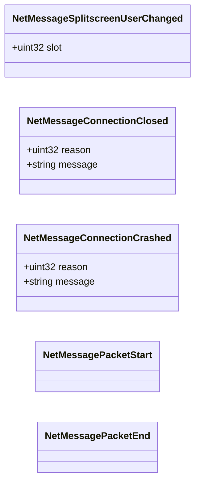

# `networksystem_protomessages.proto`

## Diagram

## Messages

### `NetMessageSplitscreenUserChanged`

| Field | Number | Type | Label | Description |
|-------|--------|------|-------|-------------|
| `slot` | 1 | uint32 | optional |  |

### `NetMessageConnectionClosed`

| Field | Number | Type | Label | Description |
|-------|--------|------|-------|-------------|
| `reason` | 1 | uint32 | optional |  |
| `message` | 2 | string | optional |  |

### `NetMessageConnectionCrashed`

| Field | Number | Type | Label | Description |
|-------|--------|------|-------|-------------|
| `reason` | 1 | uint32 | optional |  |
| `message` | 2 | string | optional |  |

### `NetMessagePacketStart`

*(no fields)*

### `NetMessagePacketEnd`

*(no fields)*
