# `steammessages_gc.proto`

**Imports:** `google/protobuf/descriptor.proto`, `steammessages.proto`

## Diagram

```mermaid
classDiagram
direction LR

  class CMsgWebAPIKey {
    +uint32 status
    +uint32 account_id
    +uint32 publisher_group_id
    +uint32 key_id
    +string domain
  }

  class CMsgHttpRequest {
    +uint32 request_method
    +string hostname
    +string url
    +List~CMsgHttpRequest.RequestHeader~ headers
    +List~CMsgHttpRequest.QueryParam~ get_params
    +List~CMsgHttpRequest.QueryParam~ post_params
    +bytes body
    +uint32 absolute_timeout
  }

  class RequestHeader {
    +string name
    +string value
  }

  class QueryParam {
    +string name
    +bytes value
  }

  class CMsgWebAPIRequest {
    +string interface_name
    +string method_name
    +uint32 version
    +CMsgWebAPIKey api_key
    +CMsgHttpRequest request
    +uint32 routing_app_id
  }

  class CMsgHttpResponse {
    +uint32 status_code
    +List~CMsgHttpResponse.ResponseHeader~ headers
    +bytes body
  }

  class ResponseHeader {
    +string name
    +string value
  }

  class CMsgAMFindAccounts {
    +uint32 search_type
    +string search_string
  }

  class CMsgAMFindAccountsResponse {
    +List~fixed64~ steam_id
  }

  class CMsgNotifyWatchdog {
    +uint32 source
    +uint32 alert_type
    +uint32 alert_destination
    +bool critical
    +uint32 time
    +uint32 appid
    +string text
  }

  class CMsgAMGetLicenses {
    +fixed64 steamid
  }

  class CMsgPackageLicense {
    +uint32 package_id
    +uint32 time_created
    +uint32 owner_id
  }

  class CMsgAMGetLicensesResponse {
    +List~CMsgPackageLicense~ license
    +uint32 result
  }

  class CMsgAMGetUserGameStats {
    +fixed64 steam_id
    +fixed64 game_id
    +List~uint32~ stats
  }

  class CMsgAMGetUserGameStatsResponse {
    +fixed64 steam_id
    +fixed64 game_id
    +int32 eresult
    +List~CMsgAMGetUserGameStatsResponse.Stats~ stats
    +List~CMsgAMGetUserGameStatsResponse.Achievement_Blocks~ achievement_blocks
  }

  class Stats {
    +uint32 stat_id
    +uint32 stat_value
  }

  class Achievement_Blocks {
    +uint32 achievement_id
    +uint32 achievement_bit_id
    +fixed32 unlock_time
  }

  class CMsgGCGetCommandList {
    +uint32 app_id
    +string command_prefix
  }

  class CMsgGCGetCommandListResponse {
    +List~string~ command_name
  }

  class CGCMsgMemCachedGet {
    +List~string~ keys
  }

  class CGCMsgMemCachedGetResponse {
    +List~CGCMsgMemCachedGetResponse.ValueTag~ values
  }

  class ValueTag {
    +bool found
    +bytes value
  }

  class CGCMsgMemCachedSet {
    +List~CGCMsgMemCachedSet.KeyPair~ keys
  }

  class KeyPair {
    +string name
    +bytes value
  }

  class CGCMsgMemCachedDelete {
    +List~string~ keys
  }

  class CGCMsgMemCachedStats {
  }

  class CGCMsgMemCachedStatsResponse {
    +uint64 curr_connections
    +uint64 cmd_get
    +uint64 cmd_set
    +uint64 cmd_flush
    +uint64 get_hits
    +uint64 get_misses
    +uint64 delete_hits
    +uint64 delete_misses
    +uint64 bytes_read
    +uint64 bytes_written
    +uint64 limit_maxbytes
    +uint64 curr_items
    +uint64 evictions
    +uint64 bytes
  }

  class CGCMsgSQLStats {
    +uint32 schema_catalog
  }

  class CGCMsgSQLStatsResponse {
    +uint32 threads
    +uint32 threads_connected
    +uint32 threads_active
    +uint32 operations_submitted
    +uint32 prepared_statements_executed
    +uint32 non_prepared_statements_executed
    +uint32 deadlock_retries
    +uint32 operations_timed_out_in_queue
    +uint32 errors
  }

  class CMsgAMAddFreeLicense {
    +fixed64 steamid
    +uint32 ip_public
    +uint32 packageid
    +string store_country_code
  }

  class CMsgAMAddFreeLicenseResponse {
    +int32 eresult
    +int32 purchase_result_detail
    +fixed64 transid
  }

  class CGCMsgGetIPLocation {
    +List~fixed32~ ips
  }

  class CIPLocationInfo {
    +uint32 ip
    +float latitude
    +float longitude
    +string country
    +string state
    +string city
  }

  class CGCMsgGetIPLocationResponse {
    +List~CIPLocationInfo~ infos
  }

  class CGCMsgSystemStatsSchema {
    +uint32 gc_app_id
    +bytes schema_kv
  }

  class CGCMsgGetSystemStats {
  }

  class CGCMsgGetSystemStatsResponse {
    +uint32 gc_app_id
    +bytes stats_kv
    +uint32 active_jobs
    +uint32 yielding_jobs
    +uint32 user_sessions
    +uint32 game_server_sessions
    +uint32 socaches
    +uint32 socaches_to_unload
    +uint32 socaches_loading
    +uint32 writeback_queue
    +uint32 steamid_locks
    +uint32 logon_queue
    +uint32 logon_jobs
  }

  class CMsgAMSendEmail {
    +fixed64 steamid
    +uint32 email_msg_type
    +uint32 email_format
    +List~CMsgAMSendEmail.PersonaNameReplacementToken~ persona_name_tokens
    +uint32 source_gc
    +List~CMsgAMSendEmail.ReplacementToken~ tokens
  }

  class ReplacementToken {
    +string token_name
    +string token_value
  }

  class PersonaNameReplacementToken {
    +fixed64 steamid
    +string token_name
  }

  class CMsgAMSendEmailResponse {
    +uint32 eresult
  }

  class CMsgGCGetEmailTemplate {
    +uint32 app_id
    +uint32 email_msg_type
    +int32 email_lang
    +int32 email_format
  }

  class CMsgGCGetEmailTemplateResponse {
    +uint32 eresult
    +bool template_exists
    +string template
  }

  class CMsgAMGrantGuestPasses2 {
    +fixed64 steam_id
    +uint32 package_id
    +int32 passes_to_grant
    +int32 days_to_expiration
    +int32 action
  }

  class CMsgAMGrantGuestPasses2Response {
    +int32 eresult
    +int32 passes_granted
  }

  class CGCSystemMsg_GetAccountDetails {
    +fixed64 steamid
    +uint32 appid
  }

  class CGCSystemMsg_GetAccountDetails_Response {
    +uint32 eresult_deprecated
    +string account_name
    +string persona_name
    +bool is_profile_public
    +bool is_inventory_public
    +bool is_vac_banned
    +bool is_cyber_cafe
    +bool is_school_account
    +bool is_limited
    +bool is_subscribed
    +uint32 package
    +bool is_free_trial_account
    +uint32 free_trial_expiration
    +bool is_low_violence
    +bool is_account_locked_down
    +bool is_community_banned
    +bool is_trade_banned
    +uint32 trade_ban_expiration
    +uint32 accountid
    +uint32 suspension_end_time
    +string currency
    +uint32 steam_level
    +uint32 friend_count
    +uint32 account_creation_time
    +bool is_steamguard_enabled
    +bool is_phone_verified
    +bool is_two_factor_auth_enabled
    +uint32 two_factor_enabled_time
    +uint32 phone_verification_time
    +uint64 phone_id
    +bool is_phone_identifying
    +uint32 rt_identity_linked
    +uint32 rt_birth_date
    +string txn_country_code
    +bool has_accepted_china_ssa
    +bool is_banned_steam_china
    +uint64 ext_spend
  }

  class CMsgGCGetPersonaNames {
    +List~fixed64~ steamids
  }

  class CMsgGCGetPersonaNames_Response {
    +List~CMsgGCGetPersonaNames_Response.PersonaName~ succeeded_lookups
    +List~fixed64~ failed_lookup_steamids
  }

  class PersonaName {
    +fixed64 steamid
    +string persona_name
  }

  class CMsgGCCheckFriendship {
    +fixed64 steamid_left
    +fixed64 steamid_right
  }

  class CMsgGCCheckFriendship_Response {
    +bool success
    +bool found_friendship
  }

  class CMsgGCMsgMasterSetDirectory {
    +uint32 master_dir_index
    +List~CMsgGCMsgMasterSetDirectory.SubGC~ dir
  }

  class SubGC {
    +uint32 dir_index
    +string name
    +string box
    +string command_line
    +string gc_binary
  }

  class CMsgGCMsgMasterSetDirectory_Response {
    +int32 eresult
    +string message
  }

  class CMsgGCMsgWebAPIJobRequestForwardResponse {
    +uint32 dir_index
  }

  class CGCSystemMsg_GetPurchaseTrust_Request {
    +fixed64 steamid
  }

  class CGCSystemMsg_GetPurchaseTrust_Response {
    +bool has_prior_purchase_history
    +bool has_no_recent_password_resets
    +bool is_wallet_cash_trusted
    +uint32 time_all_trusted
  }

  class CMsgGCHAccountVacStatusChange {
    +fixed64 steam_id
    +uint32 app_id
    +uint32 rtime_vacban_starts
    +bool is_banned_now
    +bool is_banned_future
  }

  class CMsgGCGetPartnerAccountLink {
    +fixed64 steamid
  }

  class CMsgGCGetPartnerAccountLink_Response {
    +uint32 pwid
    +uint32 nexonid
    +int32 ageclass
    +bool id_verified
    +bool is_adult
  }

  class CMsgGCAddressMask {
    +fixed32 ipv4
    +uint32 maskbits
  }

  class CMsgGCAddressMaskGroup {
    +List~CMsgGCAddressMask~ addrs
  }

  class CMsgGCRoutingInfo {
    +List~uint32~ dir_index
    +CMsgGCRoutingInfo.RoutingMethod method
    +CMsgGCRoutingInfo.RoutingMethod fallback
    +uint32 protobuf_field
    +string webapi_param
    +List~CMsgGCRoutingInfo.PolicyRule~ policy_rules
  }

  class TokenBucketConfiguration {
    +int32 tokens_start
    +int32 tokens_grant
    +int32 grant_seconds
  }

  class PolicyRule {
    +int32 account_type
    +int32 address_mask_group_id
    +CMsgGCRoutingInfo.TokenBucketConfiguration token_bucket
  }

  class CMsgGCMsgMasterSetWebAPIRouting {
    +List~CMsgGCMsgMasterSetWebAPIRouting.Entry~ entries
  }

  class Entry {
    +string interface_name
    +string method_name
    +CMsgGCRoutingInfo routing
  }

  class CMsgGCMsgMasterSetClientMsgRouting {
    +List~CMsgGCMsgMasterSetClientMsgRouting.Entry~ entries
    +List~CMsgGCAddressMaskGroup~ address_mask_groups
  }

  class Entry {
    +uint32 msg_type
    +CMsgGCRoutingInfo routing
  }

  class CMsgGCMsgMasterSetWebAPIRouting_Response {
    +int32 eresult
  }

  class CMsgGCMsgMasterSetClientMsgRouting_Response {
    +int32 eresult
  }

  class CMsgGCMsgSetOptions {
    +List~CMsgGCMsgSetOptions.Option~ options
    +List~CMsgGCMsgSetOptions.MessageRange~ client_msg_ranges
  }

  class MessageRange {
    +uint32 low
    +uint32 high
  }

  class CMsgGCHUpdateSession {
    +fixed64 steam_id
    +uint32 app_id
    +bool online
    +fixed64 server_steam_id
    +uint32 server_addr
    +uint32 server_port
    +uint32 os_type
    +uint32 client_addr
    +List~CMsgGCHUpdateSession.ExtraField~ extra_fields
    +fixed64 owner_id
    +uint32 cm_session_sysid
    +uint32 cm_session_identifier
    +List~uint32~ depot_ids
  }

  class ExtraField {
    +string name
    +string value
  }

  class CMsgNotificationOfSuspiciousActivity {
    +fixed64 steamid
    +uint32 appid
    +CMsgNotificationOfSuspiciousActivity.MultipleGameInstances multiple_instances
  }

  class MultipleGameInstances {
    +uint32 app_instance_count
    +List~fixed64~ other_steamids
  }

  class CMsgDPPartnerMicroTxns {
    +uint32 appid
    +string gc_name
    +CMsgDPPartnerMicroTxns.PartnerInfo partner
    +List~CMsgDPPartnerMicroTxns.PartnerMicroTxn~ transactions
  }

  class PartnerMicroTxn {
    +uint32 init_time
    +uint32 last_update_time
    +uint64 txn_id
    +uint32 account_id
    +uint32 line_item
    +uint64 item_id
    +uint32 def_index
    +uint64 price
    +uint64 tax
    +uint64 price_usd
    +uint64 tax_usd
    +uint32 purchase_type
    +uint32 steam_txn_type
    +string country_code
    +string region_code
    +int32 quantity
    +uint64 ref_trans_id
  }

  class PartnerInfo {
    +uint32 partner_id
    +string partner_name
    +string currency_code
    +string currency_name
  }

  class CMsgDPPartnerMicroTxnsResponse {
    +uint32 eresult
    +CMsgDPPartnerMicroTxnsResponse.EErrorCode eerrorcode
  }

  CMsgHttpRequest --> RequestHeader : headers[]
  CMsgHttpRequest --> QueryParam : get_params[]
  CMsgWebAPIRequest --> CMsgWebAPIKey : api_key
  CMsgWebAPIRequest --> CMsgHttpRequest : request
  CMsgHttpResponse --> ResponseHeader : headers[]
  CMsgAMGetLicensesResponse --> CMsgPackageLicense : license[]
  CMsgAMGetUserGameStatsResponse --> Stats : stats[]
  CMsgAMGetUserGameStatsResponse --> Achievement_Blocks : achievement_blocks[]
  CGCMsgMemCachedGetResponse --> ValueTag : values[]
  CGCMsgMemCachedSet --> KeyPair : keys[]
  CGCMsgGetIPLocationResponse --> CIPLocationInfo : infos[]
  CMsgAMSendEmail --> PersonaNameReplacementToken : persona_name_tokens[]
  CMsgAMSendEmail --> ReplacementToken : tokens[]
  CMsgGCGetPersonaNames_Response --> PersonaName : succeeded_lookups[]
  CMsgGCMsgMasterSetDirectory --> SubGC : dir[]
  CMsgGCAddressMaskGroup --> CMsgGCAddressMask : addrs[]
  CMsgGCRoutingInfo --> RoutingMethod : method
  CMsgGCRoutingInfo --> PolicyRule : policy_rules[]
  PolicyRule --> TokenBucketConfiguration : token_bucket
  CMsgGCMsgMasterSetWebAPIRouting --> Entry : entries[]
  Entry --> CMsgGCRoutingInfo : routing
  CMsgGCMsgMasterSetClientMsgRouting --> Entry : entries[]
  CMsgGCMsgMasterSetClientMsgRouting --> CMsgGCAddressMaskGroup : address_mask_groups[]
  CMsgGCMsgSetOptions --> Option : options[]
  CMsgGCMsgSetOptions --> MessageRange : client_msg_ranges[]
  CMsgGCHUpdateSession --> ExtraField : extra_fields[]
  CMsgNotificationOfSuspiciousActivity --> MultipleGameInstances : multiple_instances
  CMsgDPPartnerMicroTxns --> PartnerInfo : partner
  CMsgDPPartnerMicroTxns --> PartnerMicroTxn : transactions[]
  CMsgDPPartnerMicroTxnsResponse --> EErrorCode : eerrorcode

  class RoutingMethod{
    <<enumeration>>
    RANDOM
    DISCARD
    CLIENT_STEAMID
    PROTOBUF_FIELD_UINT64
    WEBAPI_PARAM_UINT64
  }

  class Option{
    <<enumeration>>
    NOTIFY_USER_SESSIONS
    NOTIFY_SERVER_SESSIONS
    NOTIFY_ACHIEVEMENTS
    NOTIFY_VAC_ACTION
  }

  class EErrorCode{
    <<enumeration>>
    k_MsgValid
    k_MsgInvalidAppID
    k_MsgInvalidPartnerInfo
    k_MsgNoTransactions
    k_MsgSQLFailure
    k_MsgPartnerInfoDiscrepancy
    k_MsgTransactionInsertFailed
    k_MsgAlreadyRunning
    k_MsgInvalidTransactionData
  }

```

## Messages

### `CMsgWebAPIKey`

| Field | Ordinal | Type | Label | Description |
|-------|---------|------|-------|-------------|
| `status` | 1 | uint32 | optional | *(default: `255`)* |
| `account_id` | 2 | uint32 | optional | *(default: `0`)* |
| `publisher_group_id` | 3 | uint32 | optional | *(default: `0`)* |
| `key_id` | 4 | uint32 | optional |  |
| `domain` | 5 | string | optional |  |

### `CMsgHttpRequest`

| Field | Ordinal | Type | Label | Description |
|-------|---------|------|-------|-------------|
| `request_method` | 1 | uint32 | optional |  |
| `hostname` | 2 | string | optional |  |
| `url` | 3 | string | optional |  |
| `headers` | 4 | CMsgHttpRequest.RequestHeader | repeated |  |
| `get_params` | 5 | CMsgHttpRequest.QueryParam | repeated |  |
| `post_params` | 6 | CMsgHttpRequest.QueryParam | repeated |  |
| `body` | 7 | bytes | optional |  |
| `absolute_timeout` | 8 | uint32 | optional |  |

### `CMsgWebAPIRequest`

| Field | Ordinal | Type | Label | Description |
|-------|---------|------|-------|-------------|
| `interface_name` | 2 | string | optional |  |
| `method_name` | 3 | string | optional |  |
| `version` | 4 | uint32 | optional |  |
| `api_key` | 5 | [CMsgWebAPIKey](#cmsgwebapikey) | optional |  |
| `request` | 6 | [CMsgHttpRequest](#cmsghttprequest) | optional |  |
| `routing_app_id` | 7 | uint32 | optional |  |

### `CMsgHttpResponse`

| Field | Ordinal | Type | Label | Description |
|-------|---------|------|-------|-------------|
| `status_code` | 1 | uint32 | optional |  |
| `headers` | 2 | CMsgHttpResponse.ResponseHeader | repeated |  |
| `body` | 3 | bytes | optional |  |

### `CMsgAMFindAccounts`

| Field | Ordinal | Type | Label | Description |
|-------|---------|------|-------|-------------|
| `search_type` | 1 | uint32 | optional |  |
| `search_string` | 2 | string | optional |  |

### `CMsgAMFindAccountsResponse`

| Field | Ordinal | Type | Label | Description |
|-------|---------|------|-------|-------------|
| `steam_id` | 1 | fixed64 | repeated |  |

### `CMsgNotifyWatchdog`

| Field | Ordinal | Type | Label | Description |
|-------|---------|------|-------|-------------|
| `source` | 1 | uint32 | optional |  |
| `alert_type` | 2 | uint32 | optional |  |
| `alert_destination` | 3 | uint32 | optional |  |
| `critical` | 4 | bool | optional |  |
| `time` | 5 | uint32 | optional |  |
| `appid` | 6 | uint32 | optional |  |
| `text` | 7 | string | optional |  |

### `CMsgAMGetLicenses`

| Field | Ordinal | Type | Label | Description |
|-------|---------|------|-------|-------------|
| `steamid` | 1 | fixed64 | optional |  |

### `CMsgPackageLicense`

| Field | Ordinal | Type | Label | Description |
|-------|---------|------|-------|-------------|
| `package_id` | 1 | uint32 | optional |  |
| `time_created` | 2 | uint32 | optional |  |
| `owner_id` | 3 | uint32 | optional |  |

### `CMsgAMGetLicensesResponse`

| Field | Ordinal | Type | Label | Description |
|-------|---------|------|-------|-------------|
| `license` | 1 | [CMsgPackageLicense](#cmsgpackagelicense) | repeated |  |
| `result` | 2 | uint32 | optional |  |

### `CMsgAMGetUserGameStats`

| Field | Ordinal | Type | Label | Description |
|-------|---------|------|-------|-------------|
| `steam_id` | 1 | fixed64 | optional |  |
| `game_id` | 2 | fixed64 | optional |  |
| `stats` | 3 | uint32 | repeated |  |

### `CMsgAMGetUserGameStatsResponse`

| Field | Ordinal | Type | Label | Description |
|-------|---------|------|-------|-------------|
| `steam_id` | 1 | fixed64 | optional |  |
| `game_id` | 2 | fixed64 | optional |  |
| `eresult` | 3 | int32 | optional | *(default: `2`)* |
| `stats` | 4 | CMsgAMGetUserGameStatsResponse.Stats | repeated |  |
| `achievement_blocks` | 5 | CMsgAMGetUserGameStatsResponse.Achievement_Blocks | repeated |  |

### `CMsgGCGetCommandList`

| Field | Ordinal | Type | Label | Description |
|-------|---------|------|-------|-------------|
| `app_id` | 1 | uint32 | optional |  |
| `command_prefix` | 2 | string | optional |  |

### `CMsgGCGetCommandListResponse`

| Field | Ordinal | Type | Label | Description |
|-------|---------|------|-------|-------------|
| `command_name` | 1 | string | repeated |  |

### `CGCMsgMemCachedGet`

| Field | Ordinal | Type | Label | Description |
|-------|---------|------|-------|-------------|
| `keys` | 1 | string | repeated |  |

### `CGCMsgMemCachedGetResponse`

| Field | Ordinal | Type | Label | Description |
|-------|---------|------|-------|-------------|
| `values` | 1 | CGCMsgMemCachedGetResponse.ValueTag | repeated |  |

### `CGCMsgMemCachedSet`

| Field | Ordinal | Type | Label | Description |
|-------|---------|------|-------|-------------|
| `keys` | 1 | CGCMsgMemCachedSet.KeyPair | repeated |  |

### `CGCMsgMemCachedDelete`

| Field | Ordinal | Type | Label | Description |
|-------|---------|------|-------|-------------|
| `keys` | 1 | string | repeated |  |

### `CGCMsgMemCachedStats`

### `CGCMsgMemCachedStatsResponse`

| Field | Ordinal | Type | Label | Description |
|-------|---------|------|-------|-------------|
| `curr_connections` | 1 | uint64 | optional |  |
| `cmd_get` | 2 | uint64 | optional |  |
| `cmd_set` | 3 | uint64 | optional |  |
| `cmd_flush` | 4 | uint64 | optional |  |
| `get_hits` | 5 | uint64 | optional |  |
| `get_misses` | 6 | uint64 | optional |  |
| `delete_hits` | 7 | uint64 | optional |  |
| `delete_misses` | 8 | uint64 | optional |  |
| `bytes_read` | 9 | uint64 | optional |  |
| `bytes_written` | 10 | uint64 | optional |  |
| `limit_maxbytes` | 11 | uint64 | optional |  |
| `curr_items` | 12 | uint64 | optional |  |
| `evictions` | 13 | uint64 | optional |  |
| `bytes` | 14 | uint64 | optional |  |

### `CGCMsgSQLStats`

| Field | Ordinal | Type | Label | Description |
|-------|---------|------|-------|-------------|
| `schema_catalog` | 1 | uint32 | optional |  |

### `CGCMsgSQLStatsResponse`

| Field | Ordinal | Type | Label | Description |
|-------|---------|------|-------|-------------|
| `threads` | 1 | uint32 | optional |  |
| `threads_connected` | 2 | uint32 | optional |  |
| `threads_active` | 3 | uint32 | optional |  |
| `operations_submitted` | 4 | uint32 | optional |  |
| `prepared_statements_executed` | 5 | uint32 | optional |  |
| `non_prepared_statements_executed` | 6 | uint32 | optional |  |
| `deadlock_retries` | 7 | uint32 | optional |  |
| `operations_timed_out_in_queue` | 8 | uint32 | optional |  |
| `errors` | 9 | uint32 | optional |  |

### `CMsgAMAddFreeLicense`

| Field | Ordinal | Type | Label | Description |
|-------|---------|------|-------|-------------|
| `steamid` | 1 | fixed64 | optional |  |
| `ip_public` | 2 | uint32 | optional |  |
| `packageid` | 3 | uint32 | optional |  |
| `store_country_code` | 4 | string | optional |  |

### `CMsgAMAddFreeLicenseResponse`

| Field | Ordinal | Type | Label | Description |
|-------|---------|------|-------|-------------|
| `eresult` | 1 | int32 | optional | *(default: `2`)* |
| `purchase_result_detail` | 2 | int32 | optional |  |
| `transid` | 3 | fixed64 | optional |  |

### `CGCMsgGetIPLocation`

| Field | Ordinal | Type | Label | Description |
|-------|---------|------|-------|-------------|
| `ips` | 1 | fixed32 | repeated |  |

### `CIPLocationInfo`

| Field | Ordinal | Type | Label | Description |
|-------|---------|------|-------|-------------|
| `ip` | 1 | uint32 | optional |  |
| `latitude` | 2 | float | optional |  |
| `longitude` | 3 | float | optional |  |
| `country` | 4 | string | optional |  |
| `state` | 5 | string | optional |  |
| `city` | 6 | string | optional |  |

### `CGCMsgGetIPLocationResponse`

| Field | Ordinal | Type | Label | Description |
|-------|---------|------|-------|-------------|
| `infos` | 1 | [CIPLocationInfo](#ciplocationinfo) | repeated |  |

### `CGCMsgSystemStatsSchema`

| Field | Ordinal | Type | Label | Description |
|-------|---------|------|-------|-------------|
| `gc_app_id` | 1 | uint32 | optional |  |
| `schema_kv` | 2 | bytes | optional |  |

### `CGCMsgGetSystemStats`

### `CGCMsgGetSystemStatsResponse`

| Field | Ordinal | Type | Label | Description |
|-------|---------|------|-------|-------------|
| `gc_app_id` | 1 | uint32 | optional |  |
| `stats_kv` | 2 | bytes | optional |  |
| `active_jobs` | 3 | uint32 | optional |  |
| `yielding_jobs` | 4 | uint32 | optional |  |
| `user_sessions` | 5 | uint32 | optional |  |
| `game_server_sessions` | 6 | uint32 | optional |  |
| `socaches` | 7 | uint32 | optional |  |
| `socaches_to_unload` | 8 | uint32 | optional |  |
| `socaches_loading` | 9 | uint32 | optional |  |
| `writeback_queue` | 10 | uint32 | optional |  |
| `steamid_locks` | 11 | uint32 | optional |  |
| `logon_queue` | 12 | uint32 | optional |  |
| `logon_jobs` | 13 | uint32 | optional |  |

### `CMsgAMSendEmail`

| Field | Ordinal | Type | Label | Description |
|-------|---------|------|-------|-------------|
| `steamid` | 1 | fixed64 | optional |  |
| `email_msg_type` | 2 | uint32 | optional |  |
| `email_format` | 3 | uint32 | optional |  |
| `persona_name_tokens` | 5 | CMsgAMSendEmail.PersonaNameReplacementToken | repeated |  |
| `source_gc` | 6 | uint32 | optional |  |
| `tokens` | 7 | CMsgAMSendEmail.ReplacementToken | repeated |  |

### `CMsgAMSendEmailResponse`

| Field | Ordinal | Type | Label | Description |
|-------|---------|------|-------|-------------|
| `eresult` | 1 | uint32 | optional | *(default: `2`)* |

### `CMsgGCGetEmailTemplate`

| Field | Ordinal | Type | Label | Description |
|-------|---------|------|-------|-------------|
| `app_id` | 1 | uint32 | optional |  |
| `email_msg_type` | 2 | uint32 | optional |  |
| `email_lang` | 3 | int32 | optional |  |
| `email_format` | 4 | int32 | optional |  |

### `CMsgGCGetEmailTemplateResponse`

| Field | Ordinal | Type | Label | Description |
|-------|---------|------|-------|-------------|
| `eresult` | 1 | uint32 | optional | *(default: `2`)* |
| `template_exists` | 2 | bool | optional |  |
| `template` | 3 | string | optional |  |

### `CMsgAMGrantGuestPasses2`

| Field | Ordinal | Type | Label | Description |
|-------|---------|------|-------|-------------|
| `steam_id` | 1 | fixed64 | optional |  |
| `package_id` | 2 | uint32 | optional |  |
| `passes_to_grant` | 3 | int32 | optional |  |
| `days_to_expiration` | 4 | int32 | optional |  |
| `action` | 5 | int32 | optional |  |

### `CMsgAMGrantGuestPasses2Response`

| Field | Ordinal | Type | Label | Description |
|-------|---------|------|-------|-------------|
| `eresult` | 1 | int32 | optional | *(default: `2`)* |
| `passes_granted` | 2 | int32 | optional | *(default: `0`)* |

### `CGCSystemMsg_GetAccountDetails`

| Field | Ordinal | Type | Label | Description |
|-------|---------|------|-------|-------------|
| `steamid` | 1 | fixed64 | optional |  |
| `appid` | 2 | uint32 | optional |  |

### `CGCSystemMsg_GetAccountDetails_Response`

| Field | Ordinal | Type | Label | Description |
|-------|---------|------|-------|-------------|
| `eresult_deprecated` | 1 | uint32 | optional | *(default: `2`)* |
| `account_name` | 2 | string | optional |  |
| `persona_name` | 3 | string | optional |  |
| `is_profile_public` | 4 | bool | optional |  |
| `is_inventory_public` | 5 | bool | optional |  |
| `is_vac_banned` | 7 | bool | optional |  |
| `is_cyber_cafe` | 8 | bool | optional |  |
| `is_school_account` | 9 | bool | optional |  |
| `is_limited` | 10 | bool | optional |  |
| `is_subscribed` | 11 | bool | optional |  |
| `package` | 12 | uint32 | optional |  |
| `is_free_trial_account` | 13 | bool | optional |  |
| `free_trial_expiration` | 14 | uint32 | optional |  |
| `is_low_violence` | 15 | bool | optional |  |
| `is_account_locked_down` | 16 | bool | optional |  |
| `is_community_banned` | 17 | bool | optional |  |
| `is_trade_banned` | 18 | bool | optional |  |
| `trade_ban_expiration` | 19 | uint32 | optional |  |
| `accountid` | 20 | uint32 | optional |  |
| `suspension_end_time` | 21 | uint32 | optional |  |
| `currency` | 22 | string | optional |  |
| `steam_level` | 23 | uint32 | optional |  |
| `friend_count` | 24 | uint32 | optional |  |
| `account_creation_time` | 25 | uint32 | optional |  |
| `is_steamguard_enabled` | 27 | bool | optional |  |
| `is_phone_verified` | 28 | bool | optional |  |
| `is_two_factor_auth_enabled` | 29 | bool | optional |  |
| `two_factor_enabled_time` | 30 | uint32 | optional |  |
| `phone_verification_time` | 31 | uint32 | optional |  |
| `phone_id` | 33 | uint64 | optional |  |
| `is_phone_identifying` | 34 | bool | optional |  |
| `rt_identity_linked` | 35 | uint32 | optional |  |
| `rt_birth_date` | 36 | uint32 | optional |  |
| `txn_country_code` | 37 | string | optional |  |
| `has_accepted_china_ssa` | 38 | bool | optional |  |
| `is_banned_steam_china` | 39 | bool | optional |  |
| `ext_spend` | 40 | uint64 | optional |  |

### `CMsgGCGetPersonaNames`

| Field | Ordinal | Type | Label | Description |
|-------|---------|------|-------|-------------|
| `steamids` | 1 | fixed64 | repeated |  |

### `CMsgGCGetPersonaNames_Response`

| Field | Ordinal | Type | Label | Description |
|-------|---------|------|-------|-------------|
| `succeeded_lookups` | 1 | CMsgGCGetPersonaNames_Response.PersonaName | repeated |  |
| `failed_lookup_steamids` | 2 | fixed64 | repeated |  |

### `CMsgGCCheckFriendship`

| Field | Ordinal | Type | Label | Description |
|-------|---------|------|-------|-------------|
| `steamid_left` | 1 | fixed64 | optional |  |
| `steamid_right` | 2 | fixed64 | optional |  |

### `CMsgGCCheckFriendship_Response`

| Field | Ordinal | Type | Label | Description |
|-------|---------|------|-------|-------------|
| `success` | 1 | bool | optional |  |
| `found_friendship` | 2 | bool | optional |  |

### `CMsgGCMsgMasterSetDirectory`

| Field | Ordinal | Type | Label | Description |
|-------|---------|------|-------|-------------|
| `master_dir_index` | 1 | uint32 | optional |  |
| `dir` | 2 | CMsgGCMsgMasterSetDirectory.SubGC | repeated |  |

### `CMsgGCMsgMasterSetDirectory_Response`

| Field | Ordinal | Type | Label | Description |
|-------|---------|------|-------|-------------|
| `eresult` | 1 | int32 | optional | *(default: `2`)* |
| `message` | 2 | string | optional |  |

### `CMsgGCMsgWebAPIJobRequestForwardResponse`

| Field | Ordinal | Type | Label | Description |
|-------|---------|------|-------|-------------|
| `dir_index` | 1 | uint32 | optional |  |

### `CGCSystemMsg_GetPurchaseTrust_Request`

| Field | Ordinal | Type | Label | Description |
|-------|---------|------|-------|-------------|
| `steamid` | 1 | fixed64 | optional |  |

### `CGCSystemMsg_GetPurchaseTrust_Response`

| Field | Ordinal | Type | Label | Description |
|-------|---------|------|-------|-------------|
| `has_prior_purchase_history` | 1 | bool | optional |  |
| `has_no_recent_password_resets` | 2 | bool | optional |  |
| `is_wallet_cash_trusted` | 3 | bool | optional |  |
| `time_all_trusted` | 4 | uint32 | optional |  |

### `CMsgGCHAccountVacStatusChange`

| Field | Ordinal | Type | Label | Description |
|-------|---------|------|-------|-------------|
| `steam_id` | 1 | fixed64 | optional |  |
| `app_id` | 2 | uint32 | optional |  |
| `rtime_vacban_starts` | 3 | uint32 | optional |  |
| `is_banned_now` | 4 | bool | optional |  |
| `is_banned_future` | 5 | bool | optional |  |

### `CMsgGCGetPartnerAccountLink`

| Field | Ordinal | Type | Label | Description |
|-------|---------|------|-------|-------------|
| `steamid` | 1 | fixed64 | optional |  |

### `CMsgGCGetPartnerAccountLink_Response`

| Field | Ordinal | Type | Label | Description |
|-------|---------|------|-------|-------------|
| `pwid` | 1 | uint32 | optional |  |
| `nexonid` | 2 | uint32 | optional |  |
| `ageclass` | 3 | int32 | optional |  |
| `id_verified` | 4 | bool | optional | *(default: `true`)* |
| `is_adult` | 5 | bool | optional |  |

### `CMsgGCAddressMask`

| Field | Ordinal | Type | Label | Description |
|-------|---------|------|-------|-------------|
| `ipv4` | 1 | fixed32 | optional |  |
| `maskbits` | 2 | uint32 | optional | *(default: `32`)* |

### `CMsgGCAddressMaskGroup`

| Field | Ordinal | Type | Label | Description |
|-------|---------|------|-------|-------------|
| `addrs` | 1 | [CMsgGCAddressMask](#cmsggcaddressmask) | repeated |  |

### `CMsgGCRoutingInfo`

| Field | Ordinal | Type | Label | Description |
|-------|---------|------|-------|-------------|
| `dir_index` | 1 | uint32 | repeated |  |
| `method` | 2 | CMsgGCRoutingInfo.RoutingMethod | optional | *(default: `RANDOM`)* |
| `fallback` | 3 | CMsgGCRoutingInfo.RoutingMethod | optional | *(default: `DISCARD`)* |
| `protobuf_field` | 4 | uint32 | optional |  |
| `webapi_param` | 5 | string | optional |  |
| `policy_rules` | 6 | CMsgGCRoutingInfo.PolicyRule | repeated |  |

### `CMsgGCMsgMasterSetWebAPIRouting`

| Field | Ordinal | Type | Label | Description |
|-------|---------|------|-------|-------------|
| `entries` | 1 | CMsgGCMsgMasterSetWebAPIRouting.Entry | repeated |  |

### `CMsgGCMsgMasterSetClientMsgRouting`

| Field | Ordinal | Type | Label | Description |
|-------|---------|------|-------|-------------|
| `entries` | 1 | CMsgGCMsgMasterSetClientMsgRouting.Entry | repeated |  |
| `address_mask_groups` | 2 | [CMsgGCAddressMaskGroup](#cmsggcaddressmaskgroup) | repeated |  |

### `CMsgGCMsgMasterSetWebAPIRouting_Response`

| Field | Ordinal | Type | Label | Description |
|-------|---------|------|-------|-------------|
| `eresult` | 1 | int32 | optional | *(default: `2`)* |

### `CMsgGCMsgMasterSetClientMsgRouting_Response`

| Field | Ordinal | Type | Label | Description |
|-------|---------|------|-------|-------------|
| `eresult` | 1 | int32 | optional | *(default: `2`)* |

### `CMsgGCMsgSetOptions`

| Field | Ordinal | Type | Label | Description |
|-------|---------|------|-------|-------------|
| `options` | 1 | CMsgGCMsgSetOptions.Option | repeated |  |
| `client_msg_ranges` | 2 | CMsgGCMsgSetOptions.MessageRange | repeated |  |

### `CMsgGCHUpdateSession`

| Field | Ordinal | Type | Label | Description |
|-------|---------|------|-------|-------------|
| `steam_id` | 1 | fixed64 | optional |  |
| `app_id` | 2 | uint32 | optional |  |
| `online` | 3 | bool | optional |  |
| `server_steam_id` | 4 | fixed64 | optional |  |
| `server_addr` | 5 | uint32 | optional |  |
| `server_port` | 6 | uint32 | optional |  |
| `os_type` | 7 | uint32 | optional |  |
| `client_addr` | 8 | uint32 | optional |  |
| `extra_fields` | 9 | CMsgGCHUpdateSession.ExtraField | repeated |  |
| `owner_id` | 10 | fixed64 | optional |  |
| `cm_session_sysid` | 11 | uint32 | optional |  |
| `cm_session_identifier` | 12 | uint32 | optional |  |
| `depot_ids` | 13 | uint32 | repeated |  |

### `CMsgNotificationOfSuspiciousActivity`

| Field | Ordinal | Type | Label | Description |
|-------|---------|------|-------|-------------|
| `steamid` | 1 | fixed64 | optional |  |
| `appid` | 2 | uint32 | optional |  |
| `multiple_instances` | 3 | CMsgNotificationOfSuspiciousActivity.MultipleGameInstances | optional |  |

### `CMsgDPPartnerMicroTxns`

| Field | Ordinal | Type | Label | Description |
|-------|---------|------|-------|-------------|
| `appid` | 1 | uint32 | optional |  |
| `gc_name` | 2 | string | optional |  |
| `partner` | 3 | CMsgDPPartnerMicroTxns.PartnerInfo | optional |  |
| `transactions` | 4 | CMsgDPPartnerMicroTxns.PartnerMicroTxn | repeated |  |

### `CMsgDPPartnerMicroTxnsResponse`

| Field | Ordinal | Type | Label | Description |
|-------|---------|------|-------|-------------|
| `eresult` | 1 | uint32 | optional | *(default: `2`)* |
| `eerrorcode` | 2 | CMsgDPPartnerMicroTxnsResponse.EErrorCode | optional | *(default: `k_MsgValid`)* |
