# Module: animationsystem

[📊 View UML Diagram](../diagrams/animationsystem.md)

| Name | Kind | Bases | Fields |
|------|------|-------|--------|
| [AnimationDecodeDebugDumpElement_t](#animationdecodedebugdumpelement_t) | class |  | 6 |
| [AnimationDecodeDebugDump_t](#animationdecodedebugdump_t) | class |  | 2 |
| [AnimationProcessingType_t](#animationprocessingtype_t) | enum |  | 6 |
| [AnimationSnapshotBase_t](#animationsnapshotbase_t) | class |  | 9 |
| [AnimationSnapshotType_t](#animationsnapshottype_t) | enum |  | 7 |
| [AnimationSnapshot_t](#animationsnapshot_t) | class | AnimationSnapshotBase_t | 2 |
| [BoneTransformSpace_t](#bonetransformspace_t) | enum |  | 4 |
| [CAnimActivity](#canimactivity) | class |  | 4 |
| [CAnimBone](#canimbone) | class |  | 7 |
| [CAnimBoneDifference](#canimbonedifference) | class |  | 5 |
| [CAnimData](#canimdata) | class |  | 5 |
| [CAnimDataChannelDesc](#canimdatachanneldesc) | class |  | 9 |
| [CAnimDecoder](#canimdecoder) | class |  | 3 |
| [CAnimDesc](#canimdesc) | class |  | 15 |
| [CAnimDesc_Flag](#canimdesc_flag) | class |  | 8 |
| [CAnimEncodeDifference](#canimencodedifference) | class |  | 7 |
| [CAnimEncodedFrames](#canimencodedframes) | class |  | 5 |
| [CAnimEnum](#canimenum) | class |  | 1 |
| [CAnimEventDefinition](#canimeventdefinition) | class |  | 7 |
| [CAnimFrameBlockAnim](#canimframeblockanim) | class |  | 3 |
| [CAnimFrameSegment](#canimframesegment) | class |  | 4 |
| [CAnimKeyData](#canimkeydata) | class |  | 6 |
| [CAnimLocalHierarchy](#canimlocalhierarchy) | class |  | 6 |
| [CAnimMorphDifference](#canimmorphdifference) | class |  | 1 |
| [CAnimMovement](#canimmovement) | class |  | 7 |
| [CAnimSequenceParams](#canimsequenceparams) | class |  | 2 |
| [CAnimUser](#canimuser) | class |  | 2 |
| [CAnimUserDifference](#canimuserdifference) | class |  | 2 |
| [CAnimationGroup](#canimationgroup) | class |  | 8 |
| [CCompressorGroup](#ccompressorgroup) | class |  | 17 |
| [CMoodVData](#cmoodvdata) | class |  | 3 |
| [CSeqAutoLayer](#cseqautolayer) | class |  | 7 |
| [CSeqAutoLayerFlag](#cseqautolayerflag) | class |  | 8 |
| [CSeqBoneMaskList](#cseqbonemasklist) | class |  | 5 |
| [CSeqCmdLayer](#cseqcmdlayer) | class |  | 9 |
| [CSeqCmdSeqDesc](#cseqcmdseqdesc) | class |  | 12 |
| [CSeqIKLock](#cseqiklock) | class |  | 4 |
| [CSeqMultiFetch](#cseqmultifetch) | class |  | 10 |
| [CSeqMultiFetchFlag](#cseqmultifetchflag) | class |  | 6 |
| [CSeqPoseParamDesc](#cseqposeparamdesc) | class |  | 5 |
| [CSeqPoseSetting](#cseqposesetting) | class |  | 8 |
| [CSeqS1SeqDesc](#cseqs1seqdesc) | class |  | 11 |
| [CSeqScaleSet](#cseqscaleset) | class |  | 5 |
| [CSeqSeqDescFlag](#cseqseqdescflag) | class |  | 11 |
| [CSeqSynthAnimDesc](#cseqsynthanimdesc) | class |  | 6 |
| [CSeqTransition](#cseqtransition) | class |  | 2 |
| [CSequenceGroupData](#csequencegroupdata) | class |  | 14 |
| [FollowAttachmentData](#followattachmentdata) | class |  | 2 |
| [HSequence](#hsequence) | class |  | 1 |
| [MoodAnimationLayer_t](#moodanimationlayer_t) | class |  | 12 |
| [MoodAnimation_t](#moodanimation_t) | class |  | 2 |
| [MoodType_t](#moodtype_t) | enum |  | 2 |
| [ParticleAttachment_t](#particleattachment_t) | enum |  | 18 |
| [SeqCmd_t](#seqcmd_t) | enum |  | 17 |
| [SeqPoseSetting_t](#seqposesetting_t) | enum |  | 4 |

---

### AnimationDecodeDebugDumpElement_t

**Metadata:** `MGetKV3ClassDefaults {
	"m_nEntityIndex": 0,
	"m_modelName": "",
	"m_poseParams":
	[
	],
	"m_decodeOps":
	[
	],
	"m_internalOps":
	[
	],
	"m_decodedAnims":
	[
	]
}`

**Fields:**

| Name | Type | Annotations |
|------|------|-------------|
| `m_nEntityIndex` | int32 |  |
| `m_modelName` | CUtlString |  |
| `m_poseParams` | CUtlVector<CUtlString> |  |
| `m_decodeOps` | CUtlVector<CUtlString> |  |
| `m_internalOps` | CUtlVector<CUtlString> |  |
| `m_decodedAnims` | CUtlVector<CUtlString> |  |

### AnimationDecodeDebugDump_t

**Metadata:** `MGetKV3ClassDefaults {
	"m_processingType": "ANIMATION_PROCESSING_SERVER_SIMULATION",
	"m_elems":
	[
	]
}`

**Relationships:**

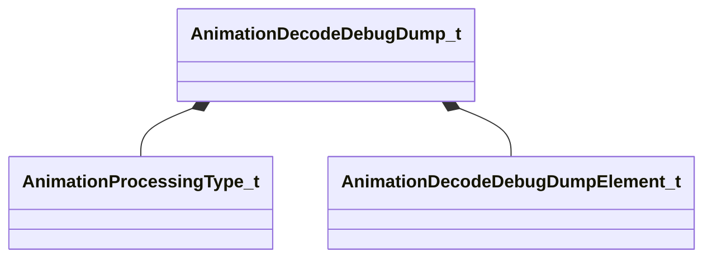

**Fields:**

| Name | Type | Annotations |
|------|------|-------------|
| `m_processingType` | [AnimationProcessingType_t](../schemas/animationsystem.md#animationprocessingtype_t) |  |
| `m_elems` | CUtlVector<[AnimationDecodeDebugDumpElement_t](../schemas/animationsystem.md#animationdecodedebugdumpelement_t)> |  |

### AnimationProcessingType_t

**Values:**

| Name | Value | Description |
|------|-------|-------------|
| `ANIMATION_PROCESSING_SERVER_SIMULATION` | 0 |  |
| `ANIMATION_PROCESSING_CLIENT_SIMULATION` | 1 |  |
| `ANIMATION_PROCESSING_CLIENT_PREDICTION` | 2 |  |
| `ANIMATION_PROCESSING_CLIENT_INTERPOLATION` | 3 |  |
| `ANIMATION_PROCESSING_CLIENT_RENDER` | 4 |  |
| `ANIMATION_PROCESSING_MAX` | 5 |  |

### AnimationSnapshotBase_t

**Derived by:** [AnimationSnapshot_t](animationsystem.md#animationsnapshot_t)

**Metadata:** `MGetKV3ClassDefaults {
	"m_flRealTime": 0.000000,
	"m_rootToWorld":
	[
		0.000000,
		0.000000,
		0.000000,
		0.000000,
		0.000000,
		0.000000,
		0.000000,
		0.000000,
		0.000000,
		0.000000,
		0.000000,
		0.000000
	],
	"m_bBonesInWorldSpace": false,
	"m_boneSetupMask":
	[
	],
	"m_boneTransforms":
	[
	],
	"m_flexControllers":
	[
	],
	"m_SnapshotType": "ANIMATION_SNAPSHOT_SERVER_SIMULATION",
	"m_bHasDecodeDump": false,
	"m_DecodeDump":
	{
		"m_nEntityIndex": 0,
		"m_modelName": "",
		"m_poseParams":
		[
		],
		"m_decodeOps":
		[
		],
		"m_internalOps":
		[
		],
		"m_decodedAnims":
		[
		]
	}
}`

**Relationships:**

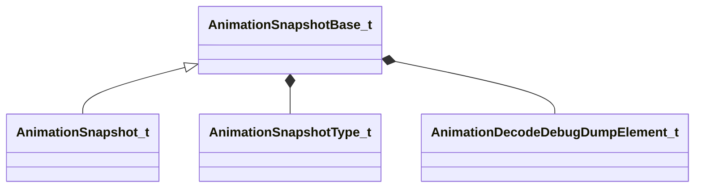

**Fields:**

| Name | Type | Annotations |
|------|------|-------------|
| `m_flRealTime` | float32 |  |
| `m_rootToWorld` | matrix3x4a_t |  |
| `m_bBonesInWorldSpace` | bool |  |
| `m_boneSetupMask` | CUtlVector<uint32> |  |
| `m_boneTransforms` | CUtlVector<matrix3x4a_t> |  |
| `m_flexControllers` | CUtlVector<float32> |  |
| `m_SnapshotType` | [AnimationSnapshotType_t](../schemas/animationsystem.md#animationsnapshottype_t) |  |
| `m_bHasDecodeDump` | bool |  |
| `m_DecodeDump` | [AnimationDecodeDebugDumpElement_t](../schemas/animationsystem.md#animationdecodedebugdumpelement_t) |  |

### AnimationSnapshotType_t

**Values:**

| Name | Value | Description |
|------|-------|-------------|
| `ANIMATION_SNAPSHOT_SERVER_SIMULATION` | 0 |  |
| `ANIMATION_SNAPSHOT_CLIENT_SIMULATION` | 1 |  |
| `ANIMATION_SNAPSHOT_CLIENT_PREDICTION` | 2 |  |
| `ANIMATION_SNAPSHOT_CLIENT_INTERPOLATION` | 3 |  |
| `ANIMATION_SNAPSHOT_CLIENT_RENDER` | 4 |  |
| `ANIMATION_SNAPSHOT_FINAL_COMPOSITE` | 5 |  |
| `ANIMATION_SNAPSHOT_MAX` | 6 |  |

### AnimationSnapshot_t

**Inherits from:** [AnimationSnapshotBase_t](animationsystem.md#animationsnapshotbase_t)

**Metadata:** `MGetKV3ClassDefaults {
	"m_flRealTime": 0.000000,
	"m_rootToWorld":
	[
		0.000000,
		0.000000,
		0.000000,
		0.000000,
		0.000000,
		0.000000,
		0.000000,
		0.000000,
		0.000000,
		0.000000,
		0.000000,
		0.000000
	],
	"m_bBonesInWorldSpace": false,
	"m_boneSetupMask":
	[
	],
	"m_boneTransforms":
	[
	],
	"m_flexControllers":
	[
	],
	"m_SnapshotType": "ANIMATION_SNAPSHOT_SERVER_SIMULATION",
	"m_bHasDecodeDump": false,
	"m_DecodeDump":
	{
		"m_nEntityIndex": 0,
		"m_modelName": "",
		"m_poseParams":
		[
		],
		"m_decodeOps":
		[
		],
		"m_internalOps":
		[
		],
		"m_decodedAnims":
		[
		]
	},
	"m_nEntIndex": 0,
	"m_modelName": ""
}`

**Relationships:**

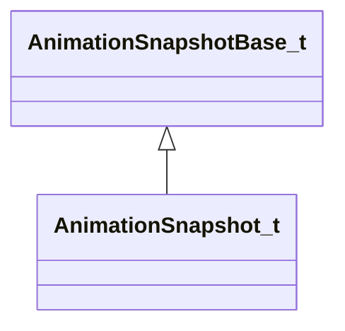

**Fields:**

| Name | Type | Annotations |
|------|------|-------------|
| `m_nEntIndex` | int32 |  |
| `m_modelName` | CUtlString |  |

### BoneTransformSpace_t

**Values:**

| Name | Value | Description |
|------|-------|-------------|
| `BoneTransformSpace_Invalid` | -1 | Invalid |
| `BoneTransformSpace_Parent` | 0 | Parent Space |
| `BoneTransformSpace_Model` | 1 | Model Space |
| `BoneTransformSpace_World` | 2 | World Space |

### CAnimActivity

**Metadata:** `MGetKV3ClassDefaults {
	"m_name": "",
	"m_nActivity": 0,
	"m_nFlags": 0,
	"m_nWeight": 0
}`

**Fields:**

| Name | Type | Annotations |
|------|------|-------------|
| `m_name` | CBufferString |  |
| `m_nActivity` | int32 |  |
| `m_nFlags` | int32 |  |
| `m_nWeight` | int32 |  |

### CAnimBone

**Metadata:** `MGetKV3ClassDefaults {
	"m_name": "",
	"m_parent": 0,
	"m_pos":
	[
		0.000000,
		0.000000,
		0.000000
	],
	"m_quat":
	[
		0.000000,
		0.000000,
		0.000000,
		1.000000
	],
	"m_scale": 1.000000,
	"m_qAlignment":
	[
		0.000000,
		0.000000,
		0.000000,
		1.000000
	],
	"m_flags": 0
}`

**Fields:**

| Name | Type | Annotations |
|------|------|-------------|
| `m_name` | CBufferString |  |
| `m_parent` | int32 |  |
| `m_pos` | Vector |  |
| `m_quat` | QuaternionStorage |  |
| `m_scale` | float32 |  |
| `m_qAlignment` | QuaternionStorage |  |
| `m_flags` | int32 |  |

### CAnimBoneDifference

**Metadata:** `MGetKV3ClassDefaults {
	"m_name": "",
	"m_parent": "",
	"m_posError":
	[
		0.000000,
		0.000000,
		0.000000
	],
	"m_bHasRotation": false,
	"m_bHasMovement": false
}`

**Fields:**

| Name | Type | Annotations |
|------|------|-------------|
| `m_name` | CBufferString |  |
| `m_parent` | CBufferString |  |
| `m_posError` | Vector |  |
| `m_bHasRotation` | bool |  |
| `m_bHasMovement` | bool |  |

### CAnimData

**Metadata:** `MGetKV3ClassDefaults {
	"m_name": "",
	"m_animArray":
	[
	],
	"m_decoderArray":
	[
	],
	"m_nMaxUniqueFrameIndex": 0,
	"m_segmentArray":
	[
	]
}`

**Relationships:**

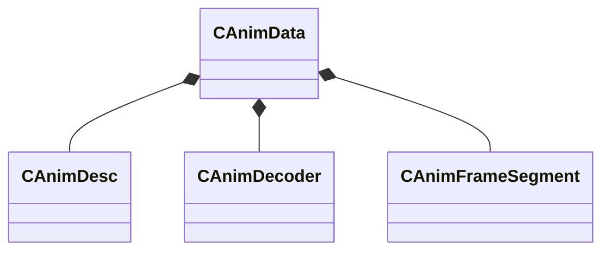

**Fields:**

| Name | Type | Annotations |
|------|------|-------------|
| `m_name` | CBufferString |  |
| `m_animArray` | CUtlVector<[CAnimDesc](../schemas/animationsystem.md#canimdesc)> |  |
| `m_decoderArray` | CUtlVector<[CAnimDecoder](../schemas/animationsystem.md#canimdecoder)> |  |
| `m_nMaxUniqueFrameIndex` | int32 |  |
| `m_segmentArray` | CUtlVector<[CAnimFrameSegment](../schemas/animationsystem.md#canimframesegment)> |  |

### CAnimDataChannelDesc

**Metadata:** `MGetKV3ClassDefaults {
	"m_szChannelClass": "",
	"m_szVariableName": "",
	"m_nFlags": 0,
	"m_nType": 0,
	"m_szGrouping": "",
	"m_szDescription": "",
	"m_szElementNameArray":
	[
	],
	"m_nElementIndexArray":
	[
	],
	"m_nElementMaskArray":
	[
	]
}`

**Fields:**

| Name | Type | Annotations |
|------|------|-------------|
| `m_szChannelClass` | CBufferString |  |
| `m_szVariableName` | CBufferString |  |
| `m_nFlags` | int32 |  |
| `m_nType` | int32 |  |
| `m_szGrouping` | CBufferString |  |
| `m_szDescription` | CBufferString |  |
| `m_szElementNameArray` | CUtlVector<CBufferString> |  |
| `m_nElementIndexArray` | CUtlVector<int32> |  |
| `m_nElementMaskArray` | CUtlVector<uint32> |  |

### CAnimDecoder

**Metadata:** `MGetKV3ClassDefaults {
	"m_szName": "",
	"m_nVersion": 0,
	"m_nType": 0
}`

**Fields:**

| Name | Type | Annotations |
|------|------|-------------|
| `m_szName` | CBufferString |  |
| `m_nVersion` | int32 |  |
| `m_nType` | int32 |  |

### CAnimDesc

**Metadata:** `MGetKV3ClassDefaults {
	"m_name": "",
	"m_flags":
	{
		"m_bLooping": false,
		"m_bAllZeros": false,
		"m_bHidden": false,
		"m_bDelta": false,
		"m_bLegacyWorldspace": false,
		"m_bModelDoc": false,
		"m_bImplicitSeqIgnoreDelta": false,
		"m_bAnimGraphAdditive": false
	},
	"fps": 0.000000,
	"m_pData":
	{
		"m_fileName": "",
		"m_nFrames": 0,
		"m_nFramesPerBlock": 0,
		"m_frameblockArray":
		[
		],
		"m_usageDifferences":
		{
			"m_boneArray":
			[
			],
			"m_morphArray":
			[
			],
			"m_userArray":
			[
			],
			"m_bHasRotationBitArray":
			[
			],
			"m_bHasMovementBitArray":
			[
			],
			"m_bHasMorphBitArray":
			[
			],
			"m_bHasUserBitArray":
			[
			]
		}
	},
	"m_movementArray":
	[
	],
	"m_xInitialOffset":
	[
		0.000000,
		0.000000,
		0.000000,
		1.000000,
		0.000000,
		0.000000,
		0.000000,
		1.000000
	],
	"m_eventArray":
	[
	],
	"m_activityArray":
	[
	],
	"m_hierarchyArray":
	[
	],
	"framestalltime": 0.000000,
	"m_vecRootMin":
	[
		0.000000,
		0.000000,
		0.000000
	],
	"m_vecRootMax":
	[
		0.000000,
		0.000000,
		0.000000
	],
	"m_vecBoneWorldMin":
	[
	],
	"m_vecBoneWorldMax":
	[
	],
	"m_sequenceParams":
	{
		"m_flFadeInTime": 0.200000,
		"m_flFadeOutTime": 0.200000
	}
}`

**Relationships:**

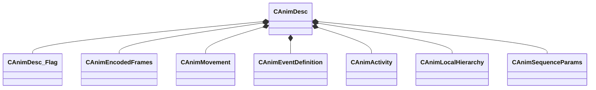

**Fields:**

| Name | Type | Annotations |
|------|------|-------------|
| `m_name` | CBufferString |  |
| `m_flags` | [CAnimDesc_Flag](../schemas/animationsystem.md#canimdesc_flag) |  |
| `fps` | float32 |  |
| `m_Data` | [CAnimEncodedFrames](../schemas/animationsystem.md#canimencodedframes) | `MKV3TransferName "m_pData"` |
| `m_movementArray` | CUtlVector<[CAnimMovement](../schemas/animationsystem.md#canimmovement)> |  |
| `m_xInitialOffset` | CTransform |  |
| `m_eventArray` | CUtlVector<[CAnimEventDefinition](../schemas/animationsystem.md#canimeventdefinition)> |  |
| `m_activityArray` | CUtlVector<[CAnimActivity](../schemas/animationsystem.md#canimactivity)> |  |
| `m_hierarchyArray` | CUtlVector<[CAnimLocalHierarchy](../schemas/animationsystem.md#canimlocalhierarchy)> |  |
| `framestalltime` | float32 |  |
| `m_vecRootMin` | Vector |  |
| `m_vecRootMax` | Vector |  |
| `m_vecBoneWorldMin` | CUtlVector<Vector> |  |
| `m_vecBoneWorldMax` | CUtlVector<Vector> |  |
| `m_sequenceParams` | [CAnimSequenceParams](../schemas/animationsystem.md#canimsequenceparams) |  |

### CAnimDesc_Flag

**Metadata:** `MGetKV3ClassDefaults {
	"m_bLooping": false,
	"m_bAllZeros": false,
	"m_bHidden": false,
	"m_bDelta": false,
	"m_bLegacyWorldspace": false,
	"m_bModelDoc": false,
	"m_bImplicitSeqIgnoreDelta": false,
	"m_bAnimGraphAdditive": false
}`

**Fields:**

| Name | Type | Annotations |
|------|------|-------------|
| `m_bLooping` | bool |  |
| `m_bAllZeros` | bool |  |
| `m_bHidden` | bool |  |
| `m_bDelta` | bool |  |
| `m_bLegacyWorldspace` | bool |  |
| `m_bModelDoc` | bool |  |
| `m_bImplicitSeqIgnoreDelta` | bool |  |
| `m_bAnimGraphAdditive` | bool |  |

### CAnimEncodeDifference

**Metadata:** `MGetKV3ClassDefaults {
	"m_boneArray":
	[
	],
	"m_morphArray":
	[
	],
	"m_userArray":
	[
	],
	"m_bHasRotationBitArray":
	[
	],
	"m_bHasMovementBitArray":
	[
	],
	"m_bHasMorphBitArray":
	[
	],
	"m_bHasUserBitArray":
	[
	]
}`

**Relationships:**

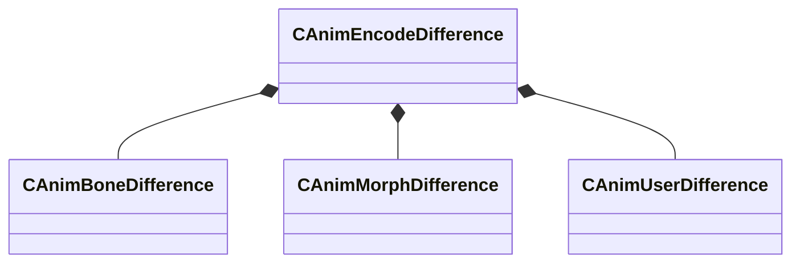

**Fields:**

| Name | Type | Annotations |
|------|------|-------------|
| `m_boneArray` | CUtlVector<[CAnimBoneDifference](../schemas/animationsystem.md#canimbonedifference)> |  |
| `m_morphArray` | CUtlVector<[CAnimMorphDifference](../schemas/animationsystem.md#canimmorphdifference)> |  |
| `m_userArray` | CUtlVector<[CAnimUserDifference](../schemas/animationsystem.md#canimuserdifference)> |  |
| `m_bHasRotationBitArray` | CUtlVector<uint8> |  |
| `m_bHasMovementBitArray` | CUtlVector<uint8> |  |
| `m_bHasMorphBitArray` | CUtlVector<uint8> |  |
| `m_bHasUserBitArray` | CUtlVector<uint8> |  |

### CAnimEncodedFrames

**Metadata:** `MGetKV3ClassDefaults {
	"m_fileName": "",
	"m_nFrames": 0,
	"m_nFramesPerBlock": 0,
	"m_frameblockArray":
	[
	],
	"m_usageDifferences":
	{
		"m_boneArray":
		[
		],
		"m_morphArray":
		[
		],
		"m_userArray":
		[
		],
		"m_bHasRotationBitArray":
		[
		],
		"m_bHasMovementBitArray":
		[
		],
		"m_bHasMorphBitArray":
		[
		],
		"m_bHasUserBitArray":
		[
		]
	}
}`

**Relationships:**

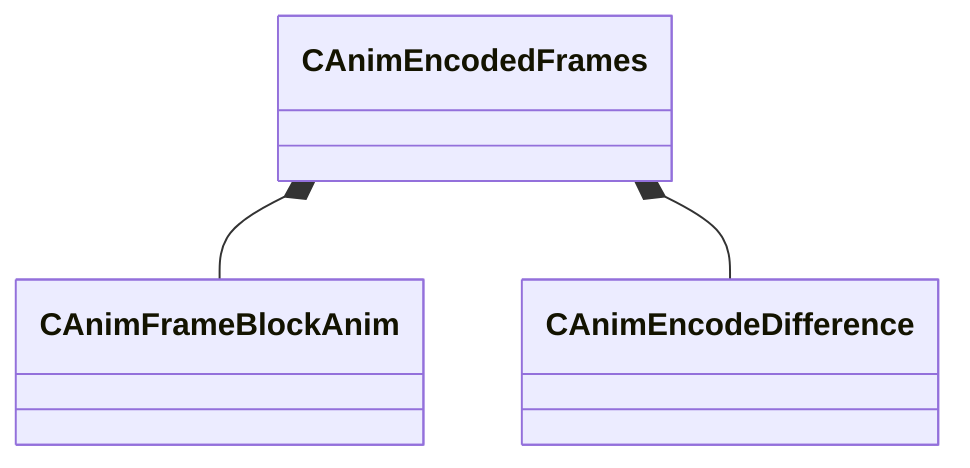

**Fields:**

| Name | Type | Annotations |
|------|------|-------------|
| `m_fileName` | CBufferString |  |
| `m_nFrames` | int32 |  |
| `m_nFramesPerBlock` | int32 |  |
| `m_frameblockArray` | CUtlVector<[CAnimFrameBlockAnim](../schemas/animationsystem.md#canimframeblockanim)> |  |
| `m_usageDifferences` | [CAnimEncodeDifference](../schemas/animationsystem.md#canimencodedifference) |  |

### CAnimEnum

**Fields:**

| Name | Type | Annotations |
|------|------|-------------|
| `m_value` | uint8 |  |

### CAnimEventDefinition

**Metadata:** `MGetKV3ClassDefaults {
	"m_nFrame": 0,
	"m_nEndFrame": -1,
	"m_flCycle": 0.000000,
	"m_flDuration": 0.000000,
	"m_EventData": null,
	"m_sOptions": "",
	"m_sEventName": ""
}`

**Fields:**

| Name | Type | Annotations |
|------|------|-------------|
| `m_nFrame` | int32 |  |
| `m_nEndFrame` | int32 |  |
| `m_flCycle` | float32 |  |
| `m_flDuration` | float32 |  |
| `m_EventData` | KeyValues3 |  |
| `m_sLegacyOptions` | CBufferString | `MKV3TransferName "m_sOptions"` |
| `m_sEventName` | CGlobalSymbol |  |

### CAnimFrameBlockAnim

**Metadata:** `MGetKV3ClassDefaults {
	"m_nStartFrame": 0,
	"m_nEndFrame": 0,
	"m_segmentIndexArray":
	[
	]
}`

**Fields:**

| Name | Type | Annotations |
|------|------|-------------|
| `m_nStartFrame` | int32 |  |
| `m_nEndFrame` | int32 |  |
| `m_segmentIndexArray` | CUtlVector<int32> |  |

### CAnimFrameSegment

**Metadata:** `MGetKV3ClassDefaults {
	"m_nUniqueFrameIndex": 0,
	"m_nLocalElementMasks": 0,
	"m_nLocalChannel": 0,
	"m_container": "[BINARY BLOB]"
}`

**Fields:**

| Name | Type | Annotations |
|------|------|-------------|
| `m_nUniqueFrameIndex` | int32 |  |
| `m_nLocalElementMasks` | uint32 |  |
| `m_nLocalChannel` | int32 |  |
| `m_container` | CUtlBinaryBlock |  |

### CAnimKeyData

**Metadata:** `MGetKV3ClassDefaults {
	"m_name": "",
	"m_boneArray":
	[
	],
	"m_userArray":
	[
	],
	"m_morphArray":
	[
	],
	"m_nChannelElements": 0,
	"m_dataChannelArray":
	[
	]
}`

**Relationships:**

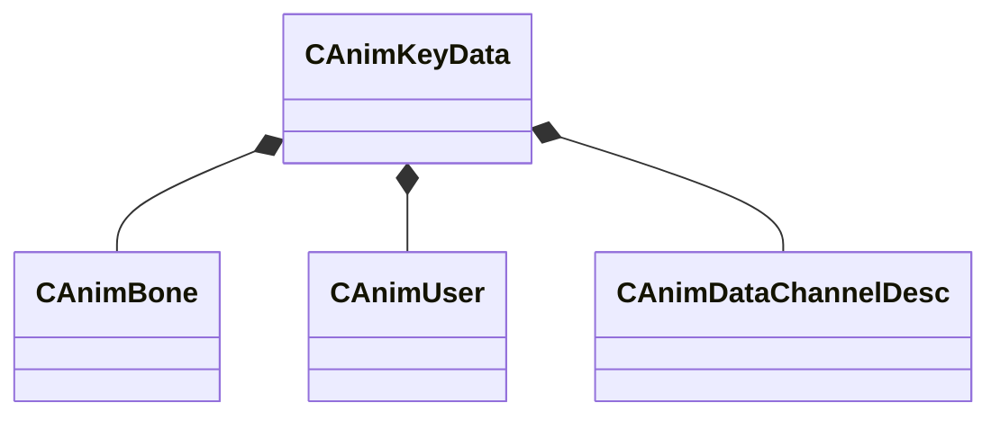

**Fields:**

| Name | Type | Annotations |
|------|------|-------------|
| `m_name` | CBufferString |  |
| `m_boneArray` | CUtlVector<[CAnimBone](../schemas/animationsystem.md#canimbone)> |  |
| `m_userArray` | CUtlVector<[CAnimUser](../schemas/animationsystem.md#canimuser)> |  |
| `m_morphArray` | CUtlVector<CBufferString> |  |
| `m_nChannelElements` | int32 |  |
| `m_dataChannelArray` | CUtlVector<[CAnimDataChannelDesc](../schemas/animationsystem.md#canimdatachanneldesc)> |  |

### CAnimLocalHierarchy

**Metadata:** `MGetKV3ClassDefaults {
	"m_sBone": "",
	"m_sNewParent": "",
	"m_nStartFrame": 0,
	"m_nPeakFrame": 0,
	"m_nTailFrame": 0,
	"m_nEndFrame": 0
}`

**Fields:**

| Name | Type | Annotations |
|------|------|-------------|
| `m_sBone` | CBufferString |  |
| `m_sNewParent` | CBufferString |  |
| `m_nStartFrame` | int32 |  |
| `m_nPeakFrame` | int32 |  |
| `m_nTailFrame` | int32 |  |
| `m_nEndFrame` | int32 |  |

### CAnimMorphDifference

**Metadata:** `MGetKV3ClassDefaults {
	"m_name": ""
}`

**Fields:**

| Name | Type | Annotations |
|------|------|-------------|
| `m_name` | CBufferString |  |

### CAnimMovement

**Metadata:** `MGetKV3ClassDefaults {
	"endframe": 0,
	"motionflags": 0,
	"v0": 0.000000,
	"v1": 0.000000,
	"angle": 0.000000,
	"vector":
	[
		0.000000,
		0.000000,
		0.000000
	],
	"position":
	[
		0.000000,
		0.000000,
		0.000000
	]
}`

**Fields:**

| Name | Type | Annotations |
|------|------|-------------|
| `endframe` | int32 |  |
| `motionflags` | int32 |  |
| `v0` | float32 |  |
| `v1` | float32 |  |
| `angle` | float32 |  |
| `vector` | Vector |  |
| `position` | Vector |  |

### CAnimSequenceParams

**Metadata:** `MGetKV3ClassDefaults {
	"m_flFadeInTime": 0.200000,
	"m_flFadeOutTime": 0.200000
}`

**Fields:**

| Name | Type | Annotations |
|------|------|-------------|
| `m_flFadeInTime` | float32 |  |
| `m_flFadeOutTime` | float32 |  |

### CAnimUser

**Metadata:** `MGetKV3ClassDefaults {
	"m_name": "",
	"m_nType": 0
}`

**Fields:**

| Name | Type | Annotations |
|------|------|-------------|
| `m_name` | CBufferString |  |
| `m_nType` | int32 |  |

### CAnimUserDifference

**Metadata:** `MGetKV3ClassDefaults {
	"m_name": "",
	"m_nType": 0
}`

**Fields:**

| Name | Type | Annotations |
|------|------|-------------|
| `m_name` | CBufferString |  |
| `m_nType` | int32 |  |

### CAnimationGroup

**Metadata:** `MGetKV3ClassDefaults {
	"m_nFlags": 0,
	"m_name": "",
	"m_localHAnimArray":
	[
	],
	"m_includedGroupArray":
	[
	],
	"m_directHSeqGroup": "",
	"m_decodeKey":
	{
		"m_name": "",
		"m_boneArray":
		[
		],
		"m_userArray":
		[
		],
		"m_morphArray":
		[
		],
		"m_nChannelElements": 0,
		"m_dataChannelArray":
		[
		]
	},
	"m_szScripts":
	[
	],
	"m_AdditionalExtRefs":
	[
	]
}`

**Relationships:**

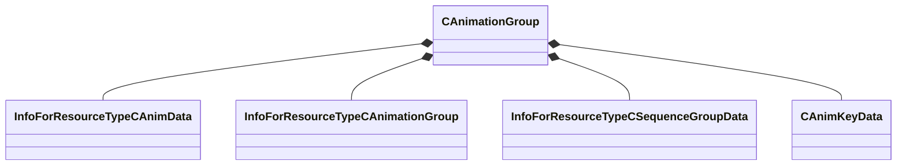

**Fields:**

| Name | Type | Annotations |
|------|------|-------------|
| `m_nFlags` | uint32 |  |
| `m_name` | CBufferString |  |
| `m_localHAnimArray_Handle` | CUtlVector<CStrongHandle<[InfoForResourceTypeCAnimData](../schemas/resourcesystem.md#infoforresourcetypecanimdata)>> | `MKV3TransferName "m_localHAnimArray"` |
| `m_includedGroupArray_Handle` | CUtlVector<CStrongHandle<[InfoForResourceTypeCAnimationGroup](../schemas/resourcesystem.md#infoforresourcetypecanimationgroup)>> | `MKV3TransferName "m_includedGroupArray"` |
| `m_directHSeqGroup_Handle` | CStrongHandle<[InfoForResourceTypeCSequenceGroupData](../schemas/resourcesystem.md#infoforresourcetypecsequencegroupdata)> | `MKV3TransferName "m_directHSeqGroup"` |
| `m_decodeKey` | [CAnimKeyData](../schemas/animationsystem.md#canimkeydata) |  |
| `m_szScripts` | CUtlVector<CBufferString> |  |
| `m_AdditionalExtRefs` | CUtlVector<CStrongHandleVoid> |  |

### CCompressorGroup

**Fields:**

| Name | Type | Annotations |
|------|------|-------------|
| `m_nTotalElementCount` | int32 |  |
| `m_szChannelClass` | CUtlVector<char*> |  |
| `m_szVariableName` | CUtlVector<char*> |  |
| `m_nType` | CUtlVector<fieldtype_t> |  |
| `m_nFlags` | CUtlVector<int32> |  |
| `m_szGrouping` | CUtlVector<CUtlString> |  |
| `m_nCompressorIndex` | CUtlVector<int32> |  |
| `m_szElementNames` | CUtlVector<CUtlVector<char*>> |  |
| `m_nElementUniqueID` | CUtlVector<CUtlVector<int32>> |  |
| `m_nElementMask` | CUtlVector<uint32> |  |
| `m_vectorCompressor` | CUtlVector<CCompressor<Vector>*> |  |
| `m_quaternionCompressor` | CUtlVector<CCompressor<QuaternionStorage>*> |  |
| `m_intCompressor` | CUtlVector<CCompressor<int32>*> |  |
| `m_boolCompressor` | CUtlVector<CCompressor<bool>*> |  |
| `m_colorCompressor` | CUtlVector<CCompressor<Color>*> |  |
| `m_vector2DCompressor` | CUtlVector<CCompressor<Vector2D>*> |  |
| `m_vector4DCompressor` | CUtlVector<CCompressor<Vector4D>*> |  |

### CMoodVData

**Metadata:** `MGetKV3ClassDefaults {
	"m_sModelName": "",
	"m_nMoodType": "eMoodType_Head",
	"m_animationLayers":
	[
	]
}`, `MVDataRoot`, `MVDataOverlayType 1`

**Relationships:**

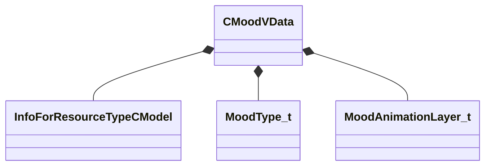

**Fields:**

| Name | Type | Annotations |
|------|------|-------------|
| `m_sModelName` | CResourceNameTyped<CWeakHandle<[InfoForResourceTypeCModel](../schemas/resourcesystem.md#infoforresourcetypecmodel)>> | `MPropertyDescription "Model to get the animation list from"` `MPropertyProvidesEditContextString "ToolEditContext_ID_VMDL"` |
| `m_nMoodType` | [MoodType_t](../schemas/animationsystem.md#moodtype_t) | `MPropertyDescription "Type of mood"` |
| `m_animationLayers` | CUtlVector<[MoodAnimationLayer_t](../schemas/animationsystem.md#moodanimationlayer_t)> | `MPropertyDescription "Layers for this mood"` |

### CSeqAutoLayer

**Metadata:** `MGetKV3ClassDefaults {
	"m_nLocalReference": 0,
	"m_nLocalPose": 0,
	"m_flags":
	{
		"m_bPost": false,
		"m_bSpline": false,
		"m_bXFade": false,
		"m_bNoBlend": false,
		"m_bLocal": false,
		"m_bPose": false,
		"m_bFetchFrame": false,
		"m_bSubtract": false
	},
	"m_start": 0.000000,
	"m_peak": 0.000000,
	"m_tail": 0.000000,
	"m_end": 0.000000
}`

**Relationships:**

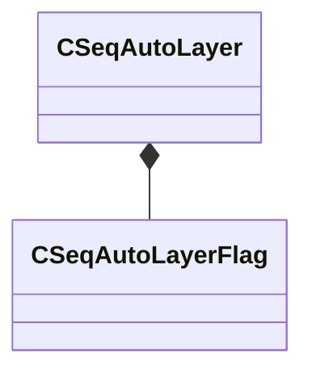

**Fields:**

| Name | Type | Annotations |
|------|------|-------------|
| `m_nLocalReference` | int16 |  |
| `m_nLocalPose` | int16 |  |
| `m_flags` | [CSeqAutoLayerFlag](../schemas/animationsystem.md#cseqautolayerflag) |  |
| `m_start` | float32 |  |
| `m_peak` | float32 |  |
| `m_tail` | float32 |  |
| `m_end` | float32 |  |

### CSeqAutoLayerFlag

**Metadata:** `MGetKV3ClassDefaults {
	"m_bPost": false,
	"m_bSpline": false,
	"m_bXFade": false,
	"m_bNoBlend": false,
	"m_bLocal": false,
	"m_bPose": false,
	"m_bFetchFrame": false,
	"m_bSubtract": false
}`

**Fields:**

| Name | Type | Annotations |
|------|------|-------------|
| `m_bPost` | bool |  |
| `m_bSpline` | bool |  |
| `m_bXFade` | bool |  |
| `m_bNoBlend` | bool |  |
| `m_bLocal` | bool |  |
| `m_bPose` | bool |  |
| `m_bFetchFrame` | bool |  |
| `m_bSubtract` | bool |  |

### CSeqBoneMaskList

**Metadata:** `MGetKV3ClassDefaults {
	"m_sName": "",
	"m_nLocalBoneArray":
	[
	],
	"m_flBoneWeightArray":
	[
	],
	"m_flDefaultMorphCtrlWeight": 1.000000,
	"m_morphCtrlWeightArray":
	[
	]
}`

**Fields:**

| Name | Type | Annotations |
|------|------|-------------|
| `m_sName` | CBufferString |  |
| `m_nLocalBoneArray` | CUtlVector<int16> |  |
| `m_flBoneWeightArray` | CUtlVector<float32> |  |
| `m_flDefaultMorphCtrlWeight` | float32 |  |
| `m_morphCtrlWeightArray` | CUtlVector<std::pair<CBufferString,float32>> |  |

### CSeqCmdLayer

**Metadata:** `MGetKV3ClassDefaults {
	"m_cmd": 0,
	"m_nLocalReference": 0,
	"m_nLocalBonemask": 0,
	"m_nDstResult": 0,
	"m_nSrcResult": 0,
	"m_bSpline": false,
	"m_flVar1": 0.000000,
	"m_flVar2": 0.000000,
	"m_nLineNumber": 0
}`

**Fields:**

| Name | Type | Annotations |
|------|------|-------------|
| `m_cmd` | int16 |  |
| `m_nLocalReference` | int16 |  |
| `m_nLocalBonemask` | int16 |  |
| `m_nDstResult` | int16 |  |
| `m_nSrcResult` | int16 |  |
| `m_bSpline` | bool |  |
| `m_flVar1` | float32 |  |
| `m_flVar2` | float32 |  |
| `m_nLineNumber` | int16 |  |

### CSeqCmdSeqDesc

**Metadata:** `MGetKV3ClassDefaults {
	"m_sName": "",
	"m_flags":
	{
		"m_bLooping": false,
		"m_bSnap": false,
		"m_bAutoplay": false,
		"m_bPost": false,
		"m_bHidden": false,
		"m_bMulti": false,
		"m_bLegacyDelta": false,
		"m_bLegacyWorldspace": false,
		"m_bLegacyCyclepose": false,
		"m_bLegacyRealtime": false,
		"m_bModelDoc": false
	},
	"m_transition":
	{
		"m_flFadeInTime": 0.000000,
		"m_flFadeOutTime": 0.000000
	},
	"m_nFrameRangeSequence": 0,
	"m_nFrameCount": 0,
	"m_flFPS": 30.000000,
	"m_nSubCycles": 1,
	"m_numLocalResults": 0,
	"m_cmdLayerArray":
	[
	],
	"m_eventArray":
	[
	],
	"m_activityArray":
	[
	],
	"m_poseSettingArray":
	[
	]
}`

**Relationships:**

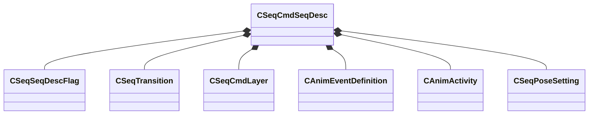

**Fields:**

| Name | Type | Annotations |
|------|------|-------------|
| `m_sName` | CBufferString |  |
| `m_flags` | [CSeqSeqDescFlag](../schemas/animationsystem.md#cseqseqdescflag) |  |
| `m_transition` | [CSeqTransition](../schemas/animationsystem.md#cseqtransition) |  |
| `m_nFrameRangeSequence` | int16 |  |
| `m_nFrameCount` | int16 |  |
| `m_flFPS` | float32 |  |
| `m_nSubCycles` | int16 |  |
| `m_numLocalResults` | int16 |  |
| `m_cmdLayerArray` | CUtlVector<[CSeqCmdLayer](../schemas/animationsystem.md#cseqcmdlayer)> |  |
| `m_eventArray` | CUtlVector<[CAnimEventDefinition](../schemas/animationsystem.md#canimeventdefinition)> |  |
| `m_activityArray` | CUtlVector<[CAnimActivity](../schemas/animationsystem.md#canimactivity)> |  |
| `m_poseSettingArray` | CUtlVector<[CSeqPoseSetting](../schemas/animationsystem.md#cseqposesetting)> |  |

### CSeqIKLock

**Metadata:** `MGetKV3ClassDefaults {
	"m_flPosWeight": 0.000000,
	"m_flAngleWeight": 0.000000,
	"m_nLocalBone": 0,
	"m_bBonesOrientedAlongPositiveX": true
}`

**Fields:**

| Name | Type | Annotations |
|------|------|-------------|
| `m_flPosWeight` | float32 |  |
| `m_flAngleWeight` | float32 |  |
| `m_nLocalBone` | int16 |  |
| `m_bBonesOrientedAlongPositiveX` | bool |  |

### CSeqMultiFetch

**Metadata:** `MGetKV3ClassDefaults {
	"m_flags":
	{
		"m_bRealtime": false,
		"m_bCylepose": false,
		"m_b0D": false,
		"m_b1D": false,
		"m_b2D": false,
		"m_b2D_TRI": false
	},
	"m_localReferenceArray":
	[
	],
	"m_nGroupSize":
	[
		0,
		0
	],
	"m_nLocalPose":
	[
		0,
		0
	],
	"m_poseKeyArray0":
	[
	],
	"m_poseKeyArray1":
	[
	],
	"m_nLocalCyclePoseParameter": 0,
	"m_bCalculatePoseParameters": false,
	"m_bFixedBlendWeight": false,
	"m_flFixedBlendWeightVals":
	[
		0.000000,
		0.000000
	]
}`

**Relationships:**

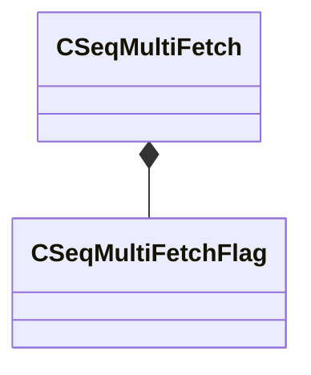

**Fields:**

| Name | Type | Annotations |
|------|------|-------------|
| `m_flags` | [CSeqMultiFetchFlag](../schemas/animationsystem.md#cseqmultifetchflag) |  |
| `m_localReferenceArray` | CUtlVector<int16> |  |
| `m_nGroupSize` | int32[2] |  |
| `m_nLocalPose` | int32[2] |  |
| `m_poseKeyArray0` | CUtlVector<float32> |  |
| `m_poseKeyArray1` | CUtlVector<float32> |  |
| `m_nLocalCyclePoseParameter` | int32 |  |
| `m_bCalculatePoseParameters` | bool |  |
| `m_bFixedBlendWeight` | bool |  |
| `m_flFixedBlendWeightVals` | float32[2] |  |

### CSeqMultiFetchFlag

**Metadata:** `MGetKV3ClassDefaults {
	"m_bRealtime": false,
	"m_bCylepose": false,
	"m_b0D": false,
	"m_b1D": false,
	"m_b2D": false,
	"m_b2D_TRI": false
}`

**Fields:**

| Name | Type | Annotations |
|------|------|-------------|
| `m_bRealtime` | bool |  |
| `m_bCylepose` | bool |  |
| `m_b0D` | bool |  |
| `m_b1D` | bool |  |
| `m_b2D` | bool |  |
| `m_b2D_TRI` | bool |  |

### CSeqPoseParamDesc

**Metadata:** `MGetKV3ClassDefaults {
	"m_sName": "",
	"m_flStart": 0.000000,
	"m_flEnd": 0.000000,
	"m_flLoop": 0.000000,
	"m_bLooping": false
}`

**Fields:**

| Name | Type | Annotations |
|------|------|-------------|
| `m_sName` | CBufferString |  |
| `m_flStart` | float32 |  |
| `m_flEnd` | float32 |  |
| `m_flLoop` | float32 |  |
| `m_bLooping` | bool |  |

### CSeqPoseSetting

**Metadata:** `MGetKV3ClassDefaults {
	"m_sPoseParameter": "",
	"m_sAttachment": "",
	"m_sReferenceSequence": "",
	"m_flValue": 0.000000,
	"m_bX": false,
	"m_bY": false,
	"m_bZ": false,
	"m_eType": 0
}`

**Fields:**

| Name | Type | Annotations |
|------|------|-------------|
| `m_sPoseParameter` | CBufferString |  |
| `m_sAttachment` | CBufferString |  |
| `m_sReferenceSequence` | CBufferString |  |
| `m_flValue` | float32 |  |
| `m_bX` | bool |  |
| `m_bY` | bool |  |
| `m_bZ` | bool |  |
| `m_eType` | int32 |  |

### CSeqS1SeqDesc

**Metadata:** `MGetKV3ClassDefaults {
	"m_sName": "",
	"m_flags":
	{
		"m_bLooping": false,
		"m_bSnap": false,
		"m_bAutoplay": false,
		"m_bPost": false,
		"m_bHidden": false,
		"m_bMulti": false,
		"m_bLegacyDelta": false,
		"m_bLegacyWorldspace": false,
		"m_bLegacyCyclepose": false,
		"m_bLegacyRealtime": false,
		"m_bModelDoc": false
	},
	"m_fetch":
	{
		"m_flags":
		{
			"m_bRealtime": false,
			"m_bCylepose": false,
			"m_b0D": false,
			"m_b1D": false,
			"m_b2D": false,
			"m_b2D_TRI": false
		},
		"m_localReferenceArray":
		[
		],
		"m_nGroupSize":
		[
			0,
			0
		],
		"m_nLocalPose":
		[
			0,
			0
		],
		"m_poseKeyArray0":
		[
		],
		"m_poseKeyArray1":
		[
		],
		"m_nLocalCyclePoseParameter": 0,
		"m_bCalculatePoseParameters": false,
		"m_bFixedBlendWeight": false,
		"m_flFixedBlendWeightVals":
		[
			0.000000,
			0.000000
		]
	},
	"m_nLocalWeightlist": 0,
	"m_autoLayerArray":
	[
	],
	"m_IKLockArray":
	[
	],
	"m_transition":
	{
		"m_flFadeInTime": 0.000000,
		"m_flFadeOutTime": 0.000000
	},
	"m_SequenceKeys": null,
	"m_keyValueText": "",
	"m_activityArray":
	[
	],
	"m_footMotion":
	[
	]
}`

**Relationships:**

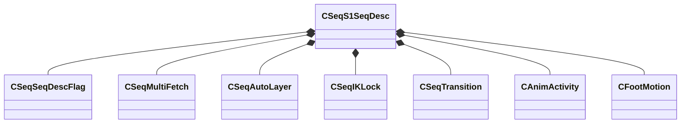

**Fields:**

| Name | Type | Annotations |
|------|------|-------------|
| `m_sName` | CBufferString |  |
| `m_flags` | [CSeqSeqDescFlag](../schemas/animationsystem.md#cseqseqdescflag) |  |
| `m_fetch` | [CSeqMultiFetch](../schemas/animationsystem.md#cseqmultifetch) |  |
| `m_nLocalWeightlist` | int32 |  |
| `m_autoLayerArray` | CUtlVector<[CSeqAutoLayer](../schemas/animationsystem.md#cseqautolayer)> |  |
| `m_IKLockArray` | CUtlVector<[CSeqIKLock](../schemas/animationsystem.md#cseqiklock)> |  |
| `m_transition` | [CSeqTransition](../schemas/animationsystem.md#cseqtransition) |  |
| `m_SequenceKeys` | KeyValues3 |  |
| `m_LegacyKeyValueText` | CBufferString | `MKV3TransferName "m_keyValueText"` |
| `m_activityArray` | CUtlVector<[CAnimActivity](../schemas/animationsystem.md#canimactivity)> |  |
| `m_footMotion` | CUtlVector<[CFootMotion](../schemas/modellib.md#cfootmotion)> |  |

### CSeqScaleSet

**Metadata:** `MGetKV3ClassDefaults {
	"m_sName": "",
	"m_bRootOffset": false,
	"m_vRootOffset":
	[
		0.000000,
		0.000000,
		0.000000
	],
	"m_nLocalBoneArray":
	[
	],
	"m_flBoneScaleArray":
	[
	]
}`

**Fields:**

| Name | Type | Annotations |
|------|------|-------------|
| `m_sName` | CBufferString |  |
| `m_bRootOffset` | bool |  |
| `m_vRootOffset` | Vector |  |
| `m_nLocalBoneArray` | CUtlVector<int16> |  |
| `m_flBoneScaleArray` | CUtlVector<float32> |  |

### CSeqSeqDescFlag

**Metadata:** `MGetKV3ClassDefaults {
	"m_bLooping": false,
	"m_bSnap": false,
	"m_bAutoplay": false,
	"m_bPost": false,
	"m_bHidden": false,
	"m_bMulti": false,
	"m_bLegacyDelta": false,
	"m_bLegacyWorldspace": false,
	"m_bLegacyCyclepose": false,
	"m_bLegacyRealtime": false,
	"m_bModelDoc": false
}`

**Fields:**

| Name | Type | Annotations |
|------|------|-------------|
| `m_bLooping` | bool |  |
| `m_bSnap` | bool |  |
| `m_bAutoplay` | bool |  |
| `m_bPost` | bool |  |
| `m_bHidden` | bool |  |
| `m_bMulti` | bool |  |
| `m_bLegacyDelta` | bool |  |
| `m_bLegacyWorldspace` | bool |  |
| `m_bLegacyCyclepose` | bool |  |
| `m_bLegacyRealtime` | bool |  |
| `m_bModelDoc` | bool |  |

### CSeqSynthAnimDesc

**Metadata:** `MGetKV3ClassDefaults {
	"m_sName": "",
	"m_flags":
	{
		"m_bLooping": false,
		"m_bSnap": false,
		"m_bAutoplay": false,
		"m_bPost": false,
		"m_bHidden": false,
		"m_bMulti": false,
		"m_bLegacyDelta": false,
		"m_bLegacyWorldspace": false,
		"m_bLegacyCyclepose": false,
		"m_bLegacyRealtime": false,
		"m_bModelDoc": false
	},
	"m_transition":
	{
		"m_flFadeInTime": 0.000000,
		"m_flFadeOutTime": 0.000000
	},
	"m_nLocalBaseReference": 0,
	"m_nLocalBoneMask": 0,
	"m_activityArray":
	[
	]
}`

**Relationships:**

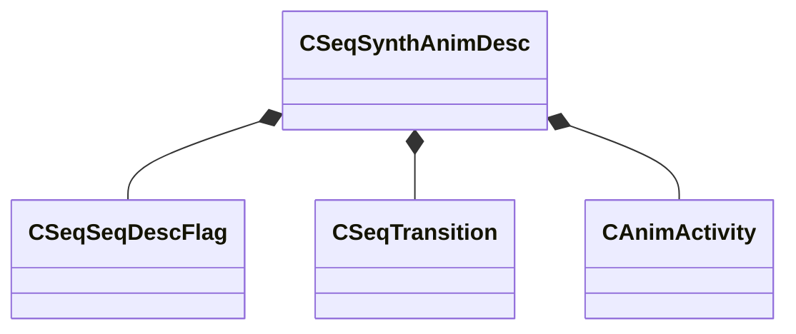

**Fields:**

| Name | Type | Annotations |
|------|------|-------------|
| `m_sName` | CBufferString |  |
| `m_flags` | [CSeqSeqDescFlag](../schemas/animationsystem.md#cseqseqdescflag) |  |
| `m_transition` | [CSeqTransition](../schemas/animationsystem.md#cseqtransition) |  |
| `m_nLocalBaseReference` | int16 |  |
| `m_nLocalBoneMask` | int16 |  |
| `m_activityArray` | CUtlVector<[CAnimActivity](../schemas/animationsystem.md#canimactivity)> |  |

### CSeqTransition

**Metadata:** `MGetKV3ClassDefaults {
	"m_flFadeInTime": 0.000000,
	"m_flFadeOutTime": 0.000000
}`

**Fields:**

| Name | Type | Annotations |
|------|------|-------------|
| `m_flFadeInTime` | float32 |  |
| `m_flFadeOutTime` | float32 |  |

### CSequenceGroupData

**Metadata:** `MGetKV3ClassDefaults {
	"m_sName": "",
	"m_nFlags": 0,
	"m_localSequenceNameArray":
	[
	],
	"m_localS1SeqDescArray":
	[
	],
	"m_localMultiSeqDescArray":
	[
	],
	"m_localSynthAnimDescArray":
	[
	],
	"m_localCmdSeqDescArray":
	[
	],
	"m_localBoneMaskArray":
	[
	],
	"m_localScaleSetArray":
	[
	],
	"m_localBoneNameArray":
	[
	],
	"m_localNodeName": "",
	"m_localPoseParamArray":
	[
	],
	"m_keyValues": null,
	"m_localIKAutoplayLockArray":
	[
	]
}`

**Relationships:**

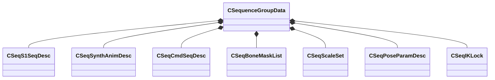

**Fields:**

| Name | Type | Annotations |
|------|------|-------------|
| `m_sName` | CBufferString |  |
| `m_nFlags` | uint32 |  |
| `m_localSequenceNameArray` | CUtlVector<CBufferString> |  |
| `m_localS1SeqDescArray` | CUtlVector<[CSeqS1SeqDesc](../schemas/animationsystem.md#cseqs1seqdesc)> |  |
| `m_localMultiSeqDescArray` | CUtlVector<[CSeqS1SeqDesc](../schemas/animationsystem.md#cseqs1seqdesc)> |  |
| `m_localSynthAnimDescArray` | CUtlVector<[CSeqSynthAnimDesc](../schemas/animationsystem.md#cseqsynthanimdesc)> |  |
| `m_localCmdSeqDescArray` | CUtlVector<[CSeqCmdSeqDesc](../schemas/animationsystem.md#cseqcmdseqdesc)> |  |
| `m_localBoneMaskArray` | CUtlVector<[CSeqBoneMaskList](../schemas/animationsystem.md#cseqbonemasklist)> |  |
| `m_localScaleSetArray` | CUtlVector<[CSeqScaleSet](../schemas/animationsystem.md#cseqscaleset)> |  |
| `m_localBoneNameArray` | CUtlVector<CBufferString> |  |
| `m_localNodeName` | CBufferString |  |
| `m_localPoseParamArray` | CUtlVector<[CSeqPoseParamDesc](../schemas/animationsystem.md#cseqposeparamdesc)> |  |
| `m_keyValues` | KeyValues3 |  |
| `m_localIKAutoplayLockArray` | CUtlVector<[CSeqIKLock](../schemas/animationsystem.md#cseqiklock)> |  |

### FollowAttachmentData

**Metadata:** `MGetKV3ClassDefaults {
	"m_boneIndex": 5,
	"m_attachmentHandle": 0
}`

**Relationships:**

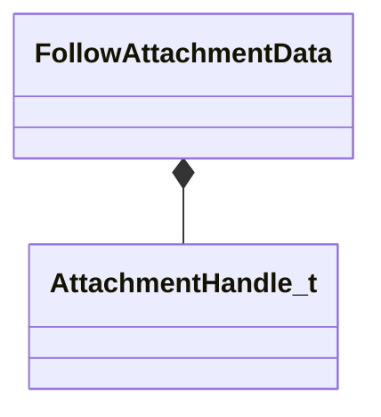

**Fields:**

| Name | Type | Annotations |
|------|------|-------------|
| `m_boneIndex` | int32 |  |
| `m_attachmentHandle` | [AttachmentHandle_t](../schemas/modellib.md#attachmenthandle_t) |  |

### HSequence

**Metadata:** `MIsBoxedIntegerType`

**Fields:**

| Name | Type | Annotations |
|------|------|-------------|
| `m_Value` | int32 |  |

### MoodAnimationLayer_t

**Metadata:** `MGetKV3ClassDefaults {
	"m_sName": "",
	"m_bActiveListening": true,
	"m_bActiveTalking": true,
	"m_layerAnimations":
	[
	],
	"m_flIntensity": 1.000000,
	"m_flDurationScale": 1.000000,
	"m_bScaleWithInts": false,
	"m_flNextStart": 1.000000,
	"m_flStartOffset": 0.000000,
	"m_flEndOffset": 0.000000,
	"m_flFadeIn": 0.200000,
	"m_flFadeOut": 0.200000
}`, `MPropertyArrayElementNameKey "m_sName"`

**Relationships:**

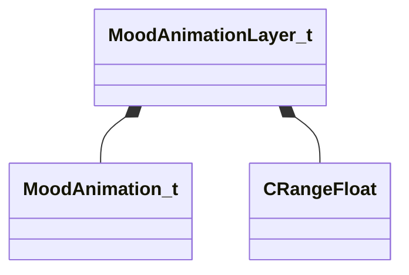

**Fields:**

| Name | Type | Annotations |
|------|------|-------------|
| `m_sName` | CUtlString | `MPropertyFriendlyName "Name"` `MPropertyDescription "Name of the layer"` |
| `m_bActiveListening` | bool | `MPropertyFriendlyName "Active When Listening"` `MPropertyDescription "Sets the mood's animation buckets to be active when the character is listening"` |
| `m_bActiveTalking` | bool | `MPropertyFriendlyName "Active When Talking"` `MPropertyDescription "Sets the mood's animation buckets to be active when the character is talking"` |
| `m_layerAnimations` | CUtlVector<[MoodAnimation_t](../schemas/animationsystem.md#moodanimation_t)> | `MPropertyDescription "List of animations to choose from"` |
| `m_flIntensity` | [CRangeFloat](../schemas/tier2.md#crangefloat) | `MPropertyDescription "Intensity of the animation"` `MPropertyAttributeRange "0 1"` |
| `m_flDurationScale` | [CRangeFloat](../schemas/tier2.md#crangefloat) | `MPropertyDescription "Multiplier of the animation duration"` |
| `m_bScaleWithInts` | bool | `MPropertyDescription "When scaling an animation, grab the scale value as in int. Used for gestures/postures to control number of looping sections"` |
| `m_flNextStart` | [CRangeFloat](../schemas/tier2.md#crangefloat) | `MPropertyDescription "Time before the next animation can start"` |
| `m_flStartOffset` | [CRangeFloat](../schemas/tier2.md#crangefloat) | `MPropertyDescription "Time from the start of the mood before an animation can start"` |
| `m_flEndOffset` | [CRangeFloat](../schemas/tier2.md#crangefloat) | `MPropertyDescription "Time from the end of the mood when an animation cannot play"` |
| `m_flFadeIn` | float32 | `MPropertyDescription "Fade in time of the animation"` |
| `m_flFadeOut` | float32 | `MPropertyDescription "Fade out time of the animation"` |

### MoodAnimation_t

**Metadata:** `MGetKV3ClassDefaults {
	"m_sName": "",
	"m_flWeight": 1.000000
}`, `MPropertyArrayElementNameKey "m_sName"`

**Fields:**

| Name | Type | Annotations |
|------|------|-------------|
| `m_sName` | CModelAnimNameWithDeltas | `MPropertyDescription "Name of the animation"` |
| `m_flWeight` | float32 | `MPropertyDescription "Weight of the animation, higher numbers get picked more"` |

### MoodType_t

**Values:**

| Name | Value | Description |
|------|-------|-------------|
| `eMoodType_Head` | 0 | Head |
| `eMoodType_Body` | 1 | Body |

### ParticleAttachment_t

**Values:**

| Name | Value | Description |
|------|-------|-------------|
| `PATTACH_INVALID` | -1 |  |
| `PATTACH_ABSORIGIN` | 0 |  |
| `PATTACH_ABSORIGIN_FOLLOW` | 1 |  |
| `PATTACH_CUSTOMORIGIN` | 2 |  |
| `PATTACH_CUSTOMORIGIN_FOLLOW` | 3 |  |
| `PATTACH_POINT` | 4 |  |
| `PATTACH_POINT_FOLLOW` | 5 |  |
| `PATTACH_EYES_FOLLOW` | 6 |  |
| `PATTACH_OVERHEAD_FOLLOW` | 7 |  |
| `PATTACH_WORLDORIGIN` | 8 |  |
| `PATTACH_ROOTBONE_FOLLOW` | 9 |  |
| `PATTACH_RENDERORIGIN_FOLLOW` | 10 |  |
| `PATTACH_MAIN_VIEW` | 11 |  |
| `PATTACH_WATERWAKE` | 12 |  |
| `PATTACH_CENTER_FOLLOW` | 13 |  |
| `PATTACH_CUSTOM_GAME_STATE_1` | 14 |  |
| `PATTACH_HEALTHBAR` | 15 |  |
| `MAX_PATTACH_TYPES` | 16 |  |

### SeqCmd_t

**Values:**

| Name | Value | Description |
|------|-------|-------------|
| `SeqCmd_Nop` | 0 |  |
| `SeqCmd_LinearDelta` | 1 |  |
| `SeqCmd_FetchFrameRange` | 2 |  |
| `SeqCmd_Slerp` | 3 |  |
| `SeqCmd_Add` | 4 |  |
| `SeqCmd_Subtract` | 5 |  |
| `SeqCmd_Scale` | 6 |  |
| `SeqCmd_Copy` | 7 |  |
| `SeqCmd_Blend` | 8 |  |
| `SeqCmd_Worldspace` | 9 |  |
| `SeqCmd_Sequence` | 10 |  |
| `SeqCmd_FetchCycle` | 11 |  |
| `SeqCmd_FetchFrame` | 12 |  |
| `SeqCmd_IKLockInPlace` | 13 |  |
| `SeqCmd_IKRestoreAll` | 14 |  |
| `SeqCmd_ReverseSequence` | 15 |  |
| `SeqCmd_Transform` | 16 |  |

### SeqPoseSetting_t

**Values:**

| Name | Value | Description |
|------|-------|-------------|
| `SEQ_POSE_SETTING_CONSTANT` | 0 |  |
| `SEQ_POSE_SETTING_ROTATION` | 1 |  |
| `SEQ_POSE_SETTING_POSITION` | 2 |  |
| `SEQ_POSE_SETTING_VELOCITY` | 3 |  |
