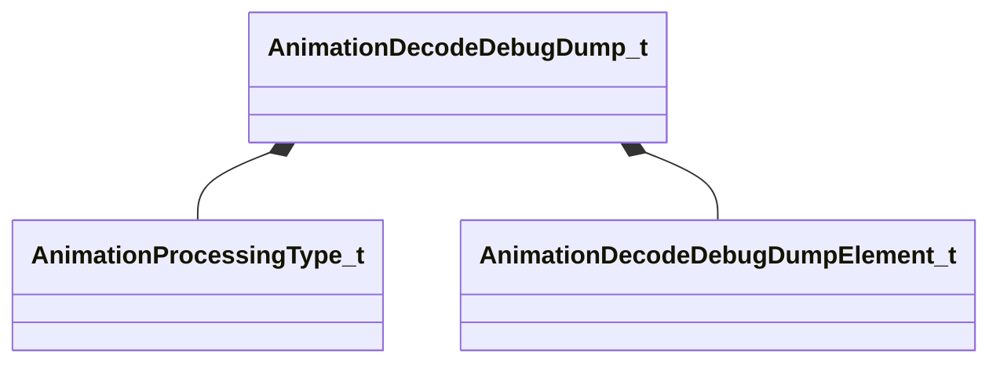

[Schemas](../../schemas.md) / [animationsystem](../animationsystem.md) / AnimationDecodeDebugDump_t

# AnimationDecodeDebugDump_t

**Kind:** class · **Size:** 32 bytes (`0x20`) · **Align:** 8 · **Module:** animationsystem

**Relationships:**

## Memory layout

2 fields (2 declared here, 0 inherited). Offsets are absolute from the object base.

| Offset | Field | Type | From | Annotations |
|--------|-------|------|------|-------------|
| `0x0` | `m_processingType` | [AnimationProcessingType_t](../!GlobalTypes/AnimationProcessingType_t.md) |  |  |
| `0x8` | `m_elems` | CUtlVector< [AnimationDecodeDebugDumpElement_t](../animationsystem/AnimationDecodeDebugDumpElement_t.md) > |  |  |

KV3 class defaults

<pre>{
	&quot;m_processingType&quot;: &quot;ANIMATION_PROCESSING_SERVER_SIMULATION&quot;,
	&quot;m_elems&quot;:
	[
	]
}</pre>

