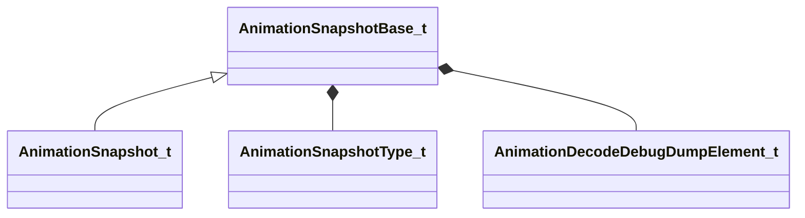

[Schemas](../../schemas.md) / [animationsystem](../animationsystem.md) / AnimationSnapshotBase_t

# AnimationSnapshotBase_t

**Kind:** class · **Size:** 272 bytes (`0x110`) · **Align:** 16 · **Module:** animationsystem

**Derived by:** [AnimationSnapshot_t](../animationsystem/AnimationSnapshot_t.md)

**Relationships:**

## Memory layout

9 fields (9 declared here, 0 inherited). Offsets are absolute from the object base.

| Offset | Field | Type | From | Annotations |
|--------|-------|------|------|-------------|
| `0x0` | `m_flRealTime` | float32 |  |  |
| `0x10` | `m_rootToWorld` | matrix3x4a_t |  |  |
| `0x40` | `m_bBonesInWorldSpace` | bool |  |  |
| `0x48` | `m_boneSetupMask` | CUtlVector< uint32 > |  |  |
| `0x60` | `m_boneTransforms` | CUtlVector< matrix3x4a_t > |  |  |
| `0x78` | `m_flexControllers` | CUtlVector< float32 > |  |  |
| `0x90` | `m_SnapshotType` | [AnimationSnapshotType_t](../!GlobalTypes/AnimationSnapshotType_t.md) |  |  |
| `0x94` | `m_bHasDecodeDump` | bool |  |  |
| `0x98` | `m_DecodeDump` | [AnimationDecodeDebugDumpElement_t](../animationsystem/AnimationDecodeDebugDumpElement_t.md) |  |  |

KV3 class defaults

<pre>{
	&quot;m_flRealTime&quot;: 0.000000,
	&quot;m_rootToWorld&quot;:
	[
		0.000000,
		0.000000,
		0.000000,
		0.000000,
		0.000000,
		0.000000,
		0.000000,
		0.000000,
		0.000000,
		0.000000,
		0.000000,
		0.000000
	],
	&quot;m_bBonesInWorldSpace&quot;: false,
	&quot;m_boneSetupMask&quot;:
	[
	],
	&quot;m_boneTransforms&quot;:
	[
	],
	&quot;m_flexControllers&quot;:
	[
	],
	&quot;m_SnapshotType&quot;: &quot;ANIMATION_SNAPSHOT_SERVER_SIMULATION&quot;,
	&quot;m_bHasDecodeDump&quot;: false,
	&quot;m_DecodeDump&quot;:
	{
		&quot;m_nEntityIndex&quot;: 0,
		&quot;m_modelName&quot;: &quot;&quot;,
		&quot;m_poseParams&quot;:
		[
		],
		&quot;m_decodeOps&quot;:
		[
		],
		&quot;m_internalOps&quot;:
		[
		],
		&quot;m_decodedAnims&quot;:
		[
		]
	}
}</pre>

