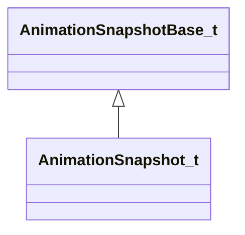

[Schemas](../../schemas.md) / [animationsystem](../animationsystem.md) / AnimationSnapshot_t

# AnimationSnapshot_t

> Source: **Build 25000182** · 2026-08-28 · `windows-x86_64` · schema `0.10.0`

**Kind:** class · **Size:** 288 bytes (`0x120`) · **Align:** 16 · **Module:** animationsystem

**Inherits from:** [AnimationSnapshotBase_t](../animationsystem/AnimationSnapshotBase_t.md)

**Relationships:**

## Memory layout

11 fields (2 declared here, 9 inherited). Offsets are absolute from the object base.

| Offset | Field | Type | From | Annotations |
|--------|-------|------|------|-------------|
| `0x0` | `m_flRealTime` | float32 | [AnimationSnapshotBase_t](../animationsystem/AnimationSnapshotBase_t.md) |  |
| `0x10` | `m_rootToWorld` | matrix3x4a_t | [AnimationSnapshotBase_t](../animationsystem/AnimationSnapshotBase_t.md) |  |
| `0x40` | `m_bBonesInWorldSpace` | bool | [AnimationSnapshotBase_t](../animationsystem/AnimationSnapshotBase_t.md) |  |
| `0x48` | `m_boneSetupMask` | CUtlVector< uint32 > | [AnimationSnapshotBase_t](../animationsystem/AnimationSnapshotBase_t.md) |  |
| `0x60` | `m_boneTransforms` | CUtlVector< matrix3x4a_t > | [AnimationSnapshotBase_t](../animationsystem/AnimationSnapshotBase_t.md) |  |
| `0x78` | `m_flexControllers` | CUtlVector< float32 > | [AnimationSnapshotBase_t](../animationsystem/AnimationSnapshotBase_t.md) |  |
| `0x90` | `m_SnapshotType` | [AnimationSnapshotType_t](../animationsystem/AnimationSnapshotType_t.md) | [AnimationSnapshotBase_t](../animationsystem/AnimationSnapshotBase_t.md) |  |
| `0x94` | `m_bHasDecodeDump` | bool | [AnimationSnapshotBase_t](../animationsystem/AnimationSnapshotBase_t.md) |  |
| `0x98` | `m_DecodeDump` | [AnimationDecodeDebugDumpElement_t](../animationsystem/AnimationDecodeDebugDumpElement_t.md) | [AnimationSnapshotBase_t](../animationsystem/AnimationSnapshotBase_t.md) |  |
| `0x110` | `m_nEntIndex` | int32 |  |  |
| `0x118` | `m_modelName` | CUtlString |  |  |

KV3 class defaults

<pre>{
	&quot;m_flRealTime&quot;: 0.000000,
	&quot;m_rootToWorld&quot;:
	[
		0.000000,
		0.000000,
		0.000000,
		0.000000,
		0.000000,
		0.000000,
		0.000000,
		0.000000,
		0.000000,
		0.000000,
		0.000000,
		0.000000
	],
	&quot;m_bBonesInWorldSpace&quot;: false,
	&quot;m_boneSetupMask&quot;:
	[
	],
	&quot;m_boneTransforms&quot;:
	[
	],
	&quot;m_flexControllers&quot;:
	[
	],
	&quot;m_SnapshotType&quot;: &quot;ANIMATION_SNAPSHOT_SERVER_SIMULATION&quot;,
	&quot;m_bHasDecodeDump&quot;: false,
	&quot;m_DecodeDump&quot;:
	{
		&quot;m_nEntityIndex&quot;: 0,
		&quot;m_modelName&quot;: &quot;&quot;,
		&quot;m_poseParams&quot;:
		[
		],
		&quot;m_decodeOps&quot;:
		[
		],
		&quot;m_internalOps&quot;:
		[
		],
		&quot;m_decodedAnims&quot;:
		[
		]
	},
	&quot;m_nEntIndex&quot;: 0,
	&quot;m_modelName&quot;: &quot;&quot;
}</pre>

