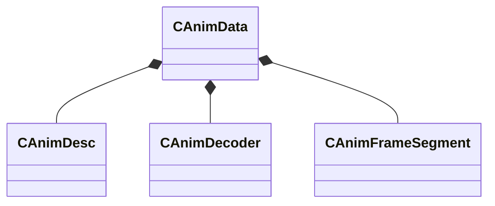

[Schemas](../../schemas.md) / [animationsystem](../animationsystem.md) / CAnimData

# CAnimData

**Kind:** class · **Size:** 112 bytes (`0x70`) · **Align:** 8 · **Module:** animationsystem

**Relationships:**

## Memory layout

5 fields (5 declared here, 0 inherited). Offsets are absolute from the object base.

| Offset | Field | Type | From | Annotations |
|--------|-------|------|------|-------------|
| `0x10` | `m_name` | CBufferString |  |  |
| `0x20` | `m_animArray` | CUtlVector< [CAnimDesc](../animationsystem/CAnimDesc.md) > |  |  |
| `0x38` | `m_decoderArray` | CUtlVector< [CAnimDecoder](../animationsystem/CAnimDecoder.md) > |  |  |
| `0x50` | `m_nMaxUniqueFrameIndex` | int32 |  |  |
| `0x58` | `m_segmentArray` | CUtlVector< [CAnimFrameSegment](../animationsystem/CAnimFrameSegment.md) > |  |  |

KV3 class defaults

<pre>{
	&quot;m_name&quot;: &quot;&quot;,
	&quot;m_animArray&quot;:
	[
	],
	&quot;m_decoderArray&quot;:
	[
	],
	&quot;m_nMaxUniqueFrameIndex&quot;: 0,
	&quot;m_segmentArray&quot;:
	[
	]
}</pre>

