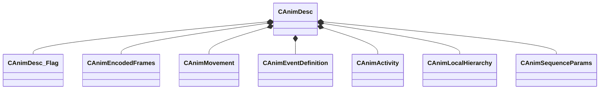

[Schemas](../../schemas.md) / [animationsystem](../animationsystem.md) / CAnimDesc

# CAnimDesc

> Source: **Build 25000182** · 2026-08-28 · `windows-x86_64` · schema `0.10.0`

**Kind:** class · **Size:** 464 bytes (`0x1d0`) · **Align:** 16 · **Module:** animationsystem

**Relationships:**

## Memory layout

15 fields (15 declared here, 0 inherited). Offsets are absolute from the object base.

| Offset | Field | Type | From | Annotations |
|--------|-------|------|------|-------------|
| `0x0` | `m_name` | CBufferString |  |  |
| `0x10` | `m_flags` | [CAnimDesc_Flag](../animationsystem/CAnimDesc_Flag.md) |  |  |
| `0x18` | `fps` | float32 |  |  |
| `0x20` | `m_Data` | [CAnimEncodedFrames](../animationsystem/CAnimEncodedFrames.md) |  | `MKV3TransferName m_pData` |
| `0xf8` | `m_movementArray` | CUtlVector< [CAnimMovement](../animationsystem/CAnimMovement.md) > |  |  |
| `0x110` | `m_xInitialOffset` | CTransform |  |  |
| `0x130` | `m_eventArray` | CUtlVector< [CAnimEventDefinition](../animationsystem/CAnimEventDefinition.md) > |  |  |
| `0x148` | `m_activityArray` | CUtlVector< [CAnimActivity](../animationsystem/CAnimActivity.md) > |  |  |
| `0x160` | `m_hierarchyArray` | CUtlVector< [CAnimLocalHierarchy](../animationsystem/CAnimLocalHierarchy.md) > |  |  |
| `0x178` | `framestalltime` | float32 |  |  |
| `0x17c` | `m_vecRootMin` | Vector |  |  |
| `0x188` | `m_vecRootMax` | Vector |  |  |
| `0x198` | `m_vecBoneWorldMin` | CUtlVector< Vector > |  |  |
| `0x1b0` | `m_vecBoneWorldMax` | CUtlVector< Vector > |  |  |
| `0x1c8` | `m_sequenceParams` | [CAnimSequenceParams](../animationsystem/CAnimSequenceParams.md) |  |  |

KV3 class defaults

<pre>{
	&quot;m_name&quot;: &quot;&quot;,
	&quot;m_flags&quot;:
	{
		&quot;m_bLooping&quot;: false,
		&quot;m_bAllZeros&quot;: false,
		&quot;m_bHidden&quot;: false,
		&quot;m_bDelta&quot;: false,
		&quot;m_bLegacyWorldspace&quot;: false,
		&quot;m_bModelDoc&quot;: false,
		&quot;m_bImplicitSeqIgnoreDelta&quot;: false,
		&quot;m_bAnimGraphAdditive&quot;: false
	},
	&quot;fps&quot;: 0.000000,
	&quot;m_pData&quot;:
	{
		&quot;m_fileName&quot;: &quot;&quot;,
		&quot;m_nFrames&quot;: 0,
		&quot;m_nFramesPerBlock&quot;: 0,
		&quot;m_frameblockArray&quot;:
		[
		],
		&quot;m_usageDifferences&quot;:
		{
			&quot;m_boneArray&quot;:
			[
			],
			&quot;m_morphArray&quot;:
			[
			],
			&quot;m_userArray&quot;:
			[
			],
			&quot;m_bHasRotationBitArray&quot;:
			[
			],
			&quot;m_bHasMovementBitArray&quot;:
			[
			],
			&quot;m_bHasMorphBitArray&quot;:
			[
			],
			&quot;m_bHasUserBitArray&quot;:
			[
			]
		}
	},
	&quot;m_movementArray&quot;:
	[
	],
	&quot;m_xInitialOffset&quot;:
	[
		0.000000,
		0.000000,
		0.000000,
		1.000000,
		0.000000,
		0.000000,
		0.000000,
		1.000000
	],
	&quot;m_eventArray&quot;:
	[
	],
	&quot;m_activityArray&quot;:
	[
	],
	&quot;m_hierarchyArray&quot;:
	[
	],
	&quot;framestalltime&quot;: 0.000000,
	&quot;m_vecRootMin&quot;:
	[
		0.000000,
		0.000000,
		0.000000
	],
	&quot;m_vecRootMax&quot;:
	[
		0.000000,
		0.000000,
		0.000000
	],
	&quot;m_vecBoneWorldMin&quot;:
	[
	],
	&quot;m_vecBoneWorldMax&quot;:
	[
	],
	&quot;m_sequenceParams&quot;:
	{
		&quot;m_flFadeInTime&quot;: 0.200000,
		&quot;m_flFadeOutTime&quot;: 0.200000
	}
}</pre>

