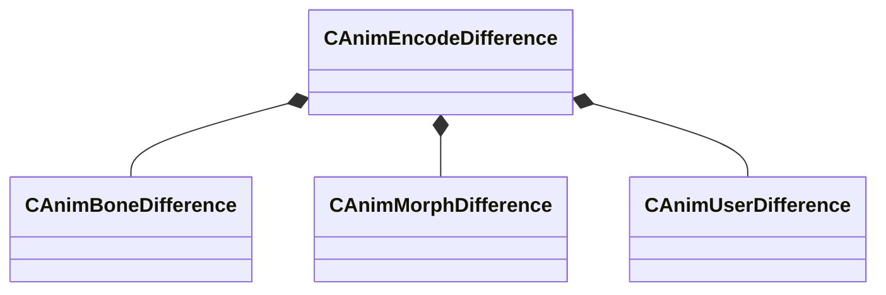

[Schemas](../../schemas.md) / [animationsystem](../animationsystem.md) / CAnimEncodeDifference

# CAnimEncodeDifference

**Kind:** class · **Size:** 168 bytes (`0xa8`) · **Align:** 8 · **Module:** animationsystem

**Relationships:**

## Memory layout

7 fields (7 declared here, 0 inherited). Offsets are absolute from the object base.

| Offset | Field | Type | From | Annotations |
|--------|-------|------|------|-------------|
| `0x0` | `m_boneArray` | CUtlVector< [CAnimBoneDifference](../animationsystem/CAnimBoneDifference.md) > |  |  |
| `0x18` | `m_morphArray` | CUtlVector< [CAnimMorphDifference](../animationsystem/CAnimMorphDifference.md) > |  |  |
| `0x30` | `m_userArray` | CUtlVector< [CAnimUserDifference](../animationsystem/CAnimUserDifference.md) > |  |  |
| `0x48` | `m_bHasRotationBitArray` | CUtlVector< uint8 > |  |  |
| `0x60` | `m_bHasMovementBitArray` | CUtlVector< uint8 > |  |  |
| `0x78` | `m_bHasMorphBitArray` | CUtlVector< uint8 > |  |  |
| `0x90` | `m_bHasUserBitArray` | CUtlVector< uint8 > |  |  |

KV3 class defaults

<pre>{
	&quot;m_boneArray&quot;:
	[
	],
	&quot;m_morphArray&quot;:
	[
	],
	&quot;m_userArray&quot;:
	[
	],
	&quot;m_bHasRotationBitArray&quot;:
	[
	],
	&quot;m_bHasMovementBitArray&quot;:
	[
	],
	&quot;m_bHasMorphBitArray&quot;:
	[
	],
	&quot;m_bHasUserBitArray&quot;:
	[
	]
}</pre>

