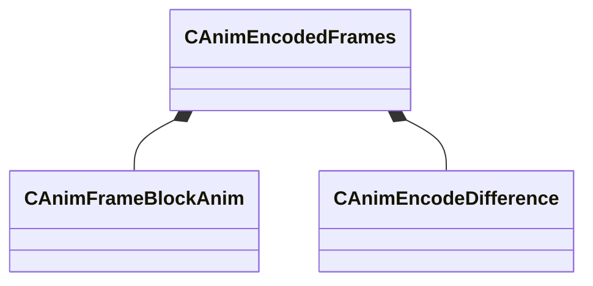

[Schemas](../../schemas.md) / [animationsystem](../animationsystem.md) / CAnimEncodedFrames

# CAnimEncodedFrames

> Source: **Build 25000182** · 2026-08-28 · `windows-x86_64` · schema `0.10.0`

**Kind:** class · **Size:** 216 bytes (`0xd8`) · **Align:** 8 · **Module:** animationsystem

**Relationships:**

## Memory layout

5 fields (5 declared here, 0 inherited). Offsets are absolute from the object base.

| Offset | Field | Type | From | Annotations |
|--------|-------|------|------|-------------|
| `0x0` | `m_fileName` | CBufferString |  |  |
| `0x10` | `m_nFrames` | int32 |  |  |
| `0x14` | `m_nFramesPerBlock` | int32 |  |  |
| `0x18` | `m_frameblockArray` | CUtlVector< [CAnimFrameBlockAnim](../animationsystem/CAnimFrameBlockAnim.md) > |  |  |
| `0x30` | `m_usageDifferences` | [CAnimEncodeDifference](../animationsystem/CAnimEncodeDifference.md) |  |  |

KV3 class defaults

<pre>{
	&quot;m_fileName&quot;: &quot;&quot;,
	&quot;m_nFrames&quot;: 0,
	&quot;m_nFramesPerBlock&quot;: 0,
	&quot;m_frameblockArray&quot;:
	[
	],
	&quot;m_usageDifferences&quot;:
	{
		&quot;m_boneArray&quot;:
		[
		],
		&quot;m_morphArray&quot;:
		[
		],
		&quot;m_userArray&quot;:
		[
		],
		&quot;m_bHasRotationBitArray&quot;:
		[
		],
		&quot;m_bHasMovementBitArray&quot;:
		[
		],
		&quot;m_bHasMorphBitArray&quot;:
		[
		],
		&quot;m_bHasUserBitArray&quot;:
		[
		]
	}
}</pre>

