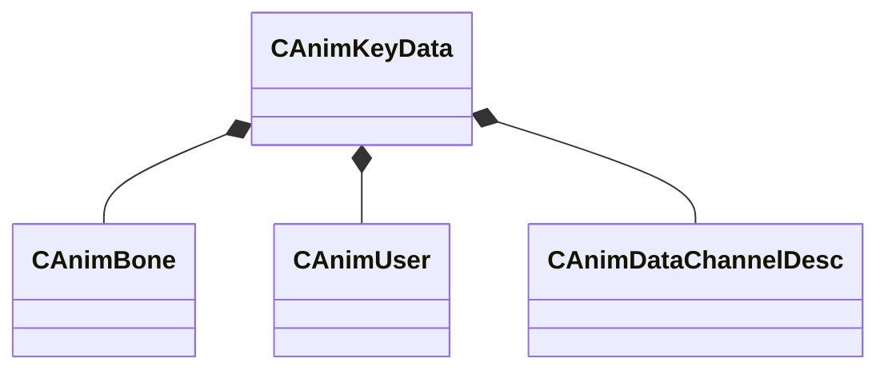

[Schemas](../../schemas.md) / [animationsystem](../animationsystem.md) / CAnimKeyData

# CAnimKeyData

> Source: **Build 25000182** · 2026-08-28 · `windows-x86_64` · schema `0.10.0`

**Kind:** class · **Size:** 120 bytes (`0x78`) · **Align:** 8 · **Module:** animationsystem

**Relationships:**

## Memory layout

6 fields (6 declared here, 0 inherited). Offsets are absolute from the object base.

| Offset | Field | Type | From | Annotations |
|--------|-------|------|------|-------------|
| `0x0` | `m_name` | CBufferString |  |  |
| `0x10` | `m_boneArray` | CUtlVector< [CAnimBone](../animationsystem/CAnimBone.md) > |  |  |
| `0x28` | `m_userArray` | CUtlVector< [CAnimUser](../animationsystem/CAnimUser.md) > |  |  |
| `0x40` | `m_morphArray` | CUtlVector< CBufferString > |  |  |
| `0x58` | `m_nChannelElements` | int32 |  |  |
| `0x60` | `m_dataChannelArray` | CUtlVector< [CAnimDataChannelDesc](../animationsystem/CAnimDataChannelDesc.md) > |  |  |

KV3 class defaults

<pre>{
	&quot;m_name&quot;: &quot;&quot;,
	&quot;m_boneArray&quot;:
	[
	],
	&quot;m_userArray&quot;:
	[
	],
	&quot;m_morphArray&quot;:
	[
	],
	&quot;m_nChannelElements&quot;: 0,
	&quot;m_dataChannelArray&quot;:
	[
	]
}</pre>

