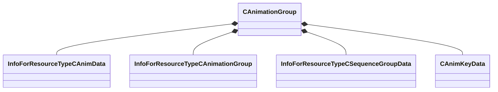

[Schemas](../../schemas.md) / [animationsystem](../animationsystem.md) / CAnimationGroup

# CAnimationGroup

**Kind:** class · **Size:** 328 bytes (`0x148`) · **Align:** 8 · **Module:** animationsystem

**Relationships:**

## Memory layout

8 fields (8 declared here, 0 inherited). Offsets are absolute from the object base.

| Offset | Field | Type | From | Annotations |
|--------|-------|------|------|-------------|
| `0x10` | `m_nFlags` | uint32 |  |  |
| `0x18` | `m_name` | CBufferString |  |  |
| `0x60` | `m_localHAnimArray_Handle` | CUtlVector< CStrongHandle< [InfoForResourceTypeCAnimData](../resourcesystem/InfoForResourceTypeCAnimData.md) > > |  | `MKV3TransferName m_localHAnimArray` |
| `0x78` | `m_includedGroupArray_Handle` | CUtlVector< CStrongHandle< [InfoForResourceTypeCAnimationGroup](../resourcesystem/InfoForResourceTypeCAnimationGroup.md) > > |  | `MKV3TransferName m_includedGroupArray` |
| `0x90` | `m_directHSeqGroup_Handle` | CStrongHandle< [InfoForResourceTypeCSequenceGroupData](../resourcesystem/InfoForResourceTypeCSequenceGroupData.md) > |  | `MKV3TransferName m_directHSeqGroup` |
| `0x98` | `m_decodeKey` | [CAnimKeyData](../animationsystem/CAnimKeyData.md) |  |  |
| `0x110` | `m_szScripts` | CUtlVector< CBufferString > |  |  |
| `0x128` | `m_AdditionalExtRefs` | CUtlVector< CStrongHandleVoid > |  |  |

KV3 class defaults

<pre>{
	&quot;m_nFlags&quot;: 0,
	&quot;m_name&quot;: &quot;&quot;,
	&quot;m_localHAnimArray&quot;:
	[
	],
	&quot;m_includedGroupArray&quot;:
	[
	],
	&quot;m_directHSeqGroup&quot;: &quot;&quot;,
	&quot;m_decodeKey&quot;:
	{
		&quot;m_name&quot;: &quot;&quot;,
		&quot;m_boneArray&quot;:
		[
		],
		&quot;m_userArray&quot;:
		[
		],
		&quot;m_morphArray&quot;:
		[
		],
		&quot;m_nChannelElements&quot;: 0,
		&quot;m_dataChannelArray&quot;:
		[
		]
	},
	&quot;m_szScripts&quot;:
	[
	],
	&quot;m_AdditionalExtRefs&quot;:
	[
	]
}</pre>

