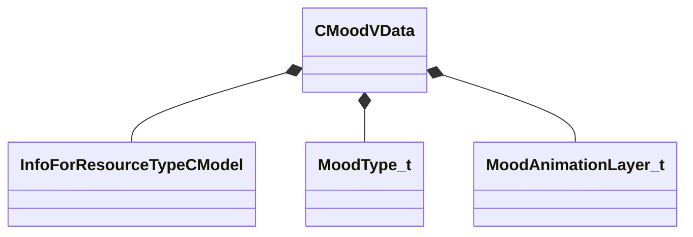

[Schemas](../../schemas.md) / [animationsystem](../animationsystem.md) / CMoodVData

# CMoodVData

> Source: **Build 25000182** · 2026-08-28 · `windows-x86_64` · schema `0.10.0`

**Kind:** class · **Size:** 256 bytes (`0x100`) · **Align:** 8 · **Module:** animationsystem

**Metadata:** `MVDataOverlayType 1`, `MVDataRoot`

**Relationships:**

## Memory layout

3 fields (3 declared here, 0 inherited). Offsets are absolute from the object base.

| Offset | Field | Type | From | Annotations |
|--------|-------|------|------|-------------|
| `0x0` | `m_sModelName` | CResourceNameTyped< CWeakHandle< [InfoForResourceTypeCModel](../resourcesystem/InfoForResourceTypeCModel.md) > > |  | `MPropertyDescription Model to get the animation list from` `MPropertyProvidesEditContextString ToolEditContext_ID_VMDL` |
| `0xe0` | `m_nMoodType` | [MoodType_t](../animationsystem/MoodType_t.md) |  | `MPropertyDescription Type of mood` |
| `0xe8` | `m_animationLayers` | CUtlVector< [MoodAnimationLayer_t](../animationsystem/MoodAnimationLayer_t.md) > |  | `MPropertyDescription Layers for this mood` |

KV3 class defaults

<pre>{
	&quot;m_sModelName&quot;: &quot;&quot;,
	&quot;m_nMoodType&quot;: &quot;eMoodType_Head&quot;,
	&quot;m_animationLayers&quot;:
	[
	]
}</pre>

