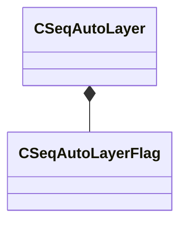

[Schemas](../../schemas.md) / [animationsystem](../animationsystem.md) / CSeqAutoLayer

# CSeqAutoLayer

> Source: **Build 25000182** · 2026-08-28 · `windows-x86_64` · schema `0.10.0`

**Kind:** class · **Size:** 28 bytes (`0x1c`) · **Align:** 4 · **Module:** animationsystem

**Relationships:**

## Memory layout

7 fields (7 declared here, 0 inherited). Offsets are absolute from the object base.

| Offset | Field | Type | From | Annotations |
|--------|-------|------|------|-------------|
| `0x0` | `m_nLocalReference` | int16 |  |  |
| `0x2` | `m_nLocalPose` | int16 |  |  |
| `0x4` | `m_flags` | [CSeqAutoLayerFlag](../animationsystem/CSeqAutoLayerFlag.md) |  |  |
| `0xc` | `m_start` | float32 |  |  |
| `0x10` | `m_peak` | float32 |  |  |
| `0x14` | `m_tail` | float32 |  |  |
| `0x18` | `m_end` | float32 |  |  |

KV3 class defaults

<pre>{
	&quot;m_nLocalReference&quot;: 0,
	&quot;m_nLocalPose&quot;: 0,
	&quot;m_flags&quot;:
	{
		&quot;m_bPost&quot;: false,
		&quot;m_bSpline&quot;: false,
		&quot;m_bXFade&quot;: false,
		&quot;m_bNoBlend&quot;: false,
		&quot;m_bLocal&quot;: false,
		&quot;m_bPose&quot;: false,
		&quot;m_bFetchFrame&quot;: false,
		&quot;m_bSubtract&quot;: false
	},
	&quot;m_start&quot;: 0.000000,
	&quot;m_peak&quot;: 0.000000,
	&quot;m_tail&quot;: 0.000000,
	&quot;m_end&quot;: 0.000000
}</pre>

