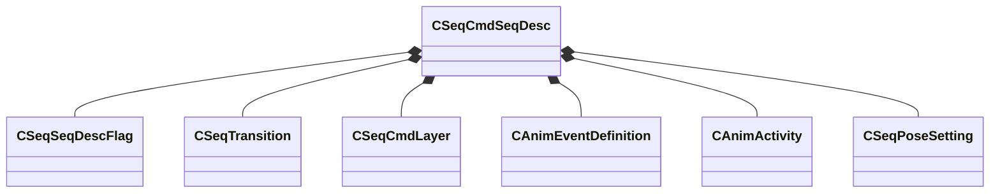

[Schemas](../../schemas.md) / [animationsystem](../animationsystem.md) / CSeqCmdSeqDesc

# CSeqCmdSeqDesc

> Source: **Build 25000182** · 2026-08-28 · `windows-x86_64` · schema `0.10.0`

**Kind:** class · **Size:** 144 bytes (`0x90`) · **Align:** 8 · **Module:** animationsystem

**Relationships:**

## Memory layout

12 fields (12 declared here, 0 inherited). Offsets are absolute from the object base.

| Offset | Field | Type | From | Annotations |
|--------|-------|------|------|-------------|
| `0x0` | `m_sName` | CBufferString |  |  |
| `0x10` | `m_flags` | [CSeqSeqDescFlag](../animationsystem/CSeqSeqDescFlag.md) |  |  |
| `0x1c` | `m_transition` | [CSeqTransition](../animationsystem/CSeqTransition.md) |  |  |
| `0x24` | `m_nFrameRangeSequence` | int16 |  |  |
| `0x26` | `m_nFrameCount` | int16 |  |  |
| `0x28` | `m_flFPS` | float32 |  |  |
| `0x2c` | `m_nSubCycles` | int16 |  |  |
| `0x2e` | `m_numLocalResults` | int16 |  |  |
| `0x30` | `m_cmdLayerArray` | CUtlVector< [CSeqCmdLayer](../animationsystem/CSeqCmdLayer.md) > |  |  |
| `0x48` | `m_eventArray` | CUtlVector< [CAnimEventDefinition](../animationsystem/CAnimEventDefinition.md) > |  |  |
| `0x60` | `m_activityArray` | CUtlVector< [CAnimActivity](../animationsystem/CAnimActivity.md) > |  |  |
| `0x78` | `m_poseSettingArray` | CUtlVector< [CSeqPoseSetting](../animationsystem/CSeqPoseSetting.md) > |  |  |

KV3 class defaults

<pre>{
	&quot;m_sName&quot;: &quot;&quot;,
	&quot;m_flags&quot;:
	{
		&quot;m_bLooping&quot;: false,
		&quot;m_bSnap&quot;: false,
		&quot;m_bAutoplay&quot;: false,
		&quot;m_bPost&quot;: false,
		&quot;m_bHidden&quot;: false,
		&quot;m_bMulti&quot;: false,
		&quot;m_bLegacyDelta&quot;: false,
		&quot;m_bLegacyWorldspace&quot;: false,
		&quot;m_bLegacyCyclepose&quot;: false,
		&quot;m_bLegacyRealtime&quot;: false,
		&quot;m_bModelDoc&quot;: false
	},
	&quot;m_transition&quot;:
	{
		&quot;m_flFadeInTime&quot;: 0.000000,
		&quot;m_flFadeOutTime&quot;: 0.000000
	},
	&quot;m_nFrameRangeSequence&quot;: 0,
	&quot;m_nFrameCount&quot;: 0,
	&quot;m_flFPS&quot;: 30.000000,
	&quot;m_nSubCycles&quot;: 1,
	&quot;m_numLocalResults&quot;: 0,
	&quot;m_cmdLayerArray&quot;:
	[
	],
	&quot;m_eventArray&quot;:
	[
	],
	&quot;m_activityArray&quot;:
	[
	],
	&quot;m_poseSettingArray&quot;:
	[
	]
}</pre>

