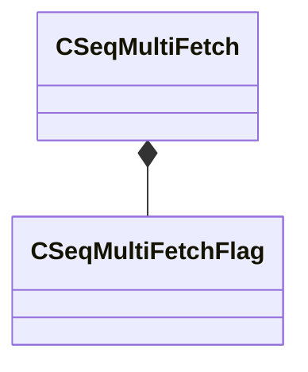

[Schemas](../../schemas.md) / [animationsystem](../animationsystem.md) / CSeqMultiFetch

# CSeqMultiFetch

> Source: **Build 25000182** · 2026-08-28 · `windows-x86_64` · schema `0.10.0`

**Kind:** class · **Size:** 112 bytes (`0x70`) · **Align:** 8 · **Module:** animationsystem

**Relationships:**

## Memory layout

10 fields (10 declared here, 0 inherited). Offsets are absolute from the object base.

| Offset | Field | Type | From | Annotations |
|--------|-------|------|------|-------------|
| `0x0` | `m_flags` | [CSeqMultiFetchFlag](../animationsystem/CSeqMultiFetchFlag.md) |  |  |
| `0x8` | `m_localReferenceArray` | CUtlVector< int16 > |  |  |
| `0x20` | `m_nGroupSize` | int32[2] |  |  |
| `0x28` | `m_nLocalPose` | int32[2] |  |  |
| `0x30` | `m_poseKeyArray0` | CUtlVector< float32 > |  |  |
| `0x48` | `m_poseKeyArray1` | CUtlVector< float32 > |  |  |
| `0x60` | `m_nLocalCyclePoseParameter` | int32 |  |  |
| `0x64` | `m_bCalculatePoseParameters` | bool |  |  |
| `0x65` | `m_bFixedBlendWeight` | bool |  |  |
| `0x68` | `m_flFixedBlendWeightVals` | float32[2] |  |  |

KV3 class defaults

<pre>{
	&quot;m_flags&quot;:
	{
		&quot;m_bRealtime&quot;: false,
		&quot;m_bCylepose&quot;: false,
		&quot;m_b0D&quot;: false,
		&quot;m_b1D&quot;: false,
		&quot;m_b2D&quot;: false,
		&quot;m_b2D_TRI&quot;: false
	},
	&quot;m_localReferenceArray&quot;:
	[
	],
	&quot;m_nGroupSize&quot;:
	[
		0,
		0
	],
	&quot;m_nLocalPose&quot;:
	[
		0,
		0
	],
	&quot;m_poseKeyArray0&quot;:
	[
	],
	&quot;m_poseKeyArray1&quot;:
	[
	],
	&quot;m_nLocalCyclePoseParameter&quot;: 0,
	&quot;m_bCalculatePoseParameters&quot;: false,
	&quot;m_bFixedBlendWeight&quot;: false,
	&quot;m_flFixedBlendWeightVals&quot;:
	[
		0.000000,
		0.000000
	]
}</pre>

