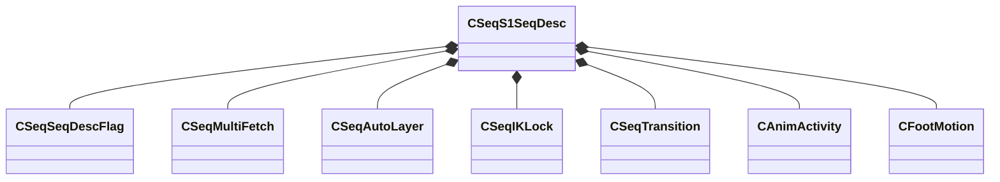

[Schemas](../../schemas.md) / [animationsystem](../animationsystem.md) / CSeqS1SeqDesc

# CSeqS1SeqDesc

> Source: **Build 25000182** · 2026-08-28 · `windows-x86_64` · schema `0.10.0`

**Kind:** class · **Size:** 288 bytes (`0x120`) · **Align:** 8 · **Module:** animationsystem

**Relationships:**

## Memory layout

11 fields (11 declared here, 0 inherited). Offsets are absolute from the object base.

| Offset | Field | Type | From | Annotations |
|--------|-------|------|------|-------------|
| `0x0` | `m_sName` | CBufferString |  |  |
| `0x10` | `m_flags` | [CSeqSeqDescFlag](../animationsystem/CSeqSeqDescFlag.md) |  |  |
| `0x20` | `m_fetch` | [CSeqMultiFetch](../animationsystem/CSeqMultiFetch.md) |  |  |
| `0x90` | `m_nLocalWeightlist` | int32 |  |  |
| `0x98` | `m_autoLayerArray` | CUtlVector< [CSeqAutoLayer](../animationsystem/CSeqAutoLayer.md) > |  |  |
| `0xb0` | `m_IKLockArray` | CUtlVector< [CSeqIKLock](../animationsystem/CSeqIKLock.md) > |  |  |
| `0xc8` | `m_transition` | [CSeqTransition](../animationsystem/CSeqTransition.md) |  |  |
| `0xd0` | `m_SequenceKeys` | KeyValues3 |  |  |
| `0xe0` | `m_LegacyKeyValueText` | CBufferString |  | `MKV3TransferName m_keyValueText` |
| `0xf0` | `m_activityArray` | CUtlVector< [CAnimActivity](../animationsystem/CAnimActivity.md) > |  |  |
| `0x108` | `m_footMotion` | CUtlVector< [CFootMotion](../modellib/CFootMotion.md) > |  |  |

KV3 class defaults

<pre>{
	&quot;m_sName&quot;: &quot;&quot;,
	&quot;m_flags&quot;:
	{
		&quot;m_bLooping&quot;: false,
		&quot;m_bSnap&quot;: false,
		&quot;m_bAutoplay&quot;: false,
		&quot;m_bPost&quot;: false,
		&quot;m_bHidden&quot;: false,
		&quot;m_bMulti&quot;: false,
		&quot;m_bLegacyDelta&quot;: false,
		&quot;m_bLegacyWorldspace&quot;: false,
		&quot;m_bLegacyCyclepose&quot;: false,
		&quot;m_bLegacyRealtime&quot;: false,
		&quot;m_bModelDoc&quot;: false
	},
	&quot;m_fetch&quot;:
	{
		&quot;m_flags&quot;:
		{
			&quot;m_bRealtime&quot;: false,
			&quot;m_bCylepose&quot;: false,
			&quot;m_b0D&quot;: false,
			&quot;m_b1D&quot;: false,
			&quot;m_b2D&quot;: false,
			&quot;m_b2D_TRI&quot;: false
		},
		&quot;m_localReferenceArray&quot;:
		[
		],
		&quot;m_nGroupSize&quot;:
		[
			0,
			0
		],
		&quot;m_nLocalPose&quot;:
		[
			0,
			0
		],
		&quot;m_poseKeyArray0&quot;:
		[
		],
		&quot;m_poseKeyArray1&quot;:
		[
		],
		&quot;m_nLocalCyclePoseParameter&quot;: 0,
		&quot;m_bCalculatePoseParameters&quot;: false,
		&quot;m_bFixedBlendWeight&quot;: false,
		&quot;m_flFixedBlendWeightVals&quot;:
		[
			0.000000,
			0.000000
		]
	},
	&quot;m_nLocalWeightlist&quot;: 0,
	&quot;m_autoLayerArray&quot;:
	[
	],
	&quot;m_IKLockArray&quot;:
	[
	],
	&quot;m_transition&quot;:
	{
		&quot;m_flFadeInTime&quot;: 0.000000,
		&quot;m_flFadeOutTime&quot;: 0.000000
	},
	&quot;m_SequenceKeys&quot;: null,
	&quot;m_keyValueText&quot;: &quot;&quot;,
	&quot;m_activityArray&quot;:
	[
	],
	&quot;m_footMotion&quot;:
	[
	]
}</pre>

