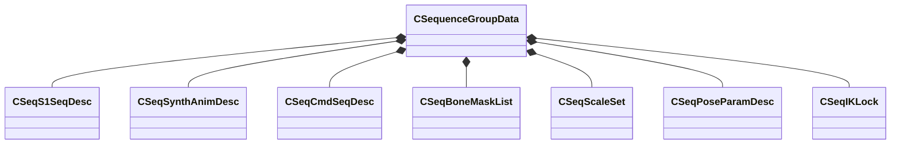

[Schemas](../../schemas.md) / [animationsystem](../animationsystem.md) / CSequenceGroupData

# CSequenceGroupData

> Source: **Build 25000182** · 2026-08-28 · `windows-x86_64` · schema `0.10.0`

**Kind:** class · **Size:** 312 bytes (`0x138`) · **Align:** 8 · **Module:** animationsystem

**Relationships:**

## Memory layout

14 fields (14 declared here, 0 inherited). Offsets are absolute from the object base.

| Offset | Field | Type | From | Annotations |
|--------|-------|------|------|-------------|
| `0x10` | `m_sName` | CBufferString |  |  |
| `0x20` | `m_nFlags` | uint32 |  |  |
| `0x28` | `m_localSequenceNameArray` | CUtlVector< CBufferString > |  |  |
| `0x40` | `m_localS1SeqDescArray` | CUtlVector< [CSeqS1SeqDesc](../animationsystem/CSeqS1SeqDesc.md) > |  |  |
| `0x58` | `m_localMultiSeqDescArray` | CUtlVector< [CSeqS1SeqDesc](../animationsystem/CSeqS1SeqDesc.md) > |  |  |
| `0x70` | `m_localSynthAnimDescArray` | CUtlVector< [CSeqSynthAnimDesc](../animationsystem/CSeqSynthAnimDesc.md) > |  |  |
| `0x88` | `m_localCmdSeqDescArray` | CUtlVector< [CSeqCmdSeqDesc](../animationsystem/CSeqCmdSeqDesc.md) > |  |  |
| `0xa0` | `m_localBoneMaskArray` | CUtlVector< [CSeqBoneMaskList](../animationsystem/CSeqBoneMaskList.md) > |  |  |
| `0xb8` | `m_localScaleSetArray` | CUtlVector< [CSeqScaleSet](../animationsystem/CSeqScaleSet.md) > |  |  |
| `0xd0` | `m_localBoneNameArray` | CUtlVector< CBufferString > |  |  |
| `0xe8` | `m_localNodeName` | CBufferString |  |  |
| `0xf8` | `m_localPoseParamArray` | CUtlVector< [CSeqPoseParamDesc](../animationsystem/CSeqPoseParamDesc.md) > |  |  |
| `0x110` | `m_keyValues` | KeyValues3 |  |  |
| `0x120` | `m_localIKAutoplayLockArray` | CUtlVector< [CSeqIKLock](../animationsystem/CSeqIKLock.md) > |  |  |

KV3 class defaults

<pre>{
	&quot;m_sName&quot;: &quot;&quot;,
	&quot;m_nFlags&quot;: 0,
	&quot;m_localSequenceNameArray&quot;:
	[
	],
	&quot;m_localS1SeqDescArray&quot;:
	[
	],
	&quot;m_localMultiSeqDescArray&quot;:
	[
	],
	&quot;m_localSynthAnimDescArray&quot;:
	[
	],
	&quot;m_localCmdSeqDescArray&quot;:
	[
	],
	&quot;m_localBoneMaskArray&quot;:
	[
	],
	&quot;m_localScaleSetArray&quot;:
	[
	],
	&quot;m_localBoneNameArray&quot;:
	[
	],
	&quot;m_localNodeName&quot;: &quot;&quot;,
	&quot;m_localPoseParamArray&quot;:
	[
	],
	&quot;m_keyValues&quot;: null,
	&quot;m_localIKAutoplayLockArray&quot;:
	[
	]
}</pre>

