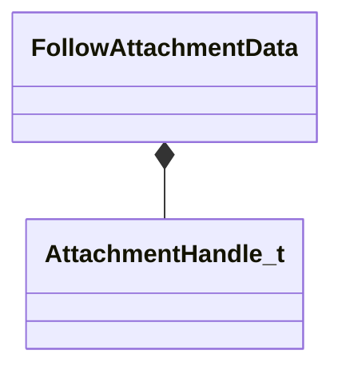

[Schemas](../../schemas.md) / [animationsystem](../animationsystem.md) / FollowAttachmentData

# FollowAttachmentData

**Kind:** class · **Size:** 8 bytes (`0x8`) · **Align:** 4 · **Module:** animationsystem

**Relationships:**

## Memory layout

2 fields (2 declared here, 0 inherited). Offsets are absolute from the object base.

| Offset | Field | Type | From | Annotations |
|--------|-------|------|------|-------------|
| `0x0` | `m_boneIndex` | int32 |  |  |
| `0x4` | `m_attachmentHandle` | [AttachmentHandle_t](../modellib/AttachmentHandle_t.md) |  |  |

KV3 class defaults

<pre>{
	&quot;m_boneIndex&quot;: 0,
	&quot;m_attachmentHandle&quot;: 0
}</pre>

