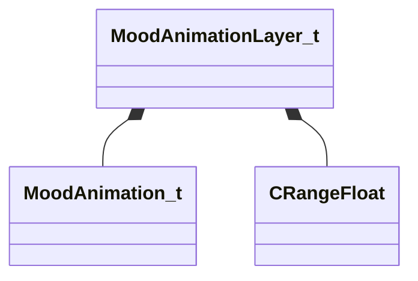

[Schemas](../../schemas.md) / [animationsystem](../animationsystem.md) / MoodAnimationLayer_t

# MoodAnimationLayer_t

> Source: **Build 25000182** · 2026-08-28 · `windows-x86_64` · schema `0.10.0`

**Kind:** class · **Size:** 96 bytes (`0x60`) · **Align:** 8 · **Module:** animationsystem

**Metadata:** `MPropertyArrayElementNameKey m_sName`

**Relationships:**

## Memory layout

12 fields (12 declared here, 0 inherited). Offsets are absolute from the object base.

| Offset | Field | Type | From | Annotations |
|--------|-------|------|------|-------------|
| `0x0` | `m_sName` | CUtlString |  | `MPropertyDescription Name of the layer` `MPropertyFriendlyName Name` |
| `0x8` | `m_bActiveListening` | bool |  | `MPropertyDescription Sets the mood's animation buckets to be active when the character is listening` `MPropertyFriendlyName Active When Listening` |
| `0x9` | `m_bActiveTalking` | bool |  | `MPropertyDescription Sets the mood's animation buckets to be active when the character is talking` `MPropertyFriendlyName Active When Talking` |
| `0x10` | `m_layerAnimations` | CUtlVector< [MoodAnimation_t](../animationsystem/MoodAnimation_t.md) > |  | `MPropertyDescription List of animations to choose from` |
| `0x28` | `m_flIntensity` | [CRangeFloat](../tier2/CRangeFloat.md) |  | `MPropertyAttributeRange 0 1` `MPropertyDescription Intensity of the animation` |
| `0x30` | `m_flDurationScale` | [CRangeFloat](../tier2/CRangeFloat.md) |  | `MPropertyDescription Multiplier of the animation duration` |
| `0x38` | `m_bScaleWithInts` | bool |  | `MPropertyDescription When scaling an animation, grab the scale value as in int. Used for gestures/postures to control number of looping sections` |
| `0x3c` | `m_flNextStart` | [CRangeFloat](../tier2/CRangeFloat.md) |  | `MPropertyDescription Time before the next animation can start` |
| `0x44` | `m_flStartOffset` | [CRangeFloat](../tier2/CRangeFloat.md) |  | `MPropertyDescription Time from the start of the mood before an animation can start` |
| `0x4c` | `m_flEndOffset` | [CRangeFloat](../tier2/CRangeFloat.md) |  | `MPropertyDescription Time from the end of the mood when an animation cannot play` |
| `0x54` | `m_flFadeIn` | float32 |  | `MPropertyDescription Fade in time of the animation` |
| `0x58` | `m_flFadeOut` | float32 |  | `MPropertyDescription Fade out time of the animation` |

KV3 class defaults

<pre>{
	&quot;m_sName&quot;: &quot;&quot;,
	&quot;m_bActiveListening&quot;: true,
	&quot;m_bActiveTalking&quot;: true,
	&quot;m_layerAnimations&quot;:
	[
	],
	&quot;m_flIntensity&quot;: 1.000000,
	&quot;m_flDurationScale&quot;: 1.000000,
	&quot;m_bScaleWithInts&quot;: false,
	&quot;m_flNextStart&quot;: 1.000000,
	&quot;m_flStartOffset&quot;: 0.000000,
	&quot;m_flEndOffset&quot;: 0.000000,
	&quot;m_flFadeIn&quot;: 0.200000,
	&quot;m_flFadeOut&quot;: 0.200000
}</pre>

