# Module: animdoclib

[📊 View UML Diagram](../diagrams/animdoclib.md)

| Name | Kind | Bases | Fields |
|------|------|-------|--------|
| [CNmAnimDocument](#cnmanimdocument) | class |  | 1 |
| [CNmBlendSpace1D](#cnmblendspace1d) | class |  | 1 |
| [CNmBlendSpace1D::Point_t](#cnmblendspace1dpoint_t) | class |  | 3 |
| [CNmBlendSpace2D](#cnmblendspace2d) | class |  | 4 |
| [CNmClipDocEvent](#cnmclipdocevent) | class |  | 2 |
| [CNmClipDocEventTrack](#cnmclipdoceventtrack) | class |  | 5 |
| [CNmClipDocEvent_BodyGroup](#cnmclipdocevent_bodygroup) | class | CNmClipDocEvent | 3 |
| [CNmClipDocEvent_EntityAttribute](#cnmclipdocevent_entityattribute) | class | CNmClipDocEvent | 5 |
| [CNmClipDocEvent_FloatCurve](#cnmclipdocevent_floatcurve) | class | CNmClipDocEvent | 2 |
| [CNmClipDocEvent_Foot](#cnmclipdocevent_foot) | class | CNmClipDocEvent | 1 |
| [CNmClipDocEvent_FrameSnap](#cnmclipdocevent_framesnap) | class | CNmClipDocEvent | 1 |
| [CNmClipDocEvent_ID](#cnmclipdocevent_id) | class | CNmClipDocEvent | 2 |
| [CNmClipDocEvent_Legacy](#cnmclipdocevent_legacy) | class | CNmClipDocEvent | 2 |
| [CNmClipDocEvent_MaterialAttribute](#cnmclipdocevent_materialattribute) | class | CNmClipDocEvent | 6 |
| [CNmClipDocEvent_OrientationWarp](#cnmclipdocevent_orientationwarp) | class | CNmClipDocEvent | 0 |
| [CNmClipDocEvent_Particle](#cnmclipdocevent_particle) | class | CNmClipDocEvent | 14 |
| [CNmClipDocEvent_RootMotion](#cnmclipdocevent_rootmotion) | class | CNmClipDocEvent | 1 |
| [CNmClipDocEvent_Sound](#cnmclipdocevent_sound) | class | CNmClipDocEvent | 7 |
| [CNmClipDocEvent_TargetWarp](#cnmclipdocevent_targetwarp) | class | CNmClipDocEvent | 2 |
| [CNmClipDocEvent_Transition](#cnmclipdocevent_transition) | class | CNmClipDocEvent | 2 |
| [CNmClipDocument](#cnmclipdocument) | class | CNmAnimDocument | 13 |
| [CNmGraphDocAndNode](#cnmgraphdocandnode) | class | CNmGraphDocFlowNode | 0 |
| [CNmGraphDocAnimationPoseNode](#cnmgraphdocanimationposenode) | class | CNmGraphDocVariationDataNode | 3 |
| [CNmGraphDocAnimationPoseNode::CData](#cnmgraphdocanimationposenodecdata) | class | CNmGraphDocVariationDataNode::CData | 2 |
| [CNmGraphDocBlend1DNode](#cnmgraphdocblend1dnode) | class | CNmGraphDocFlowNode | 2 |
| [CNmGraphDocBlend2DNode](#cnmgraphdocblend2dnode) | class | CNmGraphDocFlowNode | 2 |
| [CNmGraphDocBoneMaskBlendNode](#cnmgraphdocbonemaskblendnode) | class | CNmGraphDocFlowNode | 0 |
| [CNmGraphDocBoneMaskNode](#cnmgraphdocbonemasknode) | class | CNmGraphDocVariationDataNode | 2 |
| [CNmGraphDocBoneMaskNode::CData](#cnmgraphdocbonemasknodecdata) | class | CNmGraphDocVariationDataNode::CData | 1 |
| [CNmGraphDocBoneMaskParameterReferenceNode](#cnmgraphdocbonemaskparameterreferencenode) | class | CNmGraphDocParameterReferenceNode | 0 |
| [CNmGraphDocBoneMaskResultNode](#cnmgraphdocbonemaskresultnode) | class | CNmGraphDocResultNode | 0 |
| [CNmGraphDocBoneMaskSelectorNode](#cnmgraphdocbonemaskselectornode) | class | CNmGraphDocFlowNode | 3 |
| [CNmGraphDocBoneMaskSwitchNode](#cnmgraphdocbonemaskswitchnode) | class | CNmGraphDocFlowNode | 2 |
| [CNmGraphDocBoneMaskVirtualParameterNode](#cnmgraphdocbonemaskvirtualparameternode) | class | CNmGraphDocVirtualParameterNode | 0 |
| [CNmGraphDocBoolControlParameterNode](#cnmgraphdocboolcontrolparameternode) | class | CNmGraphDocControlParameterNode | 1 |
| [CNmGraphDocBoolParameterReferenceNode](#cnmgraphdocboolparameterreferencenode) | class | CNmGraphDocParameterReferenceNode | 0 |
| [CNmGraphDocBoolResultNode](#cnmgraphdocboolresultnode) | class | CNmGraphDocResultNode | 0 |
| [CNmGraphDocBoolVirtualParameterNode](#cnmgraphdocboolvirtualparameternode) | class | CNmGraphDocVirtualParameterNode | 0 |
| [CNmGraphDocCachedBoolNode](#cnmgraphdoccachedboolnode) | class | CNmGraphDocFlowNode | 1 |
| [CNmGraphDocCachedFloatNode](#cnmgraphdoccachedfloatnode) | class | CNmGraphDocFlowNode | 1 |
| [CNmGraphDocCachedIDNode](#cnmgraphdoccachedidnode) | class | CNmGraphDocFlowNode | 1 |
| [CNmGraphDocCachedTargetNode](#cnmgraphdoccachedtargetnode) | class | CNmGraphDocFlowNode | 1 |
| [CNmGraphDocCachedVectorNode](#cnmgraphdoccachedvectornode) | class | CNmGraphDocFlowNode | 1 |
| [CNmGraphDocClipNode](#cnmgraphdocclipnode) | class | CNmGraphDocVariationDataNode | 3 |
| [CNmGraphDocClipNode::CData](#cnmgraphdocclipnodecdata) | class | CNmGraphDocVariationDataNode::CData | 3 |
| [CNmGraphDocClipSelectorNode](#cnmgraphdocclipselectornode) | class | CNmGraphDocSelectorBaseNode | 0 |
| [CNmGraphDocCommentNode](#cnmgraphdoccommentnode) | class | CNmGraphDocNode | 3 |
| [CNmGraphDocControlParameterNode](#cnmgraphdoccontrolparameternode) | class | CNmGraphDocParameterBaseNode | 1 |
| [CNmGraphDocCurrentSyncEventIDNode](#cnmgraphdoccurrentsynceventidnode) | class | CNmGraphDocFlowNode | 0 |
| [CNmGraphDocCurrentSyncEventNode](#cnmgraphdoccurrentsynceventnode) | class | CNmGraphDocFlowNode | 1 |
| [CNmGraphDocDataDictionary](#cnmgraphdocdatadictionary) | class |  | 2 |
| [CNmGraphDocDataDictionary::IDSet_t](#cnmgraphdocdatadictionaryidset_t) | class |  | 3 |
| [CNmGraphDocDataDictionary::ParameterSet_t](#cnmgraphdocdatadictionaryparameterset_t) | class |  | 2 |
| [CNmGraphDocDataDictionary::Parameter_t](#cnmgraphdocdatadictionaryparameter_t) | class |  | 5 |
| [CNmGraphDocEntryOverrideNode](#cnmgraphdocentryoverridenode) | class | CNmGraphDocResultNode | 1 |
| [CNmGraphDocEntryStateOverrideConditionsNode](#cnmgraphdocentrystateoverrideconditionsnode) | class | CNmGraphDocResultNode | 1 |
| [CNmGraphDocEntryStateOverrideConduitNode](#cnmgraphdocentrystateoverrideconduitnode) | class | CNmGraphDocStateMachineGraphNode | 0 |
| [CNmGraphDocExternalGraphNode](#cnmgraphdocexternalgraphnode) | class | CNmGraphDocFlowNode | 0 |
| [CNmGraphDocExternalPoseNode](#cnmgraphdocexternalposenode) | class | CNmGraphDocFlowNode | 1 |
| [CNmGraphDocFixedWeightBoneMaskNode](#cnmgraphdocfixedweightbonemasknode) | class | CNmGraphDocFlowNode | 1 |
| [CNmGraphDocFloatAngleMathNode](#cnmgraphdocfloatanglemathnode) | class | CNmGraphDocFlowNode | 1 |
| [CNmGraphDocFloatClampNode](#cnmgraphdocfloatclampnode) | class | CNmGraphDocFlowNode | 1 |
| [CNmGraphDocFloatComparisonNode](#cnmgraphdocfloatcomparisonnode) | class | CNmGraphDocFlowNode | 3 |
| [CNmGraphDocFloatControlParameterNode](#cnmgraphdocfloatcontrolparameternode) | class | CNmGraphDocControlParameterNode | 3 |
| [CNmGraphDocFloatCurveEventNode](#cnmgraphdocfloatcurveeventnode) | class | CNmGraphDocFlowNode | 5 |
| [CNmGraphDocFloatCurveNode](#cnmgraphdocfloatcurvenode) | class | CNmGraphDocFlowNode | 1 |
| [CNmGraphDocFloatEaseNode](#cnmgraphdocfloateasenode) | class | CNmGraphDocFlowNode | 4 |
| [CNmGraphDocFloatMathNode](#cnmgraphdocfloatmathnode) | class | CNmGraphDocFlowNode | 4 |
| [CNmGraphDocFloatParameterReferenceNode](#cnmgraphdocfloatparameterreferencenode) | class | CNmGraphDocParameterReferenceNode | 0 |
| [CNmGraphDocFloatRangeComparisonNode](#cnmgraphdocfloatrangecomparisonnode) | class | CNmGraphDocFlowNode | 2 |
| [CNmGraphDocFloatRemapNode](#cnmgraphdocfloatremapnode) | class | CNmGraphDocFlowNode | 2 |
| [CNmGraphDocFloatRemapNode::RemapRange_t](#cnmgraphdocfloatremapnoderemaprange_t) | class |  | 2 |
| [CNmGraphDocFloatResultNode](#cnmgraphdocfloatresultnode) | class | CNmGraphDocResultNode | 0 |
| [CNmGraphDocFloatSelectorNode](#cnmgraphdocfloatselectornode) | class | CNmGraphDocFlowNode | 4 |
| [CNmGraphDocFloatSelectorNode::Option_t](#cnmgraphdocfloatselectornodeoption_t) | class |  | 2 |
| [CNmGraphDocFloatSpringNode](#cnmgraphdocfloatspringnode) | class | CNmGraphDocFlowNode | 4 |
| [CNmGraphDocFloatSwitchNode](#cnmgraphdocfloatswitchnode) | class | CNmGraphDocFlowNode | 2 |
| [CNmGraphDocFloatVirtualParameterNode](#cnmgraphdocfloatvirtualparameternode) | class | CNmGraphDocVirtualParameterNode | 0 |
| [CNmGraphDocFlowGraph](#cnmgraphdocflowgraph) | class | CNmGraphDocGraph | 1 |
| [CNmGraphDocFlowGraph::Connection_t](#cnmgraphdocflowgraphconnection_t) | class |  | 5 |
| [CNmGraphDocFlowNode](#cnmgraphdocflownode) | class | CNmGraphDocNode | 2 |
| [CNmGraphDocFootEventConditionNode](#cnmgraphdocfooteventconditionnode) | class | CNmGraphDocFlowNode | 3 |
| [CNmGraphDocFootstepEventIDNode](#cnmgraphdocfootstepeventidnode) | class | CNmGraphDocFlowNode | 3 |
| [CNmGraphDocFootstepEventPercentageThroughNode](#cnmgraphdocfootstepeventpercentagethroughnode) | class | CNmGraphDocFlowNode | 4 |
| [CNmGraphDocGlobalTransitionConduitNode](#cnmgraphdocglobaltransitionconduitnode) | class | CNmGraphDocStateMachineGraphNode | 0 |
| [CNmGraphDocGlobalTransitionNode](#cnmgraphdocglobaltransitionnode) | class | CNmGraphDocTransitionNode | 1 |
| [CNmGraphDocGraph](#cnmgraphdocgraph) | class |  | 5 |
| [CNmGraphDocGraphEventConditionNode](#cnmgraphdocgrapheventconditionnode) | class | CNmGraphDocFlowNode | 4 |
| [CNmGraphDocGraphEventConditionNode::Condition_t](#cnmgraphdocgrapheventconditionnodecondition_t) | class |  | 2 |
| [CNmGraphDocIDBasedClipSelectorNode](#cnmgraphdocidbasedclipselectornode) | class | CNmGraphDocFlowNode | 2 |
| [CNmGraphDocIDBasedSelectorNode](#cnmgraphdocidbasedselectornode) | class | CNmGraphDocFlowNode | 2 |
| [CNmGraphDocIDComparisonNode](#cnmgraphdocidcomparisonnode) | class | CNmGraphDocFlowNode | 2 |
| [CNmGraphDocIDControlParameterNode](#cnmgraphdocidcontrolparameternode) | class | CNmGraphDocControlParameterNode | 2 |
| [CNmGraphDocIDEventConditionNode](#cnmgraphdocideventconditionnode) | class | CNmGraphDocFlowNode | 5 |
| [CNmGraphDocIDEventNode](#cnmgraphdocideventnode) | class | CNmGraphDocFlowNode | 4 |
| [CNmGraphDocIDEventPercentageThroughNode](#cnmgraphdocideventpercentagethroughnode) | class | CNmGraphDocFlowNode | 4 |
| [CNmGraphDocIDParameterReferenceNode](#cnmgraphdocidparameterreferencenode) | class | CNmGraphDocParameterReferenceNode | 0 |
| [CNmGraphDocIDResultNode](#cnmgraphdocidresultnode) | class | CNmGraphDocResultNode | 0 |
| [CNmGraphDocIDSelectorNode](#cnmgraphdocidselectornode) | class | CNmGraphDocFlowNode | 2 |
| [CNmGraphDocIDSwitchNode](#cnmgraphdocidswitchnode) | class | CNmGraphDocFlowNode | 2 |
| [CNmGraphDocIDToFloatNode](#cnmgraphdocidtofloatnode) | class | CNmGraphDocFlowNode | 2 |
| [CNmGraphDocIDToFloatNode::Mapping_t](#cnmgraphdocidtofloatnodemapping_t) | class |  | 2 |
| [CNmGraphDocIDVirtualParameterNode](#cnmgraphdocidvirtualparameternode) | class | CNmGraphDocVirtualParameterNode | 0 |
| [CNmGraphDocIsExternalGraphSlotFilledNode](#cnmgraphdocisexternalgraphslotfillednode) | class | CNmGraphDocFlowNode | 1 |
| [CNmGraphDocIsExternalPoseSetNode](#cnmgraphdocisexternalposesetnode) | class | CNmGraphDocFlowNode | 1 |
| [CNmGraphDocIsInactiveBranchConditionNode](#cnmgraphdocisinactivebranchconditionnode) | class | CNmGraphDocFlowNode | 0 |
| [CNmGraphDocIsTargetSetNode](#cnmgraphdocistargetsetnode) | class | CNmGraphDocFlowNode | 0 |
| [CNmGraphDocLayerBaseNode](#cnmgraphdoclayerbasenode) | class | CNmGraphDocFlowNode | 3 |
| [CNmGraphDocLayerBlendNode](#cnmgraphdoclayerblendnode) | class | CNmGraphDocFlowNode | 1 |
| [CNmGraphDocLocalLayerNode](#cnmgraphdoclocallayernode) | class | CNmGraphDocLayerBaseNode | 0 |
| [CNmGraphDocNode](#cnmgraphdocnode) | class |  | 6 |
| [CNmGraphDocNotNode](#cnmgraphdocnotnode) | class | CNmGraphDocFlowNode | 0 |
| [CNmGraphDocOrNode](#cnmgraphdocornode) | class | CNmGraphDocFlowNode | 0 |
| [CNmGraphDocOrientationWarpNode](#cnmgraphdocorientationwarpnode) | class | CNmGraphDocFlowNode | 3 |
| [CNmGraphDocParameterBaseNode](#cnmgraphdocparameterbasenode) | class | CNmGraphDocFlowNode | 1 |
| [CNmGraphDocParameterReferenceNode](#cnmgraphdocparameterreferencenode) | class | CNmGraphDocFlowNode | 4 |
| [CNmGraphDocParameterizedClipSelectorNode](#cnmgraphdocparameterizedclipselectornode) | class | CNmGraphDocVariationDataNode | 2 |
| [CNmGraphDocParameterizedClipSelectorNode::CData](#cnmgraphdocparameterizedclipselectornodecdata) | class | CNmGraphDocVariationDataNode::CData | 1 |
| [CNmGraphDocParameterizedSelectorNode](#cnmgraphdocparameterizedselectornode) | class | CNmGraphDocVariationDataNode | 2 |
| [CNmGraphDocParameterizedSelectorNode::CData](#cnmgraphdocparameterizedselectornodecdata) | class | CNmGraphDocVariationDataNode::CData | 1 |
| [CNmGraphDocPoseResultNode](#cnmgraphdocposeresultnode) | class | CNmGraphDocResultNode | 0 |
| [CNmGraphDocReferencePoseNode](#cnmgraphdocreferenceposenode) | class | CNmGraphDocFlowNode | 0 |
| [CNmGraphDocReferencedGraphNode](#cnmgraphdocreferencedgraphnode) | class | CNmGraphDocVariationDataNode | 0 |
| [CNmGraphDocReferencedGraphNode::CData](#cnmgraphdocreferencedgraphnodecdata) | class | CNmGraphDocVariationDataNode::CData | 1 |
| [CNmGraphDocResultNode](#cnmgraphdocresultnode) | class | CNmGraphDocFlowNode | 1 |
| [CNmGraphDocRootMotionOverrideNode](#cnmgraphdocrootmotionoverridenode) | class | CNmGraphDocFlowNode | 7 |
| [CNmGraphDocScaleNode](#cnmgraphdocscalenode) | class | CNmGraphDocFlowNode | 0 |
| [CNmGraphDocSelectorBaseNode](#cnmgraphdocselectorbasenode) | class | CNmGraphDocFlowNode | 1 |
| [CNmGraphDocSelectorConditionNode](#cnmgraphdocselectorconditionnode) | class | CNmGraphDocResultNode | 0 |
| [CNmGraphDocSelectorNode](#cnmgraphdocselectornode) | class | CNmGraphDocSelectorBaseNode | 0 |
| [CNmGraphDocStateCompletedConditionNode](#cnmgraphdocstatecompletedconditionnode) | class | CNmGraphDocFlowNode | 0 |
| [CNmGraphDocStateLayerDataNode](#cnmgraphdocstatelayerdatanode) | class | CNmGraphDocResultNode | 0 |
| [CNmGraphDocStateMachineGraph](#cnmgraphdocstatemachinegraph) | class | CNmGraphDocGraph | 1 |
| [CNmGraphDocStateMachineGraphNode](#cnmgraphdocstatemachinegraphnode) | class | CNmGraphDocNode | 0 |
| [CNmGraphDocStateMachineLayerNode](#cnmgraphdocstatemachinelayernode) | class | CNmGraphDocLayerBaseNode | 0 |
| [CNmGraphDocStateMachineNode](#cnmgraphdocstatemachinenode) | class | CNmGraphDocFlowNode | 0 |
| [CNmGraphDocStateNode](#cnmgraphdocstatenode) | class | CNmGraphDocStateMachineGraphNode | 11 |
| [CNmGraphDocStateNode::StateEvent_t](#cnmgraphdocstatenodestateevent_t) | class |  | 4 |
| [CNmGraphDocStateNode::TimedStateEvent_t](#cnmgraphdocstatenodetimedstateevent_t) | class |  | 4 |
| [CNmGraphDocSyncEventIndexConditionNode](#cnmgraphdocsynceventindexconditionnode) | class | CNmGraphDocFlowNode | 2 |
| [CNmGraphDocTargetControlParameterNode](#cnmgraphdoctargetcontrolparameternode) | class | CNmGraphDocControlParameterNode | 5 |
| [CNmGraphDocTargetInfoNode](#cnmgraphdoctargetinfonode) | class | CNmGraphDocFlowNode | 2 |
| [CNmGraphDocTargetOffsetNode](#cnmgraphdoctargetoffsetnode) | class | CNmGraphDocFlowNode | 3 |
| [CNmGraphDocTargetParameterReferenceNode](#cnmgraphdoctargetparameterreferencenode) | class | CNmGraphDocParameterReferenceNode | 0 |
| [CNmGraphDocTargetPointNode](#cnmgraphdoctargetpointnode) | class | CNmGraphDocFlowNode | 1 |
| [CNmGraphDocTargetResultNode](#cnmgraphdoctargetresultnode) | class | CNmGraphDocResultNode | 0 |
| [CNmGraphDocTargetSelectorNode](#cnmgraphdoctargetselectornode) | class | CNmGraphDocFlowNode | 5 |
| [CNmGraphDocTargetVirtualParameterNode](#cnmgraphdoctargetvirtualparameternode) | class | CNmGraphDocVirtualParameterNode | 0 |
| [CNmGraphDocTargetWarpNode](#cnmgraphdoctargetwarpnode) | class | CNmGraphDocVariationDataNode | 9 |
| [CNmGraphDocTargetWarpNode::CData](#cnmgraphdoctargetwarpnodecdata) | class | CNmGraphDocVariationDataNode::CData | 1 |
| [CNmGraphDocTimeConditionNode](#cnmgraphdoctimeconditionnode) | class | CNmGraphDocFlowNode | 3 |
| [CNmGraphDocTransitionConduitNode](#cnmgraphdoctransitionconduitnode) | class | CNmGraphDocStateMachineGraphNode | 2 |
| [CNmGraphDocTransitionEventConditionNode](#cnmgraphdoctransitioneventconditionnode) | class | CNmGraphDocFlowNode | 5 |
| [CNmGraphDocTransitionNode](#cnmgraphdoctransitionnode) | class | CNmGraphDocResultNode | 8 |
| [CNmGraphDocVariationDataNode](#cnmgraphdocvariationdatanode) | class | CNmGraphDocFlowNode | 3 |
| [CNmGraphDocVariationDataNode::CData](#cnmgraphdocvariationdatanodecdata) | class |  | 0 |
| [CNmGraphDocVariationDataNode::OverrideValue_t](#cnmgraphdocvariationdatanodeoverridevalue_t) | class |  | 2 |
| [CNmGraphDocVariationIDComparisonNode](#cnmgraphdocvariationidcomparisonnode) | class | CNmGraphDocVariationDataNode | 1 |
| [CNmGraphDocVariationIDComparisonNode::CData](#cnmgraphdocvariationidcomparisonnodecdata) | class | CNmGraphDocVariationDataNode::CData | 1 |
| [CNmGraphDocVectorControlParameterNode](#cnmgraphdocvectorcontrolparameternode) | class | CNmGraphDocControlParameterNode | 1 |
| [CNmGraphDocVectorCreateNode](#cnmgraphdocvectorcreatenode) | class | CNmGraphDocFlowNode | 0 |
| [CNmGraphDocVectorInfoNode](#cnmgraphdocvectorinfonode) | class | CNmGraphDocFlowNode | 1 |
| [CNmGraphDocVectorNegateNode](#cnmgraphdocvectornegatenode) | class | CNmGraphDocFlowNode | 0 |
| [CNmGraphDocVectorParameterReferenceNode](#cnmgraphdocvectorparameterreferencenode) | class | CNmGraphDocParameterReferenceNode | 0 |
| [CNmGraphDocVectorResultNode](#cnmgraphdocvectorresultnode) | class | CNmGraphDocResultNode | 0 |
| [CNmGraphDocVectorVirtualParameterNode](#cnmgraphdocvectorvirtualparameternode) | class | CNmGraphDocVirtualParameterNode | 0 |
| [CNmGraphDocVelocityBlendNode](#cnmgraphdocvelocityblendnode) | class | CNmGraphDocFlowNode | 1 |
| [CNmGraphDocVirtualParameterNode](#cnmgraphdocvirtualparameternode) | class | CNmGraphDocParameterBaseNode | 0 |
| [CNmGraphDocZeroPoseNode](#cnmgraphdoczeroposenode) | class | CNmGraphDocFlowNode | 0 |
| [CNmGraphDocument](#cnmgraphdocument) | class | CNmAnimDocument | 4 |
| [CNmGraphDocument::DebugParameterSet_t](#cnmgraphdocumentdebugparameterset_t) | class |  | 6 |
| [CNmPreviewArchetype](#cnmpreviewarchetype) | class |  | 4 |
| [CNmPreviewArchetype::SecondarySkeleton_t](#cnmpreviewarchetypesecondaryskeleton_t) | class |  | 4 |
| [CNmSkeletonDocument](#cnmskeletondocument) | class | CNmAnimDocument | 11 |
| [CNmSkeletonDocument::SecondarySkeleton_t](#cnmskeletondocumentsecondaryskeleton_t) | class |  | 2 |
| [CNmVariationHierarchy](#cnmvariationhierarchy) | class |  | 1 |
| [CnmGraphDocChainLookatNode](#cnmgraphdocchainlookatnode) | class | CNmGraphDocVariationDataNode | 1 |
| [CnmGraphDocChainLookatNode::CData](#cnmgraphdocchainlookatnodecdata) | class | CNmGraphDocVariationDataNode::CData | 6 |
| [CnmGraphDocConstBoneTargetNode](#cnmgraphdocconstbonetargetnode) | class | CNmGraphDocFlowNode | 1 |
| [CnmGraphDocConstBoolNode](#cnmgraphdocconstboolnode) | class | CNmGraphDocFlowNode | 1 |
| [CnmGraphDocConstFloatNode](#cnmgraphdocconstfloatnode) | class | CNmGraphDocFlowNode | 1 |
| [CnmGraphDocConstIDNode](#cnmgraphdocconstidnode) | class | CNmGraphDocFlowNode | 1 |
| [CnmGraphDocConstTargetNode](#cnmgraphdocconsttargetnode) | class | CNmGraphDocFlowNode | 2 |
| [CnmGraphDocConstVectorNode](#cnmgraphdocconstvectornode) | class | CNmGraphDocFlowNode | 1 |
| [CnmGraphDocDurationScaleNode](#cnmgraphdocdurationscalenode) | class | CNmGraphDocFlowNode | 1 |
| [CnmGraphDocFollowBoneNode](#cnmgraphdocfollowbonenode) | class | CNmGraphDocVariationDataNode | 1 |
| [CnmGraphDocFollowBoneNode::CData](#cnmgraphdocfollowbonenodecdata) | class | CNmGraphDocVariationDataNode::CData | 2 |
| [CnmGraphDocFootIKNode](#cnmgraphdocfootiknode) | class | CNmGraphDocVariationDataNode | 2 |
| [CnmGraphDocFootIKNode::CData](#cnmgraphdocfootiknodecdata) | class | CNmGraphDocVariationDataNode::CData | 3 |
| [CnmGraphDocSpeedScaleNode](#cnmgraphdocspeedscalenode) | class | CNmGraphDocFlowNode | 1 |
| [CnmGraphDocTwoBoneIKNode](#cnmgraphdoctwoboneiknode) | class | CNmGraphDocVariationDataNode | 3 |
| [CnmGraphDocTwoBoneIKNode::CData](#cnmgraphdoctwoboneiknodecdata) | class | CNmGraphDocVariationDataNode::CData | 2 |
| [CnmGraphDocVariationConstFloatNode](#cnmgraphdocvariationconstfloatnode) | class | CNmGraphDocVariationDataNode | 0 |
| [CnmGraphDocVariationConstFloatNode::CData](#cnmgraphdocvariationconstfloatnodecdata) | class | CNmGraphDocVariationDataNode::CData | 1 |
| [CnmGraphDocVelocityBasedSpeedScaleNode](#cnmgraphdocvelocitybasedspeedscalenode) | class | CNmGraphDocFlowNode | 1 |
| [NmGraphDocPin_t](#nmgraphdocpin_t) | class |  | 5 |
| [NmVariation_t](#nmvariation_t) | class |  | 4 |

---

### CNmAnimDocument

**Derived by:** [CNmClipDocument](animdoclib.md#cnmclipdocument), [CNmGraphDocument](animdoclib.md#cnmgraphdocument), [CNmSkeletonDocument](animdoclib.md#cnmskeletondocument)

**Metadata:** `MGetKV3ClassDefaults`

**Relationships:**

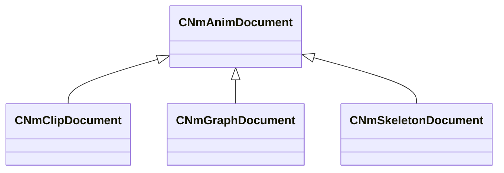
```mermaid
classDiagram
    CNmAnimDocument <|-- CNmClipDocument
    CNmAnimDocument <|-- CNmGraphDocument
    CNmAnimDocument <|-- CNmSkeletonDocument
```

**Fields:**

| Name | Type | Annotations |
|------|------|-------------|
| `m_nVersion` | int32 | `MPropertySuppressField` |

### CNmBlendSpace1D

**Metadata:** `MGetKV3ClassDefaults`

**Fields:**

| Name | Type | Annotations |
|------|------|-------------|
| `m_points` | CUtlVector< [CNmBlendSpace1D](../schemas/animdoclib.md#cnmblendspace1d)::Point_t > | `MPropertyAutoExpandSelf` `MPropertyResizable` |

### CNmBlendSpace1D::Point_t

**Metadata:** `MGetKV3ClassDefaults`

**Fields:**

| Name | Type | Annotations |
|------|------|-------------|
| `m_name` | CUtlString |  |
| `m_flValue` | float32 |  |
| `m_pinID` | V_uuid_t | `MPropertySuppressField` |

### CNmBlendSpace2D

**Metadata:** `MGetKV3ClassDefaults`

**Fields:**

| Name | Type | Annotations |
|------|------|-------------|
| `m_pointNames` | CUtlVector< CUtlString > | `MPropertyAutoExpandSelf` `MPropertyResizable` |
| `m_points` | CUtlVector< Vector2D > | `MPropertyAutoExpandSelf` `MPropertyResizable` |
| `m_indices` | CUtlVector< uint8 > | `MPropertySuppressField` |
| `m_hullIndices` | CUtlVector< uint8 > | `MPropertySuppressField` |

### CNmClipDocEvent

**Derived by:** [CNmClipDocEvent_BodyGroup](animdoclib.md#cnmclipdocevent_bodygroup), [CNmClipDocEvent_EntityAttribute](animdoclib.md#cnmclipdocevent_entityattribute), [CNmClipDocEvent_FloatCurve](animdoclib.md#cnmclipdocevent_floatcurve), [CNmClipDocEvent_Foot](animdoclib.md#cnmclipdocevent_foot), [CNmClipDocEvent_FrameSnap](animdoclib.md#cnmclipdocevent_framesnap), [CNmClipDocEvent_ID](animdoclib.md#cnmclipdocevent_id), [CNmClipDocEvent_Legacy](animdoclib.md#cnmclipdocevent_legacy), [CNmClipDocEvent_MaterialAttribute](animdoclib.md#cnmclipdocevent_materialattribute), [CNmClipDocEvent_OrientationWarp](animdoclib.md#cnmclipdocevent_orientationwarp), [CNmClipDocEvent_Particle](animdoclib.md#cnmclipdocevent_particle), [CNmClipDocEvent_RootMotion](animdoclib.md#cnmclipdocevent_rootmotion), [CNmClipDocEvent_Sound](animdoclib.md#cnmclipdocevent_sound), [CNmClipDocEvent_TargetWarp](animdoclib.md#cnmclipdocevent_targetwarp), [CNmClipDocEvent_Transition](animdoclib.md#cnmclipdocevent_transition)

**Metadata:** `MGetKV3ClassDefaults`

**Relationships:**

```mermaid
classDiagram
    CNmClipDocEvent <|-- CNmClipDocEvent_BodyGroup
    CNmClipDocEvent <|-- CNmClipDocEvent_EntityAttribute
    CNmClipDocEvent <|-- CNmClipDocEvent_FloatCurve
    CNmClipDocEvent <|-- CNmClipDocEvent_Foot
    CNmClipDocEvent <|-- CNmClipDocEvent_FrameSnap
    CNmClipDocEvent <|-- CNmClipDocEvent_ID
    CNmClipDocEvent <|-- CNmClipDocEvent_Legacy
    CNmClipDocEvent <|-- CNmClipDocEvent_MaterialAttribute
    CNmClipDocEvent <|-- CNmClipDocEvent_OrientationWarp
    CNmClipDocEvent <|-- CNmClipDocEvent_Particle
    CNmClipDocEvent <|-- CNmClipDocEvent_RootMotion
    CNmClipDocEvent <|-- CNmClipDocEvent_Sound
    CNmClipDocEvent <|-- CNmClipDocEvent_TargetWarp
    CNmClipDocEvent <|-- CNmClipDocEvent_Transition
```

**Fields:**

| Name | Type | Annotations |
|------|------|-------------|
| `m_flStartTime` | float32 |  |
| `m_flDuration` | float32 |  |

### CNmClipDocEventTrack

**Metadata:** `MGetKV3ClassDefaults`

**Relationships:**

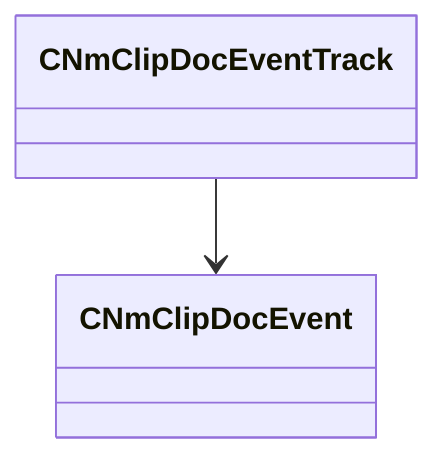
```mermaid
classDiagram
    CNmClipDocEventTrack --> CNmClipDocEvent
```

**Fields:**

| Name | Type | Annotations |
|------|------|-------------|
| `m_events` | CUtlVector< [CNmClipDocEvent](../schemas/animdoclib.md#cnmclipdocevent)* > |  |
| `m_eventClassName` | CUtlString |  |
| `m_type` | [CNmClipDocEventTrack](../schemas/animdoclib.md#cnmclipdoceventtrack)::Type_t |  |
| `m_bIsSyncTrack` | bool |  |
| `m_bIsDisabled` | bool |  |

### CNmClipDocEvent_BodyGroup

**Inherits from:** [CNmClipDocEvent](animdoclib.md#cnmclipdocevent)

**Metadata:** `MGetKV3ClassDefaults`

**Relationships:**

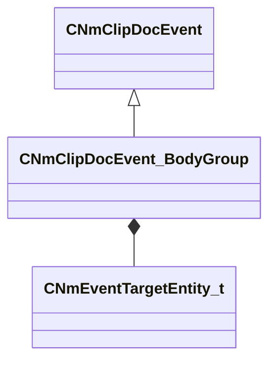
```mermaid
classDiagram
    CNmClipDocEvent <|-- CNmClipDocEvent_BodyGroup
    CNmClipDocEvent_BodyGroup *-- CNmEventTargetEntity_t
```

**Fields:**

| Name | Type | Annotations |
|------|------|-------------|
| `m_target` | [CNmEventTargetEntity_t](../schemas/!GlobalTypes.md#cnmeventtargetentity_t) |  |
| `bodygroup` | CUtlString | `MPropertyFriendlyName Body Group` |
| `value` | int32 | `MPropertyFriendlyName Value` |

### CNmClipDocEvent_EntityAttribute

**Inherits from:** [CNmClipDocEvent](animdoclib.md#cnmclipdocevent)

**Metadata:** `MGetKV3ClassDefaults`

**Relationships:**

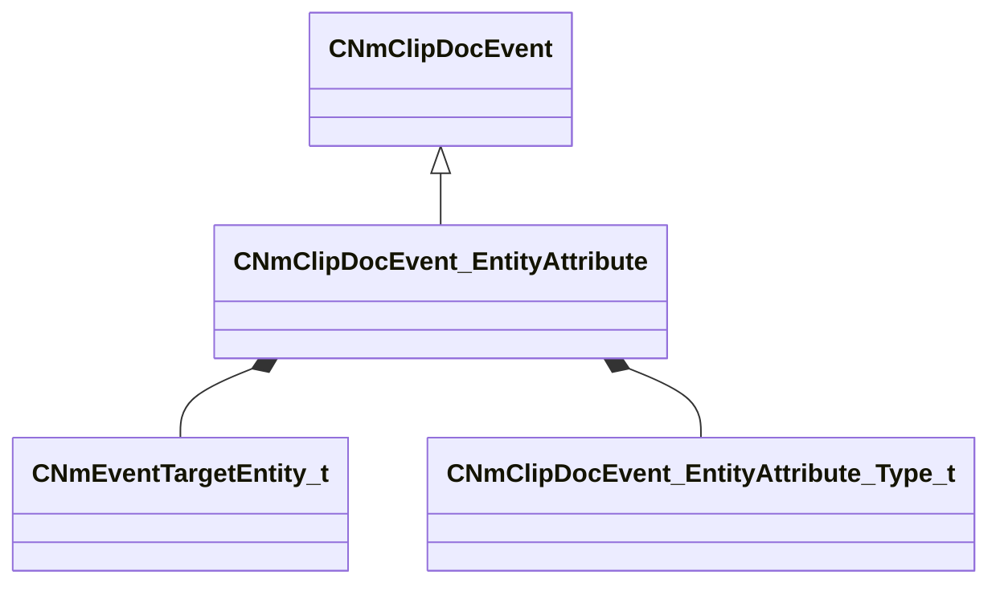
```mermaid
classDiagram
    CNmClipDocEvent <|-- CNmClipDocEvent_EntityAttribute
    CNmClipDocEvent_EntityAttribute *-- CNmEventTargetEntity_t
    CNmClipDocEvent_EntityAttribute *-- CNmClipDocEvent_EntityAttribute_Type_t
```

**Fields:**

| Name | Type | Annotations |
|------|------|-------------|
| `m_target` | [CNmEventTargetEntity_t](../schemas/!GlobalTypes.md#cnmeventtargetentity_t) |  |
| `m_attributeName` | CUtlString |  |
| `m_nValueType` | [CNmClipDocEvent_EntityAttribute_Type_t](../schemas/!GlobalTypes.md#cnmclipdocevent_entityattribute_type_t) | `MPropertyAutoRebuildOnChange` `MPropertyFriendlyName Type` |
| `m_nIntValue` | int32 | `MPropertyAttrStateCallback` |
| `m_FloatValue` | CPiecewiseCurve | `MPropertyAttrStateCallback` |

### CNmClipDocEvent_FloatCurve

**Inherits from:** [CNmClipDocEvent](animdoclib.md#cnmclipdocevent)

**Metadata:** `MGetKV3ClassDefaults`

**Relationships:**

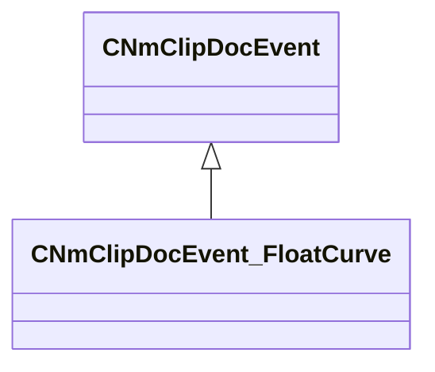
```mermaid
classDiagram
    CNmClipDocEvent <|-- CNmClipDocEvent_FloatCurve
```

**Fields:**

| Name | Type | Annotations |
|------|------|-------------|
| `m_ID` | CUtlString |  |
| `m_curve` | CPiecewiseCurve |  |

### CNmClipDocEvent_Foot

**Inherits from:** [CNmClipDocEvent](animdoclib.md#cnmclipdocevent)

**Metadata:** `MGetKV3ClassDefaults`

**Relationships:**

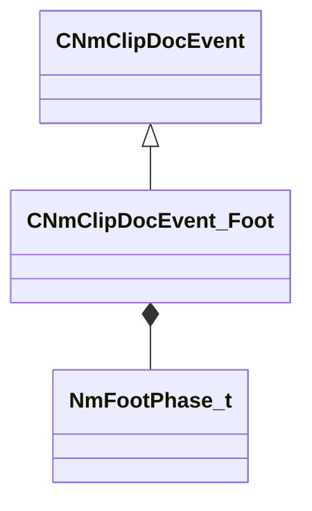
```mermaid
classDiagram
    CNmClipDocEvent <|-- CNmClipDocEvent_Foot
    CNmClipDocEvent_Foot *-- NmFootPhase_t
```

**Fields:**

| Name | Type | Annotations |
|------|------|-------------|
| `m_phase` | [NmFootPhase_t](../schemas/!GlobalTypes.md#nmfootphase_t) |  |

### CNmClipDocEvent_FrameSnap

**Inherits from:** [CNmClipDocEvent](animdoclib.md#cnmclipdocevent)

**Metadata:** `MGetKV3ClassDefaults`

**Relationships:**

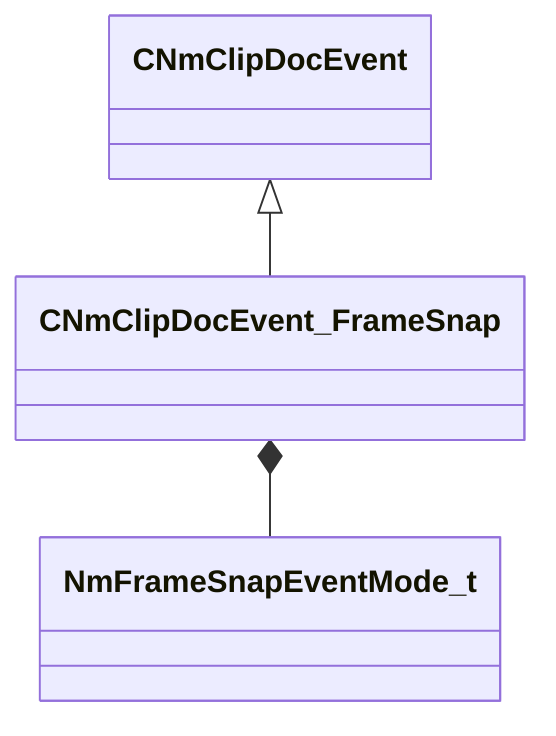
```mermaid
classDiagram
    CNmClipDocEvent <|-- CNmClipDocEvent_FrameSnap
    CNmClipDocEvent_FrameSnap *-- NmFrameSnapEventMode_t
```

**Fields:**

| Name | Type | Annotations |
|------|------|-------------|
| `m_frameSnapMode` | [NmFrameSnapEventMode_t](../schemas/!GlobalTypes.md#nmframesnapeventmode_t) |  |

### CNmClipDocEvent_ID

**Inherits from:** [CNmClipDocEvent](animdoclib.md#cnmclipdocevent)

**Metadata:** `MGetKV3ClassDefaults`

**Relationships:**

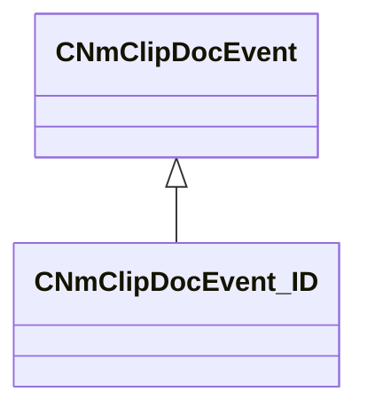
```mermaid
classDiagram
    CNmClipDocEvent <|-- CNmClipDocEvent_ID
```

**Fields:**

| Name | Type | Annotations |
|------|------|-------------|
| `m_ID` | CGlobalSymbol |  |
| `m_secondaryID` | CGlobalSymbol | `MPropertyGroupName +Optional` |

### CNmClipDocEvent_Legacy

**Inherits from:** [CNmClipDocEvent](animdoclib.md#cnmclipdocevent)

**Metadata:** `MGetKV3ClassDefaults`

**Relationships:**

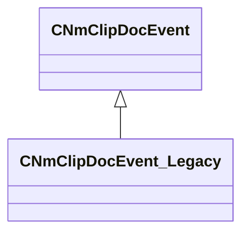
```mermaid
classDiagram
    CNmClipDocEvent <|-- CNmClipDocEvent_Legacy
```

**Fields:**

| Name | Type | Annotations |
|------|------|-------------|
| `m_eventClass` | CUtlString | `MPropertyAutoRebuildOnChange` |
| `m_KV` | KeyValues3 | `MPropertySuppressField` |

### CNmClipDocEvent_MaterialAttribute

**Inherits from:** [CNmClipDocEvent](animdoclib.md#cnmclipdocevent)

**Metadata:** `MGetKV3ClassDefaults`

**Relationships:**

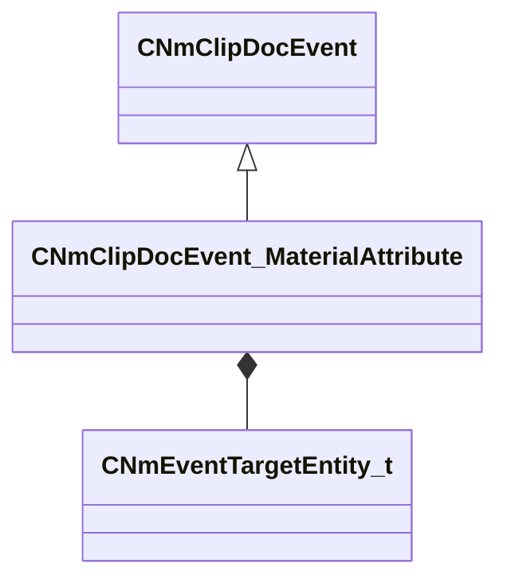
```mermaid
classDiagram
    CNmClipDocEvent <|-- CNmClipDocEvent_MaterialAttribute
    CNmClipDocEvent_MaterialAttribute *-- CNmEventTargetEntity_t
```

**Fields:**

| Name | Type | Annotations |
|------|------|-------------|
| `m_target` | [CNmEventTargetEntity_t](../schemas/!GlobalTypes.md#cnmeventtargetentity_t) |  |
| `m_attributeName` | CUtlString |  |
| `m_x` | CPiecewiseCurve |  |
| `m_y` | CPiecewiseCurve |  |
| `m_z` | CPiecewiseCurve |  |
| `m_w` | CPiecewiseCurve |  |

### CNmClipDocEvent_OrientationWarp

**Inherits from:** [CNmClipDocEvent](animdoclib.md#cnmclipdocevent)

**Metadata:** `MGetKV3ClassDefaults`

**Relationships:**

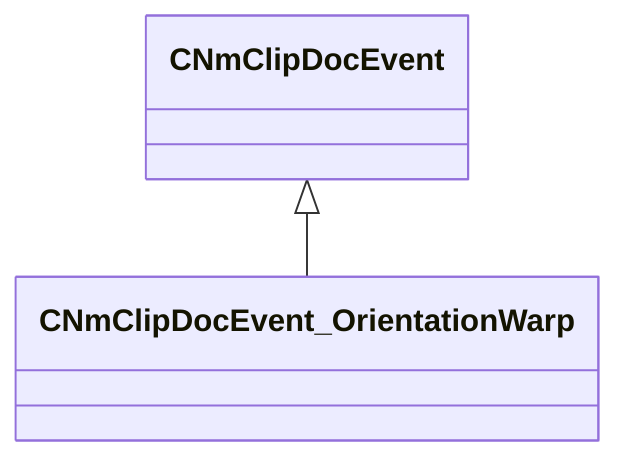
```mermaid
classDiagram
    CNmClipDocEvent <|-- CNmClipDocEvent_OrientationWarp
```

### CNmClipDocEvent_Particle

**Inherits from:** [CNmClipDocEvent](animdoclib.md#cnmclipdocevent)

**Metadata:** `MGetKV3ClassDefaults`

**Relationships:**

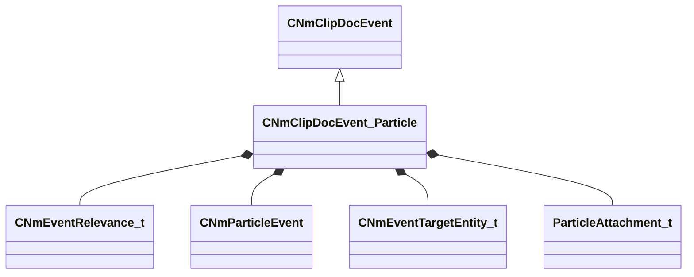
```mermaid
classDiagram
    CNmClipDocEvent <|-- CNmClipDocEvent_Particle
    CNmClipDocEvent_Particle *-- CNmEventRelevance_t
    CNmClipDocEvent_Particle *-- CNmParticleEvent
    CNmClipDocEvent_Particle *-- CNmEventTargetEntity_t
    CNmClipDocEvent_Particle *-- ParticleAttachment_t
```

**Fields:**

| Name | Type | Annotations |
|------|------|-------------|
| `m_relevance` | [CNmEventRelevance_t](../schemas/!GlobalTypes.md#cnmeventrelevance_t) |  |
| `m_type` | [CNmParticleEvent](../schemas/animlib.md#cnmparticleevent)::Type_t |  |
| `m_target` | [CNmEventTargetEntity_t](../schemas/!GlobalTypes.md#cnmeventtargetentity_t) |  |
| `m_particleSystem` | CUtlString | `MPropertyAttributeEditor AssetBrowse( vpcf, *requiredoubleclick )` `MPropertyStartGroup +Particle` |
| `m_bDetachFromOwner` | bool |  |
| `m_bStopImmediately` | bool |  |
| `m_bPlayEndCap` | bool |  |
| `m_attachmentPoint0` | CUtlString | `MPropertyAttrStateCallback` `MPropertyStartGroup +Attachment` |
| `m_attachmentType0` | [ParticleAttachment_t](../schemas/!GlobalTypes.md#particleattachment_t) | `MPropertyAttrStateCallback` |
| `m_attachmentPoint1` | CUtlString | `MPropertyAttrStateCallback` |
| `m_attachmentType1` | [ParticleAttachment_t](../schemas/!GlobalTypes.md#particleattachment_t) | `MPropertyAttrStateCallback` |
| `m_config` | CUtlString | `MPropertyAttrStateCallback` `MPropertyStartGroup +Config` |
| `m_effectForConfig` | CUtlString | `MPropertyAttrStateCallback` |
| `m_tags` | CUtlString | `MPropertyStartGroup +Metadata` |

### CNmClipDocEvent_RootMotion

**Inherits from:** [CNmClipDocEvent](animdoclib.md#cnmclipdocevent)

**Metadata:** `MGetKV3ClassDefaults`

**Relationships:**

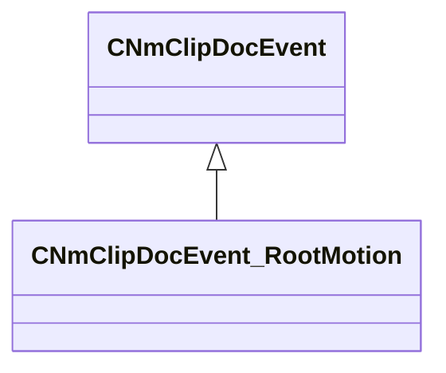
```mermaid
classDiagram
    CNmClipDocEvent <|-- CNmClipDocEvent_RootMotion
```

**Fields:**

| Name | Type | Annotations |
|------|------|-------------|
| `m_flBlendTimeSeconds` | float32 |  |

### CNmClipDocEvent_Sound

**Inherits from:** [CNmClipDocEvent](animdoclib.md#cnmclipdocevent)

**Metadata:** `MGetKV3ClassDefaults`

**Relationships:**

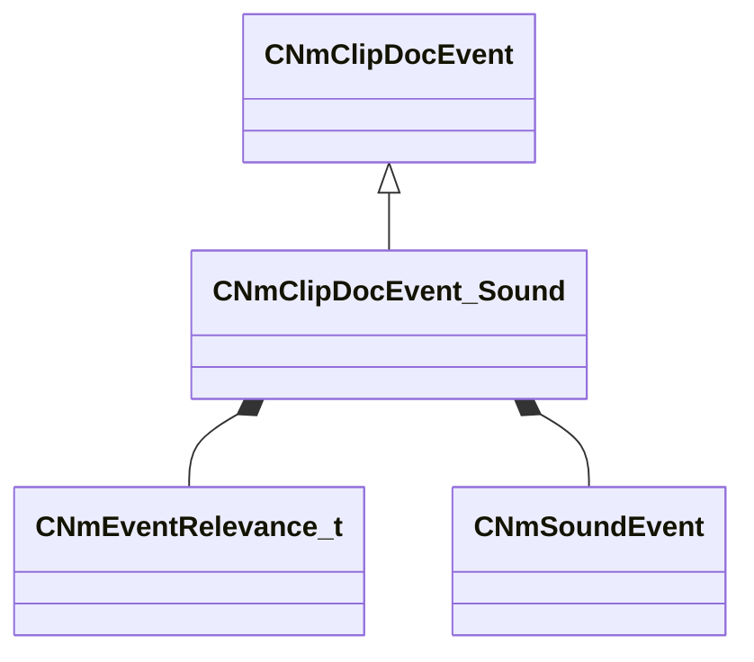
```mermaid
classDiagram
    CNmClipDocEvent <|-- CNmClipDocEvent_Sound
    CNmClipDocEvent_Sound *-- CNmEventRelevance_t
    CNmClipDocEvent_Sound *-- CNmSoundEvent
```

**Fields:**

| Name | Type | Annotations |
|------|------|-------------|
| `m_relevance` | [CNmEventRelevance_t](../schemas/!GlobalTypes.md#cnmeventrelevance_t) |  |
| `m_bContinuePlayingSoundAtDurationEnd` | bool | `MPropertyAttrStateCallback` |
| `m_flDurationInterruptionThreshold` | float32 | `MPropertyAttrStateCallback` |
| `m_name` | CUtlString | `MPropertyAttributeEditor SoundPicker()` `MPropertyStartGroup +Sound` |
| `m_position` | [CNmSoundEvent](../schemas/animlib.md#cnmsoundevent)::Position_t | `MPropertyStartGroup +Position` |
| `m_attachmentName` | CUtlString |  |
| `m_tags` | CUtlString | `MPropertyStartGroup +Metadata` |

### CNmClipDocEvent_TargetWarp

**Inherits from:** [CNmClipDocEvent](animdoclib.md#cnmclipdocevent)

**Metadata:** `MGetKV3ClassDefaults`

**Relationships:**

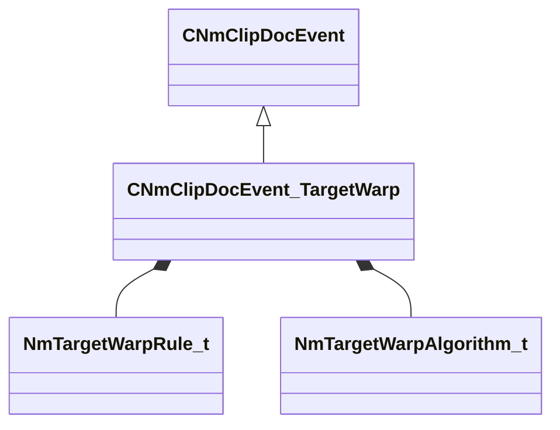
```mermaid
classDiagram
    CNmClipDocEvent <|-- CNmClipDocEvent_TargetWarp
    CNmClipDocEvent_TargetWarp *-- NmTargetWarpRule_t
    CNmClipDocEvent_TargetWarp *-- NmTargetWarpAlgorithm_t
```

**Fields:**

| Name | Type | Annotations |
|------|------|-------------|
| `m_rule` | [NmTargetWarpRule_t](../schemas/!GlobalTypes.md#nmtargetwarprule_t) |  |
| `m_algorithm` | [NmTargetWarpAlgorithm_t](../schemas/!GlobalTypes.md#nmtargetwarpalgorithm_t) |  |

### CNmClipDocEvent_Transition

**Inherits from:** [CNmClipDocEvent](animdoclib.md#cnmclipdocevent)

**Metadata:** `MGetKV3ClassDefaults`

**Relationships:**

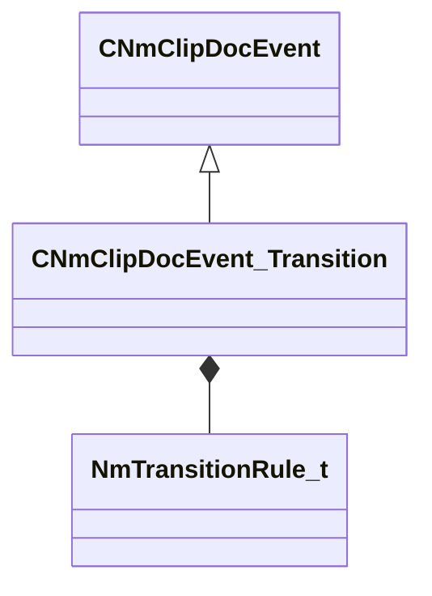
```mermaid
classDiagram
    CNmClipDocEvent <|-- CNmClipDocEvent_Transition
    CNmClipDocEvent_Transition *-- NmTransitionRule_t
```

**Fields:**

| Name | Type | Annotations |
|------|------|-------------|
| `m_rule` | [NmTransitionRule_t](../schemas/!GlobalTypes.md#nmtransitionrule_t) |  |
| `m_optionalID` | CUtlString |  |

### CNmClipDocument

**Inherits from:** [CNmAnimDocument](animdoclib.md#cnmanimdocument)

**Metadata:** `MGetKV3ClassDefaults`

**Relationships:**

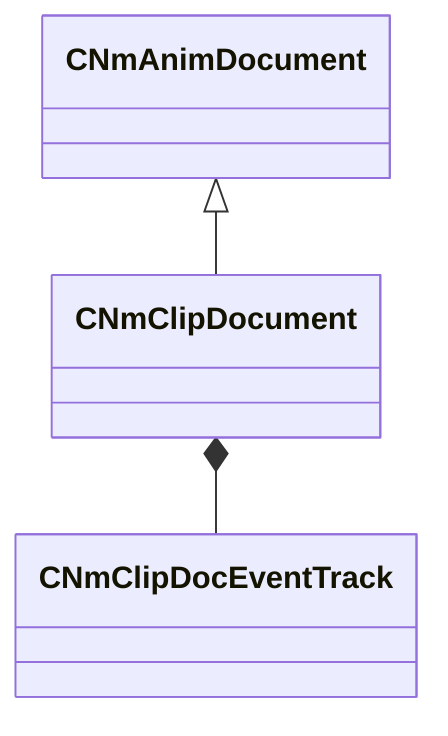
```mermaid
classDiagram
    CNmAnimDocument <|-- CNmClipDocument
    CNmClipDocument *-- CNmClipDocEventTrack
```

**Fields:**

| Name | Type | Annotations |
|------|------|-------------|
| `m_sourceFilename` | CUtlString | `MPropertyAttributeEditor ModelDocAssetBrowse( dmx, fbx, smd, *requiredoubleclick, *ShowRelatedFile )` |
| `m_animationSkeletonName` | CUtlString | `MPropertyAttributeEditor AssetBrowse( vnmskel, *requiredoubleclick )` |
| `m_secondaryAnimationSkeletonNames` | CUtlVector< CUtlString > | `MPropertyAttributeEditor AssetBrowse( vnmskel, *requiredoubleclick )` `MPropertyAutoExpandSelf` |
| `m_eventTracks` | CUtlLeanVector< [CNmClipDocEventTrack](../schemas/animdoclib.md#cnmclipdoceventtrack) > | `MPropertySuppressField` |
| `m_nStartFrame` | int32 | `MPropertyDescription Specify the import start frame (0 or a negative value means use the first frame in the authored animation)` `MPropertyGroupName +Import Options` |
| `m_nEndFrame` | int32 | `MPropertyDescription Specify the import end frame (0 or a negative value means use the last frame in the authored animation)` `MPropertyGroupName +Import Options` |
| `m_flDurationOverrideSeconds` | float32 | `MPropertyDescription Override the final duration of this clip in seconds (0 or a negative value means use the authored duration)` `MPropertyGroupName +Import Options` |
| `m_additiveType` | [CNmClipDocument](../schemas/animdoclib.md#cnmclipdocument)::AdditiveType_t | `MPropertyGroupName +Additive` |
| `m_additiveBaseFilename` | CUtlString | `MPropertyAttrStateCallback` `MPropertyAttributeEditor AssetBrowse( dmx, fbx, *requiredoubleclick )` `MPropertyDescription The source file to use as the base of the additive` `MPropertyGroupName +Additive` |
| `m_additiveBaseFrame` | [CNmClipDocument](../schemas/animdoclib.md#cnmclipdocument)::AdditiveBaseFrame_t | `MPropertyAttrStateCallback` `MPropertyDescription The frame to use when generating an additive, if you are generating relative to another animation and this is set to -1, we will extract each frame from it's corresponding frame in the base anim` `MPropertyGroupName +Additive` |
| `m_nAdditiveBaseFrameIdx` | int32 | `MPropertyAttrStateCallback` `MPropertyDescription The frame to use when generating an additive, only valid for 'RelativeToFrame' and 'RelativeToAnimationFrame' ` `MPropertyGroupName +Additive` |
| `m_bUseReferencePoseForSecondaryAnimAdditives` | bool | `MPropertyAttrStateCallback` `MPropertyDescription Should we calculate the additives for the secondary weapons from their reference pose or try to look up a pose in the specified animation` `MPropertyGroupName +Additive` |
| `m_bonesToSampleInModelSpace` | CUtlVector< CUtlString > | `MPropertyAutoExpandSelf` `MPropertyDescription List the set of bones that need to be sampled in model space for sub-frames. Warning! This can be REALLY expensive so be careful with this!` `MPropertyGroupName Advanced` |

### CNmGraphDocAndNode

**Inherits from:** [CNmGraphDocFlowNode](animdoclib.md#cnmgraphdocflownode)

**Metadata:** `MGetKV3ClassDefaults`

**Relationships:**

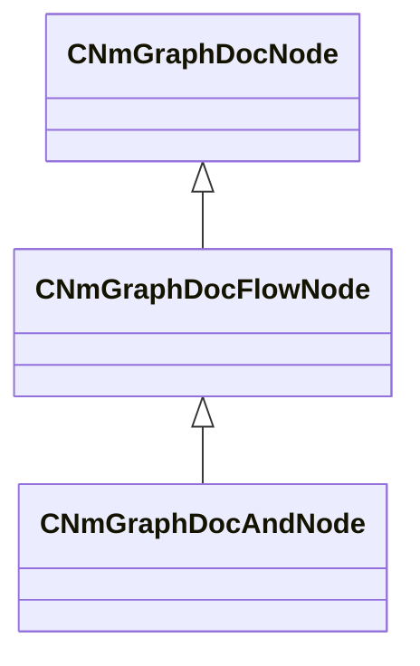
```mermaid
classDiagram
    CNmGraphDocFlowNode <|-- CNmGraphDocAndNode
    CNmGraphDocNode <|-- CNmGraphDocFlowNode
```

### CNmGraphDocAnimationPoseNode

**Inherits from:** [CNmGraphDocVariationDataNode](animdoclib.md#cnmgraphdocvariationdatanode)

**Metadata:** `MGetKV3ClassDefaults`

**Relationships:**

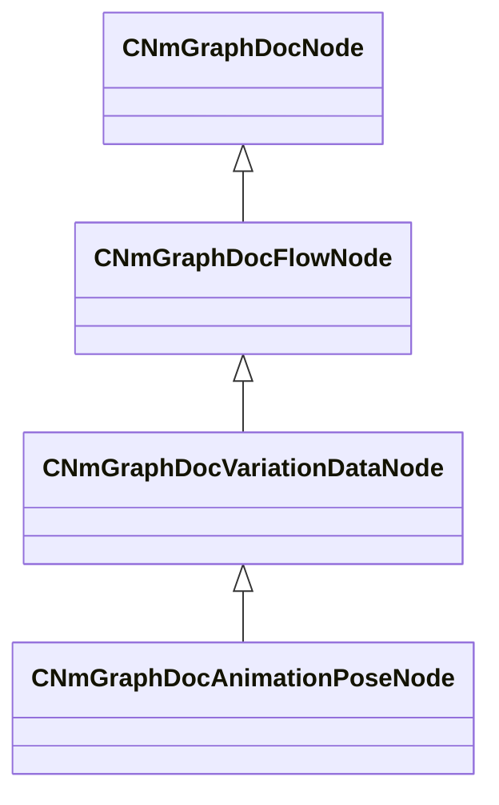
```mermaid
classDiagram
    CNmGraphDocVariationDataNode <|-- CNmGraphDocAnimationPoseNode
    CNmGraphDocFlowNode <|-- CNmGraphDocVariationDataNode
    CNmGraphDocNode <|-- CNmGraphDocFlowNode
```

**Fields:**

| Name | Type | Annotations |
|------|------|-------------|
| `m_inputTimeRemapRange` | Range_t | `MPropertyAttributeEditor RangeEditor()` |
| `m_fixedTimeValue` | float32 |  |
| `m_useFramesAsInput` | bool |  |

### CNmGraphDocAnimationPoseNode::CData

**Inherits from:** [CNmGraphDocVariationDataNode::CData](animdoclib.md#cnmgraphdocvariationdatanodecdata)

**Metadata:** `MGetKV3ClassDefaults`

**Relationships:**

```mermaid
classDiagram
    "CNmGraphDocVariationDataNode::CData" <|-- "CNmGraphDocAnimationPoseNode::CData"
```

**Fields:**

| Name | Type | Annotations |
|------|------|-------------|
| `m_clip` | CUtlString | `MPropertyAttributeEditor AssetBrowse( vnmclip, *requiredoubleclick )` |
| `m_variationTimeValue` | float32 |  |

### CNmGraphDocBlend1DNode

**Inherits from:** [CNmGraphDocFlowNode](animdoclib.md#cnmgraphdocflownode)

**Metadata:** `MGetKV3ClassDefaults`

**Relationships:**

```mermaid
classDiagram
    CNmGraphDocFlowNode <|-- CNmGraphDocBlend1DNode
    CNmGraphDocNode <|-- CNmGraphDocFlowNode
    CNmGraphDocBlend1DNode *-- CNmBlendSpace1D
```

**Fields:**

| Name | Type | Annotations |
|------|------|-------------|
| `m_blendSpace` | [CNmBlendSpace1D](../schemas/animdoclib.md#cnmblendspace1d) | `MPropertyAttributeEditor BlendSpace1D()` |
| `m_bAllowLooping` | bool | `MPropertyDescription When not being driven by a sync time, control looping behavior ` |

### CNmGraphDocBlend2DNode

**Inherits from:** [CNmGraphDocFlowNode](animdoclib.md#cnmgraphdocflownode)

**Metadata:** `MGetKV3ClassDefaults`

**Relationships:**

```mermaid
classDiagram
    CNmGraphDocFlowNode <|-- CNmGraphDocBlend2DNode
    CNmGraphDocNode <|-- CNmGraphDocFlowNode
    CNmGraphDocBlend2DNode *-- CNmBlendSpace2D
```

**Fields:**

| Name | Type | Annotations |
|------|------|-------------|
| `m_blendSpace` | [CNmBlendSpace2D](../schemas/animdoclib.md#cnmblendspace2d) | `MPropertyAttributeEditor BlendSpace2D()` |
| `m_bAllowLooping` | bool |  |

### CNmGraphDocBoneMaskBlendNode

**Inherits from:** [CNmGraphDocFlowNode](animdoclib.md#cnmgraphdocflownode)

**Metadata:** `MGetKV3ClassDefaults`

**Relationships:**

```mermaid
classDiagram
    CNmGraphDocFlowNode <|-- CNmGraphDocBoneMaskBlendNode
    CNmGraphDocNode <|-- CNmGraphDocFlowNode
```

### CNmGraphDocBoneMaskNode

**Inherits from:** [CNmGraphDocVariationDataNode](animdoclib.md#cnmgraphdocvariationdatanode)

**Metadata:** `MGetKV3ClassDefaults`

**Relationships:**

```mermaid
classDiagram
    CNmGraphDocVariationDataNode <|-- CNmGraphDocBoneMaskNode
    CNmGraphDocFlowNode <|-- CNmGraphDocVariationDataNode
    CNmGraphDocNode <|-- CNmGraphDocFlowNode
```

**Fields:**

| Name | Type | Annotations |
|------|------|-------------|
| `m_maskID` | CGlobalSymbol | `MPropertyAttributeEditor BoneMaskID()` |
| `m_bIsOptionalMask` | bool | `MPropertyDescription Should we check at compile time that this is an optional mask?` |

### CNmGraphDocBoneMaskNode::CData

**Inherits from:** [CNmGraphDocVariationDataNode::CData](animdoclib.md#cnmgraphdocvariationdatanodecdata)

**Metadata:** `MGetKV3ClassDefaults`

**Relationships:**

```mermaid
classDiagram
    "CNmGraphDocVariationDataNode::CData" <|-- "CNmGraphDocBoneMaskNode::CData"
```

**Fields:**

| Name | Type | Annotations |
|------|------|-------------|
| `m_overrideMaskID` | CGlobalSymbol | `MPropertyAttributeEditor BoneMaskID()` |

### CNmGraphDocBoneMaskParameterReferenceNode

**Inherits from:** [CNmGraphDocParameterReferenceNode](animdoclib.md#cnmgraphdocparameterreferencenode)

**Metadata:** `MGetKV3ClassDefaults`

**Relationships:**

```mermaid
classDiagram
    CNmGraphDocParameterReferenceNode <|-- CNmGraphDocBoneMaskParameterReferenceNode
    CNmGraphDocFlowNode <|-- CNmGraphDocParameterReferenceNode
    CNmGraphDocNode <|-- CNmGraphDocFlowNode
```

### CNmGraphDocBoneMaskResultNode

**Inherits from:** [CNmGraphDocResultNode](animdoclib.md#cnmgraphdocresultnode)

**Metadata:** `MGetKV3ClassDefaults`

**Relationships:**

```mermaid
classDiagram
    CNmGraphDocResultNode <|-- CNmGraphDocBoneMaskResultNode
    CNmGraphDocFlowNode <|-- CNmGraphDocResultNode
    CNmGraphDocNode <|-- CNmGraphDocFlowNode
```

### CNmGraphDocBoneMaskSelectorNode

**Inherits from:** [CNmGraphDocFlowNode](animdoclib.md#cnmgraphdocflownode)

**Metadata:** `MGetKV3ClassDefaults`

**Relationships:**

```mermaid
classDiagram
    CNmGraphDocFlowNode <|-- CNmGraphDocBoneMaskSelectorNode
    CNmGraphDocNode <|-- CNmGraphDocFlowNode
```

**Fields:**

| Name | Type | Annotations |
|------|------|-------------|
| `m_switchDynamically` | bool |  |
| `m_options` | CUtlVector< CGlobalSymbol > | `MPropertyAutoExpandSelf` `MPropertyResizable` |
| `m_flBlendTimeSeconds` | float32 |  |

### CNmGraphDocBoneMaskSwitchNode

**Inherits from:** [CNmGraphDocFlowNode](animdoclib.md#cnmgraphdocflownode)

**Metadata:** `MGetKV3ClassDefaults`

**Relationships:**

```mermaid
classDiagram
    CNmGraphDocFlowNode <|-- CNmGraphDocBoneMaskSwitchNode
    CNmGraphDocNode <|-- CNmGraphDocFlowNode
```

**Fields:**

| Name | Type | Annotations |
|------|------|-------------|
| `m_bSwitchDynamically` | bool |  |
| `m_flBlendTimeSeconds` | float32 |  |

### CNmGraphDocBoneMaskVirtualParameterNode

**Inherits from:** [CNmGraphDocVirtualParameterNode](animdoclib.md#cnmgraphdocvirtualparameternode)

**Metadata:** `MGetKV3ClassDefaults`

**Relationships:**

```mermaid
classDiagram
    CNmGraphDocVirtualParameterNode <|-- CNmGraphDocBoneMaskVirtualParameterNode
    CNmGraphDocParameterBaseNode <|-- CNmGraphDocVirtualParameterNode
    CNmGraphDocFlowNode <|-- CNmGraphDocParameterBaseNode
    CNmGraphDocNode <|-- CNmGraphDocFlowNode
```

### CNmGraphDocBoolControlParameterNode

**Inherits from:** [CNmGraphDocControlParameterNode](animdoclib.md#cnmgraphdoccontrolparameternode)

**Metadata:** `MGetKV3ClassDefaults`

**Relationships:**

```mermaid
classDiagram
    CNmGraphDocControlParameterNode <|-- CNmGraphDocBoolControlParameterNode
    CNmGraphDocParameterBaseNode <|-- CNmGraphDocControlParameterNode
    CNmGraphDocFlowNode <|-- CNmGraphDocParameterBaseNode
    CNmGraphDocNode <|-- CNmGraphDocFlowNode
```

**Fields:**

| Name | Type | Annotations |
|------|------|-------------|
| `m_previewStartValue` | bool |  |

### CNmGraphDocBoolParameterReferenceNode

**Inherits from:** [CNmGraphDocParameterReferenceNode](animdoclib.md#cnmgraphdocparameterreferencenode)

**Metadata:** `MGetKV3ClassDefaults`

**Relationships:**

```mermaid
classDiagram
    CNmGraphDocParameterReferenceNode <|-- CNmGraphDocBoolParameterReferenceNode
    CNmGraphDocFlowNode <|-- CNmGraphDocParameterReferenceNode
    CNmGraphDocNode <|-- CNmGraphDocFlowNode
```

### CNmGraphDocBoolResultNode

**Inherits from:** [CNmGraphDocResultNode](animdoclib.md#cnmgraphdocresultnode)

**Metadata:** `MGetKV3ClassDefaults`

**Relationships:**

```mermaid
classDiagram
    CNmGraphDocResultNode <|-- CNmGraphDocBoolResultNode
    CNmGraphDocFlowNode <|-- CNmGraphDocResultNode
    CNmGraphDocNode <|-- CNmGraphDocFlowNode
```

### CNmGraphDocBoolVirtualParameterNode

**Inherits from:** [CNmGraphDocVirtualParameterNode](animdoclib.md#cnmgraphdocvirtualparameternode)

**Metadata:** `MGetKV3ClassDefaults`

**Relationships:**

```mermaid
classDiagram
    CNmGraphDocVirtualParameterNode <|-- CNmGraphDocBoolVirtualParameterNode
    CNmGraphDocParameterBaseNode <|-- CNmGraphDocVirtualParameterNode
    CNmGraphDocFlowNode <|-- CNmGraphDocParameterBaseNode
    CNmGraphDocNode <|-- CNmGraphDocFlowNode
```

### CNmGraphDocCachedBoolNode

**Inherits from:** [CNmGraphDocFlowNode](animdoclib.md#cnmgraphdocflownode)

**Metadata:** `MGetKV3ClassDefaults`

**Relationships:**

```mermaid
classDiagram
    CNmGraphDocFlowNode <|-- CNmGraphDocCachedBoolNode
    CNmGraphDocNode <|-- CNmGraphDocFlowNode
    CNmGraphDocCachedBoolNode *-- NmCachedValueMode_t
```

**Fields:**

| Name | Type | Annotations |
|------|------|-------------|
| `m_mode` | [NmCachedValueMode_t](../schemas/!GlobalTypes.md#nmcachedvaluemode_t) |  |

### CNmGraphDocCachedFloatNode

**Inherits from:** [CNmGraphDocFlowNode](animdoclib.md#cnmgraphdocflownode)

**Metadata:** `MGetKV3ClassDefaults`

**Relationships:**

```mermaid
classDiagram
    CNmGraphDocFlowNode <|-- CNmGraphDocCachedFloatNode
    CNmGraphDocNode <|-- CNmGraphDocFlowNode
    CNmGraphDocCachedFloatNode *-- NmCachedValueMode_t
```

**Fields:**

| Name | Type | Annotations |
|------|------|-------------|
| `m_mode` | [NmCachedValueMode_t](../schemas/!GlobalTypes.md#nmcachedvaluemode_t) |  |

### CNmGraphDocCachedIDNode

**Inherits from:** [CNmGraphDocFlowNode](animdoclib.md#cnmgraphdocflownode)

**Metadata:** `MGetKV3ClassDefaults`

**Relationships:**

```mermaid
classDiagram
    CNmGraphDocFlowNode <|-- CNmGraphDocCachedIDNode
    CNmGraphDocNode <|-- CNmGraphDocFlowNode
    CNmGraphDocCachedIDNode *-- NmCachedValueMode_t
```

**Fields:**

| Name | Type | Annotations |
|------|------|-------------|
| `m_mode` | [NmCachedValueMode_t](../schemas/!GlobalTypes.md#nmcachedvaluemode_t) |  |

### CNmGraphDocCachedTargetNode

**Inherits from:** [CNmGraphDocFlowNode](animdoclib.md#cnmgraphdocflownode)

**Metadata:** `MGetKV3ClassDefaults`

**Relationships:**

```mermaid
classDiagram
    CNmGraphDocFlowNode <|-- CNmGraphDocCachedTargetNode
    CNmGraphDocNode <|-- CNmGraphDocFlowNode
    CNmGraphDocCachedTargetNode *-- NmCachedValueMode_t
```

**Fields:**

| Name | Type | Annotations |
|------|------|-------------|
| `m_mode` | [NmCachedValueMode_t](../schemas/!GlobalTypes.md#nmcachedvaluemode_t) |  |

### CNmGraphDocCachedVectorNode

**Inherits from:** [CNmGraphDocFlowNode](animdoclib.md#cnmgraphdocflownode)

**Metadata:** `MGetKV3ClassDefaults`

**Relationships:**

```mermaid
classDiagram
    CNmGraphDocFlowNode <|-- CNmGraphDocCachedVectorNode
    CNmGraphDocNode <|-- CNmGraphDocFlowNode
    CNmGraphDocCachedVectorNode *-- NmCachedValueMode_t
```

**Fields:**

| Name | Type | Annotations |
|------|------|-------------|
| `m_mode` | [NmCachedValueMode_t](../schemas/!GlobalTypes.md#nmcachedvaluemode_t) |  |

### CNmGraphDocClipNode

**Inherits from:** [CNmGraphDocVariationDataNode](animdoclib.md#cnmgraphdocvariationdatanode)

**Metadata:** `MGetKV3ClassDefaults`

**Relationships:**

```mermaid
classDiagram
    CNmGraphDocVariationDataNode <|-- CNmGraphDocClipNode
    CNmGraphDocFlowNode <|-- CNmGraphDocVariationDataNode
    CNmGraphDocNode <|-- CNmGraphDocFlowNode
```

**Fields:**

| Name | Type | Annotations |
|------|------|-------------|
| `m_bSampleRootMotion` | bool |  |
| `m_bAllowLooping` | bool |  |
| `m_graphEvents` | CUtlVector< CGlobalSymbol > | `MPropertyAttributeEditor AnimGraphID()` `MPropertyAutoExpandSelf` `MPropertyGroupName Advanced` |

### CNmGraphDocClipNode::CData

**Inherits from:** [CNmGraphDocVariationDataNode::CData](animdoclib.md#cnmgraphdocvariationdatanodecdata)

**Metadata:** `MGetKV3ClassDefaults`

**Relationships:**

```mermaid
classDiagram
    "CNmGraphDocVariationDataNode::CData" <|-- "CNmGraphDocClipNode::CData"
```

**Fields:**

| Name | Type | Annotations |
|------|------|-------------|
| `m_clip` | CUtlString | `MPropertyAttributeEditor AssetBrowse( vnmclip, *requiredoubleclick )` |
| `m_flSpeedMultiplier` | float32 | `MPropertyAttributeRange 0.01 5.0` |
| `m_nStartSyncEventOffset` | int32 |  |

### CNmGraphDocClipSelectorNode

**Inherits from:** [CNmGraphDocSelectorBaseNode](animdoclib.md#cnmgraphdocselectorbasenode)

**Metadata:** `MGetKV3ClassDefaults`

**Relationships:**

```mermaid
classDiagram
    CNmGraphDocSelectorBaseNode <|-- CNmGraphDocClipSelectorNode
    CNmGraphDocFlowNode <|-- CNmGraphDocSelectorBaseNode
    CNmGraphDocNode <|-- CNmGraphDocFlowNode
```

### CNmGraphDocCommentNode

**Inherits from:** [CNmGraphDocNode](animdoclib.md#cnmgraphdocnode)

**Metadata:** `MGetKV3ClassDefaults`

**Relationships:**

```mermaid
classDiagram
    CNmGraphDocNode <|-- CNmGraphDocCommentNode
```

**Fields:**

| Name | Type | Annotations |
|------|------|-------------|
| `m_size` | Vector2D |  |
| `m_comment` | CUtlString |  |
| `m_nodeColor` | Color |  |

### CNmGraphDocControlParameterNode

**Inherits from:** [CNmGraphDocParameterBaseNode](animdoclib.md#cnmgraphdocparameterbasenode)

**Derived by:** [CNmGraphDocBoolControlParameterNode](animdoclib.md#cnmgraphdocboolcontrolparameternode), [CNmGraphDocFloatControlParameterNode](animdoclib.md#cnmgraphdocfloatcontrolparameternode), [CNmGraphDocIDControlParameterNode](animdoclib.md#cnmgraphdocidcontrolparameternode), [CNmGraphDocTargetControlParameterNode](animdoclib.md#cnmgraphdoctargetcontrolparameternode), [CNmGraphDocVectorControlParameterNode](animdoclib.md#cnmgraphdocvectorcontrolparameternode)

**Metadata:** `MGetKV3ClassDefaults`

**Relationships:**

```mermaid
classDiagram
    CNmGraphDocParameterBaseNode <|-- CNmGraphDocControlParameterNode
    CNmGraphDocFlowNode <|-- CNmGraphDocParameterBaseNode
    CNmGraphDocNode <|-- CNmGraphDocFlowNode
    CNmGraphDocControlParameterNode <|-- CNmGraphDocBoolControlParameterNode
    CNmGraphDocControlParameterNode <|-- CNmGraphDocFloatControlParameterNode
    CNmGraphDocControlParameterNode <|-- CNmGraphDocIDControlParameterNode
    CNmGraphDocControlParameterNode <|-- CNmGraphDocTargetControlParameterNode
    CNmGraphDocControlParameterNode <|-- CNmGraphDocVectorControlParameterNode
```

**Fields:**

| Name | Type | Annotations |
|------|------|-------------|
| `m_dictionaryParameterBinding` | V_uuid_t |  |

### CNmGraphDocCurrentSyncEventIDNode

**Inherits from:** [CNmGraphDocFlowNode](animdoclib.md#cnmgraphdocflownode)

**Metadata:** `MGetKV3ClassDefaults`

**Relationships:**

```mermaid
classDiagram
    CNmGraphDocFlowNode <|-- CNmGraphDocCurrentSyncEventIDNode
    CNmGraphDocNode <|-- CNmGraphDocFlowNode
```

### CNmGraphDocCurrentSyncEventNode

**Inherits from:** [CNmGraphDocFlowNode](animdoclib.md#cnmgraphdocflownode)

**Metadata:** `MGetKV3ClassDefaults`

**Relationships:**

```mermaid
classDiagram
    CNmGraphDocFlowNode <|-- CNmGraphDocCurrentSyncEventNode
    CNmGraphDocNode <|-- CNmGraphDocFlowNode
```

**Fields:**

| Name | Type | Annotations |
|------|------|-------------|
| `m_infoType` | CNmCurrentSyncEventNode::InfoType_t |  |

### CNmGraphDocDataDictionary

**Metadata:** `MGetKV3ClassDefaults`, `MPropertyAutoExpandSelf`

**Fields:**

| Name | Type | Annotations |
|------|------|-------------|
| `m_parameterSets` | CUtlVector< [CNmGraphDocDataDictionary](../schemas/animdoclib.md#cnmgraphdocdatadictionary)::ParameterSet_t > | `MPropertyAutoExpandSelf` |
| `m_IDSets` | CUtlVector< [CNmGraphDocDataDictionary](../schemas/animdoclib.md#cnmgraphdocdatadictionary)::IDSet_t > | `MPropertyAutoExpandSelf` |

### CNmGraphDocDataDictionary::IDSet_t

**Metadata:** `MGetKV3ClassDefaults`, `MPropertyAutoExpandSelf`

**Fields:**

| Name | Type | Annotations |
|------|------|-------------|
| `m_ID` | V_uuid_t | `MPropertySuppressField` |
| `m_name` | CUtlString | `MPropertyFlattenIntoParentRow` |
| `m_graphIDs` | CUtlVector< CGlobalSymbol > | `MPropertyAutoExpandSelf` `MPropertyFriendlyName Graph IDs` |

### CNmGraphDocDataDictionary::ParameterSet_t

**Metadata:** `MGetKV3ClassDefaults`, `MPropertyAutoExpandSelf`

**Relationships:**

```mermaid
classDiagram
    "CNmGraphDocDataDictionary::ParameterSet_t" *-- CNmGraphDocDataDictionary
```

**Fields:**

| Name | Type | Annotations |
|------|------|-------------|
| `m_name` | CUtlString | `MPropertyFlattenIntoParentRow` |
| `m_parameters` | CUtlVector< [CNmGraphDocDataDictionary](../schemas/animdoclib.md#cnmgraphdocdatadictionary)::Parameter_t > | `MPropertyAutoExpandSelf` |

### CNmGraphDocDataDictionary::Parameter_t

**Metadata:** `MGetKV3ClassDefaults`, `MPropertyAutoExpandSelf`

**Relationships:**

```mermaid
classDiagram
    "CNmGraphDocDataDictionary::Parameter_t" *-- NmGraphValueType_t
```

**Fields:**

| Name | Type | Annotations |
|------|------|-------------|
| `m_ID` | V_uuid_t | `MPropertySuppressField` |
| `m_name` | CUtlString | `MPropertyFlattenIntoParentRow` |
| `m_groupName` | CUtlString |  |
| `m_valueType` | [NmGraphValueType_t](../schemas/!GlobalTypes.md#nmgraphvaluetype_t) |  |
| `m_expectedValues` | CUtlVector< CGlobalSymbol > | `MPropertyAttrStateCallback` `MPropertyAutoExpandSelf` |

### CNmGraphDocEntryOverrideNode

**Inherits from:** [CNmGraphDocResultNode](animdoclib.md#cnmgraphdocresultnode)

**Metadata:** `MGetKV3ClassDefaults`

**Relationships:**

```mermaid
classDiagram
    CNmGraphDocResultNode <|-- CNmGraphDocEntryOverrideNode
    CNmGraphDocFlowNode <|-- CNmGraphDocResultNode
    CNmGraphDocNode <|-- CNmGraphDocFlowNode
```

**Fields:**

| Name | Type | Annotations |
|------|------|-------------|
| `m_stateID` | V_uuid_t | `MPropertySuppressField` |

### CNmGraphDocEntryStateOverrideConditionsNode

**Inherits from:** [CNmGraphDocResultNode](animdoclib.md#cnmgraphdocresultnode)

**Metadata:** `MGetKV3ClassDefaults`

**Relationships:**

```mermaid
classDiagram
    CNmGraphDocResultNode <|-- CNmGraphDocEntryStateOverrideConditionsNode
    CNmGraphDocFlowNode <|-- CNmGraphDocResultNode
    CNmGraphDocNode <|-- CNmGraphDocFlowNode
```

**Fields:**

| Name | Type | Annotations |
|------|------|-------------|
| `m_pinToStateMapping` | CUtlVector< V_uuid_t > | `MPropertySuppressField` |

### CNmGraphDocEntryStateOverrideConduitNode

**Inherits from:** [CNmGraphDocStateMachineGraphNode](animdoclib.md#cnmgraphdocstatemachinegraphnode)

**Metadata:** `MGetKV3ClassDefaults`

**Relationships:**

```mermaid
classDiagram
    CNmGraphDocStateMachineGraphNode <|-- CNmGraphDocEntryStateOverrideConduitNode
    CNmGraphDocNode <|-- CNmGraphDocStateMachineGraphNode
```

### CNmGraphDocExternalGraphNode

**Inherits from:** [CNmGraphDocFlowNode](animdoclib.md#cnmgraphdocflownode)

**Metadata:** `MGetKV3ClassDefaults`

**Relationships:**

```mermaid
classDiagram
    CNmGraphDocFlowNode <|-- CNmGraphDocExternalGraphNode
    CNmGraphDocNode <|-- CNmGraphDocFlowNode
```

### CNmGraphDocExternalPoseNode

**Inherits from:** [CNmGraphDocFlowNode](animdoclib.md#cnmgraphdocflownode)

**Metadata:** `MGetKV3ClassDefaults`

**Relationships:**

```mermaid
classDiagram
    CNmGraphDocFlowNode <|-- CNmGraphDocExternalPoseNode
    CNmGraphDocNode <|-- CNmGraphDocFlowNode
```

**Fields:**

| Name | Type | Annotations |
|------|------|-------------|
| `m_bShouldSampleRootMotion` | bool |  |

### CNmGraphDocFixedWeightBoneMaskNode

**Inherits from:** [CNmGraphDocFlowNode](animdoclib.md#cnmgraphdocflownode)

**Metadata:** `MGetKV3ClassDefaults`

**Relationships:**

```mermaid
classDiagram
    CNmGraphDocFlowNode <|-- CNmGraphDocFixedWeightBoneMaskNode
    CNmGraphDocNode <|-- CNmGraphDocFlowNode
```

**Fields:**

| Name | Type | Annotations |
|------|------|-------------|
| `m_flBoneWeight` | float32 |  |

### CNmGraphDocFloatAngleMathNode

**Inherits from:** [CNmGraphDocFlowNode](animdoclib.md#cnmgraphdocflownode)

**Metadata:** `MGetKV3ClassDefaults`

**Relationships:**

```mermaid
classDiagram
    CNmGraphDocFlowNode <|-- CNmGraphDocFloatAngleMathNode
    CNmGraphDocNode <|-- CNmGraphDocFlowNode
```

**Fields:**

| Name | Type | Annotations |
|------|------|-------------|
| `m_operation` | CNmFloatAngleMathNode::Operation_t |  |

### CNmGraphDocFloatClampNode

**Inherits from:** [CNmGraphDocFlowNode](animdoclib.md#cnmgraphdocflownode)

**Metadata:** `MGetKV3ClassDefaults`

**Relationships:**

```mermaid
classDiagram
    CNmGraphDocFlowNode <|-- CNmGraphDocFloatClampNode
    CNmGraphDocNode <|-- CNmGraphDocFlowNode
```

**Fields:**

| Name | Type | Annotations |
|------|------|-------------|
| `m_clampRange` | Range_t |  |

### CNmGraphDocFloatComparisonNode

**Inherits from:** [CNmGraphDocFlowNode](animdoclib.md#cnmgraphdocflownode)

**Metadata:** `MGetKV3ClassDefaults`

**Relationships:**

```mermaid
classDiagram
    CNmGraphDocFlowNode <|-- CNmGraphDocFloatComparisonNode
    CNmGraphDocNode <|-- CNmGraphDocFlowNode
    CNmGraphDocFloatComparisonNode *-- Comparison_t
```

**Fields:**

| Name | Type | Annotations |
|------|------|-------------|
| `m_comparison` | CNmFloatComparisonNode::[Comparison_t](../schemas/!GlobalTypes.md#comparison_t) |  |
| `m_flComparisonValue` | float32 |  |
| `m_flEpsilon` | float32 |  |

### CNmGraphDocFloatControlParameterNode

**Inherits from:** [CNmGraphDocControlParameterNode](animdoclib.md#cnmgraphdoccontrolparameternode)

**Metadata:** `MGetKV3ClassDefaults`

**Relationships:**

```mermaid
classDiagram
    CNmGraphDocControlParameterNode <|-- CNmGraphDocFloatControlParameterNode
    CNmGraphDocParameterBaseNode <|-- CNmGraphDocControlParameterNode
    CNmGraphDocFlowNode <|-- CNmGraphDocParameterBaseNode
    CNmGraphDocNode <|-- CNmGraphDocFlowNode
```

**Fields:**

| Name | Type | Annotations |
|------|------|-------------|
| `m_previewStartValue` | float32 |  |
| `m_previewMin` | float32 |  |
| `m_previewMax` | float32 |  |

### CNmGraphDocFloatCurveEventNode

**Inherits from:** [CNmGraphDocFlowNode](animdoclib.md#cnmgraphdocflownode)

**Metadata:** `MGetKV3ClassDefaults`

**Relationships:**

```mermaid
classDiagram
    CNmGraphDocFlowNode <|-- CNmGraphDocFloatCurveEventNode
    CNmGraphDocNode <|-- CNmGraphDocFlowNode
    CNmGraphDocFloatCurveEventNode *-- NmEventPriorityRule_t
```

**Fields:**

| Name | Type | Annotations |
|------|------|-------------|
| `m_matchID` | CGlobalSymbol |  |
| `m_flDefaultValue` | float32 |  |
| `m_priorityRule` | [NmEventPriorityRule_t](../schemas/!GlobalTypes.md#nmeventpriorityrule_t) | `MPropertyGroupName +Advanced Search Rules` |
| `m_bLimitSearchToSourceState` | bool | `MPropertyGroupName +Advanced Search Rules` |
| `m_bIgnoreInactiveBranchEvents` | bool | `MPropertyGroupName +Advanced Search Rules` |

### CNmGraphDocFloatCurveNode

**Inherits from:** [CNmGraphDocFlowNode](animdoclib.md#cnmgraphdocflownode)

**Metadata:** `MGetKV3ClassDefaults`

**Relationships:**

```mermaid
classDiagram
    CNmGraphDocFlowNode <|-- CNmGraphDocFloatCurveNode
    CNmGraphDocNode <|-- CNmGraphDocFlowNode
```

**Fields:**

| Name | Type | Annotations |
|------|------|-------------|
| `m_curve` | CPiecewiseCurve | `MPropertyAttributeEditor CurveEditor()` |

### CNmGraphDocFloatEaseNode

**Inherits from:** [CNmGraphDocFlowNode](animdoclib.md#cnmgraphdocflownode)

**Metadata:** `MGetKV3ClassDefaults`

**Relationships:**

```mermaid
classDiagram
    CNmGraphDocFlowNode <|-- CNmGraphDocFloatEaseNode
    CNmGraphDocNode <|-- CNmGraphDocFlowNode
    CNmGraphDocFloatEaseNode *-- NmEasingOperation_t
```

**Fields:**

| Name | Type | Annotations |
|------|------|-------------|
| `m_easing` | [NmEasingOperation_t](../schemas/!GlobalTypes.md#nmeasingoperation_t) |  |
| `m_flEaseTime` | float32 |  |
| `m_bUseStartValue` | bool |  |
| `m_flStartValue` | float32 |  |

### CNmGraphDocFloatMathNode

**Inherits from:** [CNmGraphDocFlowNode](animdoclib.md#cnmgraphdocflownode)

**Metadata:** `MGetKV3ClassDefaults`

**Relationships:**

```mermaid
classDiagram
    CNmGraphDocFlowNode <|-- CNmGraphDocFloatMathNode
    CNmGraphDocNode <|-- CNmGraphDocFlowNode
```

**Fields:**

| Name | Type | Annotations |
|------|------|-------------|
| `m_bReturnAbsoluteResult` | bool | `MPropertyDescription Should we apply an abs to the result (is performed before we take into account the negate option)` |
| `m_bReturnNegatedResult` | bool | `MPropertyDescription Should we negate the result (absolute value will be performed before negation)` |
| `m_operator` | CNmFloatMathNode::Operator_t |  |
| `m_flValueB` | float32 |  |

### CNmGraphDocFloatParameterReferenceNode

**Inherits from:** [CNmGraphDocParameterReferenceNode](animdoclib.md#cnmgraphdocparameterreferencenode)

**Metadata:** `MGetKV3ClassDefaults`

**Relationships:**

```mermaid
classDiagram
    CNmGraphDocParameterReferenceNode <|-- CNmGraphDocFloatParameterReferenceNode
    CNmGraphDocFlowNode <|-- CNmGraphDocParameterReferenceNode
    CNmGraphDocNode <|-- CNmGraphDocFlowNode
```

### CNmGraphDocFloatRangeComparisonNode

**Inherits from:** [CNmGraphDocFlowNode](animdoclib.md#cnmgraphdocflownode)

**Metadata:** `MGetKV3ClassDefaults`

**Relationships:**

```mermaid
classDiagram
    CNmGraphDocFlowNode <|-- CNmGraphDocFloatRangeComparisonNode
    CNmGraphDocNode <|-- CNmGraphDocFlowNode
```

**Fields:**

| Name | Type | Annotations |
|------|------|-------------|
| `m_range` | Range_t |  |
| `m_isInclusiveCheck` | bool |  |

### CNmGraphDocFloatRemapNode

**Inherits from:** [CNmGraphDocFlowNode](animdoclib.md#cnmgraphdocflownode)

**Metadata:** `MGetKV3ClassDefaults`

**Relationships:**

```mermaid
classDiagram
    CNmGraphDocFlowNode <|-- CNmGraphDocFloatRemapNode
    CNmGraphDocNode <|-- CNmGraphDocFlowNode
```

**Fields:**

| Name | Type | Annotations |
|------|------|-------------|
| `m_inputRange` | [CNmGraphDocFloatRemapNode](../schemas/animdoclib.md#cnmgraphdocfloatremapnode)::RemapRange_t |  |
| `m_outputRange` | [CNmGraphDocFloatRemapNode](../schemas/animdoclib.md#cnmgraphdocfloatremapnode)::RemapRange_t |  |

### CNmGraphDocFloatRemapNode::RemapRange_t

**Metadata:** `MGetKV3ClassDefaults`, `MPropertyAutoExpandSelf`

**Fields:**

| Name | Type | Annotations |
|------|------|-------------|
| `m_flBegin` | float32 |  |
| `m_flEnd` | float32 |  |

### CNmGraphDocFloatResultNode

**Inherits from:** [CNmGraphDocResultNode](animdoclib.md#cnmgraphdocresultnode)

**Metadata:** `MGetKV3ClassDefaults`

**Relationships:**

```mermaid
classDiagram
    CNmGraphDocResultNode <|-- CNmGraphDocFloatResultNode
    CNmGraphDocFlowNode <|-- CNmGraphDocResultNode
    CNmGraphDocNode <|-- CNmGraphDocFlowNode
```

### CNmGraphDocFloatSelectorNode

**Inherits from:** [CNmGraphDocFlowNode](animdoclib.md#cnmgraphdocflownode)

**Metadata:** `MGetKV3ClassDefaults`

**Relationships:**

```mermaid
classDiagram
    CNmGraphDocFlowNode <|-- CNmGraphDocFloatSelectorNode
    CNmGraphDocNode <|-- CNmGraphDocFlowNode
    CNmGraphDocFloatSelectorNode *-- NmEasingOperation_t
```

**Fields:**

| Name | Type | Annotations |
|------|------|-------------|
| `m_options` | CUtlVector< [CNmGraphDocFloatSelectorNode](../schemas/animdoclib.md#cnmgraphdocfloatselectornode)::Option_t > | `MPropertyAutoExpandSelf` `MPropertyResizable` |
| `m_flDefaultValue` | float32 |  |
| `m_easing` | [NmEasingOperation_t](../schemas/!GlobalTypes.md#nmeasingoperation_t) | `MPropertyGroupName +Easing` |
| `m_easeTime` | float32 | `MPropertyGroupName +Easing` |

### CNmGraphDocFloatSelectorNode::Option_t

**Metadata:** `MGetKV3ClassDefaults`, `MPropertyAutoExpandSelf`

**Fields:**

| Name | Type | Annotations |
|------|------|-------------|
| `m_name` | CUtlString |  |
| `m_flValue` | float32 |  |

### CNmGraphDocFloatSpringNode

**Inherits from:** [CNmGraphDocFlowNode](animdoclib.md#cnmgraphdocflownode)

**Metadata:** `MGetKV3ClassDefaults`

**Relationships:**

```mermaid
classDiagram
    CNmGraphDocFlowNode <|-- CNmGraphDocFloatSpringNode
    CNmGraphDocNode <|-- CNmGraphDocFlowNode
```

**Fields:**

| Name | Type | Annotations |
|------|------|-------------|
| `m_flHertz` | float32 | `MPropertyDescription Valid Range [0.1 : 30]` |
| `m_flDampingRatio` | float32 | `MPropertyDescription Valid Range [0 : 10], 1 = Critically Damped` |
| `m_bUseStartValue` | bool | `MPropertyDescription Should we initialize this node to the input value or to the specified start value` |
| `m_flStartValue` | float32 | `MPropertyDescription Optional initialization value for this node` |

### CNmGraphDocFloatSwitchNode

**Inherits from:** [CNmGraphDocFlowNode](animdoclib.md#cnmgraphdocflownode)

**Metadata:** `MGetKV3ClassDefaults`

**Relationships:**

```mermaid
classDiagram
    CNmGraphDocFlowNode <|-- CNmGraphDocFloatSwitchNode
    CNmGraphDocNode <|-- CNmGraphDocFlowNode
```

**Fields:**

| Name | Type | Annotations |
|------|------|-------------|
| `m_flFalseValue` | float32 |  |
| `m_flTrueValue` | float32 |  |

### CNmGraphDocFloatVirtualParameterNode

**Inherits from:** [CNmGraphDocVirtualParameterNode](animdoclib.md#cnmgraphdocvirtualparameternode)

**Metadata:** `MGetKV3ClassDefaults`

**Relationships:**

```mermaid
classDiagram
    CNmGraphDocVirtualParameterNode <|-- CNmGraphDocFloatVirtualParameterNode
    CNmGraphDocParameterBaseNode <|-- CNmGraphDocVirtualParameterNode
    CNmGraphDocFlowNode <|-- CNmGraphDocParameterBaseNode
    CNmGraphDocNode <|-- CNmGraphDocFlowNode
```

### CNmGraphDocFlowGraph

**Inherits from:** [CNmGraphDocGraph](animdoclib.md#cnmgraphdocgraph)

**Metadata:** `MGetKV3ClassDefaults`

**Relationships:**

```mermaid
classDiagram
    CNmGraphDocGraph <|-- CNmGraphDocFlowGraph
```

**Fields:**

| Name | Type | Annotations |
|------|------|-------------|
| `m_connections` | CUtlVector< [CNmGraphDocFlowGraph](../schemas/animdoclib.md#cnmgraphdocflowgraph)::Connection_t > |  |

### CNmGraphDocFlowGraph::Connection_t

**Metadata:** `MGetKV3ClassDefaults`

**Fields:**

| Name | Type | Annotations |
|------|------|-------------|
| `m_ID` | V_uuid_t |  |
| `m_fromNodeID` | V_uuid_t |  |
| `m_outputPinID` | V_uuid_t |  |
| `m_toNodeID` | V_uuid_t |  |
| `m_inputPinID` | V_uuid_t |  |

### CNmGraphDocFlowNode

**Inherits from:** [CNmGraphDocNode](animdoclib.md#cnmgraphdocnode)

**Derived by:** [CNmGraphDocAimCSNode](modtools.md#cnmgraphdocaimcsnode), [CNmGraphDocAndNode](animdoclib.md#cnmgraphdocandnode), [CNmGraphDocBlend1DNode](animdoclib.md#cnmgraphdocblend1dnode), [CNmGraphDocBlend2DNode](animdoclib.md#cnmgraphdocblend2dnode), [CNmGraphDocBoneMaskBlendNode](animdoclib.md#cnmgraphdocbonemaskblendnode), [CNmGraphDocBoneMaskSelectorNode](animdoclib.md#cnmgraphdocbonemaskselectornode), [CNmGraphDocBoneMaskSwitchNode](animdoclib.md#cnmgraphdocbonemaskswitchnode), [CNmGraphDocCachedBoolNode](animdoclib.md#cnmgraphdoccachedboolnode), [CNmGraphDocCachedFloatNode](animdoclib.md#cnmgraphdoccachedfloatnode), [CNmGraphDocCachedIDNode](animdoclib.md#cnmgraphdoccachedidnode), [CNmGraphDocCachedTargetNode](animdoclib.md#cnmgraphdoccachedtargetnode), [CNmGraphDocCachedVectorNode](animdoclib.md#cnmgraphdoccachedvectornode), [CNmGraphDocCurrentSyncEventIDNode](animdoclib.md#cnmgraphdoccurrentsynceventidnode), [CNmGraphDocCurrentSyncEventNode](animdoclib.md#cnmgraphdoccurrentsynceventnode), [CNmGraphDocExternalGraphNode](animdoclib.md#cnmgraphdocexternalgraphnode), [CNmGraphDocExternalPoseNode](animdoclib.md#cnmgraphdocexternalposenode), [CNmGraphDocFixedWeightBoneMaskNode](animdoclib.md#cnmgraphdocfixedweightbonemasknode), [CNmGraphDocFloatAngleMathNode](animdoclib.md#cnmgraphdocfloatanglemathnode), [CNmGraphDocFloatClampNode](animdoclib.md#cnmgraphdocfloatclampnode), [CNmGraphDocFloatComparisonNode](animdoclib.md#cnmgraphdocfloatcomparisonnode), [CNmGraphDocFloatCurveEventNode](animdoclib.md#cnmgraphdocfloatcurveeventnode), [CNmGraphDocFloatCurveNode](animdoclib.md#cnmgraphdocfloatcurvenode), [CNmGraphDocFloatEaseNode](animdoclib.md#cnmgraphdocfloateasenode), [CNmGraphDocFloatMathNode](animdoclib.md#cnmgraphdocfloatmathnode), [CNmGraphDocFloatRangeComparisonNode](animdoclib.md#cnmgraphdocfloatrangecomparisonnode), [CNmGraphDocFloatRemapNode](animdoclib.md#cnmgraphdocfloatremapnode), [CNmGraphDocFloatSelectorNode](animdoclib.md#cnmgraphdocfloatselectornode), [CNmGraphDocFloatSpringNode](animdoclib.md#cnmgraphdocfloatspringnode), [CNmGraphDocFloatSwitchNode](animdoclib.md#cnmgraphdocfloatswitchnode), [CNmGraphDocFootEventConditionNode](animdoclib.md#cnmgraphdocfooteventconditionnode), [CNmGraphDocFootstepEventIDNode](animdoclib.md#cnmgraphdocfootstepeventidnode), [CNmGraphDocFootstepEventPercentageThroughNode](animdoclib.md#cnmgraphdocfootstepeventpercentagethroughnode), [CNmGraphDocGraphEventConditionNode](animdoclib.md#cnmgraphdocgrapheventconditionnode), [CNmGraphDocIDBasedClipSelectorNode](animdoclib.md#cnmgraphdocidbasedclipselectornode), [CNmGraphDocIDBasedSelectorNode](animdoclib.md#cnmgraphdocidbasedselectornode), [CNmGraphDocIDComparisonNode](animdoclib.md#cnmgraphdocidcomparisonnode), [CNmGraphDocIDEventConditionNode](animdoclib.md#cnmgraphdocideventconditionnode), [CNmGraphDocIDEventNode](animdoclib.md#cnmgraphdocideventnode), [CNmGraphDocIDEventPercentageThroughNode](animdoclib.md#cnmgraphdocideventpercentagethroughnode), [CNmGraphDocIDSelectorNode](animdoclib.md#cnmgraphdocidselectornode), [CNmGraphDocIDSwitchNode](animdoclib.md#cnmgraphdocidswitchnode), [CNmGraphDocIDToFloatNode](animdoclib.md#cnmgraphdocidtofloatnode), [CNmGraphDocIsExternalGraphSlotFilledNode](animdoclib.md#cnmgraphdocisexternalgraphslotfillednode), [CNmGraphDocIsExternalPoseSetNode](animdoclib.md#cnmgraphdocisexternalposesetnode), [CNmGraphDocIsInactiveBranchConditionNode](animdoclib.md#cnmgraphdocisinactivebranchconditionnode), [CNmGraphDocIsTargetSetNode](animdoclib.md#cnmgraphdocistargetsetnode), [CNmGraphDocLayerBaseNode](animdoclib.md#cnmgraphdoclayerbasenode), [CNmGraphDocLayerBlendNode](animdoclib.md#cnmgraphdoclayerblendnode), [CNmGraphDocNotNode](animdoclib.md#cnmgraphdocnotnode), [CNmGraphDocOrNode](animdoclib.md#cnmgraphdocornode), [CNmGraphDocOrientationWarpNode](animdoclib.md#cnmgraphdocorientationwarpnode), [CNmGraphDocParameterBaseNode](animdoclib.md#cnmgraphdocparameterbasenode), [CNmGraphDocParameterReferenceNode](animdoclib.md#cnmgraphdocparameterreferencenode), [CNmGraphDocReferencePoseNode](animdoclib.md#cnmgraphdocreferenceposenode), [CNmGraphDocResultNode](animdoclib.md#cnmgraphdocresultnode), [CNmGraphDocRootMotionOverrideNode](animdoclib.md#cnmgraphdocrootmotionoverridenode), [CNmGraphDocScaleNode](animdoclib.md#cnmgraphdocscalenode), [CNmGraphDocSelectorBaseNode](animdoclib.md#cnmgraphdocselectorbasenode), [CNmGraphDocStateCompletedConditionNode](animdoclib.md#cnmgraphdocstatecompletedconditionnode), [CNmGraphDocStateMachineNode](animdoclib.md#cnmgraphdocstatemachinenode), [CNmGraphDocSyncEventIndexConditionNode](animdoclib.md#cnmgraphdocsynceventindexconditionnode), [CNmGraphDocTargetInfoNode](animdoclib.md#cnmgraphdoctargetinfonode), [CNmGraphDocTargetOffsetNode](animdoclib.md#cnmgraphdoctargetoffsetnode), [CNmGraphDocTargetPointNode](animdoclib.md#cnmgraphdoctargetpointnode), [CNmGraphDocTargetSelectorNode](animdoclib.md#cnmgraphdoctargetselectornode), [CNmGraphDocTimeConditionNode](animdoclib.md#cnmgraphdoctimeconditionnode), [CNmGraphDocTransitionEventConditionNode](animdoclib.md#cnmgraphdoctransitioneventconditionnode), [CNmGraphDocVariationDataNode](animdoclib.md#cnmgraphdocvariationdatanode), [CNmGraphDocVectorCreateNode](animdoclib.md#cnmgraphdocvectorcreatenode), [CNmGraphDocVectorInfoNode](animdoclib.md#cnmgraphdocvectorinfonode), [CNmGraphDocVectorNegateNode](animdoclib.md#cnmgraphdocvectornegatenode), [CNmGraphDocVelocityBlendNode](animdoclib.md#cnmgraphdocvelocityblendnode), [CNmGraphDocZeroPoseNode](animdoclib.md#cnmgraphdoczeroposenode), [CnmGraphDocConstBoneTargetNode](animdoclib.md#cnmgraphdocconstbonetargetnode), [CnmGraphDocConstBoolNode](animdoclib.md#cnmgraphdocconstboolnode), [CnmGraphDocConstFloatNode](animdoclib.md#cnmgraphdocconstfloatnode), [CnmGraphDocConstIDNode](animdoclib.md#cnmgraphdocconstidnode), [CnmGraphDocConstTargetNode](animdoclib.md#cnmgraphdocconsttargetnode), [CnmGraphDocConstVectorNode](animdoclib.md#cnmgraphdocconstvectornode), [CnmGraphDocDurationScaleNode](animdoclib.md#cnmgraphdocdurationscalenode), [CnmGraphDocSnapWeaponNode](modtools.md#cnmgraphdocsnapweaponnode), [CnmGraphDocSpeedScaleNode](animdoclib.md#cnmgraphdocspeedscalenode), [CnmGraphDocVelocityBasedSpeedScaleNode](animdoclib.md#cnmgraphdocvelocitybasedspeedscalenode)

**Metadata:** `MGetKV3ClassDefaults`

**Relationships:**

```mermaid
classDiagram
    CNmGraphDocNode <|-- CNmGraphDocFlowNode
    CNmGraphDocFlowNode <|-- CNmGraphDocAimCSNode
    CNmGraphDocFlowNode <|-- CNmGraphDocAndNode
    CNmGraphDocFlowNode <|-- CNmGraphDocBlend1DNode
    CNmGraphDocFlowNode <|-- CNmGraphDocBlend2DNode
    CNmGraphDocFlowNode <|-- CNmGraphDocBoneMaskBlendNode
    CNmGraphDocFlowNode <|-- CNmGraphDocBoneMaskSelectorNode
    CNmGraphDocFlowNode <|-- CNmGraphDocBoneMaskSwitchNode
    CNmGraphDocFlowNode <|-- CNmGraphDocCachedBoolNode
    CNmGraphDocFlowNode <|-- CNmGraphDocCachedFloatNode
    CNmGraphDocFlowNode <|-- CNmGraphDocCachedIDNode
    CNmGraphDocFlowNode <|-- CNmGraphDocCachedTargetNode
    CNmGraphDocFlowNode <|-- CNmGraphDocCachedVectorNode
    CNmGraphDocFlowNode <|-- CNmGraphDocCurrentSyncEventIDNode
    CNmGraphDocFlowNode <|-- CNmGraphDocCurrentSyncEventNode
    CNmGraphDocFlowNode <|-- CNmGraphDocExternalGraphNode
    CNmGraphDocFlowNode <|-- CNmGraphDocExternalPoseNode
    CNmGraphDocFlowNode <|-- CNmGraphDocFixedWeightBoneMaskNode
    CNmGraphDocFlowNode <|-- CNmGraphDocFloatAngleMathNode
    CNmGraphDocFlowNode <|-- CNmGraphDocFloatClampNode
    CNmGraphDocFlowNode <|-- CNmGraphDocFloatComparisonNode
    CNmGraphDocFlowNode <|-- CNmGraphDocFloatCurveEventNode
    CNmGraphDocFlowNode <|-- CNmGraphDocFloatCurveNode
    CNmGraphDocFlowNode <|-- CNmGraphDocFloatEaseNode
    CNmGraphDocFlowNode <|-- CNmGraphDocFloatMathNode
    CNmGraphDocFlowNode <|-- CNmGraphDocFloatRangeComparisonNode
    CNmGraphDocFlowNode <|-- CNmGraphDocFloatRemapNode
    CNmGraphDocFlowNode <|-- CNmGraphDocFloatSelectorNode
    CNmGraphDocFlowNode <|-- CNmGraphDocFloatSpringNode
    CNmGraphDocFlowNode <|-- CNmGraphDocFloatSwitchNode
    CNmGraphDocFlowNode <|-- CNmGraphDocFootEventConditionNode
    CNmGraphDocFlowNode <|-- CNmGraphDocFootstepEventIDNode
    CNmGraphDocFlowNode <|-- CNmGraphDocFootstepEventPercentageThroughNode
    CNmGraphDocFlowNode <|-- CNmGraphDocGraphEventConditionNode
    CNmGraphDocFlowNode <|-- CNmGraphDocIDBasedClipSelectorNode
    CNmGraphDocFlowNode <|-- CNmGraphDocIDBasedSelectorNode
    CNmGraphDocFlowNode <|-- CNmGraphDocIDComparisonNode
    CNmGraphDocFlowNode <|-- CNmGraphDocIDEventConditionNode
    CNmGraphDocFlowNode <|-- CNmGraphDocIDEventNode
    CNmGraphDocFlowNode <|-- CNmGraphDocIDEventPercentageThroughNode
    CNmGraphDocFlowNode <|-- CNmGraphDocIDSelectorNode
    CNmGraphDocFlowNode <|-- CNmGraphDocIDSwitchNode
    CNmGraphDocFlowNode <|-- CNmGraphDocIDToFloatNode
    CNmGraphDocFlowNode <|-- CNmGraphDocIsExternalGraphSlotFilledNode
    CNmGraphDocFlowNode <|-- CNmGraphDocIsExternalPoseSetNode
    CNmGraphDocFlowNode <|-- CNmGraphDocIsInactiveBranchConditionNode
    CNmGraphDocFlowNode <|-- CNmGraphDocIsTargetSetNode
    CNmGraphDocFlowNode <|-- CNmGraphDocLayerBaseNode
    CNmGraphDocFlowNode <|-- CNmGraphDocLayerBlendNode
    CNmGraphDocFlowNode <|-- CNmGraphDocNotNode
    CNmGraphDocFlowNode <|-- CNmGraphDocOrNode
    CNmGraphDocFlowNode <|-- CNmGraphDocOrientationWarpNode
    CNmGraphDocFlowNode <|-- CNmGraphDocParameterBaseNode
    CNmGraphDocFlowNode <|-- CNmGraphDocParameterReferenceNode
    CNmGraphDocFlowNode <|-- CNmGraphDocReferencePoseNode
    CNmGraphDocFlowNode <|-- CNmGraphDocResultNode
    CNmGraphDocFlowNode <|-- CNmGraphDocRootMotionOverrideNode
    CNmGraphDocFlowNode <|-- CNmGraphDocScaleNode
    CNmGraphDocFlowNode <|-- CNmGraphDocSelectorBaseNode
    CNmGraphDocFlowNode <|-- CNmGraphDocStateCompletedConditionNode
    CNmGraphDocFlowNode <|-- CNmGraphDocStateMachineNode
    CNmGraphDocFlowNode <|-- CNmGraphDocSyncEventIndexConditionNode
    CNmGraphDocFlowNode <|-- CNmGraphDocTargetInfoNode
    CNmGraphDocFlowNode <|-- CNmGraphDocTargetOffsetNode
    CNmGraphDocFlowNode <|-- CNmGraphDocTargetPointNode
    CNmGraphDocFlowNode <|-- CNmGraphDocTargetSelectorNode
    CNmGraphDocFlowNode <|-- CNmGraphDocTimeConditionNode
    CNmGraphDocFlowNode <|-- CNmGraphDocTransitionEventConditionNode
    CNmGraphDocFlowNode <|-- CNmGraphDocVariationDataNode
    CNmGraphDocFlowNode <|-- CNmGraphDocVectorCreateNode
    CNmGraphDocFlowNode <|-- CNmGraphDocVectorInfoNode
    CNmGraphDocFlowNode <|-- CNmGraphDocVectorNegateNode
    CNmGraphDocFlowNode <|-- CNmGraphDocVelocityBlendNode
    CNmGraphDocFlowNode <|-- CNmGraphDocZeroPoseNode
    CNmGraphDocFlowNode <|-- CnmGraphDocConstBoneTargetNode
    CNmGraphDocFlowNode <|-- CnmGraphDocConstBoolNode
    CNmGraphDocFlowNode <|-- CnmGraphDocConstFloatNode
    CNmGraphDocFlowNode <|-- CnmGraphDocConstIDNode
    CNmGraphDocFlowNode <|-- CnmGraphDocConstTargetNode
    CNmGraphDocFlowNode <|-- CnmGraphDocConstVectorNode
    CNmGraphDocFlowNode <|-- CnmGraphDocDurationScaleNode
    CNmGraphDocFlowNode <|-- CnmGraphDocSnapWeaponNode
    CNmGraphDocFlowNode <|-- CnmGraphDocSpeedScaleNode
    CNmGraphDocFlowNode <|-- CnmGraphDocVelocityBasedSpeedScaleNode
    CNmGraphDocFlowNode *-- NmGraphDocPin_t
```

**Fields:**

| Name | Type | Annotations |
|------|------|-------------|
| `m_inputPins` | CUtlLeanVectorFixedGrowable< [NmGraphDocPin_t](../schemas/animdoclib.md#nmgraphdocpin_t), 4 > |  |
| `m_outputPins` | CUtlLeanVectorFixedGrowable< [NmGraphDocPin_t](../schemas/animdoclib.md#nmgraphdocpin_t), 1 > |  |

### CNmGraphDocFootEventConditionNode

**Inherits from:** [CNmGraphDocFlowNode](animdoclib.md#cnmgraphdocflownode)

**Metadata:** `MGetKV3ClassDefaults`

**Relationships:**

```mermaid
classDiagram
    CNmGraphDocFlowNode <|-- CNmGraphDocFootEventConditionNode
    CNmGraphDocNode <|-- CNmGraphDocFlowNode
    CNmGraphDocFootEventConditionNode *-- NmFootPhaseCondition_t
```

**Fields:**

| Name | Type | Annotations |
|------|------|-------------|
| `m_phaseCondition` | [NmFootPhaseCondition_t](../schemas/!GlobalTypes.md#nmfootphasecondition_t) |  |
| `m_bLimitSearchToSourceState` | bool | `MPropertyGroupName +Advanced Search Rules` |
| `m_bIgnoreInactiveBranchEvents` | bool | `MPropertyGroupName +Advanced Search Rules` |

### CNmGraphDocFootstepEventIDNode

**Inherits from:** [CNmGraphDocFlowNode](animdoclib.md#cnmgraphdocflownode)

**Metadata:** `MGetKV3ClassDefaults`

**Relationships:**

```mermaid
classDiagram
    CNmGraphDocFlowNode <|-- CNmGraphDocFootstepEventIDNode
    CNmGraphDocNode <|-- CNmGraphDocFlowNode
    CNmGraphDocFootstepEventIDNode *-- NmEventPriorityRule_t
```

**Fields:**

| Name | Type | Annotations |
|------|------|-------------|
| `m_priorityRule` | [NmEventPriorityRule_t](../schemas/!GlobalTypes.md#nmeventpriorityrule_t) | `MPropertyGroupName +Advanced Search Rules` |
| `m_bLimitSearchToSourceState` | bool | `MPropertyGroupName +Advanced Search Rules` |
| `m_bIgnoreInactiveBranchEvents` | bool | `MPropertyGroupName +Advanced Search Rules` |

### CNmGraphDocFootstepEventPercentageThroughNode

**Inherits from:** [CNmGraphDocFlowNode](animdoclib.md#cnmgraphdocflownode)

**Metadata:** `MGetKV3ClassDefaults`

**Relationships:**

```mermaid
classDiagram
    CNmGraphDocFlowNode <|-- CNmGraphDocFootstepEventPercentageThroughNode
    CNmGraphDocNode <|-- CNmGraphDocFlowNode
    CNmGraphDocFootstepEventPercentageThroughNode *-- NmFootPhaseCondition_t
    CNmGraphDocFootstepEventPercentageThroughNode *-- NmEventPriorityRule_t
```

**Fields:**

| Name | Type | Annotations |
|------|------|-------------|
| `m_phaseCondition` | [NmFootPhaseCondition_t](../schemas/!GlobalTypes.md#nmfootphasecondition_t) |  |
| `m_priorityRule` | [NmEventPriorityRule_t](../schemas/!GlobalTypes.md#nmeventpriorityrule_t) | `MPropertyGroupName +Advanced Search Rules` |
| `m_bLimitSearchToSourceState` | bool | `MPropertyGroupName +Advanced Search Rules` |
| `m_bIgnoreInactiveBranchEvents` | bool | `MPropertyGroupName +Advanced Search Rules` |

### CNmGraphDocGlobalTransitionConduitNode

**Inherits from:** [CNmGraphDocStateMachineGraphNode](animdoclib.md#cnmgraphdocstatemachinegraphnode)

**Metadata:** `MGetKV3ClassDefaults`

**Relationships:**

```mermaid
classDiagram
    CNmGraphDocStateMachineGraphNode <|-- CNmGraphDocGlobalTransitionConduitNode
    CNmGraphDocNode <|-- CNmGraphDocStateMachineGraphNode
```

### CNmGraphDocGlobalTransitionNode

**Inherits from:** [CNmGraphDocTransitionNode](animdoclib.md#cnmgraphdoctransitionnode)

**Metadata:** `MGetKV3ClassDefaults`

**Relationships:**

```mermaid
classDiagram
    CNmGraphDocTransitionNode <|-- CNmGraphDocGlobalTransitionNode
    CNmGraphDocResultNode <|-- CNmGraphDocTransitionNode
    CNmGraphDocFlowNode <|-- CNmGraphDocResultNode
    CNmGraphDocNode <|-- CNmGraphDocFlowNode
```

**Fields:**

| Name | Type | Annotations |
|------|------|-------------|
| `m_stateID` | V_uuid_t | `MPropertySuppressField` |

### CNmGraphDocGraph

**Derived by:** [CNmGraphDocFlowGraph](animdoclib.md#cnmgraphdocflowgraph), [CNmGraphDocStateMachineGraph](animdoclib.md#cnmgraphdocstatemachinegraph)

**Metadata:** `MGetKV3ClassDefaults`

**Relationships:**

```mermaid
classDiagram
    CNmGraphDocGraph <|-- CNmGraphDocFlowGraph
    CNmGraphDocGraph <|-- CNmGraphDocStateMachineGraph
    CNmGraphDocGraph --> CNmGraphDocNode
    CNmGraphDocGraph *-- NmGraphDocGraphType_t
```

**Fields:**

| Name | Type | Annotations |
|------|------|-------------|
| `m_ID` | V_uuid_t |  |
| `m_nodes` | CUtlVector< [CNmGraphDocNode](../schemas/animdoclib.md#cnmgraphdocnode)* > |  |
| `m_graphType` | [NmGraphDocGraphType_t](../schemas/!GlobalTypes.md#nmgraphdocgraphtype_t) |  |
| `m_viewOffset` | Vector2D |  |
| `m_flViewZoom` | float32 |  |

### CNmGraphDocGraphEventConditionNode

**Inherits from:** [CNmGraphDocFlowNode](animdoclib.md#cnmgraphdocflownode)

**Metadata:** `MGetKV3ClassDefaults`

**Relationships:**

```mermaid
classDiagram
    CNmGraphDocFlowNode <|-- CNmGraphDocGraphEventConditionNode
    CNmGraphDocNode <|-- CNmGraphDocFlowNode
    CNmGraphDocGraphEventConditionNode *-- NmEventConditionOperator_t
```

**Fields:**

| Name | Type | Annotations |
|------|------|-------------|
| `m_operator` | [NmEventConditionOperator_t](../schemas/!GlobalTypes.md#nmeventconditionoperator_t) |  |
| `m_bLimitSearchToSourceState` | bool | `MPropertyGroupName +Advanced Search Rules` |
| `m_bIgnoreInactiveBranchEvents` | bool | `MPropertyGroupName +Advanced Search Rules` |
| `m_conditions` | CUtlVector< [CNmGraphDocGraphEventConditionNode](../schemas/animdoclib.md#cnmgraphdocgrapheventconditionnode)::Condition_t > | `MPropertyAutoExpandSelf` `MPropertyGroupName +Conditions` |

### CNmGraphDocGraphEventConditionNode::Condition_t

**Metadata:** `MGetKV3ClassDefaults`, `MPropertyAutoExpandSelf`

**Relationships:**

```mermaid
classDiagram
    "CNmGraphDocGraphEventConditionNode::Condition_t" *-- NmGraphEventTypeCondition_t
```

**Fields:**

| Name | Type | Annotations |
|------|------|-------------|
| `m_eventID` | CGlobalSymbol | `MPropertyAttributeEditor AnimGraphID()` |
| `m_type` | [NmGraphEventTypeCondition_t](../schemas/!GlobalTypes.md#nmgrapheventtypecondition_t) |  |

### CNmGraphDocIDBasedClipSelectorNode

**Inherits from:** [CNmGraphDocFlowNode](animdoclib.md#cnmgraphdocflownode)

**Metadata:** `MGetKV3ClassDefaults`

**Relationships:**

```mermaid
classDiagram
    CNmGraphDocFlowNode <|-- CNmGraphDocIDBasedClipSelectorNode
    CNmGraphDocNode <|-- CNmGraphDocFlowNode
```

**Fields:**

| Name | Type | Annotations |
|------|------|-------------|
| `m_optionLabels` | CUtlVector< CUtlString > | `MPropertyAutoExpandSelf` `MPropertyResizable` |
| `m_bIgnoreInvalidOptions` | bool | `MPropertyDescription Should we ignore any invalid option and remove them from the selection. This is useful if different variations has different sets of options filled` `MPropertyGroupName Advanced` |

### CNmGraphDocIDBasedSelectorNode

**Inherits from:** [CNmGraphDocFlowNode](animdoclib.md#cnmgraphdocflownode)

**Metadata:** `MGetKV3ClassDefaults`

**Relationships:**

```mermaid
classDiagram
    CNmGraphDocFlowNode <|-- CNmGraphDocIDBasedSelectorNode
    CNmGraphDocNode <|-- CNmGraphDocFlowNode
```

**Fields:**

| Name | Type | Annotations |
|------|------|-------------|
| `m_optionLabels` | CUtlVector< CUtlString > | `MPropertyAutoExpandSelf` `MPropertyResizable` |
| `m_bIgnoreInvalidOptions` | bool | `MPropertyDescription Should we ignore any invalid option and remove them from the selection. This is useful if different variations has different sets of options filled` `MPropertyGroupName Advanced` |

### CNmGraphDocIDComparisonNode

**Inherits from:** [CNmGraphDocFlowNode](animdoclib.md#cnmgraphdocflownode)

**Metadata:** `MGetKV3ClassDefaults`

**Relationships:**

```mermaid
classDiagram
    CNmGraphDocFlowNode <|-- CNmGraphDocIDComparisonNode
    CNmGraphDocNode <|-- CNmGraphDocFlowNode
    CNmGraphDocIDComparisonNode *-- Comparison_t
```

**Fields:**

| Name | Type | Annotations |
|------|------|-------------|
| `m_comparison` | CNmIDComparisonNode::[Comparison_t](../schemas/!GlobalTypes.md#comparison_t) |  |
| `m_values` | CUtlVector< CGlobalSymbol > | `MPropertyAttributeEditor AnimGraphID()` `MPropertyAutoExpandSelf` |

### CNmGraphDocIDControlParameterNode

**Inherits from:** [CNmGraphDocControlParameterNode](animdoclib.md#cnmgraphdoccontrolparameternode)

**Metadata:** `MGetKV3ClassDefaults`

**Relationships:**

```mermaid
classDiagram
    CNmGraphDocControlParameterNode <|-- CNmGraphDocIDControlParameterNode
    CNmGraphDocParameterBaseNode <|-- CNmGraphDocControlParameterNode
    CNmGraphDocFlowNode <|-- CNmGraphDocParameterBaseNode
    CNmGraphDocNode <|-- CNmGraphDocFlowNode
```

**Fields:**

| Name | Type | Annotations |
|------|------|-------------|
| `m_previewStartValue` | CGlobalSymbol | `MPropertyAttributeEditor AnimGraphID()` |
| `m_expectedValues` | CUtlVector< CGlobalSymbol > | `MPropertyAttributeEditor AnimGraphID()` `MPropertyAutoExpandSelf` `MPropertyFriendlyName Local graph expected values` |

### CNmGraphDocIDEventConditionNode

**Inherits from:** [CNmGraphDocFlowNode](animdoclib.md#cnmgraphdocflownode)

**Metadata:** `MGetKV3ClassDefaults`

**Relationships:**

```mermaid
classDiagram
    CNmGraphDocFlowNode <|-- CNmGraphDocIDEventConditionNode
    CNmGraphDocNode <|-- CNmGraphDocFlowNode
    CNmGraphDocIDEventConditionNode *-- NmEventConditionOperator_t
```

**Fields:**

| Name | Type | Annotations |
|------|------|-------------|
| `m_operator` | [NmEventConditionOperator_t](../schemas/!GlobalTypes.md#nmeventconditionoperator_t) |  |
| `m_searchRule` | [CNmGraphDocIDEventConditionNode](../schemas/animdoclib.md#cnmgraphdocideventconditionnode)::SearchRule_t |  |
| `m_bLimitSearchToSourceState` | bool | `MPropertyGroupName +Advanced Search Rules` |
| `m_bIgnoreInactiveBranchEvents` | bool | `MPropertyGroupName +Advanced Search Rules` |
| `m_eventIDs` | CUtlVector< CGlobalSymbol > | `MPropertyAttributeEditor AnimGraphID()` `MPropertyAutoExpandSelf` `MPropertyGroupName +Conditions` |

### CNmGraphDocIDEventNode

**Inherits from:** [CNmGraphDocFlowNode](animdoclib.md#cnmgraphdocflownode)

**Metadata:** `MGetKV3ClassDefaults`

**Relationships:**

```mermaid
classDiagram
    CNmGraphDocFlowNode <|-- CNmGraphDocIDEventNode
    CNmGraphDocNode <|-- CNmGraphDocFlowNode
    CNmGraphDocIDEventNode *-- NmEventPriorityRule_t
```

**Fields:**

| Name | Type | Annotations |
|------|------|-------------|
| `m_defaultValue` | CGlobalSymbol |  |
| `m_bLimitSearchToSourceState` | bool | `MPropertyGroupName +Advanced Search Rules` |
| `m_priorityRule` | [NmEventPriorityRule_t](../schemas/!GlobalTypes.md#nmeventpriorityrule_t) | `MPropertyGroupName +Advanced Search Rules` |
| `m_bIgnoreInactiveBranchEvents` | bool | `MPropertyGroupName +Advanced Search Rules` |

### CNmGraphDocIDEventPercentageThroughNode

**Inherits from:** [CNmGraphDocFlowNode](animdoclib.md#cnmgraphdocflownode)

**Metadata:** `MGetKV3ClassDefaults`

**Relationships:**

```mermaid
classDiagram
    CNmGraphDocFlowNode <|-- CNmGraphDocIDEventPercentageThroughNode
    CNmGraphDocNode <|-- CNmGraphDocFlowNode
    CNmGraphDocIDEventPercentageThroughNode *-- NmEventPriorityRule_t
```

**Fields:**

| Name | Type | Annotations |
|------|------|-------------|
| `m_priorityRule` | [NmEventPriorityRule_t](../schemas/!GlobalTypes.md#nmeventpriorityrule_t) | `MPropertyGroupName +Advanced Search Rules` |
| `m_bLimitSearchToSourceState` | bool | `MPropertyGroupName +Advanced Search Rules` |
| `m_bIgnoreInactiveBranchEvents` | bool | `MPropertyGroupName +Advanced Search Rules` |
| `m_eventID` | CGlobalSymbol | `MPropertyAttributeEditor AnimGraphID()` |

### CNmGraphDocIDParameterReferenceNode

**Inherits from:** [CNmGraphDocParameterReferenceNode](animdoclib.md#cnmgraphdocparameterreferencenode)

**Metadata:** `MGetKV3ClassDefaults`

**Relationships:**

```mermaid
classDiagram
    CNmGraphDocParameterReferenceNode <|-- CNmGraphDocIDParameterReferenceNode
    CNmGraphDocFlowNode <|-- CNmGraphDocParameterReferenceNode
    CNmGraphDocNode <|-- CNmGraphDocFlowNode
```

### CNmGraphDocIDResultNode

**Inherits from:** [CNmGraphDocResultNode](animdoclib.md#cnmgraphdocresultnode)

**Metadata:** `MGetKV3ClassDefaults`

**Relationships:**

```mermaid
classDiagram
    CNmGraphDocResultNode <|-- CNmGraphDocIDResultNode
    CNmGraphDocFlowNode <|-- CNmGraphDocResultNode
    CNmGraphDocNode <|-- CNmGraphDocFlowNode
```

### CNmGraphDocIDSelectorNode

**Inherits from:** [CNmGraphDocFlowNode](animdoclib.md#cnmgraphdocflownode)

**Metadata:** `MGetKV3ClassDefaults`

**Relationships:**

```mermaid
classDiagram
    CNmGraphDocFlowNode <|-- CNmGraphDocIDSelectorNode
    CNmGraphDocNode <|-- CNmGraphDocFlowNode
```

**Fields:**

| Name | Type | Annotations |
|------|------|-------------|
| `m_options` | CUtlVector< CGlobalSymbol > | `MPropertyAttributeEditor AnimGraphID()` `MPropertyAutoExpandSelf` `MPropertyResizable` |
| `m_defaultID` | CGlobalSymbol | `MPropertyAttributeEditor AnimGraphID()` |

### CNmGraphDocIDSwitchNode

**Inherits from:** [CNmGraphDocFlowNode](animdoclib.md#cnmgraphdocflownode)

**Metadata:** `MGetKV3ClassDefaults`

**Relationships:**

```mermaid
classDiagram
    CNmGraphDocFlowNode <|-- CNmGraphDocIDSwitchNode
    CNmGraphDocNode <|-- CNmGraphDocFlowNode
```

**Fields:**

| Name | Type | Annotations |
|------|------|-------------|
| `m_falseValue` | CGlobalSymbol |  |
| `m_trueValue` | CGlobalSymbol |  |

### CNmGraphDocIDToFloatNode

**Inherits from:** [CNmGraphDocFlowNode](animdoclib.md#cnmgraphdocflownode)

**Metadata:** `MGetKV3ClassDefaults`

**Relationships:**

```mermaid
classDiagram
    CNmGraphDocFlowNode <|-- CNmGraphDocIDToFloatNode
    CNmGraphDocNode <|-- CNmGraphDocFlowNode
```

**Fields:**

| Name | Type | Annotations |
|------|------|-------------|
| `m_defaultValue` | float32 |  |
| `m_mappings` | CUtlVector< [CNmGraphDocIDToFloatNode](../schemas/animdoclib.md#cnmgraphdocidtofloatnode)::Mapping_t > | `MPropertyAutoExpandSelf` |

### CNmGraphDocIDToFloatNode::Mapping_t

**Metadata:** `MGetKV3ClassDefaults`, `MPropertyAutoExpandSelf`

**Fields:**

| Name | Type | Annotations |
|------|------|-------------|
| `m_ID` | CGlobalSymbol | `MPropertyAttributeEditor AnimGraphID()` |
| `m_value` | float32 |  |

### CNmGraphDocIDVirtualParameterNode

**Inherits from:** [CNmGraphDocVirtualParameterNode](animdoclib.md#cnmgraphdocvirtualparameternode)

**Metadata:** `MGetKV3ClassDefaults`

**Relationships:**

```mermaid
classDiagram
    CNmGraphDocVirtualParameterNode <|-- CNmGraphDocIDVirtualParameterNode
    CNmGraphDocParameterBaseNode <|-- CNmGraphDocVirtualParameterNode
    CNmGraphDocFlowNode <|-- CNmGraphDocParameterBaseNode
    CNmGraphDocNode <|-- CNmGraphDocFlowNode
```

### CNmGraphDocIsExternalGraphSlotFilledNode

**Inherits from:** [CNmGraphDocFlowNode](animdoclib.md#cnmgraphdocflownode)

**Metadata:** `MGetKV3ClassDefaults`

**Relationships:**

```mermaid
classDiagram
    CNmGraphDocFlowNode <|-- CNmGraphDocIsExternalGraphSlotFilledNode
    CNmGraphDocNode <|-- CNmGraphDocFlowNode
```

**Fields:**

| Name | Type | Annotations |
|------|------|-------------|
| `m_slotID` | CGlobalSymbol |  |

### CNmGraphDocIsExternalPoseSetNode

**Inherits from:** [CNmGraphDocFlowNode](animdoclib.md#cnmgraphdocflownode)

**Metadata:** `MGetKV3ClassDefaults`

**Relationships:**

```mermaid
classDiagram
    CNmGraphDocFlowNode <|-- CNmGraphDocIsExternalPoseSetNode
    CNmGraphDocNode <|-- CNmGraphDocFlowNode
```

**Fields:**

| Name | Type | Annotations |
|------|------|-------------|
| `m_slotID` | CGlobalSymbol |  |

### CNmGraphDocIsInactiveBranchConditionNode

**Inherits from:** [CNmGraphDocFlowNode](animdoclib.md#cnmgraphdocflownode)

**Metadata:** `MGetKV3ClassDefaults`

**Relationships:**

```mermaid
classDiagram
    CNmGraphDocFlowNode <|-- CNmGraphDocIsInactiveBranchConditionNode
    CNmGraphDocNode <|-- CNmGraphDocFlowNode
```

### CNmGraphDocIsTargetSetNode

**Inherits from:** [CNmGraphDocFlowNode](animdoclib.md#cnmgraphdocflownode)

**Metadata:** `MGetKV3ClassDefaults`

**Relationships:**

```mermaid
classDiagram
    CNmGraphDocFlowNode <|-- CNmGraphDocIsTargetSetNode
    CNmGraphDocNode <|-- CNmGraphDocFlowNode
```

### CNmGraphDocLayerBaseNode

**Inherits from:** [CNmGraphDocFlowNode](animdoclib.md#cnmgraphdocflownode)

**Derived by:** [CNmGraphDocLocalLayerNode](animdoclib.md#cnmgraphdoclocallayernode), [CNmGraphDocStateMachineLayerNode](animdoclib.md#cnmgraphdocstatemachinelayernode)

**Metadata:** `MGetKV3ClassDefaults`

**Relationships:**

```mermaid
classDiagram
    CNmGraphDocFlowNode <|-- CNmGraphDocLayerBaseNode
    CNmGraphDocNode <|-- CNmGraphDocFlowNode
    CNmGraphDocLayerBaseNode <|-- CNmGraphDocLocalLayerNode
    CNmGraphDocLayerBaseNode <|-- CNmGraphDocStateMachineLayerNode
    CNmGraphDocLayerBaseNode *-- NmPoseBlendMode_t
```

**Fields:**

| Name | Type | Annotations |
|------|------|-------------|
| `m_isSynchronized` | bool |  |
| `m_ignoreEvents` | bool |  |
| `m_blendMode` | [NmPoseBlendMode_t](../schemas/!GlobalTypes.md#nmposeblendmode_t) |  |

### CNmGraphDocLayerBlendNode

**Inherits from:** [CNmGraphDocFlowNode](animdoclib.md#cnmgraphdocflownode)

**Metadata:** `MGetKV3ClassDefaults`

**Relationships:**

```mermaid
classDiagram
    CNmGraphDocFlowNode <|-- CNmGraphDocLayerBlendNode
    CNmGraphDocNode <|-- CNmGraphDocFlowNode
```

**Fields:**

| Name | Type | Annotations |
|------|------|-------------|
| `m_onlySampleBaseRootMotion` | bool |  |

### CNmGraphDocLocalLayerNode

**Inherits from:** [CNmGraphDocLayerBaseNode](animdoclib.md#cnmgraphdoclayerbasenode)

**Metadata:** `MGetKV3ClassDefaults`

**Relationships:**

```mermaid
classDiagram
    CNmGraphDocLayerBaseNode <|-- CNmGraphDocLocalLayerNode
    CNmGraphDocFlowNode <|-- CNmGraphDocLayerBaseNode
    CNmGraphDocNode <|-- CNmGraphDocFlowNode
```

### CNmGraphDocNode

**Derived by:** [CNmGraphDocCommentNode](animdoclib.md#cnmgraphdoccommentnode), [CNmGraphDocFlowNode](animdoclib.md#cnmgraphdocflownode), [CNmGraphDocStateMachineGraphNode](animdoclib.md#cnmgraphdocstatemachinegraphnode)

**Metadata:** `MGetKV3ClassDefaults`

**Relationships:**

```mermaid
classDiagram
    CNmGraphDocNode <|-- CNmGraphDocCommentNode
    CNmGraphDocNode <|-- CNmGraphDocFlowNode
    CNmGraphDocNode <|-- CNmGraphDocStateMachineGraphNode
    CNmGraphDocNode --> CNmGraphDocGraph
```

**Fields:**

| Name | Type | Annotations |
|------|------|-------------|
| `m_ID` | V_uuid_t | `MPropertySuppressField` |
| `m_name` | CUtlString | `MPropertyHideField` |
| `m_floatingComment` | CUtlString | `MPropertyAttributeEditor TextBlock()` |
| `m_position` | Vector2D | `MPropertySuppressField` |
| `m_pChildGraph` | [CNmGraphDocGraph](../schemas/animdoclib.md#cnmgraphdocgraph)* | `MPropertySuppressField` |
| `m_pSecondaryGraph` | [CNmGraphDocGraph](../schemas/animdoclib.md#cnmgraphdocgraph)* | `MPropertySuppressField` |

### CNmGraphDocNotNode

**Inherits from:** [CNmGraphDocFlowNode](animdoclib.md#cnmgraphdocflownode)

**Metadata:** `MGetKV3ClassDefaults`

**Relationships:**

```mermaid
classDiagram
    CNmGraphDocFlowNode <|-- CNmGraphDocNotNode
    CNmGraphDocNode <|-- CNmGraphDocFlowNode
```

### CNmGraphDocOrNode

**Inherits from:** [CNmGraphDocFlowNode](animdoclib.md#cnmgraphdocflownode)

**Metadata:** `MGetKV3ClassDefaults`

**Relationships:**

```mermaid
classDiagram
    CNmGraphDocFlowNode <|-- CNmGraphDocOrNode
    CNmGraphDocNode <|-- CNmGraphDocFlowNode
```

### CNmGraphDocOrientationWarpNode

**Inherits from:** [CNmGraphDocFlowNode](animdoclib.md#cnmgraphdocflownode)

**Metadata:** `MGetKV3ClassDefaults`

**Relationships:**

```mermaid
classDiagram
    CNmGraphDocFlowNode <|-- CNmGraphDocOrientationWarpNode
    CNmGraphDocNode <|-- CNmGraphDocFlowNode
    CNmGraphDocOrientationWarpNode *-- CNmRootMotionData
```

**Fields:**

| Name | Type | Annotations |
|------|------|-------------|
| `m_offsetType` | [CNmGraphDocOrientationWarpNode](../schemas/animdoclib.md#cnmgraphdocorientationwarpnode)::OffsetType_t |  |
| `m_samplingMode` | [CNmRootMotionData](../schemas/animlib.md#cnmrootmotiondata)::SamplingMode_t |  |
| `m_bWarpTranslation` | bool | `MPropertyDescription Should the translation curve change as the orientation is being warped?` `MPropertyGroupName Experimental` |

### CNmGraphDocParameterBaseNode

**Inherits from:** [CNmGraphDocFlowNode](animdoclib.md#cnmgraphdocflownode)

**Derived by:** [CNmGraphDocControlParameterNode](animdoclib.md#cnmgraphdoccontrolparameternode), [CNmGraphDocVirtualParameterNode](animdoclib.md#cnmgraphdocvirtualparameternode)

**Metadata:** `MGetKV3ClassDefaults`

**Relationships:**

```mermaid
classDiagram
    CNmGraphDocFlowNode <|-- CNmGraphDocParameterBaseNode
    CNmGraphDocNode <|-- CNmGraphDocFlowNode
    CNmGraphDocParameterBaseNode <|-- CNmGraphDocControlParameterNode
    CNmGraphDocParameterBaseNode <|-- CNmGraphDocVirtualParameterNode
```

**Fields:**

| Name | Type | Annotations |
|------|------|-------------|
| `m_groupName` | CUtlString |  |

### CNmGraphDocParameterReferenceNode

**Inherits from:** [CNmGraphDocFlowNode](animdoclib.md#cnmgraphdocflownode)

**Derived by:** [CNmGraphDocBoneMaskParameterReferenceNode](animdoclib.md#cnmgraphdocbonemaskparameterreferencenode), [CNmGraphDocBoolParameterReferenceNode](animdoclib.md#cnmgraphdocboolparameterreferencenode), [CNmGraphDocFloatParameterReferenceNode](animdoclib.md#cnmgraphdocfloatparameterreferencenode), [CNmGraphDocIDParameterReferenceNode](animdoclib.md#cnmgraphdocidparameterreferencenode), [CNmGraphDocTargetParameterReferenceNode](animdoclib.md#cnmgraphdoctargetparameterreferencenode), [CNmGraphDocVectorParameterReferenceNode](animdoclib.md#cnmgraphdocvectorparameterreferencenode)

**Metadata:** `MGetKV3ClassDefaults`

**Relationships:**

```mermaid
classDiagram
    CNmGraphDocFlowNode <|-- CNmGraphDocParameterReferenceNode
    CNmGraphDocNode <|-- CNmGraphDocFlowNode
    CNmGraphDocParameterReferenceNode <|-- CNmGraphDocBoneMaskParameterReferenceNode
    CNmGraphDocParameterReferenceNode <|-- CNmGraphDocBoolParameterReferenceNode
    CNmGraphDocParameterReferenceNode <|-- CNmGraphDocFloatParameterReferenceNode
    CNmGraphDocParameterReferenceNode <|-- CNmGraphDocIDParameterReferenceNode
    CNmGraphDocParameterReferenceNode <|-- CNmGraphDocTargetParameterReferenceNode
    CNmGraphDocParameterReferenceNode <|-- CNmGraphDocVectorParameterReferenceNode
    CNmGraphDocParameterReferenceNode *-- NmGraphValueType_t
```

**Fields:**

| Name | Type | Annotations |
|------|------|-------------|
| `m_parameterUUID` | V_uuid_t |  |
| `m_parameterValueType` | [NmGraphValueType_t](../schemas/!GlobalTypes.md#nmgraphvaluetype_t) |  |
| `m_parameterName` | CUtlString |  |
| `m_parameterGroupName` | CUtlString |  |

### CNmGraphDocParameterizedClipSelectorNode

**Inherits from:** [CNmGraphDocVariationDataNode](animdoclib.md#cnmgraphdocvariationdatanode)

**Metadata:** `MGetKV3ClassDefaults`

**Relationships:**

```mermaid
classDiagram
    CNmGraphDocVariationDataNode <|-- CNmGraphDocParameterizedClipSelectorNode
    CNmGraphDocFlowNode <|-- CNmGraphDocVariationDataNode
    CNmGraphDocNode <|-- CNmGraphDocFlowNode
```

**Fields:**

| Name | Type | Annotations |
|------|------|-------------|
| `m_optionLabels` | CUtlVector< CUtlString > | `MPropertyAutoExpandSelf` `MPropertyResizable` |
| `m_bIgnoreInvalidOptions` | bool | `MPropertyDescription Should we ignore any invalid option and remove them from the selection. This is useful if different variations has different sets of options filled` `MPropertyGroupName Advanced` |

### CNmGraphDocParameterizedClipSelectorNode::CData

**Inherits from:** [CNmGraphDocVariationDataNode::CData](animdoclib.md#cnmgraphdocvariationdatanodecdata)

**Metadata:** `MGetKV3ClassDefaults`

**Relationships:**

```mermaid
classDiagram
    "CNmGraphDocVariationDataNode::CData" <|-- "CNmGraphDocParameterizedClipSelectorNode::CData"
```

**Fields:**

| Name | Type | Annotations |
|------|------|-------------|
| `m_optionWeights` | CUtlVector< uint8 > | `MPropertyAutoExpandSelf` `MPropertyGroupName Advanced` `MPropertyResizable` |

### CNmGraphDocParameterizedSelectorNode

**Inherits from:** [CNmGraphDocVariationDataNode](animdoclib.md#cnmgraphdocvariationdatanode)

**Metadata:** `MGetKV3ClassDefaults`

**Relationships:**

```mermaid
classDiagram
    CNmGraphDocVariationDataNode <|-- CNmGraphDocParameterizedSelectorNode
    CNmGraphDocFlowNode <|-- CNmGraphDocVariationDataNode
    CNmGraphDocNode <|-- CNmGraphDocFlowNode
```

**Fields:**

| Name | Type | Annotations |
|------|------|-------------|
| `m_optionLabels` | CUtlVector< CUtlString > | `MPropertyAutoExpandSelf` `MPropertyResizable` |
| `m_bIgnoreInvalidOptions` | bool | `MPropertyDescription Should we ignore any invalid option and remove them from the selection. This is useful if different variations has different sets of options filled` `MPropertyGroupName Advanced` |

### CNmGraphDocParameterizedSelectorNode::CData

**Inherits from:** [CNmGraphDocVariationDataNode::CData](animdoclib.md#cnmgraphdocvariationdatanodecdata)

**Metadata:** `MGetKV3ClassDefaults`

**Relationships:**

```mermaid
classDiagram
    "CNmGraphDocVariationDataNode::CData" <|-- "CNmGraphDocParameterizedSelectorNode::CData"
```

**Fields:**

| Name | Type | Annotations |
|------|------|-------------|
| `m_optionWeights` | CUtlVector< uint8 > | `MPropertyAutoExpandSelf` `MPropertyGroupName Advanced` `MPropertyResizable` |

### CNmGraphDocPoseResultNode

**Inherits from:** [CNmGraphDocResultNode](animdoclib.md#cnmgraphdocresultnode)

**Metadata:** `MGetKV3ClassDefaults`

**Relationships:**

```mermaid
classDiagram
    CNmGraphDocResultNode <|-- CNmGraphDocPoseResultNode
    CNmGraphDocFlowNode <|-- CNmGraphDocResultNode
    CNmGraphDocNode <|-- CNmGraphDocFlowNode
```

### CNmGraphDocReferencePoseNode

**Inherits from:** [CNmGraphDocFlowNode](animdoclib.md#cnmgraphdocflownode)

**Metadata:** `MGetKV3ClassDefaults`

**Relationships:**

```mermaid
classDiagram
    CNmGraphDocFlowNode <|-- CNmGraphDocReferencePoseNode
    CNmGraphDocNode <|-- CNmGraphDocFlowNode
```

### CNmGraphDocReferencedGraphNode

**Inherits from:** [CNmGraphDocVariationDataNode](animdoclib.md#cnmgraphdocvariationdatanode)

**Metadata:** `MGetKV3ClassDefaults`

**Relationships:**

```mermaid
classDiagram
    CNmGraphDocVariationDataNode <|-- CNmGraphDocReferencedGraphNode
    CNmGraphDocFlowNode <|-- CNmGraphDocVariationDataNode
    CNmGraphDocNode <|-- CNmGraphDocFlowNode
```

### CNmGraphDocReferencedGraphNode::CData

**Inherits from:** [CNmGraphDocVariationDataNode::CData](animdoclib.md#cnmgraphdocvariationdatanodecdata)

**Metadata:** `MGetKV3ClassDefaults`

**Relationships:**

```mermaid
classDiagram
    "CNmGraphDocVariationDataNode::CData" <|-- "CNmGraphDocReferencedGraphNode::CData"
```

**Fields:**

| Name | Type | Annotations |
|------|------|-------------|
| `m_variation` | CUtlString | `MPropertyAttributeEditor AssetBrowse( vnmgraph, *requiredoubleclick )` |

### CNmGraphDocResultNode

**Inherits from:** [CNmGraphDocFlowNode](animdoclib.md#cnmgraphdocflownode)

**Derived by:** [CNmGraphDocBoneMaskResultNode](animdoclib.md#cnmgraphdocbonemaskresultnode), [CNmGraphDocBoolResultNode](animdoclib.md#cnmgraphdocboolresultnode), [CNmGraphDocEntryOverrideNode](animdoclib.md#cnmgraphdocentryoverridenode), [CNmGraphDocEntryStateOverrideConditionsNode](animdoclib.md#cnmgraphdocentrystateoverrideconditionsnode), [CNmGraphDocFloatResultNode](animdoclib.md#cnmgraphdocfloatresultnode), [CNmGraphDocIDResultNode](animdoclib.md#cnmgraphdocidresultnode), [CNmGraphDocPoseResultNode](animdoclib.md#cnmgraphdocposeresultnode), [CNmGraphDocSelectorConditionNode](animdoclib.md#cnmgraphdocselectorconditionnode), [CNmGraphDocStateLayerDataNode](animdoclib.md#cnmgraphdocstatelayerdatanode), [CNmGraphDocTargetResultNode](animdoclib.md#cnmgraphdoctargetresultnode), [CNmGraphDocTransitionNode](animdoclib.md#cnmgraphdoctransitionnode), [CNmGraphDocVectorResultNode](animdoclib.md#cnmgraphdocvectorresultnode)

**Metadata:** `MGetKV3ClassDefaults`

**Relationships:**

```mermaid
classDiagram
    CNmGraphDocFlowNode <|-- CNmGraphDocResultNode
    CNmGraphDocNode <|-- CNmGraphDocFlowNode
    CNmGraphDocResultNode <|-- CNmGraphDocBoneMaskResultNode
    CNmGraphDocResultNode <|-- CNmGraphDocBoolResultNode
    CNmGraphDocResultNode <|-- CNmGraphDocEntryOverrideNode
    CNmGraphDocResultNode <|-- CNmGraphDocEntryStateOverrideConditionsNode
    CNmGraphDocResultNode <|-- CNmGraphDocFloatResultNode
    CNmGraphDocResultNode <|-- CNmGraphDocIDResultNode
    CNmGraphDocResultNode <|-- CNmGraphDocPoseResultNode
    CNmGraphDocResultNode <|-- CNmGraphDocSelectorConditionNode
    CNmGraphDocResultNode <|-- CNmGraphDocStateLayerDataNode
    CNmGraphDocResultNode <|-- CNmGraphDocTargetResultNode
    CNmGraphDocResultNode <|-- CNmGraphDocTransitionNode
    CNmGraphDocResultNode <|-- CNmGraphDocVectorResultNode
    CNmGraphDocResultNode *-- NmGraphValueType_t
```

**Fields:**

| Name | Type | Annotations |
|------|------|-------------|
| `m_resultType` | [NmGraphValueType_t](../schemas/!GlobalTypes.md#nmgraphvaluetype_t) |  |

### CNmGraphDocRootMotionOverrideNode

**Inherits from:** [CNmGraphDocFlowNode](animdoclib.md#cnmgraphdocflownode)

**Metadata:** `MGetKV3ClassDefaults`

**Relationships:**

```mermaid
classDiagram
    CNmGraphDocFlowNode <|-- CNmGraphDocRootMotionOverrideNode
    CNmGraphDocNode <|-- CNmGraphDocFlowNode
```

**Fields:**

| Name | Type | Annotations |
|------|------|-------------|
| `m_flMaxLinearVelocity` | float32 |  |
| `m_flMaxAngularVelocityDegrees` | float32 |  |
| `m_bOverrideMoveDirX` | bool |  |
| `m_bOverrideMoveDirY` | bool |  |
| `m_bOverrideMoveDirZ` | bool |  |
| `m_bAllowPitchForFacing` | bool |  |
| `m_bListenForRootMotionEvents` | bool |  |

### CNmGraphDocScaleNode

**Inherits from:** [CNmGraphDocFlowNode](animdoclib.md#cnmgraphdocflownode)

**Metadata:** `MGetKV3ClassDefaults`

**Relationships:**

```mermaid
classDiagram
    CNmGraphDocFlowNode <|-- CNmGraphDocScaleNode
    CNmGraphDocNode <|-- CNmGraphDocFlowNode
```

### CNmGraphDocSelectorBaseNode

**Inherits from:** [CNmGraphDocFlowNode](animdoclib.md#cnmgraphdocflownode)

**Derived by:** [CNmGraphDocClipSelectorNode](animdoclib.md#cnmgraphdocclipselectornode), [CNmGraphDocSelectorNode](animdoclib.md#cnmgraphdocselectornode)

**Metadata:** `MGetKV3ClassDefaults`

**Relationships:**

```mermaid
classDiagram
    CNmGraphDocFlowNode <|-- CNmGraphDocSelectorBaseNode
    CNmGraphDocNode <|-- CNmGraphDocFlowNode
    CNmGraphDocSelectorBaseNode <|-- CNmGraphDocClipSelectorNode
    CNmGraphDocSelectorBaseNode <|-- CNmGraphDocSelectorNode
```

**Fields:**

| Name | Type | Annotations |
|------|------|-------------|
| `m_optionLabels` | CUtlVector< CUtlString > | `MPropertyAutoExpandSelf` `MPropertyResizable` |

### CNmGraphDocSelectorConditionNode

**Inherits from:** [CNmGraphDocResultNode](animdoclib.md#cnmgraphdocresultnode)

**Metadata:** `MGetKV3ClassDefaults`

**Relationships:**

```mermaid
classDiagram
    CNmGraphDocResultNode <|-- CNmGraphDocSelectorConditionNode
    CNmGraphDocFlowNode <|-- CNmGraphDocResultNode
    CNmGraphDocNode <|-- CNmGraphDocFlowNode
```

### CNmGraphDocSelectorNode

**Inherits from:** [CNmGraphDocSelectorBaseNode](animdoclib.md#cnmgraphdocselectorbasenode)

**Metadata:** `MGetKV3ClassDefaults`

**Relationships:**

```mermaid
classDiagram
    CNmGraphDocSelectorBaseNode <|-- CNmGraphDocSelectorNode
    CNmGraphDocFlowNode <|-- CNmGraphDocSelectorBaseNode
    CNmGraphDocNode <|-- CNmGraphDocFlowNode
```

### CNmGraphDocStateCompletedConditionNode

**Inherits from:** [CNmGraphDocFlowNode](animdoclib.md#cnmgraphdocflownode)

**Metadata:** `MGetKV3ClassDefaults`

**Relationships:**

```mermaid
classDiagram
    CNmGraphDocFlowNode <|-- CNmGraphDocStateCompletedConditionNode
    CNmGraphDocNode <|-- CNmGraphDocFlowNode
```

### CNmGraphDocStateLayerDataNode

**Inherits from:** [CNmGraphDocResultNode](animdoclib.md#cnmgraphdocresultnode)

**Metadata:** `MGetKV3ClassDefaults`

**Relationships:**

```mermaid
classDiagram
    CNmGraphDocResultNode <|-- CNmGraphDocStateLayerDataNode
    CNmGraphDocFlowNode <|-- CNmGraphDocResultNode
    CNmGraphDocNode <|-- CNmGraphDocFlowNode
```

### CNmGraphDocStateMachineGraph

**Inherits from:** [CNmGraphDocGraph](animdoclib.md#cnmgraphdocgraph)

**Metadata:** `MGetKV3ClassDefaults`

**Relationships:**

```mermaid
classDiagram
    CNmGraphDocGraph <|-- CNmGraphDocStateMachineGraph
```

**Fields:**

| Name | Type | Annotations |
|------|------|-------------|
| `m_entryStateID` | V_uuid_t |  |

### CNmGraphDocStateMachineGraphNode

**Inherits from:** [CNmGraphDocNode](animdoclib.md#cnmgraphdocnode)

**Derived by:** [CNmGraphDocEntryStateOverrideConduitNode](animdoclib.md#cnmgraphdocentrystateoverrideconduitnode), [CNmGraphDocGlobalTransitionConduitNode](animdoclib.md#cnmgraphdocglobaltransitionconduitnode), [CNmGraphDocStateNode](animdoclib.md#cnmgraphdocstatenode), [CNmGraphDocTransitionConduitNode](animdoclib.md#cnmgraphdoctransitionconduitnode)

**Metadata:** `MGetKV3ClassDefaults`

**Relationships:**

```mermaid
classDiagram
    CNmGraphDocNode <|-- CNmGraphDocStateMachineGraphNode
    CNmGraphDocStateMachineGraphNode <|-- CNmGraphDocEntryStateOverrideConduitNode
    CNmGraphDocStateMachineGraphNode <|-- CNmGraphDocGlobalTransitionConduitNode
    CNmGraphDocStateMachineGraphNode <|-- CNmGraphDocStateNode
    CNmGraphDocStateMachineGraphNode <|-- CNmGraphDocTransitionConduitNode
```

### CNmGraphDocStateMachineLayerNode

**Inherits from:** [CNmGraphDocLayerBaseNode](animdoclib.md#cnmgraphdoclayerbasenode)

**Metadata:** `MGetKV3ClassDefaults`

**Relationships:**

```mermaid
classDiagram
    CNmGraphDocLayerBaseNode <|-- CNmGraphDocStateMachineLayerNode
    CNmGraphDocFlowNode <|-- CNmGraphDocLayerBaseNode
    CNmGraphDocNode <|-- CNmGraphDocFlowNode
```

### CNmGraphDocStateMachineNode

**Inherits from:** [CNmGraphDocFlowNode](animdoclib.md#cnmgraphdocflownode)

**Metadata:** `MGetKV3ClassDefaults`

**Relationships:**

```mermaid
classDiagram
    CNmGraphDocFlowNode <|-- CNmGraphDocStateMachineNode
    CNmGraphDocNode <|-- CNmGraphDocFlowNode
```

### CNmGraphDocStateNode

**Inherits from:** [CNmGraphDocStateMachineGraphNode](animdoclib.md#cnmgraphdocstatemachinegraphnode)

**Metadata:** `MGetKV3ClassDefaults`

**Relationships:**

```mermaid
classDiagram
    CNmGraphDocStateMachineGraphNode <|-- CNmGraphDocStateNode
    CNmGraphDocNode <|-- CNmGraphDocStateMachineGraphNode
```

**Fields:**

| Name | Type | Annotations |
|------|------|-------------|
| `m_type` | [CNmGraphDocStateNode](../schemas/animdoclib.md#cnmgraphdocstatenode)::StateType_t | `MPropertyHideField` |
| `m_cloneSourceStateID` | V_uuid_t | `MPropertySuppressField` |
| `m_stateEvents` | CUtlVector< [CNmGraphDocStateNode](../schemas/animdoclib.md#cnmgraphdocstatenode)::StateEvent_t > | `MPropertyAutoExpandSelf` |
| `m_timedStateEvents` | CUtlVector< [CNmGraphDocStateNode](../schemas/animdoclib.md#cnmgraphdocstatenode)::TimedStateEvent_t > | `MPropertyAutoExpandSelf` |
| `m_events` | CUtlVector< CGlobalSymbol > | `MPropertySuppressField` |
| `m_entryEvents` | CUtlVector< CGlobalSymbol > | `MPropertySuppressField` |
| `m_executeEvents` | CUtlVector< CGlobalSymbol > | `MPropertySuppressField` |
| `m_exitEvents` | CUtlVector< CGlobalSymbol > | `MPropertySuppressField` |
| `m_timeRemainingEvents` | CUtlVector< [CNmGraphDocStateNode](../schemas/animdoclib.md#cnmgraphdocstatenode)::TimedStateEvent_t > | `MPropertySuppressField` |
| `m_timeElapsedEvents` | CUtlVector< [CNmGraphDocStateNode](../schemas/animdoclib.md#cnmgraphdocstatenode)::TimedStateEvent_t > | `MPropertySuppressField` |
| `m_bUseActualElapsedTimeInStateForTimedEvents` | bool | `MPropertyGroupName Advanced` |

### CNmGraphDocStateNode::StateEvent_t

**Metadata:** `MGetKV3ClassDefaults`, `MPropertyAutoExpandSelf`

**Fields:**

| Name | Type | Annotations |
|------|------|-------------|
| `m_ID` | CGlobalSymbol | `MPropertyAttributeEditor AnimGraphID()` |
| `m_bIsEntry` | bool |  |
| `m_bIsFullyInState` | bool |  |
| `m_bIsExit` | bool |  |

### CNmGraphDocStateNode::TimedStateEvent_t

**Metadata:** `MGetKV3ClassDefaults`, `MPropertyAutoExpandSelf`

**Relationships:**

```mermaid
classDiagram
    "CNmGraphDocStateNode::TimedStateEvent_t" *-- CNmGraphDocStateNode
    "CNmGraphDocStateNode::TimedStateEvent_t" *-- Comparison_t
```

**Fields:**

| Name | Type | Annotations |
|------|------|-------------|
| `m_ID` | CGlobalSymbol | `MPropertyAttributeEditor AnimGraphID()` |
| `m_type` | [CNmGraphDocStateNode](../schemas/animdoclib.md#cnmgraphdocstatenode)::TimedStateEventType_t |  |
| `m_comparisonOperator` | CNmStateNode::TimedEvent_t::[Comparison_t](../schemas/!GlobalTypes.md#comparison_t) |  |
| `m_flTimeValueSeconds` | float32 |  |

### CNmGraphDocSyncEventIndexConditionNode

**Inherits from:** [CNmGraphDocFlowNode](animdoclib.md#cnmgraphdocflownode)

**Metadata:** `MGetKV3ClassDefaults`

**Relationships:**

```mermaid
classDiagram
    CNmGraphDocFlowNode <|-- CNmGraphDocSyncEventIndexConditionNode
    CNmGraphDocNode <|-- CNmGraphDocFlowNode
```

**Fields:**

| Name | Type | Annotations |
|------|------|-------------|
| `m_triggerMode` | CNmSyncEventIndexConditionNode::TriggerMode_t |  |
| `m_nSyncEventIdx` | int32 |  |

### CNmGraphDocTargetControlParameterNode

**Inherits from:** [CNmGraphDocControlParameterNode](animdoclib.md#cnmgraphdoccontrolparameternode)

**Metadata:** `MGetKV3ClassDefaults`

**Relationships:**

```mermaid
classDiagram
    CNmGraphDocControlParameterNode <|-- CNmGraphDocTargetControlParameterNode
    CNmGraphDocParameterBaseNode <|-- CNmGraphDocControlParameterNode
    CNmGraphDocFlowNode <|-- CNmGraphDocParameterBaseNode
    CNmGraphDocNode <|-- CNmGraphDocFlowNode
```

**Fields:**

| Name | Type | Annotations |
|------|------|-------------|
| `m_bIsSet` | bool |  |
| `m_bIsBoneID` | bool |  |
| `m_targetOrientation` | QAngle |  |
| `m_targetPosition` | Vector |  |
| `m_previewStartBoneID` | CGlobalSymbol |  |

### CNmGraphDocTargetInfoNode

**Inherits from:** [CNmGraphDocFlowNode](animdoclib.md#cnmgraphdocflownode)

**Metadata:** `MGetKV3ClassDefaults`

**Relationships:**

```mermaid
classDiagram
    CNmGraphDocFlowNode <|-- CNmGraphDocTargetInfoNode
    CNmGraphDocNode <|-- CNmGraphDocFlowNode
```

**Fields:**

| Name | Type | Annotations |
|------|------|-------------|
| `m_infoType` | CNmTargetInfoNode::Info_t |  |
| `m_bIsWorldSpaceTarget` | bool |  |

### CNmGraphDocTargetOffsetNode

**Inherits from:** [CNmGraphDocFlowNode](animdoclib.md#cnmgraphdocflownode)

**Metadata:** `MGetKV3ClassDefaults`

**Relationships:**

```mermaid
classDiagram
    CNmGraphDocFlowNode <|-- CNmGraphDocTargetOffsetNode
    CNmGraphDocNode <|-- CNmGraphDocFlowNode
```

**Fields:**

| Name | Type | Annotations |
|------|------|-------------|
| `m_bIsBoneSpaceOffset` | bool |  |
| `m_rotationOffset` | QAngle |  |
| `m_translationOffset` | Vector |  |

### CNmGraphDocTargetParameterReferenceNode

**Inherits from:** [CNmGraphDocParameterReferenceNode](animdoclib.md#cnmgraphdocparameterreferencenode)

**Metadata:** `MGetKV3ClassDefaults`

**Relationships:**

```mermaid
classDiagram
    CNmGraphDocParameterReferenceNode <|-- CNmGraphDocTargetParameterReferenceNode
    CNmGraphDocFlowNode <|-- CNmGraphDocParameterReferenceNode
    CNmGraphDocNode <|-- CNmGraphDocFlowNode
```

### CNmGraphDocTargetPointNode

**Inherits from:** [CNmGraphDocFlowNode](animdoclib.md#cnmgraphdocflownode)

**Metadata:** `MGetKV3ClassDefaults`

**Relationships:**

```mermaid
classDiagram
    CNmGraphDocFlowNode <|-- CNmGraphDocTargetPointNode
    CNmGraphDocNode <|-- CNmGraphDocFlowNode
```

**Fields:**

| Name | Type | Annotations |
|------|------|-------------|
| `m_bIsWorldSpaceTarget` | bool |  |

### CNmGraphDocTargetResultNode

**Inherits from:** [CNmGraphDocResultNode](animdoclib.md#cnmgraphdocresultnode)

**Metadata:** `MGetKV3ClassDefaults`

**Relationships:**

```mermaid
classDiagram
    CNmGraphDocResultNode <|-- CNmGraphDocTargetResultNode
    CNmGraphDocFlowNode <|-- CNmGraphDocResultNode
    CNmGraphDocNode <|-- CNmGraphDocFlowNode
```

### CNmGraphDocTargetSelectorNode

**Inherits from:** [CNmGraphDocFlowNode](animdoclib.md#cnmgraphdocflownode)

**Metadata:** `MGetKV3ClassDefaults`

**Relationships:**

```mermaid
classDiagram
    CNmGraphDocFlowNode <|-- CNmGraphDocTargetSelectorNode
    CNmGraphDocNode <|-- CNmGraphDocFlowNode
```

**Fields:**

| Name | Type | Annotations |
|------|------|-------------|
| `m_optionLabels` | CUtlVector< CUtlString > | `MPropertyAutoExpandSelf` `MPropertyResizable` |
| `m_flOrientationScoreWeight` | float32 |  |
| `m_flPositionScoreWeight` | float32 |  |
| `m_bIsWorldSpaceTarget` | bool |  |
| `m_bIgnoreInvalidOptions` | bool | `MPropertyDescription Should we ignore any invalid option and remove them from the selection. This is useful if different variations has different sets of options filled` `MPropertyGroupName Advanced` |

### CNmGraphDocTargetVirtualParameterNode

**Inherits from:** [CNmGraphDocVirtualParameterNode](animdoclib.md#cnmgraphdocvirtualparameternode)

**Metadata:** `MGetKV3ClassDefaults`

**Relationships:**

```mermaid
classDiagram
    CNmGraphDocVirtualParameterNode <|-- CNmGraphDocTargetVirtualParameterNode
    CNmGraphDocParameterBaseNode <|-- CNmGraphDocVirtualParameterNode
    CNmGraphDocFlowNode <|-- CNmGraphDocParameterBaseNode
    CNmGraphDocNode <|-- CNmGraphDocFlowNode
```

### CNmGraphDocTargetWarpNode

**Inherits from:** [CNmGraphDocVariationDataNode](animdoclib.md#cnmgraphdocvariationdatanode)

**Metadata:** `MGetKV3ClassDefaults`

**Relationships:**

```mermaid
classDiagram
    CNmGraphDocVariationDataNode <|-- CNmGraphDocTargetWarpNode
    CNmGraphDocFlowNode <|-- CNmGraphDocVariationDataNode
    CNmGraphDocNode <|-- CNmGraphDocFlowNode
    CNmGraphDocTargetWarpNode *-- CNmRootMotionData
```

**Fields:**

| Name | Type | Annotations |
|------|------|-------------|
| `m_targetUpdateRule` | CNmTargetWarpNode::TargetUpdateRule_t |  |
| `m_bAllowTargetUpdate` | bool | `MPropertySuppressField` |
| `m_bAlignWithTargetAtLastWarpEvent` | bool |  |
| `m_samplingMode` | [CNmRootMotionData](../schemas/animlib.md#cnmrootmotiondata)::SamplingMode_t |  |
| `m_flSamplingPositionErrorThreshold` | float32 |  |
| `m_flMaxTangentLength` | float32 |  |
| `m_flLerpFallbackDistanceThreshold` | float32 |  |
| `m_flTargetUpdateDistanceThresholdDegrees` | float32 |  |
| `m_flTargetUpdateAngleThresholdDegrees` | float32 |  |

### CNmGraphDocTargetWarpNode::CData

**Inherits from:** [CNmGraphDocVariationDataNode::CData](animdoclib.md#cnmgraphdocvariationdatanodecdata)

**Metadata:** `MGetKV3ClassDefaults`

**Relationships:**

```mermaid
classDiagram
    "CNmGraphDocVariationDataNode::CData" <|-- "CNmGraphDocTargetWarpNode::CData"
```

**Fields:**

| Name | Type | Annotations |
|------|------|-------------|
| `m_strAlignmentBoneName` | CUtlString |  |

### CNmGraphDocTimeConditionNode

**Inherits from:** [CNmGraphDocFlowNode](animdoclib.md#cnmgraphdocflownode)

**Metadata:** `MGetKV3ClassDefaults`

**Relationships:**

```mermaid
classDiagram
    CNmGraphDocFlowNode <|-- CNmGraphDocTimeConditionNode
    CNmGraphDocNode <|-- CNmGraphDocFlowNode
```

**Fields:**

| Name | Type | Annotations |
|------|------|-------------|
| `m_flComparand` | float32 |  |
| `m_type` | CNmTimeConditionNode::ComparisonType_t |  |
| `m_operator` | CNmTimeConditionNode::Operator_t |  |

### CNmGraphDocTransitionConduitNode

**Inherits from:** [CNmGraphDocStateMachineGraphNode](animdoclib.md#cnmgraphdocstatemachinegraphnode)

**Metadata:** `MGetKV3ClassDefaults`

**Relationships:**

```mermaid
classDiagram
    CNmGraphDocStateMachineGraphNode <|-- CNmGraphDocTransitionConduitNode
    CNmGraphDocNode <|-- CNmGraphDocStateMachineGraphNode
```

**Fields:**

| Name | Type | Annotations |
|------|------|-------------|
| `m_startStateID` | V_uuid_t |  |
| `m_endStateID` | V_uuid_t |  |

### CNmGraphDocTransitionEventConditionNode

**Inherits from:** [CNmGraphDocFlowNode](animdoclib.md#cnmgraphdocflownode)

**Metadata:** `MGetKV3ClassDefaults`

**Relationships:**

```mermaid
classDiagram
    CNmGraphDocFlowNode <|-- CNmGraphDocTransitionEventConditionNode
    CNmGraphDocNode <|-- CNmGraphDocFlowNode
    CNmGraphDocTransitionEventConditionNode *-- NmTransitionRuleCondition_t
```

**Fields:**

| Name | Type | Annotations |
|------|------|-------------|
| `m_ruleCondition` | [NmTransitionRuleCondition_t](../schemas/!GlobalTypes.md#nmtransitionrulecondition_t) |  |
| `m_bMatchOnlySpecificMarkerID` | bool |  |
| `m_markerIDToMatch` | CGlobalSymbol | `MPropertyAttributeEditor AnimGraphID()` |
| `m_bLimitSearchToSourceState` | bool | `MPropertyGroupName +Advanced Search Rules` |
| `m_bIgnoreInactiveBranchEvents` | bool | `MPropertyGroupName +Advanced Search Rules` |

### CNmGraphDocTransitionNode

**Inherits from:** [CNmGraphDocResultNode](animdoclib.md#cnmgraphdocresultnode)

**Derived by:** [CNmGraphDocGlobalTransitionNode](animdoclib.md#cnmgraphdocglobaltransitionnode)

**Metadata:** `MGetKV3ClassDefaults`

**Relationships:**

```mermaid
classDiagram
    CNmGraphDocResultNode <|-- CNmGraphDocTransitionNode
    CNmGraphDocFlowNode <|-- CNmGraphDocResultNode
    CNmGraphDocNode <|-- CNmGraphDocFlowNode
    CNmGraphDocTransitionNode <|-- CNmGraphDocGlobalTransitionNode
    CNmGraphDocTransitionNode *-- NmRootMotionBlendMode_t
    CNmGraphDocTransitionNode *-- NmEasingOperation_t
```

**Fields:**

| Name | Type | Annotations |
|------|------|-------------|
| `m_flDurationSeconds` | float32 | `MPropertyGroupName +Transition` |
| `m_bClampDurationToSource` | bool | `MPropertyGroupName +Transition` |
| `m_rootMotionBlend` | [NmRootMotionBlendMode_t](../schemas/!GlobalTypes.md#nmrootmotionblendmode_t) | `MPropertyGroupName +Transition` |
| `m_blendWeightEasing` | [NmEasingOperation_t](../schemas/!GlobalTypes.md#nmeasingoperation_t) | `MPropertyGroupName +Transition` |
| `m_flBoneMaskBlendInTimePercentage` | float32 | `MPropertyGroupName +Transition` |
| `m_timeMatchMode` | [CNmGraphDocTransitionNode](../schemas/animdoclib.md#cnmgraphdoctransitionnode)::TimeMatchMode_t | `MPropertyGroupName +Target Time` |
| `m_flTimeOffset` | float32 | `MPropertyGroupName +Target Time` |
| `m_bCanBeForced` | bool | `MPropertyGroupName Advanced` |

### CNmGraphDocVariationDataNode

**Inherits from:** [CNmGraphDocFlowNode](animdoclib.md#cnmgraphdocflownode)

**Derived by:** [CNmGraphDocAnimationPoseNode](animdoclib.md#cnmgraphdocanimationposenode), [CNmGraphDocBoneMaskNode](animdoclib.md#cnmgraphdocbonemasknode), [CNmGraphDocClipNode](animdoclib.md#cnmgraphdocclipnode), [CNmGraphDocParameterizedClipSelectorNode](animdoclib.md#cnmgraphdocparameterizedclipselectornode), [CNmGraphDocParameterizedSelectorNode](animdoclib.md#cnmgraphdocparameterizedselectornode), [CNmGraphDocReferencedGraphNode](animdoclib.md#cnmgraphdocreferencedgraphnode), [CNmGraphDocTargetWarpNode](animdoclib.md#cnmgraphdoctargetwarpnode), [CNmGraphDocVariationIDComparisonNode](animdoclib.md#cnmgraphdocvariationidcomparisonnode), [CnmGraphDocChainLookatNode](animdoclib.md#cnmgraphdocchainlookatnode), [CnmGraphDocFollowBoneNode](animdoclib.md#cnmgraphdocfollowbonenode), [CnmGraphDocFootIKNode](animdoclib.md#cnmgraphdocfootiknode), [CnmGraphDocTwoBoneIKNode](animdoclib.md#cnmgraphdoctwoboneiknode), [CnmGraphDocVariationConstFloatNode](animdoclib.md#cnmgraphdocvariationconstfloatnode)

**Metadata:** `MGetKV3ClassDefaults`

**Relationships:**

```mermaid
classDiagram
    CNmGraphDocFlowNode <|-- CNmGraphDocVariationDataNode
    CNmGraphDocNode <|-- CNmGraphDocFlowNode
    CNmGraphDocVariationDataNode <|-- CNmGraphDocAnimationPoseNode
    CNmGraphDocVariationDataNode <|-- CNmGraphDocBoneMaskNode
    CNmGraphDocVariationDataNode <|-- CNmGraphDocClipNode
    CNmGraphDocVariationDataNode <|-- CNmGraphDocParameterizedClipSelectorNode
    CNmGraphDocVariationDataNode <|-- CNmGraphDocParameterizedSelectorNode
    CNmGraphDocVariationDataNode <|-- CNmGraphDocReferencedGraphNode
    CNmGraphDocVariationDataNode <|-- CNmGraphDocTargetWarpNode
    CNmGraphDocVariationDataNode <|-- CNmGraphDocVariationIDComparisonNode
    CNmGraphDocVariationDataNode <|-- CnmGraphDocChainLookatNode
    CNmGraphDocVariationDataNode <|-- CnmGraphDocFollowBoneNode
    CNmGraphDocVariationDataNode <|-- CnmGraphDocFootIKNode
    CNmGraphDocVariationDataNode <|-- CnmGraphDocTwoBoneIKNode
    CNmGraphDocVariationDataNode <|-- CnmGraphDocVariationConstFloatNode
```

**Fields:**

| Name | Type | Annotations |
|------|------|-------------|
| `m_pDefaultVariationData` | [CNmGraphDocVariationDataNode](../schemas/animdoclib.md#cnmgraphdocvariationdatanode)::CData* | `MPropertySuppressField` |
| `m_overrides` | CUtlVector< [CNmGraphDocVariationDataNode](../schemas/animdoclib.md#cnmgraphdocvariationdatanode)::OverrideValue_t > | `MPropertySuppressField` |
| `m_defaultResourceName` | CResourceName | `MPropertySuppressField` |

### CNmGraphDocVariationDataNode::CData

**Derived by:** [CNmGraphDocAnimationPoseNode::CData](animdoclib.md#cnmgraphdocanimationposenodecdata), [CNmGraphDocBoneMaskNode::CData](animdoclib.md#cnmgraphdocbonemasknodecdata), [CNmGraphDocClipNode::CData](animdoclib.md#cnmgraphdocclipnodecdata), [CNmGraphDocParameterizedClipSelectorNode::CData](animdoclib.md#cnmgraphdocparameterizedclipselectornodecdata), [CNmGraphDocParameterizedSelectorNode::CData](animdoclib.md#cnmgraphdocparameterizedselectornodecdata), [CNmGraphDocReferencedGraphNode::CData](animdoclib.md#cnmgraphdocreferencedgraphnodecdata), [CNmGraphDocTargetWarpNode::CData](animdoclib.md#cnmgraphdoctargetwarpnodecdata), [CNmGraphDocVariationIDComparisonNode::CData](animdoclib.md#cnmgraphdocvariationidcomparisonnodecdata), [CnmGraphDocChainLookatNode::CData](animdoclib.md#cnmgraphdocchainlookatnodecdata), [CnmGraphDocFollowBoneNode::CData](animdoclib.md#cnmgraphdocfollowbonenodecdata), [CnmGraphDocFootIKNode::CData](animdoclib.md#cnmgraphdocfootiknodecdata), [CnmGraphDocTwoBoneIKNode::CData](animdoclib.md#cnmgraphdoctwoboneiknodecdata), [CnmGraphDocVariationConstFloatNode::CData](animdoclib.md#cnmgraphdocvariationconstfloatnodecdata)

**Metadata:** `MGetKV3ClassDefaults`

**Relationships:**

```mermaid
classDiagram
    "CNmGraphDocVariationDataNode::CData" <|-- "CNmGraphDocAnimationPoseNode::CData"
    "CNmGraphDocVariationDataNode::CData" <|-- "CNmGraphDocBoneMaskNode::CData"
    "CNmGraphDocVariationDataNode::CData" <|-- "CNmGraphDocClipNode::CData"
    "CNmGraphDocVariationDataNode::CData" <|-- "CNmGraphDocParameterizedClipSelectorNode::CData"
    "CNmGraphDocVariationDataNode::CData" <|-- "CNmGraphDocParameterizedSelectorNode::CData"
    "CNmGraphDocVariationDataNode::CData" <|-- "CNmGraphDocReferencedGraphNode::CData"
    "CNmGraphDocVariationDataNode::CData" <|-- "CNmGraphDocTargetWarpNode::CData"
    "CNmGraphDocVariationDataNode::CData" <|-- "CNmGraphDocVariationIDComparisonNode::CData"
    "CNmGraphDocVariationDataNode::CData" <|-- "CnmGraphDocChainLookatNode::CData"
    "CNmGraphDocVariationDataNode::CData" <|-- "CnmGraphDocFollowBoneNode::CData"
    "CNmGraphDocVariationDataNode::CData" <|-- "CnmGraphDocFootIKNode::CData"
    "CNmGraphDocVariationDataNode::CData" <|-- "CnmGraphDocTwoBoneIKNode::CData"
    "CNmGraphDocVariationDataNode::CData" <|-- "CnmGraphDocVariationConstFloatNode::CData"
```

### CNmGraphDocVariationDataNode::OverrideValue_t

**Metadata:** `MGetKV3ClassDefaults`

**Relationships:**

```mermaid
classDiagram
    "CNmGraphDocVariationDataNode::OverrideValue_t" --> CNmGraphDocVariationDataNode
```

**Fields:**

| Name | Type | Annotations |
|------|------|-------------|
| `m_variationID` | CGlobalSymbol |  |
| `m_pData` | [CNmGraphDocVariationDataNode](../schemas/animdoclib.md#cnmgraphdocvariationdatanode)::CData* |  |

### CNmGraphDocVariationIDComparisonNode

**Inherits from:** [CNmGraphDocVariationDataNode](animdoclib.md#cnmgraphdocvariationdatanode)

**Metadata:** `MGetKV3ClassDefaults`

**Relationships:**

```mermaid
classDiagram
    CNmGraphDocVariationDataNode <|-- CNmGraphDocVariationIDComparisonNode
    CNmGraphDocFlowNode <|-- CNmGraphDocVariationDataNode
    CNmGraphDocNode <|-- CNmGraphDocFlowNode
    CNmGraphDocVariationIDComparisonNode *-- Comparison_t
```

**Fields:**

| Name | Type | Annotations |
|------|------|-------------|
| `m_comparison` | CNmIDComparisonNode::[Comparison_t](../schemas/!GlobalTypes.md#comparison_t) |  |

### CNmGraphDocVariationIDComparisonNode::CData

**Inherits from:** [CNmGraphDocVariationDataNode::CData](animdoclib.md#cnmgraphdocvariationdatanodecdata)

**Metadata:** `MGetKV3ClassDefaults`

**Relationships:**

```mermaid
classDiagram
    "CNmGraphDocVariationDataNode::CData" <|-- "CNmGraphDocVariationIDComparisonNode::CData"
```

**Fields:**

| Name | Type | Annotations |
|------|------|-------------|
| `m_values` | CUtlVector< CGlobalSymbol > | `MPropertyAttributeEditor AnimGraphID()` `MPropertyAutoExpandSelf` |

### CNmGraphDocVectorControlParameterNode

**Inherits from:** [CNmGraphDocControlParameterNode](animdoclib.md#cnmgraphdoccontrolparameternode)

**Metadata:** `MGetKV3ClassDefaults`

**Relationships:**

```mermaid
classDiagram
    CNmGraphDocControlParameterNode <|-- CNmGraphDocVectorControlParameterNode
    CNmGraphDocParameterBaseNode <|-- CNmGraphDocControlParameterNode
    CNmGraphDocFlowNode <|-- CNmGraphDocParameterBaseNode
    CNmGraphDocNode <|-- CNmGraphDocFlowNode
```

**Fields:**

| Name | Type | Annotations |
|------|------|-------------|
| `m_previewStartValue` | Vector |  |

### CNmGraphDocVectorCreateNode

**Inherits from:** [CNmGraphDocFlowNode](animdoclib.md#cnmgraphdocflownode)

**Metadata:** `MGetKV3ClassDefaults`

**Relationships:**

```mermaid
classDiagram
    CNmGraphDocFlowNode <|-- CNmGraphDocVectorCreateNode
    CNmGraphDocNode <|-- CNmGraphDocFlowNode
```

### CNmGraphDocVectorInfoNode

**Inherits from:** [CNmGraphDocFlowNode](animdoclib.md#cnmgraphdocflownode)

**Metadata:** `MGetKV3ClassDefaults`

**Relationships:**

```mermaid
classDiagram
    CNmGraphDocFlowNode <|-- CNmGraphDocVectorInfoNode
    CNmGraphDocNode <|-- CNmGraphDocFlowNode
```

**Fields:**

| Name | Type | Annotations |
|------|------|-------------|
| `m_desiredInfo` | CNmVectorInfoNode::Info_t |  |

### CNmGraphDocVectorNegateNode

**Inherits from:** [CNmGraphDocFlowNode](animdoclib.md#cnmgraphdocflownode)

**Metadata:** `MGetKV3ClassDefaults`

**Relationships:**

```mermaid
classDiagram
    CNmGraphDocFlowNode <|-- CNmGraphDocVectorNegateNode
    CNmGraphDocNode <|-- CNmGraphDocFlowNode
```

### CNmGraphDocVectorParameterReferenceNode

**Inherits from:** [CNmGraphDocParameterReferenceNode](animdoclib.md#cnmgraphdocparameterreferencenode)

**Metadata:** `MGetKV3ClassDefaults`

**Relationships:**

```mermaid
classDiagram
    CNmGraphDocParameterReferenceNode <|-- CNmGraphDocVectorParameterReferenceNode
    CNmGraphDocFlowNode <|-- CNmGraphDocParameterReferenceNode
    CNmGraphDocNode <|-- CNmGraphDocFlowNode
```

### CNmGraphDocVectorResultNode

**Inherits from:** [CNmGraphDocResultNode](animdoclib.md#cnmgraphdocresultnode)

**Metadata:** `MGetKV3ClassDefaults`

**Relationships:**

```mermaid
classDiagram
    CNmGraphDocResultNode <|-- CNmGraphDocVectorResultNode
    CNmGraphDocFlowNode <|-- CNmGraphDocResultNode
    CNmGraphDocNode <|-- CNmGraphDocFlowNode
```

### CNmGraphDocVectorVirtualParameterNode

**Inherits from:** [CNmGraphDocVirtualParameterNode](animdoclib.md#cnmgraphdocvirtualparameternode)

**Metadata:** `MGetKV3ClassDefaults`

**Relationships:**

```mermaid
classDiagram
    CNmGraphDocVirtualParameterNode <|-- CNmGraphDocVectorVirtualParameterNode
    CNmGraphDocParameterBaseNode <|-- CNmGraphDocVirtualParameterNode
    CNmGraphDocFlowNode <|-- CNmGraphDocParameterBaseNode
    CNmGraphDocNode <|-- CNmGraphDocFlowNode
```

### CNmGraphDocVelocityBlendNode

**Inherits from:** [CNmGraphDocFlowNode](animdoclib.md#cnmgraphdocflownode)

**Metadata:** `MGetKV3ClassDefaults`

**Relationships:**

```mermaid
classDiagram
    CNmGraphDocFlowNode <|-- CNmGraphDocVelocityBlendNode
    CNmGraphDocNode <|-- CNmGraphDocFlowNode
```

**Fields:**

| Name | Type | Annotations |
|------|------|-------------|
| `m_bAllowLooping` | bool | `MPropertyDescription When not being driven by a sync time, control looping behavior ` |

### CNmGraphDocVirtualParameterNode

**Inherits from:** [CNmGraphDocParameterBaseNode](animdoclib.md#cnmgraphdocparameterbasenode)

**Derived by:** [CNmGraphDocBoneMaskVirtualParameterNode](animdoclib.md#cnmgraphdocbonemaskvirtualparameternode), [CNmGraphDocBoolVirtualParameterNode](animdoclib.md#cnmgraphdocboolvirtualparameternode), [CNmGraphDocFloatVirtualParameterNode](animdoclib.md#cnmgraphdocfloatvirtualparameternode), [CNmGraphDocIDVirtualParameterNode](animdoclib.md#cnmgraphdocidvirtualparameternode), [CNmGraphDocTargetVirtualParameterNode](animdoclib.md#cnmgraphdoctargetvirtualparameternode), [CNmGraphDocVectorVirtualParameterNode](animdoclib.md#cnmgraphdocvectorvirtualparameternode)

**Metadata:** `MGetKV3ClassDefaults`

**Relationships:**

```mermaid
classDiagram
    CNmGraphDocParameterBaseNode <|-- CNmGraphDocVirtualParameterNode
    CNmGraphDocFlowNode <|-- CNmGraphDocParameterBaseNode
    CNmGraphDocNode <|-- CNmGraphDocFlowNode
    CNmGraphDocVirtualParameterNode <|-- CNmGraphDocBoneMaskVirtualParameterNode
    CNmGraphDocVirtualParameterNode <|-- CNmGraphDocBoolVirtualParameterNode
    CNmGraphDocVirtualParameterNode <|-- CNmGraphDocFloatVirtualParameterNode
    CNmGraphDocVirtualParameterNode <|-- CNmGraphDocIDVirtualParameterNode
    CNmGraphDocVirtualParameterNode <|-- CNmGraphDocTargetVirtualParameterNode
    CNmGraphDocVirtualParameterNode <|-- CNmGraphDocVectorVirtualParameterNode
```

### CNmGraphDocZeroPoseNode

**Inherits from:** [CNmGraphDocFlowNode](animdoclib.md#cnmgraphdocflownode)

**Metadata:** `MGetKV3ClassDefaults`

**Relationships:**

```mermaid
classDiagram
    CNmGraphDocFlowNode <|-- CNmGraphDocZeroPoseNode
    CNmGraphDocNode <|-- CNmGraphDocFlowNode
```

### CNmGraphDocument

**Inherits from:** [CNmAnimDocument](animdoclib.md#cnmanimdocument)

**Metadata:** `MGetKV3ClassDefaults`

**Relationships:**

```mermaid
classDiagram
    CNmAnimDocument <|-- CNmGraphDocument
    CNmGraphDocument --> CNmGraphDocFlowGraph
    CNmGraphDocument *-- CNmVariationHierarchy
```

**Fields:**

| Name | Type | Annotations |
|------|------|-------------|
| `m_pRootGraph` | [CNmGraphDocFlowGraph](../schemas/animdoclib.md#cnmgraphdocflowgraph)* |  |
| `m_variationHierarchy` | [CNmVariationHierarchy](../schemas/animdoclib.md#cnmvariationhierarchy) |  |
| `m_debugParameterSets` | CUtlLeanVector< [CNmGraphDocument](../schemas/animdoclib.md#cnmgraphdocument)::DebugParameterSet_t > |  |
| `m_dictionaryIDSetIDs` | CUtlVector< V_uuid_t > |  |

### CNmGraphDocument::DebugParameterSet_t

**Metadata:** `MGetKV3ClassDefaults`

**Relationships:**

```mermaid
classDiagram
    "CNmGraphDocument::DebugParameterSet_t" *-- CNmTarget
```

**Fields:**

| Name | Type | Annotations |
|------|------|-------------|
| `m_ID` | CGlobalSymbol |  |
| `m_boolValues` | CUtlLeanVector< std::pair< CGlobalSymbol, bool > > |  |
| `m_floatValues` | CUtlLeanVector< std::pair< CGlobalSymbol, float32 > > |  |
| `m_IDValues` | CUtlLeanVector< std::pair< CGlobalSymbol, CGlobalSymbol > > |  |
| `m_vectorValues` | CUtlLeanVector< std::pair< CGlobalSymbol, Vector > > |  |
| `m_targetValues` | CUtlLeanVector< std::pair< CGlobalSymbol, [CNmTarget](../schemas/animlib.md#cnmtarget) > > |  |

### CNmPreviewArchetype

**Metadata:** `MGetKV3ClassDefaults`, `MVDataOverlayType 1`, `MVDataRoot`

**Fields:**

| Name | Type | Annotations |
|------|------|-------------|
| `m_primarySkeleton` | CUtlString | `MPropertyAttributeEditor AssetBrowse( vnmskel, *requiredoubleclick )` `MPropertyAutoExpandSelf` `MPropertyGroupName +Primary Skeleton` |
| `m_previewModel` | CUtlString | `MPropertyAttributeEditor AssetBrowse( vmdl, *requiredoubleclick )` `MPropertyAutoExpandSelf` `MPropertyGroupName +Primary Skeleton` |
| `m_bodyPartChoiceName` | CUtlString | `MPropertyAutoExpandSelf` `MPropertyGroupName +Primary Skeleton` |
| `m_secondarySkeletonSettings` | CUtlVector< [CNmPreviewArchetype](../schemas/animdoclib.md#cnmpreviewarchetype)::SecondarySkeleton_t > | `MPropertyAutoExpandSelf` `MPropertyGroupName +Secondary Skeletons` |

### CNmPreviewArchetype::SecondarySkeleton_t

**Metadata:** `MGetKV3ClassDefaults`

**Fields:**

| Name | Type | Annotations |
|------|------|-------------|
| `m_skeleton` | CUtlString | `MPropertyAttributeEditor AssetBrowse( vnmskel, *requiredoubleclick )` |
| `m_previewModel` | CUtlString | `MPropertyAttributeEditor AssetBrowse( vmdl, *requiredoubleclick )` |
| `m_bodyPartChoiceName` | CUtlString |  |
| `m_attachToBoneName` | CUtlString |  |

### CNmSkeletonDocument

**Inherits from:** [CNmAnimDocument](animdoclib.md#cnmanimdocument)

**Metadata:** `MGetKV3ClassDefaults`

**Relationships:**

```mermaid
classDiagram
    CNmAnimDocument <|-- CNmSkeletonDocument
    CNmSkeletonDocument *-- NmBoneMaskSetDefinition_t
    CNmSkeletonDocument *-- CNmFloatChannelSet_t
```

**Fields:**

| Name | Type | Annotations |
|------|------|-------------|
| `m_sourceFilename` | CUtlString | `MPropertyAttributeEditor ModelDocAssetBrowse( dmx, fbx, smd, *requiredoubleclick, *ShowRelatedFile )` |
| `m_rootBoneName` | CUtlString |  |
| `m_flGlobalScale` | float32 |  |
| `m_bIsAttachableProp` | bool |  |
| `m_bIsCS_HACK` | bool |  |
| `m_secondarySkeletons` | CUtlVector< [CNmSkeletonDocument](../schemas/animdoclib.md#cnmskeletondocument)::SecondarySkeleton_t > | `MPropertyAutoExpandSelf` `MPropertyFriendlyName Expected secondary skeletons` |
| `m_gameplayRelevantBones` | CUtlVector< CGlobalSymbol > | `MPropertyDescription The set of bones that need to be converted at import to match the S2 coordinate system (Z-up, X-forward)` |
| `m_highLODBones` | CUtlVector< CGlobalSymbol > | `MPropertySuppressField` |
| `m_boneMaskSetDefinitions` | CUtlVector< [NmBoneMaskSetDefinition_t](../schemas/animlib.md#nmbonemasksetdefinition_t) > | `MPropertySuppressField` |
| `m_floatChannelSets` | CUtlVector< [CNmFloatChannelSet_t](../schemas/animlib.md#cnmfloatchannelset_t) > | `MPropertySuppressField` |
| `m_previewModelName` | CUtlString | `MPropertyAttributeEditor AssetBrowse( vmdl, *requiredoubleclick )` `MPropertyGroupName +Preview` |

### CNmSkeletonDocument::SecondarySkeleton_t

**Metadata:** `MGetKV3ClassDefaults`, `MPropertyAutoExpandSelf`

**Fields:**

| Name | Type | Annotations |
|------|------|-------------|
| `m_skeleton` | CUtlString | `MPropertyAttributeEditor AssetBrowse( vnmskel, *requiredoubleclick )` |
| `m_attachToBoneID` | CGlobalSymbol | `MPropertyDescription The bone that we expect this skeleton to be attached to in the parent` |

### CNmVariationHierarchy

**Metadata:** `MGetKV3ClassDefaults`

**Relationships:**

```mermaid
classDiagram
    CNmVariationHierarchy *-- NmVariation_t
```

**Fields:**

| Name | Type | Annotations |
|------|------|-------------|
| `m_variations` | CUtlVector< [NmVariation_t](../schemas/animdoclib.md#nmvariation_t) > |  |

### CnmGraphDocChainLookatNode

**Inherits from:** [CNmGraphDocVariationDataNode](animdoclib.md#cnmgraphdocvariationdatanode)

**Metadata:** `MGetKV3ClassDefaults`

**Relationships:**

```mermaid
classDiagram
    CNmGraphDocVariationDataNode <|-- CnmGraphDocChainLookatNode
    CNmGraphDocFlowNode <|-- CNmGraphDocVariationDataNode
    CNmGraphDocNode <|-- CNmGraphDocFlowNode
```

**Fields:**

| Name | Type | Annotations |
|------|------|-------------|
| `m_bIsTargetInWorldSpace` | bool |  |

### CnmGraphDocChainLookatNode::CData

**Inherits from:** [CNmGraphDocVariationDataNode::CData](animdoclib.md#cnmgraphdocvariationdatanodecdata)

**Metadata:** `MGetKV3ClassDefaults`

**Relationships:**

```mermaid
classDiagram
    "CNmGraphDocVariationDataNode::CData" <|-- "CnmGraphDocChainLookatNode::CData"
```

**Fields:**

| Name | Type | Annotations |
|------|------|-------------|
| `m_endEffectorBoneName` | CUtlString |  |
| `m_endEffectorForwardAxis` | Vector | `MPropertyDescription The axis that you want to point at the target` |
| `m_endEffectorOffset` | Vector | `MPropertyDescription Add an additional local space offset to the end effector to use for aiming the lookat` |
| `m_nChainLength` | uint8 | `MPropertyAttributeRange 2 7` `MPropertyDescription The length of the IK chain` |
| `m_flBlendTimeSeconds` | float32 | `MPropertyDescription How long should the blend in/out take` |
| `m_chainWeights` | CUtlVector< float32 > | `MPropertyAutoExpandSelf` `MPropertyDescription The weights from the tip of the chain to the base. 0 is the effector/tip of the chain weight, N is the base of the chain.` |

### CnmGraphDocConstBoneTargetNode

**Inherits from:** [CNmGraphDocFlowNode](animdoclib.md#cnmgraphdocflownode)

**Metadata:** `MGetKV3ClassDefaults`

**Relationships:**

```mermaid
classDiagram
    CNmGraphDocFlowNode <|-- CnmGraphDocConstBoneTargetNode
    CNmGraphDocNode <|-- CNmGraphDocFlowNode
```

**Fields:**

| Name | Type | Annotations |
|------|------|-------------|
| `m_boneName` | CGlobalSymbol |  |

### CnmGraphDocConstBoolNode

**Inherits from:** [CNmGraphDocFlowNode](animdoclib.md#cnmgraphdocflownode)

**Metadata:** `MGetKV3ClassDefaults`

**Relationships:**

```mermaid
classDiagram
    CNmGraphDocFlowNode <|-- CnmGraphDocConstBoolNode
    CNmGraphDocNode <|-- CNmGraphDocFlowNode
```

**Fields:**

| Name | Type | Annotations |
|------|------|-------------|
| `m_bValue` | bool |  |

### CnmGraphDocConstFloatNode

**Inherits from:** [CNmGraphDocFlowNode](animdoclib.md#cnmgraphdocflownode)

**Metadata:** `MGetKV3ClassDefaults`

**Relationships:**

```mermaid
classDiagram
    CNmGraphDocFlowNode <|-- CnmGraphDocConstFloatNode
    CNmGraphDocNode <|-- CNmGraphDocFlowNode
```

**Fields:**

| Name | Type | Annotations |
|------|------|-------------|
| `m_flValue` | float32 |  |

### CnmGraphDocConstIDNode

**Inherits from:** [CNmGraphDocFlowNode](animdoclib.md#cnmgraphdocflownode)

**Metadata:** `MGetKV3ClassDefaults`

**Relationships:**

```mermaid
classDiagram
    CNmGraphDocFlowNode <|-- CnmGraphDocConstIDNode
    CNmGraphDocNode <|-- CNmGraphDocFlowNode
```

**Fields:**

| Name | Type | Annotations |
|------|------|-------------|
| `m_value` | CGlobalSymbol | `MPropertyAttributeEditor AnimGraphID()` |

### CnmGraphDocConstTargetNode

**Inherits from:** [CNmGraphDocFlowNode](animdoclib.md#cnmgraphdocflownode)

**Metadata:** `MGetKV3ClassDefaults`

**Relationships:**

```mermaid
classDiagram
    CNmGraphDocFlowNode <|-- CnmGraphDocConstTargetNode
    CNmGraphDocNode <|-- CNmGraphDocFlowNode
```

**Fields:**

| Name | Type | Annotations |
|------|------|-------------|
| `m_rotation` | QAngle |  |
| `m_translation` | Vector |  |

### CnmGraphDocConstVectorNode

**Inherits from:** [CNmGraphDocFlowNode](animdoclib.md#cnmgraphdocflownode)

**Metadata:** `MGetKV3ClassDefaults`

**Relationships:**

```mermaid
classDiagram
    CNmGraphDocFlowNode <|-- CnmGraphDocConstVectorNode
    CNmGraphDocNode <|-- CNmGraphDocFlowNode
```

**Fields:**

| Name | Type | Annotations |
|------|------|-------------|
| `m_value` | Vector |  |

### CnmGraphDocDurationScaleNode

**Inherits from:** [CNmGraphDocFlowNode](animdoclib.md#cnmgraphdocflownode)

**Metadata:** `MGetKV3ClassDefaults`

**Relationships:**

```mermaid
classDiagram
    CNmGraphDocFlowNode <|-- CnmGraphDocDurationScaleNode
    CNmGraphDocNode <|-- CNmGraphDocFlowNode
```

**Fields:**

| Name | Type | Annotations |
|------|------|-------------|
| `m_flDesiredDuration` | float32 |  |

### CnmGraphDocFollowBoneNode

**Inherits from:** [CNmGraphDocVariationDataNode](animdoclib.md#cnmgraphdocvariationdatanode)

**Metadata:** `MGetKV3ClassDefaults`

**Relationships:**

```mermaid
classDiagram
    CNmGraphDocVariationDataNode <|-- CnmGraphDocFollowBoneNode
    CNmGraphDocFlowNode <|-- CNmGraphDocVariationDataNode
    CNmGraphDocNode <|-- CNmGraphDocFlowNode
    CnmGraphDocFollowBoneNode *-- NmFollowBoneMode_t
```

**Fields:**

| Name | Type | Annotations |
|------|------|-------------|
| `m_mode` | [NmFollowBoneMode_t](../schemas/!GlobalTypes.md#nmfollowbonemode_t) |  |

### CnmGraphDocFollowBoneNode::CData

**Inherits from:** [CNmGraphDocVariationDataNode::CData](animdoclib.md#cnmgraphdocvariationdatanodecdata)

**Metadata:** `MGetKV3ClassDefaults`

**Relationships:**

```mermaid
classDiagram
    "CNmGraphDocVariationDataNode::CData" <|-- "CnmGraphDocFollowBoneNode::CData"
```

**Fields:**

| Name | Type | Annotations |
|------|------|-------------|
| `m_boneName` | CUtlString |  |
| `m_followTargetBoneName` | CUtlString |  |

### CnmGraphDocFootIKNode

**Inherits from:** [CNmGraphDocVariationDataNode](animdoclib.md#cnmgraphdocvariationdatanode)

**Metadata:** `MGetKV3ClassDefaults`

**Relationships:**

```mermaid
classDiagram
    CNmGraphDocVariationDataNode <|-- CnmGraphDocFootIKNode
    CNmGraphDocFlowNode <|-- CNmGraphDocVariationDataNode
    CNmGraphDocNode <|-- CNmGraphDocFlowNode
    CnmGraphDocFootIKNode *-- NmIKBlendMode_t
```

**Fields:**

| Name | Type | Annotations |
|------|------|-------------|
| `m_bIsTargetInWorldSpace` | bool |  |
| `m_blendMode` | [NmIKBlendMode_t](../schemas/!GlobalTypes.md#nmikblendmode_t) |  |

### CnmGraphDocFootIKNode::CData

**Inherits from:** [CNmGraphDocVariationDataNode::CData](animdoclib.md#cnmgraphdocvariationdatanodecdata)

**Metadata:** `MGetKV3ClassDefaults`

**Relationships:**

```mermaid
classDiagram
    "CNmGraphDocVariationDataNode::CData" <|-- "CnmGraphDocFootIKNode::CData"
```

**Fields:**

| Name | Type | Annotations |
|------|------|-------------|
| `m_leftEffectorBoneName` | CUtlString |  |
| `m_rightEffectorBoneName` | CUtlString |  |
| `m_flBlendTimeSeconds` | float32 |  |

### CnmGraphDocSpeedScaleNode

**Inherits from:** [CNmGraphDocFlowNode](animdoclib.md#cnmgraphdocflownode)

**Metadata:** `MGetKV3ClassDefaults`

**Relationships:**

```mermaid
classDiagram
    CNmGraphDocFlowNode <|-- CnmGraphDocSpeedScaleNode
    CNmGraphDocNode <|-- CNmGraphDocFlowNode
```

**Fields:**

| Name | Type | Annotations |
|------|------|-------------|
| `m_flMultiplier` | float32 |  |

### CnmGraphDocTwoBoneIKNode

**Inherits from:** [CNmGraphDocVariationDataNode](animdoclib.md#cnmgraphdocvariationdatanode)

**Metadata:** `MGetKV3ClassDefaults`

**Relationships:**

```mermaid
classDiagram
    CNmGraphDocVariationDataNode <|-- CnmGraphDocTwoBoneIKNode
    CNmGraphDocFlowNode <|-- CNmGraphDocVariationDataNode
    CNmGraphDocNode <|-- CNmGraphDocFlowNode
    CnmGraphDocTwoBoneIKNode *-- NmIKBlendMode_t
```

**Fields:**

| Name | Type | Annotations |
|------|------|-------------|
| `m_bIsTargetInWorldSpace` | bool |  |
| `m_blendMode` | [NmIKBlendMode_t](../schemas/!GlobalTypes.md#nmikblendmode_t) |  |
| `m_flChainRotationWeight` | float32 | `MPropertyDescription ChainRotationWeight - this controls how we solve for effector rotations, 0.0f will try to fully rotate the effector, 1.0f will try to solve the rotation by rotating the IK chain` |

### CnmGraphDocTwoBoneIKNode::CData

**Inherits from:** [CNmGraphDocVariationDataNode::CData](animdoclib.md#cnmgraphdocvariationdatanodecdata)

**Metadata:** `MGetKV3ClassDefaults`

**Relationships:**

```mermaid
classDiagram
    "CNmGraphDocVariationDataNode::CData" <|-- "CnmGraphDocTwoBoneIKNode::CData"
```

**Fields:**

| Name | Type | Annotations |
|------|------|-------------|
| `m_effectorBoneName` | CUtlString |  |
| `m_flBlendTimeSeconds` | float32 |  |

### CnmGraphDocVariationConstFloatNode

**Inherits from:** [CNmGraphDocVariationDataNode](animdoclib.md#cnmgraphdocvariationdatanode)

**Metadata:** `MGetKV3ClassDefaults`

**Relationships:**

```mermaid
classDiagram
    CNmGraphDocVariationDataNode <|-- CnmGraphDocVariationConstFloatNode
    CNmGraphDocFlowNode <|-- CNmGraphDocVariationDataNode
    CNmGraphDocNode <|-- CNmGraphDocFlowNode
```

### CnmGraphDocVariationConstFloatNode::CData

**Inherits from:** [CNmGraphDocVariationDataNode::CData](animdoclib.md#cnmgraphdocvariationdatanodecdata)

**Metadata:** `MGetKV3ClassDefaults`

**Relationships:**

```mermaid
classDiagram
    "CNmGraphDocVariationDataNode::CData" <|-- "CnmGraphDocVariationConstFloatNode::CData"
```

**Fields:**

| Name | Type | Annotations |
|------|------|-------------|
| `m_flValue` | float32 |  |

### CnmGraphDocVelocityBasedSpeedScaleNode

**Inherits from:** [CNmGraphDocFlowNode](animdoclib.md#cnmgraphdocflownode)

**Metadata:** `MGetKV3ClassDefaults`

**Relationships:**

```mermaid
classDiagram
    CNmGraphDocFlowNode <|-- CnmGraphDocVelocityBasedSpeedScaleNode
    CNmGraphDocNode <|-- CNmGraphDocFlowNode
```

**Fields:**

| Name | Type | Annotations |
|------|------|-------------|
| `m_flDesiredVelocity` | float32 |  |

### NmGraphDocPin_t

**Metadata:** `MGetKV3ClassDefaults`

**Relationships:**

```mermaid
classDiagram
    NmGraphDocPin_t *-- NmGraphValueType_t
```

**Fields:**

| Name | Type | Annotations |
|------|------|-------------|
| `m_ID` | V_uuid_t |  |
| `m_name` | CUtlString |  |
| `m_type` | [NmGraphValueType_t](../schemas/!GlobalTypes.md#nmgraphvaluetype_t) |  |
| `m_bIsDynamicPin` | bool |  |
| `m_bAllowMultipleOutConnections` | bool |  |

### NmVariation_t

**Metadata:** `MGetKV3ClassDefaults`

**Relationships:**

```mermaid
classDiagram
    NmVariation_t --> CNmGraphVariationUserData
```

**Fields:**

| Name | Type | Annotations |
|------|------|-------------|
| `m_ID` | CGlobalSymbol |  |
| `m_parentID` | CGlobalSymbol |  |
| `m_skeleton` | CResourceName |  |
| `m_pUserData` | [CNmGraphVariationUserData](../schemas/animlib.md#cnmgraphvariationuserdata)* |  |
