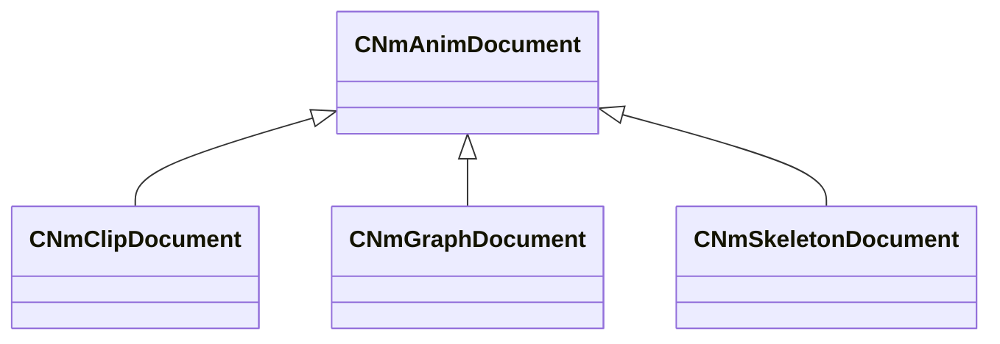

[Schemas](../../schemas.md) / [animdoclib](../animdoclib.md) / CNmAnimDocument

# CNmAnimDocument

**Kind:** class · **Size:** 112 bytes (`0x70`) · **Align:** 255 · **Module:** animdoclib

**Derived by:** [CNmClipDocument](../animdoclib/CNmClipDocument.md), [CNmGraphDocument](../animdoclib/CNmGraphDocument.md), [CNmSkeletonDocument](../animdoclib/CNmSkeletonDocument.md)

**Relationships:**

## Memory layout

1 fields (1 declared here, 0 inherited). Offsets are absolute from the object base.

| Offset | Field | Type | From | Annotations |
|--------|-------|------|------|-------------|
| `0x68` | `m_nVersion` | int32 |  | `MPropertySuppressField` |
