[Schemas](../../schemas.md) / [animdoclib](../animdoclib.md) / CNmClipDocEvent

# CNmClipDocEvent

> Source: **Build 25000182** · 2026-08-28 · `windows-x86_64` · schema `0.10.0`

**Kind:** class · **Size:** 16 bytes (`0x10`) · **Align:** 8 · **Module:** animdoclib

**Derived by:** [CNmClipDocEvent_BodyGroup](../animdoclib/CNmClipDocEvent_BodyGroup.md), [CNmClipDocEvent_EntityAttribute](../animdoclib/CNmClipDocEvent_EntityAttribute.md), [CNmClipDocEvent_FloatCurve](../animdoclib/CNmClipDocEvent_FloatCurve.md), [CNmClipDocEvent_Foot](../animdoclib/CNmClipDocEvent_Foot.md), [CNmClipDocEvent_FrameSnap](../animdoclib/CNmClipDocEvent_FrameSnap.md), [CNmClipDocEvent_ID](../animdoclib/CNmClipDocEvent_ID.md), [CNmClipDocEvent_Legacy](../animdoclib/CNmClipDocEvent_Legacy.md), [CNmClipDocEvent_MaterialAttribute](../animdoclib/CNmClipDocEvent_MaterialAttribute.md), [CNmClipDocEvent_OrientationWarp](../animdoclib/CNmClipDocEvent_OrientationWarp.md), [CNmClipDocEvent_Particle](../animdoclib/CNmClipDocEvent_Particle.md), [CNmClipDocEvent_RootMotion](../animdoclib/CNmClipDocEvent_RootMotion.md), [CNmClipDocEvent_Sound](../animdoclib/CNmClipDocEvent_Sound.md), [CNmClipDocEvent_TargetWarp](../animdoclib/CNmClipDocEvent_TargetWarp.md), [CNmClipDocEvent_Transition](../animdoclib/CNmClipDocEvent_Transition.md)

**Relationships:**

```mermaid
classDiagram
    CNmClipDocEvent <|-- CNmClipDocEvent_BodyGroup
    CNmClipDocEvent <|-- CNmClipDocEvent_EntityAttribute
    CNmClipDocEvent <|-- CNmClipDocEvent_FloatCurve
    CNmClipDocEvent <|-- CNmClipDocEvent_Foot
    CNmClipDocEvent <|-- CNmClipDocEvent_FrameSnap
    CNmClipDocEvent <|-- CNmClipDocEvent_ID
    CNmClipDocEvent <|-- CNmClipDocEvent_Legacy
    CNmClipDocEvent <|-- CNmClipDocEvent_MaterialAttribute
    CNmClipDocEvent <|-- CNmClipDocEvent_OrientationWarp
    CNmClipDocEvent <|-- CNmClipDocEvent_Particle
    CNmClipDocEvent <|-- CNmClipDocEvent_RootMotion
    CNmClipDocEvent <|-- CNmClipDocEvent_Sound
    CNmClipDocEvent <|-- CNmClipDocEvent_TargetWarp
    CNmClipDocEvent <|-- CNmClipDocEvent_Transition
```

## Memory layout

2 fields (2 declared here, 0 inherited). Offsets are absolute from the object base.

| Offset | Field | Type | From | Annotations |
|--------|-------|------|------|-------------|
| `0x8` | `m_flStartTime` | float32 |  |  |
| `0xc` | `m_flDuration` | float32 |  |  |

KV3 class defaults

<pre>{
	&quot;_class&quot;: &quot;CNmClipDocEvent&quot;,
	&quot;m_flStartTime&quot;: 0.000000,
	&quot;m_flDuration&quot;: 0.000000
}</pre>

