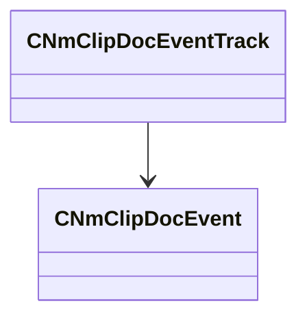

[Schemas](../../schemas.md) / [animdoclib](../animdoclib.md) / CNmClipDocEventTrack

# CNmClipDocEventTrack

**Kind:** class · **Size:** 40 bytes (`0x28`) · **Align:** 8 · **Module:** animdoclib

**Relationships:**

## Memory layout

5 fields (5 declared here, 0 inherited). Offsets are absolute from the object base.

| Offset | Field | Type | From | Annotations |
|--------|-------|------|------|-------------|
| `0x0` | `m_events` | CUtlVector< [CNmClipDocEvent](../animdoclib/CNmClipDocEvent.md)* > |  |  |
| `0x18` | `m_eventClassName` | CUtlString |  |  |
| `0x20` | `m_type` | [CNmClipDocEventTrack](../animdoclib/CNmClipDocEventTrack.md)::Type_t |  |  |
| `0x24` | `m_bIsSyncTrack` | bool |  |  |
| `0x25` | `m_bIsDisabled` | bool |  |  |

KV3 class defaults

<pre>{
	&quot;m_events&quot;:
	[
	],
	&quot;m_eventClassName&quot;: &quot;&quot;,
	&quot;m_type&quot;: &quot;Duration&quot;,
	&quot;m_bIsSyncTrack&quot;: false,
	&quot;m_bIsDisabled&quot;: false
}</pre>

