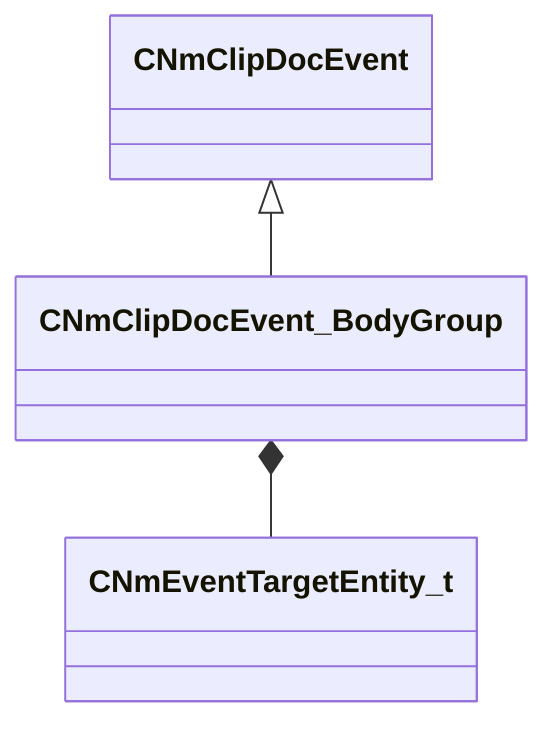

[Schemas](../../schemas.md) / [animdoclib](../animdoclib.md) / CNmClipDocEvent_BodyGroup

# CNmClipDocEvent_BodyGroup

**Kind:** class · **Size:** 40 bytes (`0x28`) · **Align:** 8 · **Module:** animdoclib

**Inherits from:** [CNmClipDocEvent](../animdoclib/CNmClipDocEvent.md)

**Relationships:**

## Memory layout

5 fields (3 declared here, 2 inherited). Offsets are absolute from the object base.

| Offset | Field | Type | From | Annotations |
|--------|-------|------|------|-------------|
| `0x8` | `m_flStartTime` | float32 | [CNmClipDocEvent](../animdoclib/CNmClipDocEvent.md) |  |
| `0xc` | `m_flDuration` | float32 | [CNmClipDocEvent](../animdoclib/CNmClipDocEvent.md) |  |
| `0x10` | `m_target` | [CNmEventTargetEntity_t](../animlib/CNmEventTargetEntity_t.md) |  |  |
| `0x18` | `bodygroup` | CUtlString |  | `MPropertyFriendlyName Body Group` |
| `0x20` | `value` | int32 |  | `MPropertyFriendlyName Value` |

KV3 class defaults

<pre>{
	&quot;_class&quot;: &quot;CNmClipDocEvent_BodyGroup&quot;,
	&quot;m_flStartTime&quot;: 0.000000,
	&quot;m_flDuration&quot;: 0.000000,
	&quot;m_target&quot;: &quot;Self&quot;,
	&quot;bodygroup&quot;: &quot;&quot;,
	&quot;value&quot;: 0
}</pre>

