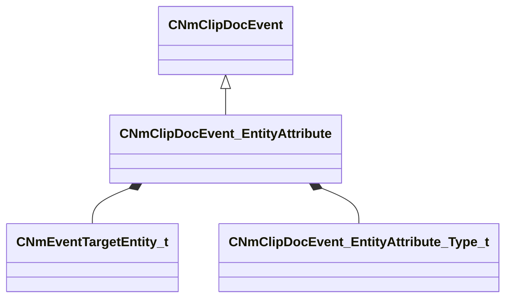

[Schemas](../../schemas.md) / [animdoclib](../animdoclib.md) / CNmClipDocEvent_EntityAttribute

# CNmClipDocEvent_EntityAttribute

> Source: **Build 25000182** · 2026-08-28 · `windows-x86_64` · schema `0.10.0`

**Kind:** class · **Size:** 104 bytes (`0x68`) · **Align:** 8 · **Module:** animdoclib

**Inherits from:** [CNmClipDocEvent](../animdoclib/CNmClipDocEvent.md)

**Relationships:**

## Memory layout

7 fields (5 declared here, 2 inherited). Offsets are absolute from the object base.

| Offset | Field | Type | From | Annotations |
|--------|-------|------|------|-------------|
| `0x8` | `m_flStartTime` | float32 | [CNmClipDocEvent](../animdoclib/CNmClipDocEvent.md) |  |
| `0xc` | `m_flDuration` | float32 | [CNmClipDocEvent](../animdoclib/CNmClipDocEvent.md) |  |
| `0x10` | `m_target` | [CNmEventTargetEntity_t](../animlib/CNmEventTargetEntity_t.md) |  |  |
| `0x18` | `m_attributeName` | CUtlString |  |  |
| `0x20` | `m_nValueType` | [CNmClipDocEvent_EntityAttribute_Type_t](../animdoclib/CNmClipDocEvent_EntityAttribute_Type_t.md) |  | `MPropertyAutoRebuildOnChange` `MPropertyFriendlyName Type` |
| `0x24` | `m_nIntValue` | int32 |  | `MPropertyAttrStateCallback` |
| `0x28` | `m_FloatValue` | CPiecewiseCurve |  | `MPropertyAttrStateCallback` |

KV3 class defaults

<pre>{
	&quot;_class&quot;: &quot;CNmClipDocEvent_EntityAttribute&quot;,
	&quot;m_flStartTime&quot;: 0.000000,
	&quot;m_flDuration&quot;: 0.000000,
	&quot;m_target&quot;: &quot;Self&quot;,
	&quot;m_attributeName&quot;: &quot;&quot;,
	&quot;m_nValueType&quot;: &quot;EVENT_ENTITY_ATTR_TYPE_INT&quot;,
	&quot;m_nIntValue&quot;: 0,
	&quot;m_FloatValue&quot;:
	{
		&quot;m_spline&quot;:
		[
		],
		&quot;m_tangents&quot;:
		[
		],
		&quot;m_vDomainMins&quot;:
		[
			0.000000,
			0.000000
		],
		&quot;m_vDomainMaxs&quot;:
		[
			0.000000,
			0.000000
		]
	}
}</pre>

