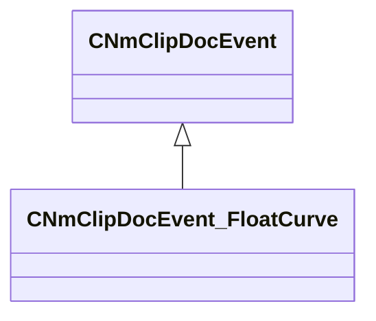

[Schemas](../../schemas.md) / [animdoclib](../animdoclib.md) / CNmClipDocEvent_FloatCurve

# CNmClipDocEvent_FloatCurve

> Source: **Build 25000182** · 2026-08-28 · `windows-x86_64` · schema `0.10.0`

**Kind:** class · **Size:** 88 bytes (`0x58`) · **Align:** 8 · **Module:** animdoclib

**Inherits from:** [CNmClipDocEvent](../animdoclib/CNmClipDocEvent.md)

**Relationships:**

## Memory layout

4 fields (2 declared here, 2 inherited). Offsets are absolute from the object base.

| Offset | Field | Type | From | Annotations |
|--------|-------|------|------|-------------|
| `0x8` | `m_flStartTime` | float32 | [CNmClipDocEvent](../animdoclib/CNmClipDocEvent.md) |  |
| `0xc` | `m_flDuration` | float32 | [CNmClipDocEvent](../animdoclib/CNmClipDocEvent.md) |  |
| `0x10` | `m_ID` | CUtlString |  |  |
| `0x18` | `m_curve` | CPiecewiseCurve |  |  |

KV3 class defaults

<pre>{
	&quot;_class&quot;: &quot;CNmClipDocEvent_FloatCurve&quot;,
	&quot;m_flStartTime&quot;: 0.000000,
	&quot;m_flDuration&quot;: 0.000000,
	&quot;m_ID&quot;: &lt;HIDDEN FOR DIFF&gt;,
	&quot;m_curve&quot;:
	{
		&quot;m_spline&quot;:
		[
			{
				&quot;x&quot;: 0.000000,
				&quot;y&quot;: 0.000000,
				&quot;m_flSlopeIncoming&quot;: 1.000000,
				&quot;m_flSlopeOutgoing&quot;: 1.000000
			},
			{
				&quot;x&quot;: 1.000000,
				&quot;y&quot;: 1.000000,
				&quot;m_flSlopeIncoming&quot;: 1.000000,
				&quot;m_flSlopeOutgoing&quot;: 1.000000
			}
		],
		&quot;m_tangents&quot;:
		[
			{
				&quot;m_nIncomingTangent&quot;: &quot;CURVE_TANGENT_SPLINE&quot;,
				&quot;m_nOutgoingTangent&quot;: &quot;CURVE_TANGENT_SPLINE&quot;
			},
			{
				&quot;m_nIncomingTangent&quot;: &quot;CURVE_TANGENT_SPLINE&quot;,
				&quot;m_nOutgoingTangent&quot;: &quot;CURVE_TANGENT_SPLINE&quot;
			}
		],
		&quot;m_vDomainMins&quot;:
		[
			0.000000,
			0.000000
		],
		&quot;m_vDomainMaxs&quot;:
		[
			1.000000,
			1.000000
		]
	}
}</pre>

