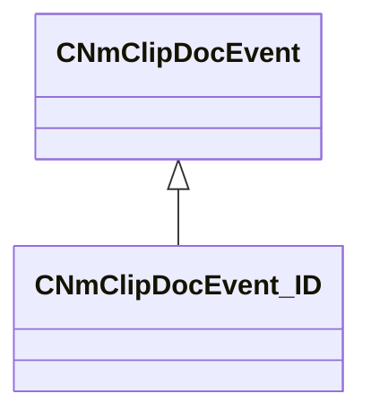

[Schemas](../../schemas.md) / [animdoclib](../animdoclib.md) / CNmClipDocEvent_ID

# CNmClipDocEvent_ID

**Kind:** class · **Size:** 32 bytes (`0x20`) · **Align:** 8 · **Module:** animdoclib

**Inherits from:** [CNmClipDocEvent](../animdoclib/CNmClipDocEvent.md)

**Relationships:**

## Memory layout

4 fields (2 declared here, 2 inherited). Offsets are absolute from the object base.

| Offset | Field | Type | From | Annotations |
|--------|-------|------|------|-------------|
| `0x8` | `m_flStartTime` | float32 | [CNmClipDocEvent](../animdoclib/CNmClipDocEvent.md) |  |
| `0xc` | `m_flDuration` | float32 | [CNmClipDocEvent](../animdoclib/CNmClipDocEvent.md) |  |
| `0x10` | `m_ID` | CGlobalSymbol |  |  |
| `0x18` | `m_secondaryID` | CGlobalSymbol |  | `MPropertyGroupName +Optional` |

KV3 class defaults

<pre>{
	&quot;_class&quot;: &quot;CNmClipDocEvent_ID&quot;,
	&quot;m_flStartTime&quot;: 0.000000,
	&quot;m_flDuration&quot;: 0.000000,
	&quot;m_ID&quot;: &lt;HIDDEN FOR DIFF&gt;,
	&quot;m_secondaryID&quot;: &quot;&quot;
}</pre>

