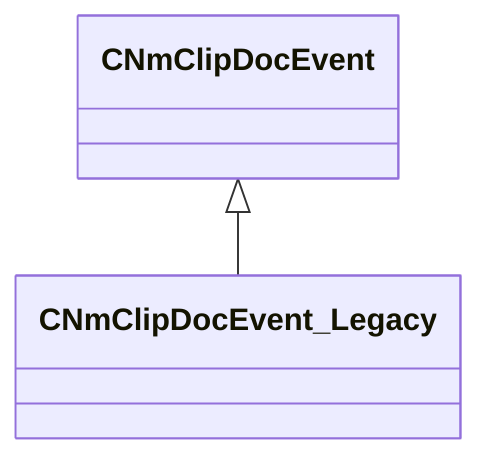

[Schemas](../../schemas.md) / [animdoclib](../animdoclib.md) / CNmClipDocEvent_Legacy

# CNmClipDocEvent_Legacy

> Source: **Build 25000182** · 2026-08-28 · `windows-x86_64` · schema `0.10.0`

**Kind:** class · **Size:** 40 bytes (`0x28`) · **Align:** 8 · **Module:** animdoclib

**Inherits from:** [CNmClipDocEvent](../animdoclib/CNmClipDocEvent.md)

**Relationships:**

## Memory layout

4 fields (2 declared here, 2 inherited). Offsets are absolute from the object base.

| Offset | Field | Type | From | Annotations |
|--------|-------|------|------|-------------|
| `0x8` | `m_flStartTime` | float32 | [CNmClipDocEvent](../animdoclib/CNmClipDocEvent.md) |  |
| `0xc` | `m_flDuration` | float32 | [CNmClipDocEvent](../animdoclib/CNmClipDocEvent.md) |  |
| `0x10` | `m_eventClass` | CUtlString |  | `MPropertyAutoRebuildOnChange` |
| `0x18` | `m_KV` | KeyValues3 |  | `MPropertySuppressField` |

KV3 class defaults

<pre>{
	&quot;_class&quot;: &quot;CNmClipDocEvent_Legacy&quot;,
	&quot;m_flStartTime&quot;: 0.000000,
	&quot;m_flDuration&quot;: 0.000000,
	&quot;m_eventClass&quot;: &quot;&quot;,
	&quot;m_KV&quot;: null
}</pre>

