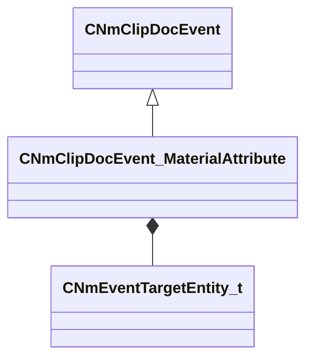

[Schemas](../../schemas.md) / [animdoclib](../animdoclib.md) / CNmClipDocEvent_MaterialAttribute

# CNmClipDocEvent_MaterialAttribute

**Kind:** class · **Size:** 288 bytes (`0x120`) · **Align:** 8 · **Module:** animdoclib

**Inherits from:** [CNmClipDocEvent](../animdoclib/CNmClipDocEvent.md)

**Relationships:**

## Memory layout

8 fields (6 declared here, 2 inherited). Offsets are absolute from the object base.

| Offset | Field | Type | From | Annotations |
|--------|-------|------|------|-------------|
| `0x8` | `m_flStartTime` | float32 | [CNmClipDocEvent](../animdoclib/CNmClipDocEvent.md) |  |
| `0xc` | `m_flDuration` | float32 | [CNmClipDocEvent](../animdoclib/CNmClipDocEvent.md) |  |
| `0x10` | `m_target` | [CNmEventTargetEntity_t](../animlib/CNmEventTargetEntity_t.md) |  |  |
| `0x18` | `m_attributeName` | CUtlString |  |  |
| `0x20` | `m_x` | CPiecewiseCurve |  |  |
| `0x60` | `m_y` | CPiecewiseCurve |  |  |
| `0xa0` | `m_z` | CPiecewiseCurve |  |  |
| `0xe0` | `m_w` | CPiecewiseCurve |  |  |

KV3 class defaults

<pre>{
	&quot;_class&quot;: &quot;CNmClipDocEvent_MaterialAttribute&quot;,
	&quot;m_flStartTime&quot;: 0.000000,
	&quot;m_flDuration&quot;: 0.000000,
	&quot;m_target&quot;: &quot;Self&quot;,
	&quot;m_attributeName&quot;: &quot;&quot;,
	&quot;m_x&quot;:
	{
		&quot;m_spline&quot;:
		[
		],
		&quot;m_tangents&quot;:
		[
		],
		&quot;m_vDomainMins&quot;:
		[
			0.000000,
			0.000000
		],
		&quot;m_vDomainMaxs&quot;:
		[
			0.000000,
			0.000000
		]
	},
	&quot;m_y&quot;:
	{
		&quot;m_spline&quot;:
		[
		],
		&quot;m_tangents&quot;:
		[
		],
		&quot;m_vDomainMins&quot;:
		[
			0.000000,
			0.000000
		],
		&quot;m_vDomainMaxs&quot;:
		[
			0.000000,
			0.000000
		]
	},
	&quot;m_z&quot;:
	{
		&quot;m_spline&quot;:
		[
		],
		&quot;m_tangents&quot;:
		[
		],
		&quot;m_vDomainMins&quot;:
		[
			0.000000,
			0.000000
		],
		&quot;m_vDomainMaxs&quot;:
		[
			0.000000,
			0.000000
		]
	},
	&quot;m_w&quot;:
	{
		&quot;m_spline&quot;:
		[
		],
		&quot;m_tangents&quot;:
		[
		],
		&quot;m_vDomainMins&quot;:
		[
			0.000000,
			0.000000
		],
		&quot;m_vDomainMaxs&quot;:
		[
			0.000000,
			0.000000
		]
	}
}</pre>

