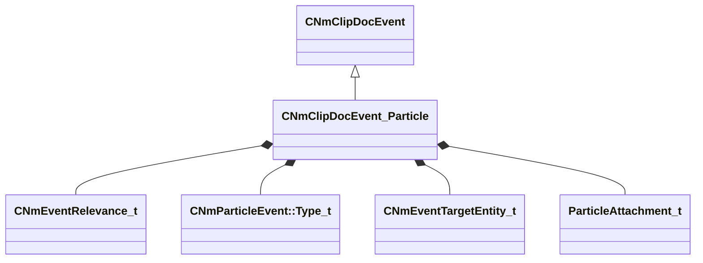

[Schemas](../../schemas.md) / [animdoclib](../animdoclib.md) / CNmClipDocEvent_Particle

# CNmClipDocEvent_Particle

> Source: **Build 25000182** · 2026-08-28 · `windows-x86_64` · schema `0.10.0`

**Kind:** class · **Size:** 104 bytes (`0x68`) · **Align:** 8 · **Module:** animdoclib

**Inherits from:** [CNmClipDocEvent](../animdoclib/CNmClipDocEvent.md)

**Relationships:**

## Memory layout

16 fields (14 declared here, 2 inherited). Offsets are absolute from the object base.

| Offset | Field | Type | From | Annotations |
|--------|-------|------|------|-------------|
| `0x8` | `m_flStartTime` | float32 | [CNmClipDocEvent](../animdoclib/CNmClipDocEvent.md) |  |
| `0xc` | `m_flDuration` | float32 | [CNmClipDocEvent](../animdoclib/CNmClipDocEvent.md) |  |
| `0x10` | `m_relevance` | [CNmEventRelevance_t](../animlib/CNmEventRelevance_t.md) |  |  |
| `0x14` | `m_type` | [CNmParticleEvent::Type_t](../animlib/CNmParticleEvent.Type_t.md) |  |  |
| `0x18` | `m_target` | [CNmEventTargetEntity_t](../animlib/CNmEventTargetEntity_t.md) |  |  |
| `0x20` | `m_particleSystem` | CUtlString |  | `MPropertyAttributeEditor AssetBrowse( vpcf, *requiredoubleclick )` `MPropertyStartGroup +Particle` |
| `0x28` | `m_bDetachFromOwner` | bool |  |  |
| `0x29` | `m_bStopImmediately` | bool |  |  |
| `0x2a` | `m_bPlayEndCap` | bool |  |  |
| `0x30` | `m_attachmentPoint0` | CUtlString |  | `MPropertyAttrStateCallback` `MPropertyStartGroup +Attachment` |
| `0x38` | `m_attachmentType0` | [ParticleAttachment_t](../animationsystem/ParticleAttachment_t.md) |  | `MPropertyAttrStateCallback` |
| `0x40` | `m_attachmentPoint1` | CUtlString |  | `MPropertyAttrStateCallback` |
| `0x48` | `m_attachmentType1` | [ParticleAttachment_t](../animationsystem/ParticleAttachment_t.md) |  | `MPropertyAttrStateCallback` |
| `0x50` | `m_config` | CUtlString |  | `MPropertyAttrStateCallback` `MPropertyStartGroup +Config` |
| `0x58` | `m_effectForConfig` | CUtlString |  | `MPropertyAttrStateCallback` |
| `0x60` | `m_tags` | CUtlString |  | `MPropertyStartGroup +Metadata` |

KV3 class defaults

<pre>{
	&quot;_class&quot;: &quot;CNmClipDocEvent_Particle&quot;,
	&quot;m_flStartTime&quot;: 0.000000,
	&quot;m_flDuration&quot;: 0.000000,
	&quot;m_relevance&quot;: &quot;ClientAndServer&quot;,
	&quot;m_type&quot;: &quot;Create&quot;,
	&quot;m_target&quot;: &quot;Self&quot;,
	&quot;m_particleSystem&quot;: &quot;&quot;,
	&quot;m_bDetachFromOwner&quot;: false,
	&quot;m_bStopImmediately&quot;: false,
	&quot;m_bPlayEndCap&quot;: false,
	&quot;m_attachmentPoint0&quot;: &quot;&quot;,
	&quot;m_attachmentType0&quot;: &quot;PATTACH_INVALID&quot;,
	&quot;m_attachmentPoint1&quot;: &quot;&quot;,
	&quot;m_attachmentType1&quot;: &quot;PATTACH_INVALID&quot;,
	&quot;m_config&quot;: &quot;&quot;,
	&quot;m_effectForConfig&quot;: &quot;&quot;,
	&quot;m_tags&quot;: &quot;&quot;
}</pre>

